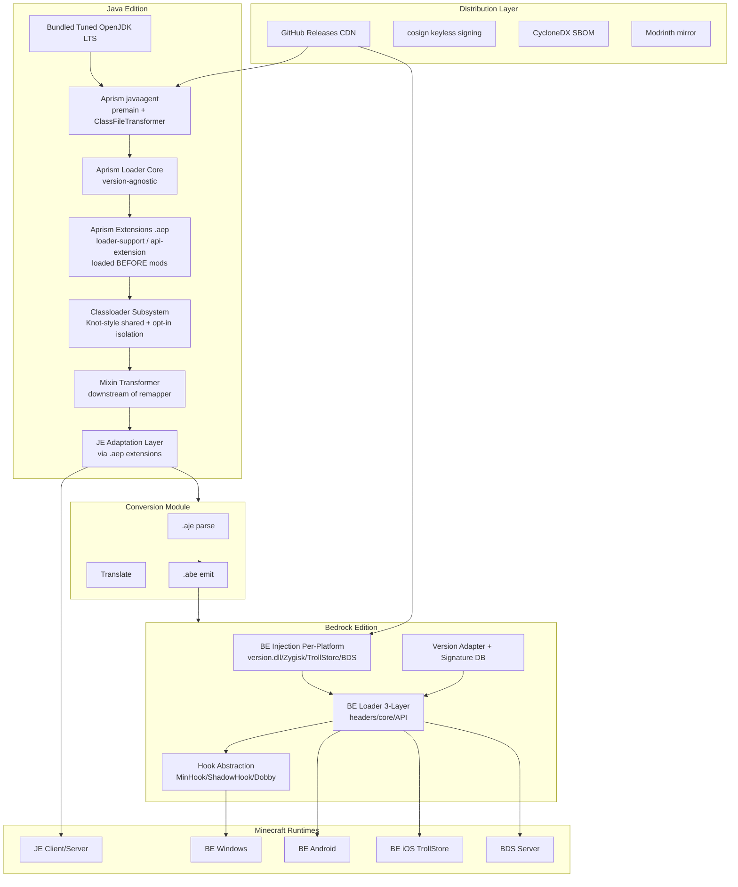
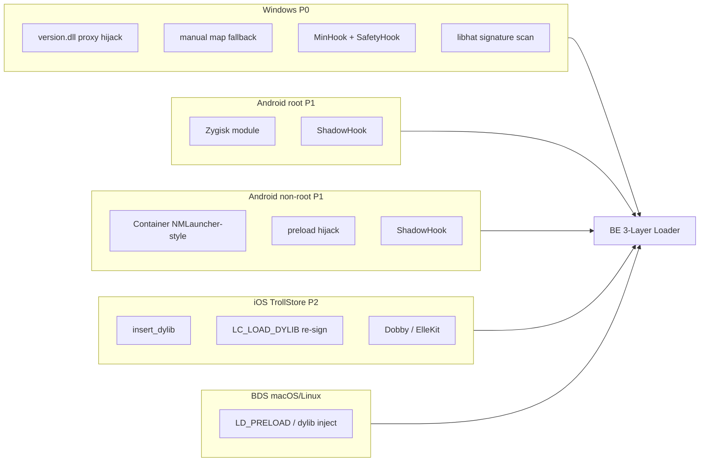
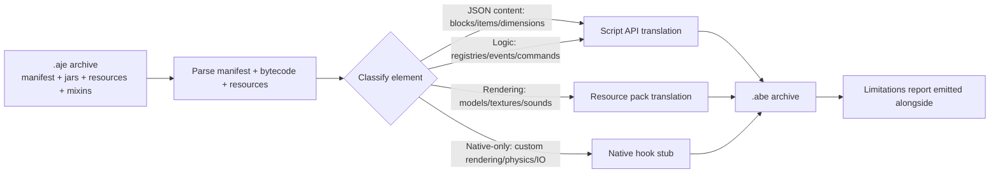
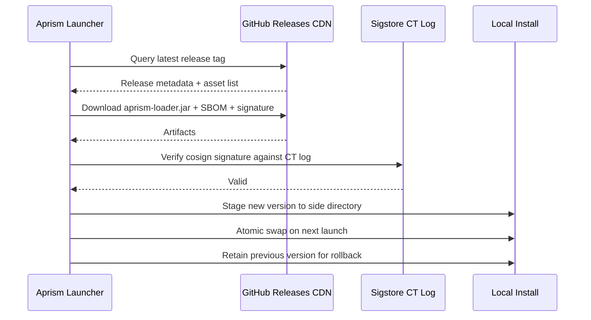

# Aprism Loader Overall Architecture Design

> Document 1 of 8 | Aprism Loader Documentation Set
> Version: v26.0-Alpha.1 | Status: Development
> Author: BlockConnect@StarsailsClover
> Canonical language: English (Chinese copy maintained in parallel)

## 1. Executive Summary

Aprism is a unified, cross-edition, cross-platform Minecraft modding platform that spans Java Edition (JE) and Bedrock Edition (BE) under a single developer-facing API surface. It is not a single loader but a stratified system: a JE native foundation built on a premain javaagent and `ClassFileTransformer` over a bundled, tuned OpenJDK LTS build; an adaptation layer that ingests existing Fabric, NeoForge, Forge, Quilt, and LiteLoader mod formats; a BE injection and loader subsystem that performs per-platform native binary patching on Windows, Android, iOS, and BDS; a JE-to-BE conversion module that re-targets JE mod artifacts to Bedrock behavior/resource packs and native hooks; and a distribution pipeline built on GitHub Releases with cosign keyless signing and CycloneDX SBOMs.

The design is governed by four non-negotiable invariants. First, mod containers expose reference identity that is stable across every lookup API in the system. Second, the public interface contract is monotonically increasing: additions and deprecations are permitted, removals and renames are not. Third, every supported Minecraft version is addressed through a compatibility group with an explicit SemVer range; nothing is "best effort." Fourth, distribution is standalone desktop only, because Microsoft Store Policy 10.2 and Apple App Review Guideline 2.4.5(iv) legally block dynamic code injection in store-distributed applications.

This document is the canonical architecture reference. All other Aprism documents (build tooling, manifest schema, API reference, BE internals, conversion, distribution, versioning, and security) derive from and must remain consistent with the decisions recorded here.

## 2. Design Goals and Principles

### 2.1 Goals

| Goal | Statement |
|------|-----------|
| Unified interfaces | A mod authored against the Aprism API runs on every supported Minecraft edition and loader without source changes where semantics permit. |
| Monotonic version increment | The public API surface only grows. Deprecation is allowed for at least one LTS cycle; removal and rename are forbidden. |
| Cross-edition | JE and BE share a manifest superset and a conversion pipeline so a single source artifact can target both editions. |
| Cross-platform | JE targets Windows, macOS, and Linux desktops. BE targets Windows, Android (root and non-root), iOS (TrollStore), and BDS on macOS/Linux. |
| Forced compatibility | Compatibility is declared up front via compatibility-group SemVer ranges and enforced at load time. Mods with unsatisfied ranges are not loaded rather than loaded and broken. |

### 2.2 Principles

- **Substrate, not rewrite.** Aprism sits on a tuned OpenJDK, not a custom JVM. The loader core is version-agnostic and mirrors the Fabric Loader architecture so that the largest existing mod catalog (Fabric, Quilt, LiteLoader) loads natively.
- **Canonical injection.** SpongePowered Mixin is the sole bytecode injection mechanism for JE. There is exactly one Mixin transformer, inserted downstream of Aprism's own remapper, never as a competing transformation pass.
- **Per-platform realism.** BE injection is acknowledged as version-fragile. The version adapter and signature database are the dominant engineering investment, not an afterthought.
- **Legal hygiene.** Aprism never redistributes modified Minecraft jars, never ships on stores that prohibit code injection, and never modifies Xbox Live network traffic.

## 3. High-Level Architecture

The JE path is a strict pipeline: bundled JDK hosts the Aprism javaagent, which installs a `ClassFileTransformer` over the loader core. The loader core scans `aprism-extensions/` first, registers loader-support extensions, then owns classloaders, the Mixin transformer, and the adaptation layer (provided by extensions). The BE path is parallel: a per-platform injector bootstraps the 3-layer loader, which consults the version adapter and signature database before installing hooks through a platform-specific hook backend. The conversion module bridges the two: it consumes a packaged `.aje` artifact and emits a `.abe` artifact, deferring to Script API where semantics align and to native hooks otherwise.

**Aprism Native Superset**: Aprism JE Native API is a strict superset of all other JE loaders' APIs. Aprism BE Native API mirrors JE Native where the platform allows. Mods written for Aprism native (`.aje` / `.abe`) get maximum capabilities; loader-specific mods (via extensions) get only that loader's capabilities.

**BE Support Scope**: Aprism BE supports Minecraft Bedrock Edition from version 26.x onwards. BE versions below 26.x are NOT supported.

## 4. JE Aprism Native Foundation

The foundation is a premain javaagent coupled with a `ClassFileTransformer` over a bundled, tuned OpenJDK LTS build derived from Eclipse Temurin. The agent JAR is attached via `-javaagent:aprism-loader.jar` on the JE launch command line and registers its transformer before the application classloader resolves any Minecraft class. This guarantees that every Minecraft class transits the Aprism transformation pipeline exactly once and in a deterministic order.

### 4.1 Why Not a Custom JVM or GraalVM Native Image

A custom JVM would grant maximum control over classloading, GC, and JIT policies but would impose a permanent maintenance burden, diverge from upstream security fixes, and break compatibility with arbitrary user JVM tooling (profilers, agents, debuggers). The cost-benefit ratio is unfavorable for a modding platform. Aprism therefore tracks upstream OpenJDK LTS and applies a curated patch set (tiered compilation tuning, class data sharing for warm start, and metadata reductions) rather than forking.

GraalVM Native Image is reserved for an opt-in, pre-baked modpack bundle: a closed-world mod set compiled ahead-of-time to a native executable for sub-second cold start on low-end hardware. This is not the default runtime because closed-world analysis is incompatible with dynamic mod loading, reflection-heavy mods, and runtime Mixin application. The native bundle is a distribution target, not a foundation.

Project Leyden is tracked for its promise of ahead-of-time class linking and method profiling snapshots, which would dramatically improve launcher warm-start. Aprism will adopt Leyden output formats when they stabilize in an upstream LTS; until then, AppCDS is used as the warm-start mitigation.

### 4.2 Version-Agnostic Loader Core

The loader core exposes a stable internal SPI that does not reference Minecraft version symbols. It mirrors the Fabric Loader decomposition: a `Loader` owns a set of `ModContainer` instances, each backed by a `ModClassLoader`; a `Knot`-style classloader graph resolves classes; transformation is delegated to a pluggable `IMixinPlatformAgent`-equivalent. Minecraft-version-specific logic (mapping names, version-gated adapters) lives in the adaptation layer, never in the core.

## 5. Classloader and Transformation Subsystem

### 5.1 Default Shared Class Space

The default classloader strategy is a Fabric Knot-style shared class space. All mods share a single parent classloader that exposes the union of their exported packages, with per-mod child classloaders that defer to the parent for shared classes and isolate only their internal packages. This maximizes the addressable mod catalog: Fabric, Quilt (which loads Fabric mods through a compat shim), and LiteLoader mods all expect a shared space and break under stricter isolation.

### 5.2 Opt-in Isolated ModClassLoader Shim

Forge-style mods require an isolated `ModClassLoader` because Forge mods assume their own classloader is the defining loader of their classes and rely on `getClass().getClassLoader()` returning a mod-specific instance. Aprism exposes an opt-in `isolated` flag in `aprism.manifest.json`. When set, the mod is wrapped in an `IsolatedModClassLoader` shim that satisfies Forge's classloader-identity expectations while still routing transformation through the central pipeline.

### 5.3 ModContainer Reference Identity Invariant

Every `ModContainer` returned by any lookup API (`Loader.getModContainer`, event payloads, registry callbacks, dependency resolution) is the same object instance. There is no per-API facsimile. This invariant is enforced by a single container registry and is the load-bearing assumption that lets adaptation-layer providers interoperate without re-wrapping.

### 5.4 Mixin as Canonical Injection

SpongePowered Mixin is the sole bytecode injection mechanism. Aprism registers exactly one `MixinTransformer` in its `ClassFileTransformer` chain, positioned downstream of Aprism's own remapper. This mirrors the Fabric and NeoForge integration: Mixin sees already-remapped names and operates on stable intermediaries. No competing injection framework (custom ASM injection passes, etc.) is permitted to enter the transformation chain. AccessWidener is not an injection mechanism but a separate access-widening pass positioned AFTER Mixin in the pipeline (transform order: registered transformations → Mixin → AccessWidener; see Document 6, Section 3.4, and the `AprismClassTransformer` implementation): the widened access flags are therefore visible to downstream bytecode consumers (reflection, subsequent lookups), and because AccessWidener only rewrites access flags without adding members or method bodies, it cannot collide with Mixin injection points.

### 5.5 Remapping Strategy

For Minecraft versions prior to 26.1, Aprism consumes Fabric Intermediary mappings and applies TinyRemapper-equivalent remapping at load time so that mods authored against intermediaries resolve against runtime obfuscated names. For 26.1 and later, Mojang ships unobfuscated jars, so Aprism runs in no-remap mode: the remapper is a pass-through and Mixin operates directly on official names. Refmaps (the YAML mapping from development names to intermediary names shipped inside mod jars) are honored in remapped mode and ignored in no-remap mode.

## 6. JE Adaptation Layer (via Aprism Extensions)

Aprism does NOT natively understand Fabric, Forge, NeoForge, Quilt, or LiteLoader mod formats. Loader support is provided by Aprism Extensions (`.aep`), which enhance Aprism itself and load BEFORE any mods. Each `loader-support` extension provides a loader runtime that scans its corresponding `<loader>-mods/` directory, parses native manifests, constructs `ModContainer` instances, registers entrypoints, and bridges the native event/registration model onto the Aprism event bus.

| Extension | Loader Key | Native Manifest | Entrypoint Model | Mod Folder |
|-----------|-----------|-----------------|------------------|------------|
| Fabric-Support.aep | `Fa` | `fabric.mod.json` v1 | `main`/`client`/`server` entrypoints | `fabric-mods/` |
| NeoForge-Support.aep | `N` | `META-INF/neoforge.mods.toml` | `@Mod` annotation, `IEventBus` | `neoforge-mods/` |
| Forge-Support.aep | `Fo` | `META-INF/mods.toml` | `@Mod` annotation, `@SubscribeEvent` | `forge-mods/` |
| Quilt-Support.aep | `Q` | `quilt.mod.json` | QSL entrypoints | `quilt-mods/` |
| LiteLoader-Support.aep | `L` | `litemod.json` | `init()` lifecycle | `liteloader-mods/` |

If a loader's Support extension is NOT installed, the corresponding `<loader>-mods/` folder is simply not scanned. Aprism native `.aje` mods in `mods/` do NOT need any extension.

### 6.1 Entrypoint and Event Bus Adapters

Each loader-support extension exposes an adapter that translates its native entrypoint contract onto the Aprism phase-strict event bus. The Fabric functional registration adapter maps `Registry.register` calls and `RegistryHelper` callbacks onto Aprism's `SETUP` phase. The Forge `addListener` adapter maps `IEventBus.addListener` subscriptions onto the corresponding Aprism phase. Both adapters are backed by the same bus instance; there is no per-loader bus.

### 6.2 Auto-Discovery Fallback

When a loader-specific mod ships without an `aprism.manifest.json`, the extension's loader runtime auto-discovers its native manifest (`fabric.mod.json`, `quilt.mod.json`, `META-INF/neoforge.mods.toml`, `META-INF/mods.toml`, or `litemod.json`; full order in Document 2, Section 5) and synthesizes an Aprism manifest. Synthesis is lossy: only fields with unambiguous Aprism equivalents are populated. Mods requiring Aprism-specific features (cross-edition conversion, compatibility-group declaration) must ship an explicit `aprism.manifest.json` and be packaged as `.aje` in `mods/`.

### 6.3 Aprism Native Superset Principle

Aprism JE Native API is a strict superset of all other JE loaders' APIs. Every capability available in Fabric, Forge, NeoForge, Quilt, or LiteLoader has an Aprism native equivalent or superior. Mods written for Aprism native (`.aje` in `mods/`) get MAXIMUM capabilities. Mods using loader-specific APIs (via extensions, `.jar` in `<loader>-mods/`) get ONLY that loader's capabilities. To access the full superset, a mod must be written for Aprism native.

### 6.4 Extension Loading

Extensions load in a dedicated phase before the mod scan. The Aprism core scans `aprism-extensions/`, validates each extension's `aprismRange` and `mcVersion` against the running environment, resolves extension dependencies, registers capabilities, and only then begins scanning mod directories. See Document 7 Section 12 for the full `.aep` specification.

## 7. BE Injection and Loader Subsystem

Bedrock Edition is a closed-source C++ binary with no official native mod SDK. The Script API (`@minecraft/server`) is a sandboxed JavaScript runtime that cannot create custom blocks, items, or dimensions beyond JSON-defined content. Native modding is therefore the only path to feature parity with JE mods. Amethyst (a Windows client loader) and LeviLamina (a BDS server loader) demonstrate feasibility but are version-fragile: function offsets shift on every Bedrock update.

### 7.1 Per-Platform Injection

| Platform | Priority | Injection Vector | Hook Engine | Notes |
|----------|----------|------------------|-------------|-------|
| Windows | P0 | `version.dll` proxy hijack + manual map fallback | MinHook + SafetyHook | libhat for pattern scanning; primary development target. |
| Android (root) | P1 | Zygisk module | ShadowHook | Per-process injection via Zygote. |
| Android (non-root) | P1 | NMLauncher-style container + preload hijack | ShadowHook | No system modification; isolated container. |
| iOS (TrollStore) | P2 research | `insert_dylib` + `LC_LOAD_DYLIB` re-sign | Dobby / ElleKit | TrollStore sideload only; no App Store path. |
| macOS / Linux | N/A (client) | BDS server only | LD_PRELOAD / dylib | No BE client on these platforms. |
| Consoles | Impossible | N/A | N/A | Locked-down OS; no injection surface. |

### 7.2 Three-Layer Loader Architecture

The BE loader follows the LeviLamina three-layer pattern.

1. **Reverse-engineered headers layer.** Auto-generated by a `header_generator` toolchain fed by `BedrockAnalyzer` outputs. This layer exposes C++ class layouts, vtable indices, and function signatures as consumed headers, decoupling loader code from hand-maintained offsets.
2. **Core layer.** Owns the mod registrar, the hook manager, and the version database. The hook manager abstracts over the platform hook engine and is the only component permitted to install inline or vtable hooks.
3. **Public API layer.** Exposes events, commands, and a registry to mod code. Mods target only this layer; the core and headers layers are internal.

Source is split across `src/` (shared), `src-client/` (client-only hooks such as rendering), and `src-server/` (BDS-only hooks such as chunk serialization).

### 7.3 Version Adapter and Signature Database

The version adapter is the single most important engineering investment in the BE subsystem. Bedrock updates shift function offsets and struct layouts unpredictably. Aprism addresses this with a signature database: function locations are stored as libhat pattern signatures (byte patterns with wildcard masks) maintained in a community-versioned repository. At load time, the adapter resolves signatures against the running binary, populates a function pointer table, and refuses to load if any required signature is unresolved. Mods declare the Bedrock version range they support; mismatches fail closed.

### 7.4 Hook Abstraction

The hook manager presents a uniform `installHook(target, detour)` API to mods and dispatches to the platform engine: MinHook or SafetyHook on Windows, ShadowHook on Android, Dobby or ElleKit on iOS. Mods never call a platform hook engine directly.

## 8. JE-to-BE Conversion Module

The conversion module consumes a packaged `.aje` artifact and emits a `.abe` artifact. It is not a universal translator; it is a best-effort pipeline with explicit fallback semantics.

### 8.1 Translation Targets

- **Script API candidates:** JSON-defined content (blocks, items, dimensions), registry callbacks, command registration, and event handlers whose semantics match `@minecraft/server` events. These translate to behavior pack scripts.
- **Resource pack candidates:** models, textures, sounds, and language files. These translate to Bedrock resource pack assets, with format conversions where schemas differ.
- **Native hook candidates:** custom rendering, custom physics, filesystem I/O, and any capability the Script API does not expose. The converter emits a stub `native/` directory containing a C++ skeleton that the mod author must complete. The converter does not synthesize native code; it produces a buildable scaffold and a manifest `type: native` entry.

### 8.2 Limitations

The converter cannot translate Mixins. A JE mod that uses `@Inject` or `@Redirect` to alter Minecraft internals has no Script API equivalent and must be re-implemented as a BE native mod. The converter detects Mixin usage and emits a limitations report listing every untranslatable element. The `.abe` artifact is always produced; whether it is functionally equivalent to the `.aje` source is reported explicitly and never assumed.

## 9. Unified API Surface

### 9.1 IAprismMod Interface

Every mod entrypoint implements `IAprismMod`, the single lifecycle interface. Providers that bridge native entrypoints (Fabric `ModInitializer`, NeoForge `@Mod` constructors) wrap the native entrypoint in an `IAprismMod` adapter so that the rest of the system sees a uniform type.

### 9.2 Phase-Strict Event Bus

The event bus is partitioned into strictly ordered phases. A handler registered for a phase fires only during that phase, and registration after a phase has completed is rejected with an error rather than silently dropped.

| Phase | Semantics | Typical Use |
|-------|-----------|-------------|
| PREINIT | Manifest parsed, classloaders ready, no Minecraft classes touched. | Mixin config registration, early logging. |
| INIT | Minecraft classloading has begun; registries are open. | Registry subscription, config load. |
| SETUP | Registries frozen; content may be added but not redefined. | Inter-mod wiring, capability registration. |
| COMPLETE | All registration finalized. | Late validation, cross-mod integrity checks. |
| CLIENT | Client-only context active. | Rendering, input, screen registration. |
| SERVER | Server-only context active. | Dedicated server logic, world lifecycle. |

### 9.3 Registry, Config, and the Monotonic Contract

Registry APIs expose only additive operations. Config schemas are versioned with the same monotonic rule: fields may be added and deprecated, never removed or renamed. A field marked deprecated remains functional for at least one LTS cycle and emits a warning on use. This contract is enforced by a build-time API compatibility check that compares the public surface against the previous released baseline.

## 10. Build and Packaging Pipeline

### 10.1 Architectury Loom Foundation

The build foundation is Architectury Loom, the multi-loader fork of Fabric Loom. For Minecraft 26.1 and later, the `loom-no-remap` profile is used because Mojang ships unobfuscated jars. For earlier versions, the standard remapping Loom pipeline is used.

### 10.2 aprism-packaging Gradle Plugin

A custom `aprism-packaging` Gradle plugin produces the `.aje` and `.abe` archives. The plugin consumes the compiled artifact set, the manifest, the Mixin configs, and the platform subdirectories, and emits the archive in the format defined in section 12.

### 10.3 Compatibility-Group Jars

Mods are packaged as compatibility-group jars: a single artifact declares the SemVer range of Minecraft versions it supports and the compatibility group it belongs to. The loader selects the correct artifact at runtime based on the running Minecraft version.

### 10.4 Split Profiles

Two build profiles are maintained in parallel.

| Profile | Minecraft Range | Gradle | Java Target |
|---------|-----------------|--------|-------------|
| Legacy | pre-26.1 (remapped) | Gradle 8.x | Java 8/11 (1.16.5), Java 17 (1.18-1.20.4), Java 21 (1.20.5-1.21.11), per the official Mojang baseline |
| Modern | 26.1+ (no-remap) | Gradle 9.x | Java 25 |

### 10.5 Version Catalog

A single `gradle/libs.versions.toml` central catalog pins all dependency versions across the build. Plugin and dependency versions are not declared inline.

## 11. Distribution and Update Architecture

### 11.1 Channel

Distribution is standalone desktop download only. Aprism is not published to the Microsoft Store or Apple App Store, because store policies (Microsoft Store Policy 10.2, Apple App Review Guideline 2.4.5(iv)) prohibit dynamic code injection in store-distributed applications. Alpha builds ship as GitHub Pre-Releases; minor officials (bare version numbers) and the annual edition ship as GitHub Releases. Modrinth is used as a mirror, not a primary channel, because Modrinth hosts mod artifacts, not the loader itself.

Minecraft binaries are downloaded from Mojang-authorized sources at install time. Aprism never redistributes modified Minecraft jars.

### 11.2 Integrity

Every release artifact is signed with cosign keyless signing (OIDC-bound, certificate transparency logged) and accompanied by a CycloneDX SBOM. Verification is performed at install time and on every update.

### 11.3 Update Flow

Updates are atomic: the new version is staged alongside the existing install, swapped on the next launch, and the previous version is retained for one cycle to enable rollback. A failed signature verification aborts the update before any filesystem mutation.

## 12. Versioning and Compatibility Contract

### 12.1 Version Scheme

The Aprism version follows `v<Year>.<minor>[-Alpha.<n>][-<MCEdit>-<MCVer>]`. One major line corresponds to one calendar year: `v26` is the 2026 line, containing ten minors `v26.0`, `v26.1` ... `v26.9` (the first 2026 build is `v26.0-Alpha.1`; the last 2026 minor is `v26.9`). Within each minor, `Alpha.1` through `Alpha.9` are published as GitHub Pre-Releases; the normal iteration cadence is one Alpha every two weeks. The minor official is the bare version number (e.g. `v26.2`, carrying no stability suffix), published as a GitHub Release; the last Alpha of each minor (Alpha.9) is its release candidate, and the label "Alpha 10" is never used. The annual edition takes the form `v<Year>.<full year>`, e.g. `v26.2026`, as the final improvement pass over `v26.9`, released each December as a GitHub Release. Beta is not planned. May 2027 is the estimated delivery date for all currently committed deliverables. Phase (0-9) is an internal development stage tracker, NOT shown in public version strings; it is recorded only in FACT.md session logs. Example artifacts: `Aprism-v26.0-Alpha.1-JE-1.21.4` (dev), `Aprism-v26.2-JE-26.2` (minor official).

### 12.2 JDK Targets

| Minecraft Range | JDK Target |
|-----------------|------------|
| 1.16.5 | Java 8/11 |
| 1.17 - 1.19.x | Java 16/17 (per the official Mojang baseline) |
| 1.20 - 1.20.4 | Java 17 |
| 1.20.5 - 1.21.11 | Java 21 |
| 26.x | Java 25 |

### 12.3 Monotonic Interface Contract

The public interface contract is monotonic. Additions are permitted at any time. Deprecations are permitted and must carry a removal-cycle target, but the deprecated surface remains functional for at least one LTS cycle. Removals and renames are forbidden; a renamed API is a new API coexisting with the old. This contract is enforced by a build-time compatibility check that diffs the public surface against the previous baseline and fails the build on any non-additive change.

### 12.4 Compatibility Groups

A compatibility group is a set of Minecraft versions that share a common mapping and adapter surface. Mods declare the group they target via SemVer range. The loader resolves the running version against the declared range and refuses to load a mod whose range does not contain the running version.

## 13. Security Considerations

### 13.1 Supply Chain

Every release artifact is signed with cosign keyless signing and accompanied by a CycloneDX SBOM. Dependency provenance is verified at build time. The version catalog pins every dependency to a digest-pinned coordinate where the upstream registry supports it. Mods loaded from untrusted sources are sandboxed by default: filesystem and network access require explicit manifest declaration and user consent at install time.

### 13.2 Bedrock Ban Risk Disclosure

BE client mods that touch network traffic carry a real Xbox Live enforcement risk. Microsoft may issue account or device bans for client modification that affects online play. Aprism discloses this risk at install time and defaults BE client mods to offline-only operation. Network-affecting hooks require an explicit user opt-in per mod. BDS server mods carry no Xbox Live risk because BDS is a server product; this is the safest BE target and the recommended starting point for BE mod authors.

### 13.3 Sandbox Argument

The Aprism sandbox is capability-based: a mod's manifest declares the capabilities it requires (filesystem paths, network endpoints, native hooks, inter-mod reflection). The loader grants exactly the declared capabilities and denies everything else. The sandbox is not a security boundary against a malicious mod with native hooks; native hooks are, by definition, escapes. The sandbox is a defense against accidental overreach and a disclosure mechanism: a mod's capabilities are visible to the user before installation.

## 14. Risk Register

| Risk | Likelihood | Impact | Mitigation |
|------|-----------|--------|------------|
| Bedrock update shifts offsets, breaking all BE mods. | High | High | Signature database with community-maintained patterns; version adapter fails closed; rapid signature update pipeline. |
| Microsoft Store / App Store policy enforcement against related tooling. | Low | High | Standalone desktop distribution only; no store presence; legal review of distribution channel. |
| Xbox Live enforcement against BE client mod users. | Medium | High | Offline-by-default for BE client mods; explicit opt-in for network hooks; prominent disclosure. |
| Mixin transformer conflict with provider-specific transformation. | Low | Medium | Single Mixin transformer, downstream of remapper; no competing injection frameworks. |
| Quilt QSL deprecation (Dec 2025) leaves Quilt-only mods unsupported. | Medium | Low | Quilt provider loads Fabric mods via compat shim; Quilt-only surface treated as best-effort. |
| GraalVM native bundle maintenance burden. | Low | Low | Reserved for opt-in pre-baked modpack bundles; not the default runtime; closed-world scope required. |
| Project Leyden format churn before LTS stabilization. | Medium | Low | AppCDS used as interim warm-start mitigation; Leyden adoption deferred until LTS stabilization. |
| LiteLoader legacy mods use abandoned 1.12.2-only APIs. | Low | Low | Read-only compatibility; no forward porting. |
| JE-to-BE converter produces functionally incomplete `.abe` artifacts. | High | Medium | Limitations report emitted alongside every conversion; native scaffold for untranslatable features; never assume equivalence. |
| Supply chain compromise of a bundled dependency. | Low | High | cosign keyless signing; CycloneDX SBOM; digest-pinned dependencies; capability sandbox. |

## 15. References

- Fabric Loader, Knot classloader, TinyRemapper, Intermediary mappings. `fabric.mod.json` schema v1 with entrypoints, mixins, depends, accessWidener.
- SpongePowered Mixin: `*.mixins.json` configuration, `@Mixin` / `@Inject` / `@Redirect` / `@ModifyArg`, `MixinTransformer` positioned downstream of remapping.
- NeoForge: `META-INF/neoforge.mods.toml`, `@Mod` annotation, `IEventBus`, `ModClassLoader` isolation. Diverged from Forge July 2023.
- Minecraft Forge: `META-INF/mods.toml`, `@Mod`, `@SubscribeEvent`, isolated classloader model.
- Quilt Loader: `quilt.mod.json`, QSL discontinued December 2025, Fabric compat shim, `ModContainer` identity fix in 0.29.2.
- LiteLoader: `.litemod` format, `litemod.json`, 1.12.2 only, abandoned 2017.
- MultiLoader-Template: common / fabric / neoforge source sets, `IPlatformHelper` via `ServiceLoader`. Neo-Loom fork (moritz-htk) building Fabric and NeoForge from a single Loom pipeline.
- Architectury Loom; `loom-no-remap` profile for unobfuscated 26.1+ jars.
- Bedrock Edition: C++ binary, closed source, Script API (`@minecraft/server`) sandboxed JavaScript.
- Amethyst: Bedrock client C++ loader, Windows.
- LeviLamina: Bedrock server C++ loader, BDS; three-layer architecture pattern.
- libhat: signature and pattern scanning library for native binaries.
- MinHook, SafetyHook: Windows inline hook engines.
- ShadowHook: Android inline hook engine used by Zygisk modules.
- Dobby, ElleKit: iOS inline hook engines.
- `insert_dylib`, `LC_LOAD_DYLIB` re-signing: iOS Mach-O load command injection.
- Zygisk: Magisk module format for per-process Android injection via Zygote.
- cosign, Sigstore: keyless code signing with OIDC and certificate transparency.
- CycloneDX: software bill of materials standard.
- Microsoft Store Policy 10.2; Apple App Review Guideline 2.4.5(iv): prohibitions on dynamic code injection in store-distributed applications.
- Project Leyden: OpenJDK ahead-of-time class linking and method profiling effort.
- Eclipse Temurin: OpenJDK LTS distribution used as the Aprism bundled JDK base.
- Gradle `libs.versions.toml`: central version catalog.

## Version Line (v26.1-Alpha.7)

Aprism supports the JE version line **1.20 .. 26.2** via
`VersionLineRegistry`. Each version resolves to a
`VersionLineEntry` describing its obfuscation profile (REMAPPED pre-26.1,
NO_REMAP 26.1+), Java baseline (17 / 21 / 25), and mappings source
(Intermediary / none). Versions below 1.20 are outside the supported line;
versions above 26.2 follow the unobfuscated line but are reported as beyond
the explicit window.

## Lower-Level API (v26.1-Alpha.8)

Aprism exposes a lower-level capability layer in
`com.aprism.loader.lowlevel` (goal #2, aligned with the MCJEBooster layer):

- **ClassRedefiner** — runtime class redefinition and retransformation via
  `java.lang.instrument.Instrumentation`, for re-shaping already-loaded
  classes (e.g. the server tick loop) after JVM start.
- **MethodHookRegistry** — programmatic method hooks keyed by
  class/method/descriptor, fired from injected bytecode.
- **MethodHookTransformer** — ASM pass that injects a dispatch call into the
  entry of hooked methods; integrated as the fourth pass of the class
  transformer (after registered transformations, Mixin, access wideners).

Hooks are on-enter and cheap when idle (passthrough when no hook registered).
A throwing hook is logged and swallowed so a faulty hook never crashes the
host game.

## Stronger AEP Capabilities (v26.1-Alpha.9)

The Aprism Extension (.aep) model gained three production capabilities
(goal #3) that bring the extension layer in line with the loader-support
needs of AprismRefract:

- **Priority ordering** — `aprism.extension.json` accepts an optional
  `priority` integer (defaults to 0). Extensions initialize in descending
  priority order, so foundational extensions (e.g. a loader-support bridge
  that other extensions build on) can declare they must run first.
- **Dependency validation** — an extension's `depends` map is validated
  against the full discovered set before instantiation. The available set
  contains every extension id plus every declared `provides` capability, so
  extensions can depend on either a concrete extension or an abstract
  capability. An unsatisfied dependency isolates only that extension
  (logged + recorded in the load report); the boot continues.
- **Lifecycle hooks** — `IAprismExtension` declares two new default
  no-op methods: `onPostInitialize` (runs once after every extension has
  completed `onInitialize`, for cross-extension wiring) and `onShutdown`
  (runs when the runtime shuts down, for releasing native or OS resources).
  The shutdown hook runs before the runtime nulls its shared objects, so
  the context handed to `onShutdown` still exposes a live event bus and
  registry. A throwing hook isolates only that extension.

Interface contract note: both hooks are additive `default` methods;
existing extensions compile and run unchanged.

## Structured Logging (v26.2-Alpha.1)

Aprism ships a structured logging facility in `com.aprism.loader.logging`
(goal #6), layered on top of the existing per-unit loggers:

- **AprismLogging** — the central facility. Owns the sink fan-out, the
  level threshold (default INFO), and the retained ring buffer. Fail-safe:
  a sink that throws is isolated and never propagates into the logging call
  site.
- **AprismLogger** — cheap per-unit loggers (mod id, extension id, or
  runtime component) obtained from the facility; TRACE/DEBUG/INFO/WARN/
  ERROR conveniences plus level+throwable logging.
- **AprismLogRecord** — immutable record (wall clock, level, unit, message,
  optional throwable) rendered as `[ISO-8601] LEVEL unit - message`.
- **AprismLogRingBuffer** — bounded in-memory retention (default 5000
  records) always attached; backs crash reports and the load report.
- **ConsoleSink** — stdout for TRACE..INFO, stderr for WARN/ERROR.
- **FileSink** — appends rendered records to `<game-root>/aprism-logs/aprism.log`
  once the game root is known (attached in `performLoad`); write failures
  are swallowed.

Runtime wiring: the facility is created in `initialize()` (console sink),
the file sink is attached in `performLoad()`, and `shutdown()` flushes and
closes the facility. Accessors: `AprismRuntime.getLogging()` and
`AprismRuntime.getLogger(unit)`.

## Native Mod List (v26.2-Alpha.2)

Aprism ships a runtime-queryable native mod list in
`com.aprism.loader.modmenu` (goal #7, part 1), the registry backing the
future in-game mod menu in the style of Fabric Mod Menu / the NeoForge
native mod menu:

- **ModListEntry** — immutable per-unit snapshot: id, version, display
  name, description, kind (`mod`/`extension`), loader key, source archive
  name, dependency declarations, and lifecycle state.
- **ModListState** — DISCOVERED / LOADED / FAILED / DISABLED.
- **ModListRegistry** — rebuilt from scratch on every load pass; exposes
  `getAll` / `getMods` / `getExtensions` / `getFailed` sorted by id.

Runtime wiring: `performLoad()` calls `rebuildModList()` after loading,
populating LOADED entries from every loaded mod and extension container and
FAILED entries from the load report's failures (a `loadReport` is created
on demand so direct `performLoad` callers also see failures). Accessor:
`AprismRuntime.getModList()`. Cleared on `shutdown()`.

## Mod Settings (v26.2-Alpha.3)

Aprism ships a typed per-mod settings system (goal #7, part 2):

- **Manifest schema** — mods declare settings under
  `custom.aprism.settings` in `aprism.manifest.json`. Each declaration
  carries `type` (string / integer / double / boolean / enum), `default`,
  `label`, and (for enums) `options`.
- **SettingType / SettingDeclaration / SettingsDeclarationReader**
  (aprism-manifest) — parse declarations defensively: unknown types degrade
  to STRING and malformed entries are skipped, so a bad settings block can
  never break mod loading.
- **ModSettings** (aprism-loader-core) — per-mod store seeded with declared
  defaults; `get/set` with typed accessors (`getString`, `getLong`,
  `getDouble`, `getBoolean`); `set` validates against the declared type and
  enum option set, rejecting violations with a clear error.
- **SettingsRegistry** — central registry populated during `performLoad`
  from every loaded mod's manifest. User values persist as one JSON file
  per mod under `<game-root>/config/aprism-settings/<modid>.json`.
  Persistence is fail-safe: corrupted files and invalid values fall back to
  declared defaults without aborting the boot. Dirty stores flush on
  `shutdown()` and on explicit `persist()` calls.

Accessor: `AprismRuntime.getSettings()`.

## Loader-Support Extraction Complete (v26.2-Alpha.5)

Goal #4 is closed. The transitional built-in foreign-loader bridges
(`FabricEntrypointBridge`, `ForgeEntrypointBridge`, `NeoForgeEntrypointBridge`,
`LiteLoaderEntrypointBridge`, the Forge/NeoForge event buses), the built-in
loader-support extensions (`com.aprism.ext.*`), and the foreign-loader shim
types (`net.fabricmc.api.*`, `net.neoforged.*`, `net.minecraftforge.*`,
`com.mumfrey.*`) were removed from aprism-loader-core and the production
artifact.

The core now keeps only: loader-key constants, the `LoaderEntrypointHandler`
contract, `LoaderEntrypointRegistry`, and Aprism-native dispatch. Foreign
mods are still discovered by the unchanged `ModDiscoverer`, but their
entrypoint dispatch is owned exclusively by the SPI: a loader-support
extension from the corresponding AprismRefract branch (`fabric` / `forge` /
`neoforge` / `quilt` / `liteloader`) registers a handler for its loader key.
A foreign mod with no registered handler is discovered but never dispatched —
the core never guesses foreign conventions.

Verification: the five cross-repo E2E tests (`Refract*AepE2ETest`) run the
branch-built `.aep` archives against the real runtime and all pass.

## Crash Report Hardening (v26.2-Alpha.6)

The agent's best-effort crash report (`<gameRoot>/aprism-crashes/`) is
enriched beyond the raw stack trace so a failed boot is actionable:

- **Cause** — the full stack trace of the failure.
- **Recent log** — the last 50 records from the structured logging ring
  buffer (goal #6), rendered as `[ISO-8601] LEVEL unit - message`.
- **Mod list** — the mod list snapshot (goal #7) with each unit's state,
  kind, id, version, and loader key.

To make the log tail actionable, the runtime mirrors key lifecycle events
(initialize, performLoad start/complete) into the structured facility. All
report reads are defensive: during a crash the runtime may be only partially
initialized, and the report writer never itself throws.

## Game-Event Dispatch (v26.3-Alpha.1)

The QA0 gap #1 (no game-event dispatch) is addressed by a game-event
foundation in `com.aprism.api.gameevent` + `com.aprism.loader.gameevent`:

- **Typed game events** extending the sealed `AprismEvent.GameEvent`
  extension point: `GameTickEvent` (START/END stages; START cancellable),
  `ClientRenderEvent` (partial tick + frame counter, cancellable),
  `WorldLoadEvent` / `WorldUnloadEvent` (world id).
- **GameEventDispatcher** — the runtime-side seam the native injector fires
  into. Translates hook calls into typed events posted on the shared
  `AprismEventBus`; owns tick/frame counters; fail-safe (a throwing
  listener never propagates into the game loop). Detached by default:
  events fired before attachment are dropped so early-boot hooks cannot
  reach half-initialized listeners.
- **Runtime wiring** — `AprismRuntime.getGameEventDispatcher()`; reset and
  nulled on shutdown.

The actual in-game hooks (tick/render/world transitions) are installed via
the low-level method-hook API (v26.1-Alpha.8, goal #2) by platform code;
this alpha ships the dispatch foundation they fire into.

## Typed Registry Binding (v26.3-Alpha.2)

The QA0 gap #2 (generic-only registry) is addressed by a typed registry
layer in `com.aprism.api.registry` + `com.aprism.loader.registry`:

- **ResourceKey** — a validated namespaced identifier (`namespace:name`);
  segments are lowercase alphanumeric with `_`/`-`; `parse()` splits the
  combined form and rejects malformed input.
- **TypedRegistry<T>** — a typed content registry contract: validated
  registration (duplicate keys and null entries rejected), key lookup,
  registration-order key listing.
- **Content records** — `BlockContent` (hardness, resistance, luminance
  0-15), `ItemContent` (maxStack 1-64), `EntityContent` (factoryClass
  required, clientTracked). Each validates its own invariants.
- **TypedRegistryImpl / GameRegistries** — in-memory implementations and
  the aggregate holder exposing typed `blocks()` / `items()` /
  `entities()` registries.

Runtime wiring: `AprismRuntime.getGameRegistries()`; cleared on shutdown.
The native game binding (projecting registered content into real Minecraft
registries) is delegated to the platform adapter layer and is out of scope
for the loader core.

## Networking API (v26.3-Alpha.3)

The QA0 gap #4 (no networking API) is addressed by a transport-neutral
networking foundation in `com.aprism.api.networking` +
`com.aprism.loader.networking`:

- **PacketChannel** — a namespaced channel id (`namespace:name`) with
  validation; mods register channels before using them.
- **NetworkPacket** — a channel plus a transport-neutral byte payload; mods
  own (de)serialization.
- **NetworkDirection** — CLIENT_TO_SERVER / SERVER_TO_CLIENT.
- **NetworkListener** — receives (packet, direction) pairs for a channel.
- **NetworkTransport** — the seam that moves bytes across the real game
  connection. The loader core ships no real transport; the registry is
  fail-closed when none is attached (sends are refused, never silently
  dropped).

**NetworkingRegistry** — channel registration (duplicates rejected),
listener subscribe/unsubscribe, fail-closed `send` (unregistered channel,
missing transport, and unavailable transport all refuse), and `deliver`
with per-listener isolation (a throwing listener never breaks delivery to
the rest).

Runtime wiring: `AprismRuntime.getNetworking()`; cleared on shutdown.

## AI Support (v26.3-Alpha.4) - Experimental / Reference Only

Goal #8 ships as an explicitly experimental reference surface in
`com.aprism.api.ai` + `com.aprism.loader.ai`:

- **AiRequest** — prompt + optional context lines + maxTokens + temperature
  (validated; blank prompts rejected).
- **AiResponse** — generated text, model id, token accounting, finish
  reason; `refused()` factory for unavailable/rejected completions.
- **AiAssistant** — the capability contract: `name()`, `model()`,
  `isAvailable()`, `complete(request)`. Capability-gated: completions
  against an unavailable assistant return a refusal, never throw into the
  game.
- **LocalModelAdapter** — the seam for on-device / LAN model runtimes
  (e.g. Ollama-compatible servers); concrete adapters ship inside the
  providing ai-extension so the core never depends on a specific runtime.
- **ExtensionType.AI_EXTENSION** (`ai-extension`) — the .aep type for AI
  capability providers.
- **ExtensionContext.registerAiAssistant(Object)** — the registration seam
  (Object-typed to avoid an api -> loader-core circular dependency; the
  implementation validates the AiAssistant contract at registration).
- **AiRegistry** — capability-gated completion (`complete(name, request)`
  returns refusals for unknown / unavailable / throwing assistants),
  available-assistant listing, runtime wiring via
  `AprismRuntime.getAiRegistry()`, cleared on shutdown.

No production guarantee is attached to this surface; mods must treat it as
best-effort and degrade gracefully.

## Rendering Pipeline Innovation (v26.3-Alpha.5) - Experimental / Reference Only

Goal #9 ships as an explicitly experimental reference surface in
`com.aprism.api.rendering` + `com.aprism.loader.rendering`.

### Ecosystem context (as of 2026-08)

Mojang announced the Minecraft Java Edition transition from OpenGL to
Vulkan in 2026-02; Vulkan 1.3 has been the minimum graphics requirement
since 2026-07, and macOS runs Vulkan through a translation layer because
macOS is deprecating OpenGL. The strategic order of backends is therefore
Vulkan first, with Apple Metal and Microsoft DirectX 12 as experimental
alternatives rather than upstream targets.

### Reference surface

- **RenderBackend** — OPENGL (deprecated upstream), VULKAN (announced
  upstream successor), METAL (experimental), DX12 (experimental), with
  case-insensitive manifest parsing.
- **RenderCapability** — the feature set a backend exposes on a machine
  (feature tokens such as {@code ray-query} / {@code compute} /
  {@code mesh-shader}, plus max texture size).
- **RenderingProvider** — the provider contract: supported backends,
  per-backend capability queries, readiness. Actual native rendering
  libraries ship inside the providing rendering-extension; the core never
  depends on a specific rendering library.
- **ExtensionType.RENDERING_EXTENSION** ({@code rendering-extension}) — the
  .aep type for rendering capability providers.
- **ExtensionContext.registerRenderingProvider(Object)** — the registration
  seam (Object-typed for circular-dependency reasons; validated against the
  RenderingProvider contract at registration).
- **RenderingRegistry** — capability-gated capability queries
  ({@code queryCapability(name, backend)} returns empty for unknown /
  unready providers, unsupported backends, and throwing providers), runtime
  wiring via {@code AprismRuntime.getRenderingRegistry()}, cleared on
  shutdown.

No production guarantee is attached to this surface; it is a reference for
the future native rendering library support line.

## Event-Bus Priority (v26.3-Alpha.6) - Forge/NeoForge parity

Goal: Forge EventPriority parity. The Aprism event bus now dispatches
listeners in priority order while keeping cancellation semantics.

- **EventPriority** — HIGHEST / HIGH / NORMAL / LOW / LOWEST, matching the
  Forge/NeoForge dispatch tiers; {@code dispatchesBefore(other)} helper.
- **AprismEventBus.register(type, listener, priority)** — new default-method
  overload; the two-arg form remains and delegates at NORMAL priority, so
  pre-existing implementations keep compiling unchanged.
- **AprismEventBusImpl** — stores listeners per event type as
  (priority, listener) pairs in registration order within a tier; inserts
  new listeners at the priority-sorted position; dispatch walks the sorted
  bucket and short-circuits on a cancelled event, so a HIGHEST cancel skips
  all lower tiers.
- Null priority falls back to NORMAL; unregister removes a listener at any
  priority.

Nine tests cover ordering, same-tier registration order, default/null
priority fallback, late high-priority registration, cancellation
short-circuit across tiers, and priority-independent unregistration.

## Inter-Mod Communication (v26.3-Alpha.7) - Forge/NeoForge parity

Goal: Forge/NeoForge {@code InterModComms} parity. Mods exchange one-way
messages keyed by a method string.

- **ImcMessage** — immutable record (targetModId, methodKey, senderModId,
  payload); blank addressing fields are rejected; the payload is
  intentionally untyped ({@code Object}), matching Forge semantics where
  sender and receiver agree on the payload contract out of band.
- **InterModComms** — the API surface: {@code sendTo} (accepted only once
  the INIT phase has begun; fail-closed earlier), {@code hasMessages},
  {@code getMessages} (drains the recipient queue in send order),
  method-key-filtered drain (non-matching messages stay buffered),
  {@code clear}.
- **InterModCommsImpl** — thread-safe per-target
  {@link ConcurrentLinkedQueue} buffering; the runtime opens the send
  window in {@code invokeEntrypoints(INIT)} and clears the window on
  shutdown.
- **AprismContext.getInterModComms()** — every mod receives the shared
  surface through its lifecycle context (single {@code AprismContextImpl}
  implementation updated; one construction site).

Eleven tests cover phase gating (reject before INIT, accept after, clear
resets the window), addressing validation, drain semantics (one-shot
drain, send order, unknown recipient), method-key filtering (match drain +
non-match retention, null filter), and runtime wiring (surface exposure +
shutdown clear).

## Command & Key-Binding Registration (v26.3-Alpha.8) - Fabric parity

Goal: Fabric {@code CommandRegistrationCallback} and
{@code KeyBindingRegistry} parity. Both surfaces follow the same
one-shot registration-window model: the window opens when the INIT phase
begins and freezes when the COMPLETE phase fires; registrations outside
the window are rejected fail-closed.

- **CommandSpec** — (name, description, handler); the handler is untyped
  ({@code Object}) so the loader-level spec stays independent of any
  command-dispatcher API; blank names and null handlers are rejected.
- **CommandRegistration / CommandRegistrationImpl** — thread-safe
  {@code CopyOnWriteArrayList} storage, duplicate command-name rejection,
  registration-order preservation, window gating, freeze flag, clear on
  shutdown.
- **KeyBindingSpec** — (id, category, defaultKeyCode with GLFW key-code
  convention); blank id/category rejected.
- **KeyBindingRegistry / KeyBindingRegistryImpl** — same window model and
  storage guarantees as commands, with duplicate-id rejection.
- Runtime wiring: {@code invokeEntrypoints(INIT)} opens both windows,
  {@code invokeEntrypoints(COMPLETE)} freezes them, shutdown clears them;
  both surfaces are exposed via {@code AprismRuntime.getCommandRegistration()}
  and {@code AprismRuntime.getKeyBindingRegistry()}.

Twenty-two tests cover window gating (before/after/frozen), duplicate
rejection, spec validation, registration order, and runtime wiring with
shutdown clear.

## Tick Scheduler & Resource Reload (v26.3-Alpha.9) - Fabric parity

Goal: Fabric {@code ServerTickEvents}/{@code ClientTickEvents} and
{@code ResourceManagerReloadListener} parity.

- **TickSide** — CLIENT / SERVER distribution selector.
- **ScheduledTask** — (side, intervalTicks, repeating, handler); interval
  must be at least 1; the handler is untyped ({@code Object}) with
  {@code Runnable} invocation semantics at fire time.
- **TickScheduler / TickSchedulerImpl** — per-side task lists with
  next-fire-tick bookkeeping; {@code schedule} (repeating) and
  {@code scheduleOnce} (one-shot, removed after firing);
  {@code runTick(side, tickNumber)} fires every due task fail-safely (a
  throwing handler is logged and never aborts the remaining tasks); sides
  are independent.
- **ResourceReloadListener / ResourceReloadRegistry /
  ResourceReloadRegistryImpl** — one-shot registration window (INIT opens,
  COMPLETE freezes), duplicate rejection, fail-safe {@code fireReload()}
  (a throwing listener is logged and never aborts the remaining listeners),
  clear on shutdown.
- Runtime wiring: {@code invokeEntrypoints(INIT)} opens the resource-reload
  window, {@code invokeEntrypoints(COMPLETE)} freezes it, shutdown clears
  both the scheduler and the registry; exposed via
  {@code AprismRuntime.getTickScheduler()} and
  {@code AprismRuntime.getResourceReloadRegistry()}.

Twenty-four tests cover scheduling (repeating/one-shot/interval/handler
validation/unschedule), tick firing (one-shot at due tick, repeating
interval, side independence, throwing-handler isolation), resource-reload
window gating, duplicate rejection, fail-safe firing, and runtime wiring.

## Deep Bytecode-Hook API (v26.4-Alpha.3) - low-level seam deepening

Goal: deepen the Aprism JE native API into more low-level positions.
This alpha adds a typed bytecode-structure layer on top of the existing
ClassRedefiner/MethodHook seam.

- **ClassShape** — a typed snapshot of a class file parsed from bytecode
  (slashed name, superclass, interfaces, access flags, methods with
  hook-form keys, fields); defensive records with validation.
- **ClassShapeDiff** — the structural diff between two shapes: added /
  removed methods and fields, superclass and interface changes, with
  isEmpty() and isStructural() (structural = a change stock
  Instrumentation.redefineClasses cannot perform). Supports the
  validate-before-redefine workflow.
- **ClassShapeAnalyzer** — the ASM-based engine: analyze(bytes) ->
  ClassShape (fail-closed on malformed bytes), diff(old, new) ->
  ClassShapeDiff.
- **ClassLoadObserver / ClassLoadObserverRegistry** — read-only,
  fail-safe load-time observers: an observer that throws is logged and
  skipped; never aborts class loading or the game.
- **Pipeline wiring** — AprismClassTransformer notifies observers at the
  end of every transformation pass (zero overhead when no observers are
  registered); AprismRuntime exposes getClassLoadObservers() and clears
  the registry on shutdown.

Twenty-one tests cover shape analysis (real classes, interfaces,
hook-form keys, malformed-byte rejection), structural diffing (identical,
added method, removed field, hierarchy changes), and observer behaviour
(registration, duplicate rejection, fail-safe notification, transformer
wiring, unchanged passthrough without observers).

## JVM Introspection (v26.4-Alpha.4) - deep API layer 2

Goal: a typed, stable view over JVM runtime state, laying the foundation
for the AprismateAgent performance work (v26.4-Alpha.6).

- **API records** — {@code ThreadInsight} (id, name, state, stack depth,
  bounded top frames), {@code ClassStats} (loaded/unloaded/total),
  {@code HeapSummary} (heap used/committed/max + non-heap used),
  {@code GcSummary} (collector name, count, time), {@code
  CompilationSummary} (JIT name, total compile time, availability).
- **JvmInsight** facade — threads(), classStats(), heap(), gcCollectors(),
  compilation(), uptimeMs(), vmName(), vmVendor(), javaVersion().
- **JvmInsightImpl** — reads through the standard {@code ManagementFactory}
  MXBeans so it works on any compliant JVM (including AprismJDK, where
  deeper seams may replace individual methods later without changing the
  contract); stack capture is bounded at 16 frames per thread.
- Runtime wiring: {@code AprismRuntime.getJvmInsight()} returns the shared
  instance (stateless, no shutdown cleanup needed).

Nine tests cover live thread listing (including the current thread),
frame bounding, class-stats sanity, heap sanity, GC collector naming,
JIT state contract, VM identity, and runtime wiring stability.

## Native Interop Bridge (v26.4-Alpha.5) - deep API layer 3

Goal: the loader-level seam for native interop, standardizing on the
Foreign Function &amp; Memory model named in the AprismJDK design (§6
cross-language transition). Because FFM is not a stable API on the Java
21 build baseline, this alpha ships the **contract and the
capability-gated registry**; the FFM-backed backend registers through
this seam on AprismJDK (JDK 22+). On stock JVMs without a backend, every
operation is refused fail-closed — nothing throws into the game.

- **API types** — {@code NativeSymbol} (library, name, FUNCTION/DATA
  kind), {@code NativeLibraryHandle} (identity + lifecycle state),
  {@code NativeResult} (success/refused with reason, never throws).
- **NativeBridgeProvider** — the provider contract: loadLibrary /
  unloadLibrary / findSymbol / invoke / loadedLibraries, covering the
  three responsibilities named in the AprismJDK design: library
  lifecycle, invocation, and memory/symbol resolution.
- **NativeBridgeRegistry** — capability-gated provider registry
  (AiRegistry pattern): duplicate-name rejection, availability filtering
  (getAvailableProviderNames / hasAvailableProvider), refusal semantics
  for unknown/unavailable/throwing providers.
- Runtime wiring: {@code AprismRuntime.getNativeBridgeRegistry()},
  cleared on shutdown; {@code ExtensionContext.
  registerNativeBridgeProvider(Object)} lets a native-extension .aep
  register its backend (validated against the provider contract).

Fifteen tests cover registration (duplicate rejection, availability
filtering, clear), capability gating (unknown/unavailable/throwing
provider refusal, gated findSymbol+invoke), value validation (symbol,
handle, result factories), and runtime wiring (exposure + shutdown
clear).

## AprismateAgent Reference (v26.4-Alpha.6) - deep API layer 4

Goal: the loader-side reference implementation of the AprismateAgent named
in the AprismJDK design (§3). This alpha ships the loader-level
counterpart; the JDK-embedded agent that rides inside the AprismJDK image
is an AprismJDK-line milestone.

- **AprismateCapability** — one capability unit (name, available, detail).
- **AprismateAgentDescriptor** — the answer to "which AprismJDK
  capabilities does this runtime expose?" (present flag, runtime name,
  capability set, hasCapability/availableCapabilityNames queries).
- **AprismateAgent** — detects the runtime via the
  {@code aprismate.jdk.version} system property (set by the AprismJDK
  image; fail-safe: absence means stock) and assembles a PROVEN capability
  set: class-redefinition and method-hooks require a live Instrumentation
  handle reporting the support; jvm-introspection and native-bridge are
  loader-provided on any JVM.
- Runtime wiring: assembled in {@code initialize}, exposed via
  {@code AprismRuntime.getAprismateDescriptor()}, cleared on shutdown
  (descriptor is null before initialize, per the runtime reset contract).

Eleven tests cover detection (stock vs AprismJDK property), capability
assembly (null-instrumentation downgrade, always-four reporting,
consistency), value validation, and runtime wiring (descriptor after
initialize, null before initialize).

## Performance & Hardware Fusion (v26.4-Alpha.7) - deep API layer 5

Goal: advisory hardware awareness as first-class, stable APIs — the
AprismJDK design principle "advisory, never mandatory" (§5), shipped now
as a loader-level reference with a replaceable deep probe.

- **CpuFeatures** — architecture, OS name, processor count, proven
  instruction-set tokens; {@code hasFeature} is case-insensitive.
- **HardwareInsight** — CPU features + cache line size + NUMA node count;
  unknown quantities carry the {@code -1} sentinel (cacheLineKnown /
  numaKnown helpers).
- **HardwareProbe** — the probe seam: the default probe reports only what
  a stock JVM can prove (os.* properties, processor count, and
  architecturally-guaranteed tokens — SSE2 on amd64/x86_64, NEON on
  aarch64/arm64); a deeper probe (the AprismJDK native probe) may
  register and activate to replace the insight with hardware-backed
  values.
- **HardwareRegistry** — default probe always active; register/activate
  by name; a throwing probe falls back to the default insight; reset to
  default on shutdown.
- Runtime wiring: {@code AprismRuntime.getHardwareRegistry()}.

Fourteen tests cover default-probe guarantees (proven values, unknown
sentinels, ISA-guarantee-only tokens, case-insensitivity), registry
activation (deep probe, duplicate rejection, unknown probe, throwing-probe
fallback, clear reset), value validation, and runtime wiring.

## Cross-Language Runtime (v26.4-Alpha.8) - Cpp2Java / Rust2Java reference

Goal: the runtime half of the AprismJDK design §6 cross-language
transition, built on the NativeBridge seam of v26.4-Alpha.5. This alpha
ships the loader-level ABI vocabulary, binding registry and
capability-gated invocation; the binding generators (header consumption,
stub emission) are build-time concerns that ship separately.

- **ForeignType** — the shared ABI-mapping vocabulary: VOID, BOOL, I8..I64,
  F32, F64, POINTER, STRING. Structs cross the boundary as POINTER with an
  agreed layout, keeping the ABI surface small and stable.
- **ForeignSignature** — function signature expressed entirely in
  ForeignType terms (name, parameter types, return type, arity).
- **OwnershipPolicy** — the "who allocates, who frees" convention:
  CALLER_FREES / CALLEE_OWNS / ARENA_SCOPED.
- **ForeignBinding** — a bound function: id, library, symbol name, typed
  signature, ownership, source language (CPP / RUST).
- **CrossLanguageRuntime** — binding registry + capability-gated
  invocation through the native bridge seam: unknown binding -> refusal,
  no provider / unresolved symbol -> refusal, never thrown.
- Runtime wiring: {@code AprismRuntime.getCrossLanguageRuntime()} (lazy),
  cleared on shutdown.

Thirteen tests cover the ABI vocabulary (void rejected as parameter,
return validity, arity), value validation (binding/signature), binding
registry (register/lookup/duplicate rejection), capability-gated
invocation (unknown binding, no-provider refusal), and runtime wiring.

## Annotation-Scan Entrypoint Discovery (v26.5-Alpha.1) - QA0 gap #5 closed

When a mod manifest does not declare an explicit `entrypoints` map (or
the `main` key is absent), the loader scans the mod's extracted embedded
jar(s) for classes annotated with `@AprismMod` and uses those as the
`main` entrypoint. This closes the last QA0 gap: entrypoint discovery is
no longer manifest-driven only.

- **`@AprismMod`** (`com.aprism.api.AprismMod`): runtime-visible
  annotation marking a class as an Aprism mod entrypoint. The annotated
  class must implement `IAprismMod`. The optional `value()` specifies the
  mod id; when present it must match the manifest `id`. When absent, any
  `@AprismMod` class in the mod's jar is accepted.
- **`AnnotationScanner`** (`com.aprism.loader.AnnotationScanner`): ASM-
  based scanner that reads class files directly (no class loading) to
  discover `@AprismMod`-annotated classes. Returns fully-qualified class
  names in scan order.
- **Integration**: `AprismRuntime.invokeModEntrypoint` delegates to the
  scanner when the manifest has no `main` entrypoints. The scan result
  becomes the entrypoint list for all lifecycle phases.
- Mod id filtering: when `@AprismMod("mymod")` is present, the scanner
  verifies the value matches the manifest id; mismatched annotations are
  skipped silently.
- Foreign loaders are unaffected: annotation scanning applies only to
  Aprism-native mods (loader key absent or empty).

Twelve tests cover: single-annotation discovery, multiple annotations,
empty jar, mod-id filtering (match/mismatch/empty/null), multiple
classes in one jar, and non-IAprismMod annotated classes.

## Extension Dependency SemVer Range Matching (v26.5-Alpha.2) - known-issue #6 closed

Extension `depends` entries are now validated against the full Aprism
SemVer range syntax, not just presence-checked. When an extension
declares `depends: { "base-ext": ">=2.0.0,<3.0.0" }`, the loader
resolves the dependency extension's `version` field and checks it
against the range using `VersionRange`. A dependency whose range is
`*`, empty, or null matches any version (backwards-compatible with
the v26.1-Alpha.9 presence-only check). An unparseable range falls
back to "satisfied" so that non-conforming manifests do not block
the boot.

- **`AprismExtensionManifest.version`** — new optional field (SemVer
  string); null when omitted. Gson deserializes missing JSON fields as
  null, so existing manifests without `version` continue to work.
- **`AprismRuntime.extensionDependenciesSatisfied`** — now accepts a
  `Map<String, String>` (id -> version) instead of a `Set<String>`,
  and calls `extensionRangeSatisfied` for each dependency.
- **Capability dependencies** — when an extension depends on a
  `provides` capability rather than a concrete id, the version of the
  providing extension is used for range matching.
- **Mod list** — `ModListEntry` for extensions now prefers the
  `version` field over `loaderRange` for the version column.

Seven new tests cover: satisfied range loads, mismatched range
isolated, caret range satisfied, caret range mismatch isolated,
wildcard range is presence-only, capability with version range, and
backwards-compatible presence-only when dep has no version.

## Game-Event Real Dispatch (v26.5-Alpha.3) - method hooks into MC game loop

The v26.3-Alpha.1 game-event dispatcher was a passive seam: it exposed
fire methods but had no mechanism to actually call them from inside
the running game. This alpha adds the bridge: a
{@code GameEventHookInstaller} that uses the v26.1-Alpha.8
{@code MethodHookRegistry} to register on-enter hooks against
Minecraft's tick, render, and world-load/unload methods. When the
{@code MethodHookTransformer} injects the dispatch call and the
hooked method runs, the callback fires the corresponding game event
on the shared {@code AprismEventBus}.

- **{@code GameEventHookInstaller}** (`com.aprism.loader.gameevent`):
  accepts {@code HookTarget} records (slashed class name + method name
  + JVM descriptor + event type) and registers {@code Runnable}
  callbacks via {@code MethodHookRegistry.register}. The installer
  does NOT hardcode Minecraft class names — the platform adapter layer
  (which knows the running MC version's obfuscation profile) supplies
  the correct targets, keeping the loader core version-agnostic.
- **{@code EventType}** enum: TICK_START, TICK_END, RENDER,
  WORLD_LOAD, WORLD_UNLOAD — maps to the corresponding
  {@code GameEventDispatcher.fireXxx} methods.
- **{@code HookTarget}** record: validated (className, methodName,
  descriptor, eventType); {@code isValid()} checks non-blank fields.
- **Runtime wiring**: created in {@code initialize()}, exposed via
  {@code AprismRuntime.getGameEventHookInstaller()}; {@code uninstallAll()}
  runs in {@code shutdown()} before the dispatcher resets.
- **Fail-safe**: a throwing callback is caught by
  {@code MethodHookRegistry.fire} and logged, never propagating into
  the game loop. Events fired before the dispatcher is attached are
  dropped (unchanged from v26.3-Alpha.1).

Sixteen tests cover: hook registration (single, multiple, null no-op,
immutable snapshot), hook firing (tick start/end, render, world
load/unload), hook lifecycle (uninstall removes hooks, detached
dispatcher drops events, multiple targets on same method fire both
events), hook-target validation (valid, blank class, null event type),
and constructor validation (null dispatcher throws).

## Command Binding Installer (v26.5-Alpha.4) - MC command dispatcher binding

The v26.3-Alpha.8 command registration surface is a registration-only
contract: mods declare commands by name + description + handler, and
the loader freezes the list at the COMPLETE phase. This alpha adds the
bridge that takes the frozen command list and binds each command to
the real Minecraft command dispatcher through a platform-supplied
{@code CommandDispatcherBridge}.

- **{@code CommandDispatcherBridge}** (`com.aprism.loader.commands`):
  platform-supplied interface with {@code bind(CommandSpec)} and
  {@code unbindAll()}. The implementation is provided by the platform
  adapter layer (which knows the running MC version's command dispatcher
  API, e.g. {@code com.mojang.brigadier.CommandDispatcher}). The loader
  core never references MC command classes directly.
- **{@code CommandBindingInstaller}**: holds the
  {@code CommandRegistration} surface; {@code setBridge()} attaches the
  platform bridge; {@code bindCommands()} iterates the frozen command
  list and calls {@code bridge.bind(spec)} for each. Binding is fail-safe:
  a throwing bind isolates only the failing command. When no bridge is
  attached, binding is a no-op (commands are registered but never
  dispatched).
- **Runtime wiring**: created in {@code initialize()}, exposed via
  {@code AprismRuntime.getCommandBindingInstaller()}; {@code unbindAll()}
  runs in {@code shutdown()} before clearing the registration.

Twelve tests cover: bridge attachment (no bridge by default, set attaches,
null detaches), binding (no-op without bridge, all commands bound, empty
list, failing command does not block others, idempotent rebind), unbind
(bridge unbindAll called, no-op without bridge, throwing bridge caught),
and constructor validation (null registration throws).

## Key-Binding Binding Installer (v26.5-Alpha.5) - MC input system mapping

The v26.3-Alpha.8 key-binding registration surface is a registration-only
contract. This alpha adds the bridge that takes the frozen key-binding
list and binds each entry to the real MC input system through a
platform-supplied {@code InputSystemBridge}.

- **{@code InputSystemBridge}** (`com.aprism.loader.keybinding`):
  platform-supplied interface with {@code bind(KeyBindingSpec)} and
  {@code unbindAll()}. The implementation is provided by the platform
  adapter layer (which knows the running MC version's input API, e.g.
  GLFW key callbacks or MC's {@code KeyMapping} class).
- **{@code KeyBindingBindingInstaller}**: holds the
  {@code KeyBindingRegistry}; {@code setBridge()} attaches the platform
  bridge; {@code bindKeyBindings()} iterates the frozen binding list
  and calls {@code bridge.bind(spec)} for each. Fail-safe: a throwing
  bind isolates only the failing key binding. No bridge = no-op.
- **Runtime wiring**: created in {@code initialize()}, exposed via
  {@code AprismRuntime.getKeyBindingBindingInstaller()}; unbind runs
  in {@code shutdown()}.

Eleven tests cover: bridge attachment, binding (no-op, all bound, empty,
failing isolation), unbind (called, no-op, throwing caught), constructor.

## Tick Scheduler Driver (v26.5-Alpha.6) - MC tick loop driving

The v26.3-Alpha.9 tick scheduler is a passive surface: it exposes
{@code runTick(side, tickNumber)} but nothing calls it. This driver
registers as a {@code GameTickEvent} listener on the shared event bus;
when the v26.5-Alpha.3 game-event hooks fire a TICK_START, this driver
calls {@code runTick} on the active side.

- **{@code TickSchedulerDriver}** (`com.aprism.loader.scheduler`):
  holds the {@code TickScheduler} and the {@code AprismEventBus}.
  {@code setActiveSide(TickSide)} sets which side is active (CLIENT or
  SERVER); {@code attach()} registers the tick-event listener;
  {@code detach()} removes it and clears the active side. When the
  active side is null or the driver is not attached, tick events are
  ignored.
- **Side isolation**: only tasks on the active side are driven. A
  client-side tick does not fire server-side tasks and vice versa.
- **Fail-safe**: a throwing scheduled task is caught by
  {@code TickScheduler.runTick} (per-task isolation); the driver also
  catches any unexpected {@code RuntimeException} from the scheduler.
- **Runtime wiring**: created in {@code initialize()}, exposed via
  {@code AprismRuntime.getTickSchedulerDriver()}; {@code detach()} runs
  in {@code shutdown()} before clearing the scheduler.

Fourteen tests cover: construction (null scheduler, null event bus),
attachment (default, attach, idempotent attach, detach, idempotent
detach), active side (default null, set, detach clears), tick driving
(event drives scheduler, side null ignored, not attached ignored, tick
end does not drive, multiple ticks, cross-side isolation, throwing task
does not break driver).

## User Installer + Launch Profile Generation (v26.6-Alpha.1)

The user-facing installer surface (com.aprism.loader.installer) makes
first-time Aprism setup a guided flow instead of a manual javaagent edit:

- **LauncherType**: supported launchers (Prism, ATLauncher, GDLauncher,
  Generic). Each carries its instance-config file name for detection and
  generation.
- **LaunchProfile**: immutable description of an Aprism installation
  (aprismVersion, mcVersion, agentJarPath, gameRoot, extra JVM args) with
  a javaagentArg() renderer producing the full -javaagent:...=key=value;...
  string in the documented agent argument format.
- **LaunchProfileGenerator**: per-launcher config generation. Prism gets
  an instance.cfg PreLaunchCommand; ATLauncher/GDLauncher get JSON configs;
  Generic falls back to standalone .bat/.sh launch scripts. A dependency-free
  JSON writer keeps the loader core lean.
- **LauncherDetector**: detects the launcher type from characteristic files
  (instance.cfg + mmc-pack.json -> Prism; instance.json + minecraft.json ->
  ATLauncher; config.json with modpackVersion/customJavaArgs -> GDLauncher);
  detectFromParent() majority-votes across an instances directory.
- **InstallationValidator**: fail-closed validation of the agent jar
  (exists/readable/size), game root, mods/extensions directories (warnings
  only), and version-string formats; validateAndReport() renders a readable
  text report.
- **FirstRunReport**: end-user report combining the profile summary,
  validation status, next steps, launcher-specific notes, and support links.

Twenty-eight tests cover profile building/validation (5), launcher
detection single+parent (7), config/script generation per launcher (9),
and installation validation errors/warnings/report (7).

## MDL Deep Integration: Machine-Readable Status (v26.6-Alpha.2)

The loader now publishes a machine-readable status document at
<gameRoot>/aprism-status.json (schema aprism.status/v1) after every load
milestone, giving launcher tooling (MDL diagnose), the installer first-run
report, and support workflows a single queryable file instead of game-log
parsing:

- **StatusPublisher.buildSnapshot** assembles the document from the runtime
  state: schemaVersion, aprismVersion, mcEdit, mcVersion, generatedAt,
  phase (LOADED / SHUTDOWN), okCount/failureCount, and per-unit entries
  (kind, id, version, loaderKey, state) enriched with per-unit durations
  from the LoadReport when available.
- **Atomic publish**: write to .tmp then ATOMIC_MOVE so concurrent readers
  never observe a half-written document; non-atomic fallback for
  filesystems without atomic move support.
- **Fail-safe**: IO errors are logged at FINE and swallowed; a read-only or
  missing game root never breaks the boot.
- **Runtime wiring**: published with phase=LOADED at the end of performLoad
  and refreshed with phase=SHUTDOWN at the start of shutdown() while the
  state is still queryable.

Ten tests cover publish/republish/unpublish, schema identity fields,
null-argument handling, tmp-file cleanup, unit counting from the mod list,
duration enrichment from the load report, and null-field normalization.

## Modrinth Mirror Distribution (v26.6-Alpha.3) - known-issue #13 closed

Aprism artifacts are now mirrored to Modrinth for discoverability while
GitHub Releases remains the primary, verification-authoritative channel:

- **DistributionChannel** enum: github-releases (primary) and modrinth
  (mirror), with stable machine-readable ids.
- **DistributionResolver**: pure URL resolution - canonical artifact names
  (Aprism-<version>-JE-<mcVer>.jar), the deterministic GitHub tag-download
  URL, checksums.txt on the primary channel only (the mirror relies on
  Modrinth's own sidecar hashes plus the embedded cosign bundle), and a
  describe() map for status documents and tooling.
- **release.yml mirror step**: after the GitHub Release is created, the same
  signed jar is uploaded to Modrinth via the v2 API; gated on the
  MODRINTH_TOKEN secret so forks run green without it. Version type maps to
  beta for Alphas, release for bare officials.

Seven tests cover artifact naming (official + Alpha), null rejection,
primary-first ordering, deterministic GitHub URLs, the Modrinth project
page, primary-only checksums, and the stable describe() document.

## Support Report (v26.6-Alpha.4)

The aprism-report support bundle is the single artifact a user attaches to
a bug report (SupportReportBuilder, com.aprism.loader.report):

- Environment identity: Aprism version, MC edition/version, JVM/vendor,
  OS/arch, cores, max heap.
- Load outcome: the startup LoadReport summary plus per-failure detail
  lines with actionable first-step hints mapped from common failure
  signatures (missing dependency, circular dependency, unsatisfied version
  range, malformed manifest, ClassNotFound, duplicate id).
- Mutual-exclusion warning: when both aprism.agent.active and a Prismate
  marker property are set, the report surfaces the unsupported combination
  loudly at the top of the failure section.
- Recent structured-log tail (last 100 records) and the mod list snapshot.
- Fail-safe: build() never throws; write(gameRoot, ...) renders to
  <gameRoot>/aprism-report.txt and returns null instead of throwing on IO
  failure.

Nine tests cover header/environment rendering, null-field stability, the
no-runtime path, file writing with and without a game root, hint mapping
(six known signatures + unknown/null), and the mutual-exclusion warning in
both its triggered and quiet states.

## Real Content Registration (v26.7-Alpha.1) - QA2 content-superset gap

Aprism-native content records now bind into the live Minecraft registries.
On the NO_REMAP profile (MC 26.1+, unobfuscated),
GameContentBindingInstaller reflects every ItemContent/BlockContent from
GameRegistries into BuiltInRegistries.ITEM/.BLOCK via the static
Registry.register helper, under aprism:<key> identifiers. Bound items exist
in the real game registry (creative menu, /give). Fail-closed contract:
PROFILE_UNSUPPORTED on remapped profiles; TARGET_UNRESOLVED when the MC surface is absent; ENTRY_FAILED isolated per record; never throws into the game. Runtime wiring: bootstrapProduction invokes the binder after the common lifecycle for JE loads, gated by McProfile.

Four unit tests run against test-sourceset MC stubs (the live-game proof lands with the smoke harness). Production artifacts carry no Minecraft classes.

## Pre-26.1 Binding Strategy (v26.7-Alpha.7) - DEC-PRE261
## Pre-26.1 Binding Strategy (v26.7-Alpha.7) - DEC-PRE261

Decision DEC-PRE261: content/command/input/network binding requires the
NO_REMAP profile (MC 26.1+, unobfuscated official names). On REMAPPED
log hint. Rationale: cross-mapping official Mojang names to runtime
obfuscated names needs Mojang official mappings chained through the
intermediary table - a per-version asset plus resolution workstream that
deserves its own line (v26.8 candidate) rather than a rushed add-on.
Priority targets remain 26.x-first per the internal version table.
Decision DEC-PRE261: content/command/input/network binding requires the
NO_REMAP profile (MC 26.1+, unobfuscated official names). On REMAPPED
profiles the binders refuse fail-closed with PROFILE_UNSUPPORTED and a
log hint. Rationale: cross-mapping official Mojang names to runtime
obfuscated names needs Mojang official mappings chained through the
intermediary table - a per-version asset plus resolution workstream that
deserves its own line (v26.8 candidate) rather than a rushed add-on.
Priority targets remain 26.x-first per the internal version table.

## Real Pre-26.1 Mapping Assets (v26.8-Alpha.8)

The REMAPPED profile now accepts two distinct agent inputs: mappings points to
the Fabric Intermediary tiny-v2 file for bytecode remapping; officialMappings
points to Mojang client.txt for reflective official-to-runtime translation.
They are intentionally separate. The runtime stores the official mapping and
passes it to content binding; shutdown clears it. Real 1.21.4 client.txt
verification parsed 8,857 classes in 312 ms and resolved BuiltInRegistries
to mb, ITEM to g, BLOCK to e, Registry.register to a, and Item.Properties
stacksTo to a. The official name Identifier passed through as expected.

<!-- GitHub@NDBlockConnect | BlockConnect@StarsailsClover -->
