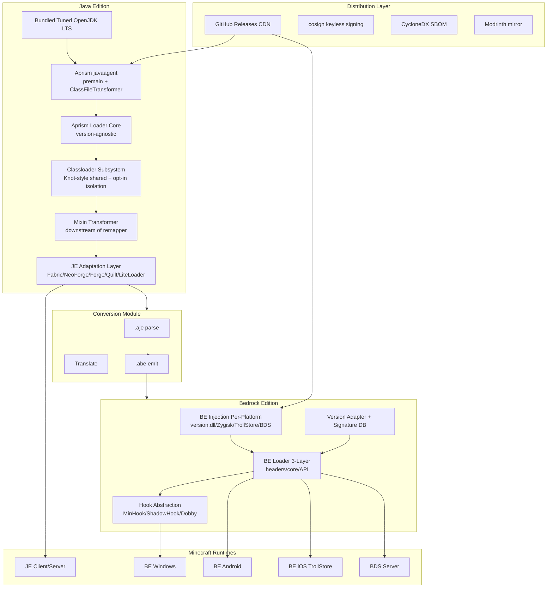
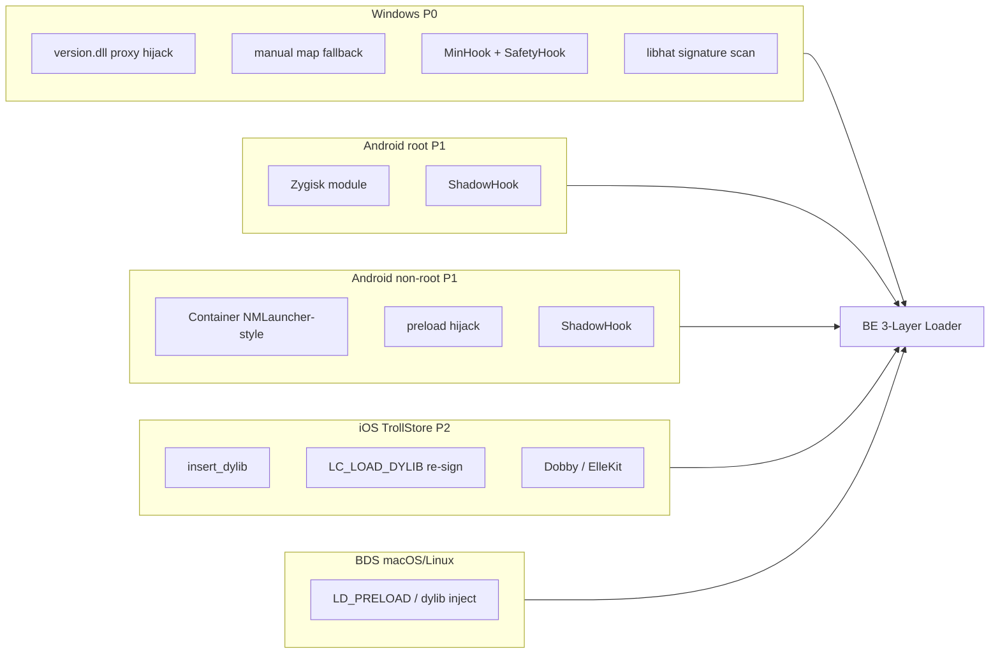
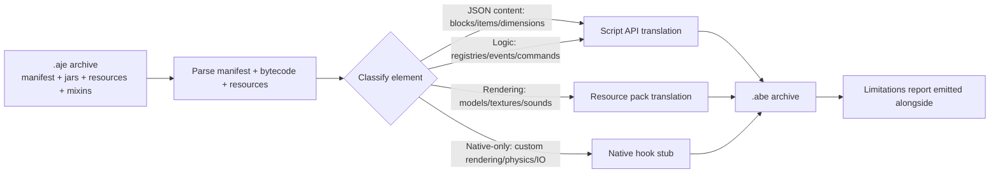
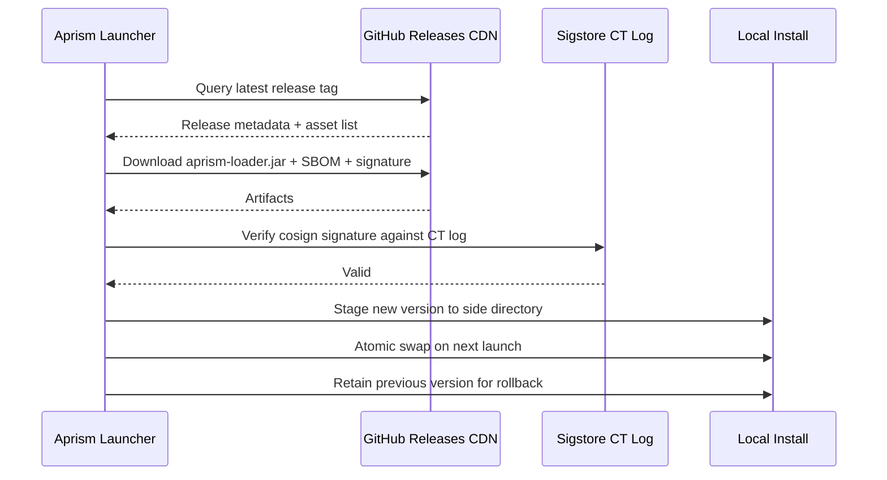

# Aprism Loader Overall Architecture Design

> Document 1 of 8 | Aprism Loader Documentation Set
> Version: v26.0-Alpha1-Phase0 | Status: Development
> Author: BlockConnect@StarsailsClover
> Canonical language: English (Chinese copy maintained in parallel)

## 1. Executive Summary

Aprism is a unified, cross-edition, cross-platform Minecraft modding platform that spans Java Edition (JE) and Bedrock Edition (BE) under a single developer-facing API surface. It is not a single loader but a stratified system: a JE native foundation built on a premain javaagent and `ClassFileTransformer` over a bundled, tuned OpenJDK LTS build; an adaptation layer that ingests existing Fabric, NeoForge, Forge, Quilt, and LiteLoader mod formats; a BE injection and loader subsystem that performs per-platform native binary patching on Windows, Android, iOS, and BDS; a JE-to-BE conversion module that re-targets JE mod artifacts to Bedrock behavior/resource packs and native hooks; and a distribution pipeline built on GitHub Releases with cosign keyless signing and CycloneDX SBOMs.

The design is governed by four non-negotiable invariants. First, mod containers expose reference identity that is stable across every lookup API in the system. Second, the public interface contract is monotonically increasing: additions and deprecations are permitted, removals and renames are not. Third, every supported Minecraft version is addressed through a compatibility group with an explicit SemVer range; nothing is "best effort." Fourth, distribution is standalone desktop only, because Microsoft Store Policy 10.2 and Apple App Review Guideline 2.4.5(iv) legally block dynamic code injection in store-distributed applications.

This document is the canonical architecture reference. All other Aprism documents (build tooling, manifest schema, API reference, BE internals, conversion, distribution, versioning, and security) derive from and must remain consistent with the decisions recorded here.

## 2. Design Goals and Principles

### 2.1 Goals

| Goal | Statement |
|------|-----------|
| Unified interfaces | A mod authored against the Aprism API runs on every supported Minecraft edition and loader without source changes where semantics permit. |
| Monotonic version increment | The public API surface only grows. Deprecation is allowed for at least one LTS cycle; removal and rename are forbidden. |
| Cross-edition | JE and BE share a manifest superset and a conversion pipeline so a single source artifact can target both editions. |
| Cross-platform | JE targets Windows, macOS, and Linux desktops. BE targets Windows, Android (root and non-root), iOS (TrollStore), and BDS on macOS/Linux. |
| Forced compatibility | Compatibility is declared up front via compatibility-group SemVer ranges and enforced at load time. Mods with unsatisfied ranges are not loaded rather than loaded and broken. |

### 2.2 Principles

- **Substrate, not rewrite.** Aprism sits on a tuned OpenJDK, not a custom JVM. The loader core is version-agnostic and mirrors the Fabric Loader architecture so that the largest existing mod catalog (Fabric, Quilt, LiteLoader) loads natively.
- **Canonical injection.** SpongePowered Mixin is the sole bytecode injection mechanism for JE. There is exactly one Mixin transformer, inserted downstream of Aprism's own remapper, never as a competing transformation pass.
- **Per-platform realism.** BE injection is acknowledged as version-fragile. The version adapter and signature database are the dominant engineering investment, not an afterthought.
- **Legal hygiene.** Aprism never redistributes modified Minecraft jars, never ships on stores that prohibit code injection, and never modifies Xbox Live network traffic.

## 3. High-Level Architecture

The JE path is a strict pipeline: bundled JDK hosts the Aprism javaagent, which installs a `ClassFileTransformer` over the loader core. The loader core owns classloaders, the Mixin transformer, and the adaptation layer, which dispatches to per-loader providers. The BE path is parallel: a per-platform injector bootstraps the 3-layer loader, which consults the version adapter and signature database before installing hooks through a platform-specific hook backend. The conversion module bridges the two: it consumes a packaged `.aje` artifact and emits a `.abe` artifact, deferring to Script API where semantics align and to native hooks otherwise.

## 4. JE Aprism Native Foundation

The foundation is a premain javaagent coupled with a `ClassFileTransformer` over a bundled, tuned OpenJDK LTS build derived from Eclipse Temurin. The agent JAR is attached via `-javaagent:aprism-loader.jar` on the JE launch command line and registers its transformer before the application classloader resolves any Minecraft class. This guarantees that every Minecraft class transits the Aprism transformation pipeline exactly once and in a deterministic order.

### 4.1 Why Not a Custom JVM or GraalVM Native Image

A custom JVM would grant maximum control over classloading, GC, and JIT policies but would impose a permanent maintenance burden, diverge from upstream security fixes, and break compatibility with arbitrary user JVM tooling (profilers, agents, debuggers). The cost-benefit ratio is unfavorable for a modding platform. Aprism therefore tracks upstream OpenJDK LTS and applies a curated patch set (tiered compilation tuning, class data sharing for warm start, and metadata reductions) rather than forking.

GraalVM Native Image is reserved for an opt-in, pre-baked modpack bundle: a closed-world mod set compiled ahead-of-time to a native executable for sub-second cold start on low-end hardware. This is not the default runtime because closed-world analysis is incompatible with dynamic mod loading, reflection-heavy mods, and runtime Mixin application. The native bundle is a distribution target, not a foundation.

Project Leyden is tracked for its promise of ahead-of-time class linking and method profiling snapshots, which would dramatically improve launcher warm-start. Aprism will adopt Leyden output formats when they stabilize in an upstream LTS; until then, AppCDS is used as the warm-start mitigation.

### 4.2 Version-Agnostic Loader Core

The loader core exposes a stable internal SPI that does not reference Minecraft version symbols. It mirrors the Fabric Loader decomposition: a `Loader` owns a set of `ModContainer` instances, each backed by a `ModClassLoader`; a `Knot`-style classloader graph resolves classes; transformation is delegated to a pluggable `IMixinPlatformAgent`-equivalent. Minecraft-version-specific logic (mapping names, version-gated adapters) lives in the adaptation layer, never in the core.

## 5. Classloader and Transformation Subsystem

### 5.1 Default Shared Class Space

The default classloader strategy is a Fabric Knot-style shared class space. All mods share a single parent classloader that exposes the union of their exported packages, with per-mod child classloaders that defer to the parent for shared classes and isolate only their internal packages. This maximizes the addressable mod catalog: Fabric, Quilt (which loads Fabric mods through a compat shim), and LiteLoader mods all expect a shared space and break under stricter isolation.

### 5.2 Opt-in Isolated ModClassLoader Shim

Forge-style mods require an isolated `ModClassLoader` because Forge mods assume their own classloader is the defining loader of their classes and rely on `getClass().getClassLoader()` returning a mod-specific instance. Aprism exposes an opt-in `isolated` flag in `aprism.manifest.json`. When set, the mod is wrapped in an `IsolatedModClassLoader` shim that satisfies Forge's classloader-identity expectations while still routing transformation through the central pipeline.

### 5.3 ModContainer Reference Identity Invariant

Every `ModContainer` returned by any lookup API (`Loader.getModContainer`, event payloads, registry callbacks, dependency resolution) is the same object instance. There is no per-API facsimile. This invariant is enforced by a single container registry and is the load-bearing assumption that lets adaptation-layer providers interoperate without re-wrapping.

### 5.4 Mixin as Canonical Injection

SpongePowered Mixin is the sole bytecode injection mechanism. Aprism registers exactly one `MixinTransformer` in its `ClassFileTransformer` chain, positioned downstream of Aprism's own remapper. This mirrors the Fabric and NeoForge integration: Mixin sees already-remapped names and operates on stable intermediaries. No competing injection framework (AccessWidener-as-transformer, custom ASM passes) is permitted to mutate bytecode after Mixin; AccessWidener is applied as a separate pre-Mixin widening pass.

### 5.5 Remapping Strategy

For Minecraft versions prior to 26.1, Aprism consumes Fabric Intermediary mappings and applies TinyRemapper-equivalent remapping at load time so that mods authored against intermediaries resolve against runtime obfuscated names. For 26.1 and later, Mojang ships unobfuscated jars, so Aprism runs in no-remap mode: the remapper is a pass-through and Mixin operates directly on official names. Refmaps (the YAML mapping from development names to intermediary names shipped inside mod jars) are honored in remapped mode and ignored in no-remap mode.

## 6. JE Adaptation Layer

The adaptation layer is a set of provider implementations, one per supported loader format. Each provider parses its native manifest, constructs a `ModContainer`, registers entrypoints, and bridges its native event/registration model onto the Aprism event bus.

| Provider | Native Manifest | Entrypoint Model | Notes |
|----------|-----------------|------------------|-------|
| Fabric | `fabric.mod.json` v1 | `main`/`client`/`server` entrypoints | Largest catalog; loads natively in shared space. |
| NeoForge | `neoforge.mods.toml` | `@Mod` annotation, `IEventBus` | Diverged from Forge July 2023; isolated classloader shim. |
| Forge | `mods.toml` | `@Mod` annotation, `@SubscribeEvent` | Legacy; isolated classloader shim. |
| Quilt | `quilt.mod.json` | QSL entrypoints | QSL discontinued Dec 2025; loads Fabric mods via compat shim. ModContainer identity bug fixed in Quilt 0.29.2 is enforced by Aprism's identity invariant regardless. |
| LiteLoader | `litemod.json` | `init()` lifecycle | Legacy 1.12.2 only, abandoned 2017. Read-only compatibility. |

### 6.1 Entrypoint and Event Bus Adapters

Each provider exposes an adapter that translates its native entrypoint contract onto the Aprism phase-strict event bus. The Fabric functional registration adapter maps `Registry.register` calls and `RegistryHelper` callbacks onto Aprism's `SETUP` phase. The Forge `addListener` adapter maps `IEventBus.addListener` subscriptions onto the corresponding Aprism phase. Both adapters are backed by the same bus instance; there is no per-loader bus.

### 6.2 Auto-Discovery Fallback

When a mod ships without an `aprism.manifest.json`, the adaptation layer auto-discovers `fabric.mod.json`, `neoforge.mods.toml`, `mods.toml`, and `litemod.json` in priority order and synthesizes an Aprism manifest. Synthesis is lossy: only the fields with unambiguous Aprism equivalents are populated. Mods requiring Aprism-specific features (cross-edition conversion, compatibility-group declaration) must ship an explicit `aprism.manifest.json`.

## 7. BE Injection and Loader Subsystem

Bedrock Edition is a closed-source C++ binary with no official native mod SDK. The Script API (`@minecraft/server`) is a sandboxed JavaScript runtime that cannot create custom blocks, items, or dimensions beyond JSON-defined content. Native modding is therefore the only path to feature parity with JE mods. Amethyst (a Windows client loader) and LeviLamina (a BDS server loader) demonstrate feasibility but are version-fragile: function offsets shift on every Bedrock update.

### 7.1 Per-Platform Injection

| Platform | Priority | Injection Vector | Hook Engine | Notes |
|----------|----------|------------------|-------------|-------|
| Windows | P0 | `version.dll` proxy hijack + manual map fallback | MinHook + SafetyHook | libhat for pattern scanning; primary development target. |
| Android (root) | P1 | Zygisk module | ShadowHook | Per-process injection via Zygote. |
| Android (non-root) | P1 | NMLauncher-style container + preload hijack | ShadowHook | No system modification; isolated container. |
| iOS (TrollStore) | P2 research | `insert_dylib` + `LC_LOAD_DYLIB` re-sign | Dobby / ElleKit | TrollStore sideload only; no App Store path. |
| macOS / Linux | N/A (client) | BDS server only | LD_PRELOAD / dylib | No BE client on these platforms. |
| Consoles | Impossible | N/A | N/A | Locked-down OS; no injection surface. |

### 7.2 Three-Layer Loader Architecture

The BE loader follows the LeviLamina three-layer pattern.

1. **Reverse-engineered headers layer.** Auto-generated by a `header_generator` toolchain fed by `BedrockAnalyzer` outputs. This layer exposes C++ class layouts, vtable indices, and function signatures as consumed headers, decoupling loader code from hand-maintained offsets.
2. **Core layer.** Owns the mod registrar, the hook manager, and the version database. The hook manager abstracts over the platform hook engine and is the only component permitted to install inline or vtable hooks.
3. **Public API layer.** Exposes events, commands, and a registry to mod code. Mods target only this layer; the core and headers layers are internal.

Source is split across `src/` (shared), `src-client/` (client-only hooks such as rendering), and `src-server/` (BDS-only hooks such as chunk serialization).

### 7.3 Version Adapter and Signature Database

The version adapter is the single most important engineering investment in the BE subsystem. Bedrock updates shift function offsets and struct layouts unpredictably. Aprism addresses this with a signature database: function locations are stored as libhat pattern signatures (byte patterns with wildcard masks) maintained in a community-versioned repository. At load time, the adapter resolves signatures against the running binary, populates a function pointer table, and refuses to load if any required signature is unresolved. Mods declare the Bedrock version range they support; mismatches fail closed.

### 7.4 Hook Abstraction

The hook manager presents a uniform `installHook(target, detour)` API to mods and dispatches to the platform engine: MinHook or SafetyHook on Windows, ShadowHook on Android, Dobby or ElleKit on iOS. Mods never call a platform hook engine directly.

## 8. JE-to-BE Conversion Module

The conversion module consumes a packaged `.aje` artifact and emits a `.abe` artifact. It is not a universal translator; it is a best-effort pipeline with explicit fallback semantics.

### 8.1 Translation Targets

- **Script API candidates:** JSON-defined content (blocks, items, dimensions), registry callbacks, command registration, and event handlers whose semantics match `@minecraft/server` events. These translate to behavior pack scripts.
- **Resource pack candidates:** models, textures, sounds, and language files. These translate to Bedrock resource pack assets, with format conversions where schemas differ.
- **Native hook candidates:** custom rendering, custom physics, filesystem I/O, and any capability the Script API does not expose. The converter emits a stub `native/` directory containing a C++ skeleton that the mod author must complete. The converter does not synthesize native code; it produces a buildable scaffold and a manifest `type: native` entry.

### 8.2 Limitations

The converter cannot translate Mixins. A JE mod that uses `@Inject` or `@Redirect` to alter Minecraft internals has no Script API equivalent and must be re-implemented as a BE native mod. The converter detects Mixin usage and emits a limitations report listing every untranslatable element. The `.abe` artifact is always produced; whether it is functionally equivalent to the `.aje` source is reported explicitly and never assumed.

## 9. Unified API Surface

### 9.1 IAprismMod Interface

Every mod entrypoint implements `IAprismMod`, the single lifecycle interface. Providers that bridge native entrypoints (Fabric `ModInitializer`, NeoForge `@Mod` constructors) wrap the native entrypoint in an `IAprismMod` adapter so that the rest of the system sees a uniform type.

### 9.2 Phase-Strict Event Bus

The event bus is partitioned into strictly ordered phases. A handler registered for a phase fires only during that phase, and registration after a phase has completed is rejected with an error rather than silently dropped.

| Phase | Semantics | Typical Use |
|-------|-----------|-------------|
| PREINIT | Manifest parsed, classloaders ready, no Minecraft classes touched. | Mixin config registration, early logging. |
| INIT | Minecraft classloading has begun; registries are open. | Registry subscription, config load. |
| SETUP | Registries frozen; content may be added but not redefined. | Inter-mod wiring, capability registration. |
| COMPLETE | All registration finalized. | Late validation, cross-mod integrity checks. |
| CLIENT | Client-only context active. | Rendering, input, screen registration. |
| SERVER | Server-only context active. | Dedicated server logic, world lifecycle. |

### 9.3 Registry, Config, and the Monotonic Contract

Registry APIs expose only additive operations. Config schemas are versioned with the same monotonic rule: fields may be added and deprecated, never removed or renamed. A field marked deprecated remains functional for at least one LTS cycle and emits a warning on use. This contract is enforced by a build-time API compatibility check that compares the public surface against the previous released baseline.

## 10. Build and Packaging Pipeline

### 10.1 Architectury Loom Foundation

The build foundation is Architectury Loom, the multi-loader fork of Fabric Loom. For Minecraft 26.1 and later, the `loom-no-remap` profile is used because Mojang ships unobfuscated jars. For earlier versions, the standard remapping Loom pipeline is used.

### 10.2 aprism-packaging Gradle Plugin

A custom `aprism-packaging` Gradle plugin produces the `.aje` and `.abe` archives. The plugin consumes the compiled artifact set, the manifest, the Mixin configs, and the platform subdirectories, and emits the archive in the format defined in section 12.

### 10.3 Compatibility-Group Jars

Mods are packaged as compatibility-group jars: a single artifact declares the SemVer range of Minecraft versions it supports and the compatibility group it belongs to. The loader selects the correct artifact at runtime based on the running Minecraft version.

### 10.4 Split Profiles

Two build profiles are maintained in parallel.

| Profile | Minecraft Range | Gradle | Java Target |
|---------|-----------------|--------|-------------|
| Legacy | pre-26.1 (remapped) | Gradle 8.x | Java 17 (1.20-1.20.4), Java 21 (1.20.5-1.21.11) |
| Modern | 26.1+ (no-remap) | Gradle 9.x | Java 25 |

### 10.5 Version Catalog

A single `gradle/libs.versions.toml` central catalog pins all dependency versions across the build. Plugin and dependency versions are not declared inline.

## 11. Distribution and Update Architecture

### 11.1 Channel

Distribution is standalone desktop download only. Aprism is not published to the Microsoft Store or Apple App Store, because store policies (Microsoft Store Policy 10.2, Apple App Review Guideline 2.4.5(iv)) prohibit dynamic code injection in store-distributed applications. Modrinth is used as a mirror, not a primary channel, because Modrinth hosts mod artifacts, not the loader itself.

Minecraft binaries are downloaded from Mojang-authorized sources at install time. Aprism never redistributes modified Minecraft jars.

### 11.2 Integrity

Every release artifact is signed with cosign keyless signing (OIDC-bound, certificate transparency logged) and accompanied by a CycloneDX SBOM. Verification is performed at install time and on every update.

### 11.3 Update Flow

Updates are atomic: the new version is staged alongside the existing install, swapped on the next launch, and the previous version is retained for one cycle to enable rollback. A failed signature verification aborts the update before any filesystem mutation.

## 12. Versioning and Compatibility Contract

### 12.1 Version Scheme

The Aprism version follows `v<MC>.<aprism>-<stability>-<phase>`. The current document targets `v26.0-Alpha1-Phase0`, meaning Minecraft 26.0 baseline, Aprism Alpha 1, Phase 0 of the rollout. The Alpha/Phase scheme denotes progressively widening audience and feature freeze: Phase 0 is internal, Phase 1 is closed beta, Phase 2 is open beta, Phase 3 is general availability.

### 12.2 JDK Targets

| Minecraft Range | JDK Target |
|-----------------|------------|
| 1.20 - 1.20.4 | Java 17 |
| 1.20.5 - 1.21.11 | Java 21 |
| 26.x | Java 25 |

### 12.3 Monotonic Interface Contract

The public interface contract is monotonic. Additions are permitted at any time. Deprecations are permitted and must carry a removal-cycle target, but the deprecated surface remains functional for at least one LTS cycle. Removals and renames are forbidden; a renamed API is a new API coexisting with the old. This contract is enforced by a build-time compatibility check that diffs the public surface against the previous baseline and fails the build on any non-additive change.

### 12.4 Compatibility Groups

A compatibility group is a set of Minecraft versions that share a common mapping and adapter surface. Mods declare the group they target via SemVer range. The loader resolves the running version against the declared range and refuses to load a mod whose range does not contain the running version.

## 13. Security Considerations

### 13.1 Supply Chain

Every release artifact is signed with cosign keyless signing and accompanied by a CycloneDX SBOM. Dependency provenance is verified at build time. The version catalog pins every dependency to a digest-pinned coordinate where the upstream registry supports it. Mods loaded from untrusted sources are sandboxed by default: filesystem and network access require explicit manifest declaration and user consent at install time.

### 13.2 Bedrock Ban Risk Disclosure

BE client mods that touch network traffic carry a real Xbox Live enforcement risk. Microsoft may issue account or device bans for client modification that affects online play. Aprism discloses this risk at install time and defaults BE client mods to offline-only operation. Network-affecting hooks require an explicit user opt-in per mod. BDS server mods carry no Xbox Live risk because BDS is a server product; this is the safest BE target and the recommended starting point for BE mod authors.

### 13.3 Sandbox Argument

The Aprism sandbox is capability-based: a mod's manifest declares the capabilities it requires (filesystem paths, network endpoints, native hooks, inter-mod reflection). The loader grants exactly the declared capabilities and denies everything else. The sandbox is not a security boundary against a malicious mod with native hooks; native hooks are, by definition, escapes. The sandbox is a defense against accidental overreach and a disclosure mechanism: a mod's capabilities are visible to the user before installation.

## 14. Risk Register

| Risk | Likelihood | Impact | Mitigation |
|------|-----------|--------|------------|
| Bedrock update shifts offsets, breaking all BE mods. | High | High | Signature database with community-maintained patterns; version adapter fails closed; rapid signature update pipeline. |
| Microsoft Store / App Store policy enforcement against related tooling. | Low | High | Standalone desktop distribution only; no store presence; legal review of distribution channel. |
| Xbox Live enforcement against BE client mod users. | Medium | High | Offline-by-default for BE client mods; explicit opt-in for network hooks; prominent disclosure. |
| Mixin transformer conflict with provider-specific transformation. | Low | Medium | Single Mixin transformer, downstream of remapper; no competing injection frameworks. |
| Quilt QSL deprecation (Dec 2025) leaves Quilt-only mods unsupported. | Medium | Low | Quilt provider loads Fabric mods via compat shim; Quilt-only surface treated as best-effort. |
| GraalVM native bundle maintenance burden. | Low | Low | Reserved for opt-in pre-baked modpack bundles; not the default runtime; closed-world scope required. |
| Project Leyden format churn before LTS stabilization. | Medium | Low | AppCDS used as interim warm-start mitigation; Leyden adoption deferred until LTS stabilization. |
| LiteLoader legacy mods use abandoned 1.12.2-only APIs. | Low | Low | Read-only compatibility; no forward porting. |
| JE-to-BE converter produces functionally incomplete `.abe` artifacts. | High | Medium | Limitations report emitted alongside every conversion; native scaffold for untranslatable features; never assume equivalence. |
| Supply chain compromise of a bundled dependency. | Low | High | cosign keyless signing; CycloneDX SBOM; digest-pinned dependencies; capability sandbox. |

## 15. References

- Fabric Loader, Knot classloader, TinyRemapper, Intermediary mappings. `fabric.mod.json` schema v1 with entrypoints, mixins, depends, accessWidener.
- SpongePowered Mixin: `*.mixins.json` configuration, `@Mixin` / `@Inject` / `@Redirect` / `@ModifyArg`, `MixinTransformer` positioned downstream of remapping.
- NeoForge: `neoforge.mods.toml`, `@Mod` annotation, `IEventBus`, `ModClassLoader` isolation. Diverged from Forge July 2023.
- Minecraft Forge: `mods.toml`, `@Mod`, `@SubscribeEvent`, isolated classloader model.
- Quilt Loader: `quilt.mod.json`, QSL discontinued December 2025, Fabric compat shim, `ModContainer` identity fix in 0.29.2.
- LiteLoader: `.litemod` format, `litemod.json`, 1.12.2 only, abandoned 2017.
- MultiLoader-Template: common / fabric / neoforge source sets, `IPlatformHelper` via `ServiceLoader`. Neo-Loom fork (moritz-htk) building Fabric and NeoForge from a single Loom pipeline.
- Architectury Loom; `loom-no-remap` profile for unobfuscated 26.1+ jars.
- Bedrock Edition: C++ binary, closed source, Script API (`@minecraft/server`) sandboxed JavaScript.
- Amethyst: Bedrock client C++ loader, Windows.
- LeviLamina: Bedrock server C++ loader, BDS; three-layer architecture pattern.
- libhat: signature and pattern scanning library for native binaries.
- MinHook, SafetyHook: Windows inline hook engines.
- ShadowHook: Android inline hook engine used by Zygisk modules.
- Dobby, ElleKit: iOS inline hook engines.
- `insert_dylib`, `LC_LOAD_DYLIB` re-signing: iOS Mach-O load command injection.
- Zygisk: Magisk module format for per-process Android injection via Zygote.
- cosign, Sigstore: keyless code signing with OIDC and certificate transparency.
- CycloneDX: software bill of materials standard.
- Microsoft Store Policy 10.2; Apple App Review Guideline 2.4.5(iv): prohibitions on dynamic code injection in store-distributed applications.
- Project Leyden: OpenJDK ahead-of-time class linking and method profiling effort.
- Eclipse Temurin: OpenJDK LTS distribution used as the Aprism bundled JDK base.
- Gradle `libs.versions.toml`: central version catalog.
