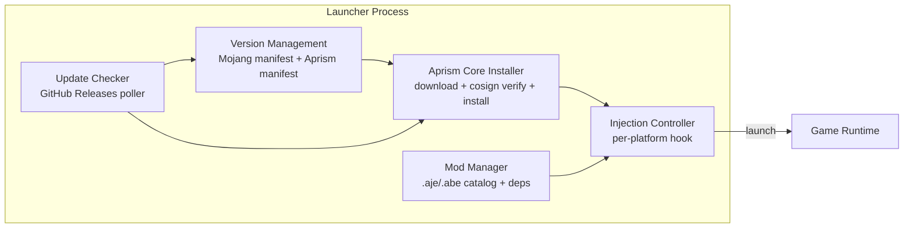
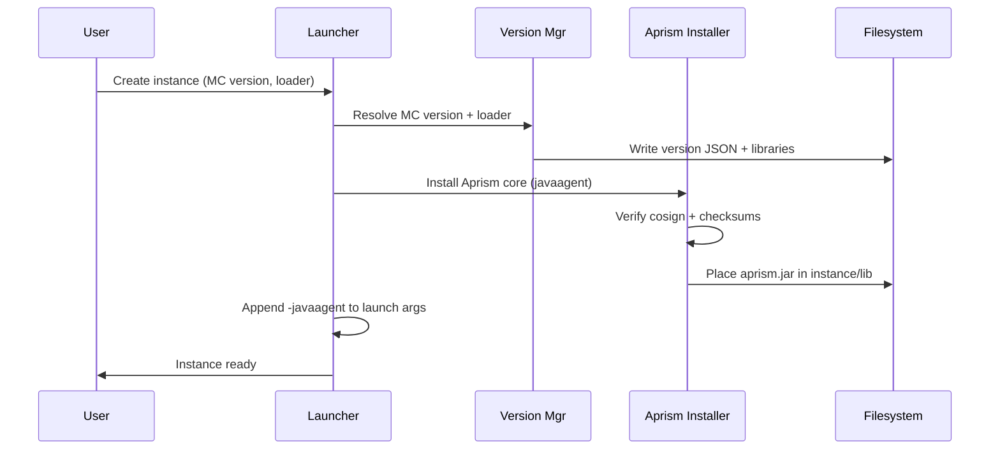
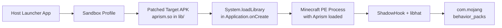
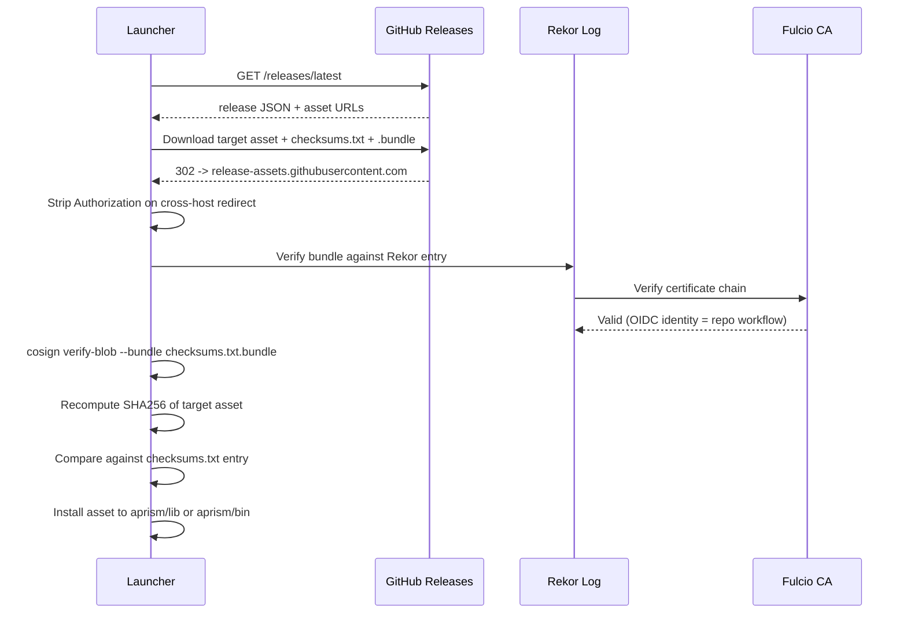
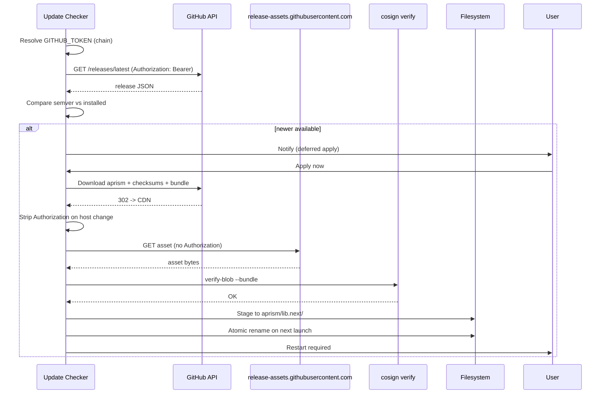

# Minecraft JE/BE Launcher Aprism Adaptation, Download, Installation and Management Module Development Guide

> Document 3 of 8 | Aprism Loader Documentation Set
> Version: v26.0-Alpha1-Phase0 | Status: Development
> Author: BlockConnect@StarsailsClover
> Canonical language: English (Chinese copy maintained in parallel)

## 1. Executive Summary

This guide specifies the integration surface between the Aprism Loader and third-party or first-party Minecraft launchers. It covers four lifecycle concerns that every conforming launcher must implement: (1) discovery and download of Aprism core artifacts from GitHub Releases with cosign verification, (2) per-platform installation of the loader into Java Edition (JE) and Bedrock Edition (BE) client/server runtimes, (3) Aprism mod (`.aje` / `.abe`) download, dependency resolution and management, and (4) self-update of the Aprism core on the user's machine.

Distribution is restricted to a standalone desktop download. Aprism artifacts are never published to Microsoft Store, Apple App Store, or Realms channels. JE Minecraft jars are always fetched from Mojang-authorized sources; Aprism never redistributes modified Mojang jars. BE injection techniques vary by platform and are documented in Section 4. All GitHub Releases artifacts are signed with cosign keyless signing (Fulcio-issued X.509 certificates, Rekor transparency log entries), and launchers MUST verify signatures before invoking any Aprism binary.

The intended audience is launcher developers (C++/Qt, C#/.NET, Kotlin, Swift, Go) integrating Aprism into an existing or new launcher product. Reference implementations exist for Prism Launcher, MultiMC, ATLauncher and the official launcher adapter layer on JE; NMLauncher-pattern container launchers on Android; TrollStore-based workflows on iOS.

## 2. Launcher Integration Overview

A conforming Aprism launcher is composed of five logical components. They may be in-process modules or separate processes communicating over a local IPC channel, but the responsibilities are fixed.



| Component | Responsibility | Persistence |
| --- | --- | --- |
| Version Management | Fetch and cache JE `version_manifest_v2.json`, BE BDS download index, Aprism manifest | `versions/` cache, TTL 30 min |
| Aprism Core Installer | Download artifact, verify cosign + checksums, install per platform | `aprism/lib/`, `aprism/bin/` |
| Mod Manager | Discover mods from Modrinth/CurseForge/GitHub/local, resolve deps, write mod list | `mods/`, `behavior_packs/` |
| Injection Controller | Apply platform-specific hook (javaagent, proxy DLL, Zygisk, insert_dylib, direct link) | Per-instance state |
| Update Checker | Poll GitHub Releases `/latest`, compare semver, schedule update window | `aprism/state/updates.json` |

The components communicate through a shared `AprismContext` object holding resolved paths, the active Java runtime, the resolved GitHub token, and the user's update channel preference. The Injection Controller is the only component permitted to mutate game launch arguments.

## 3. JE Launcher Integration

### 3.1 Instance Creation with Aprism

A JE launcher instance is a self-contained game profile with its own version JSON, libraries, mods and runtime arguments. Aprism integrates as a Java agent attached at JVM startup. The launcher appends the following to the JVM argument list:

```
-javaagent:${aprism_home}/lib/aprism.jar=${aprism_args}
```

When Fabric or NeoForge is present, Aprism must be loaded as a cooperating agent rather than a mixin participant, to avoid duplicate transform conflicts. The recommended order is: loader chain (Fabric Loader or NeoForge userdev) first, Aprism agent second. Aprism detects the loader via `fabric.mod.json` / `neoforge.mods.toml` metadata and defers mixin application for classes owned by the co-installed loader.

The instance creation flow:



### 3.2 Version Manifest Fetching and Caching

JE version metadata is fetched from `https://piston-meta.mojang.com/mc/game/version_manifest_v2.json`. The launcher caches this file under `versions/manifest_v2.json` with an ETag and a 30-minute TTL. Each entry in the `versions` array points to a per-version JSON document containing `libraries`, `downloads.client.url`, `assetIndex` and `arguments.game`. Launchers MUST NOT invent or rewrite version JSONs; they consume the Mojang-published documents verbatim.

For offline launches, the cached manifest and downloaded version JSONs are used directly. If the manifest is stale beyond 7 days, the launcher warns the user and continues if all required artifacts are already on disk.

### 3.3 Java Runtime Detection and Recommendation

JE versions map to required Java runtimes per Mojang profile. The launcher maintains a table mapping each major Minecraft version to its recommended Java major:

| MC Version Range | Java Major | Notes |
| --- | --- | --- |
| 1.0 - 1.16.4 | 8 | Legacy |
| 1.16.5 - 1.17.0 | 16 | Transitional |
| 1.17.1 - 1.20.4 | 17 | LTS |
| 1.20.5 - 1.20.6 | 21 | LTS |
| 1.21+ | 21 | Aprism minimum runtime |
| 1.21.6+ (planned) | 25 | Aprism forward-compat |

Aprism itself requires Java 21 as a baseline runtime for the launcher process. The agent jar is built with `--release 21` bytecode and is forward-compatible with Java 25. Launchers SHOULD offer to install a Mojang-provided Java runtime (from `javaRuntimeManifest` in the version JSON) if no matching runtime is detected in the user's PATH or configured runtime list.

### 3.4 Mod Directory Management

JE mods live in `.minecraft/mods/` (flat directory or `mods/<version>/` per-instance layout for MultiMC/Prism). Aprism `.aje` archives are placed in the same directory as standard `.jar` mods. The Aprism agent scans `mods/` at startup and loads any file with a `.aje` extension as an Aprism mod container; `.jar` files are passed through to Fabric/NeoForge unmodified.

```
.minecraft/
  mods/
    fabric-api.jar
    aprism-core.aje
    example-mod.aje
    jei.jar
```

Nested directory scanning is disabled by default to avoid picking up `mods/<disabled>/` holding areas used by some launchers. The launcher exposes an explicit "Aprism mods folder" view that lists `.aje` files alongside co-installed `.jar` mods.

### 3.5 Adapter Patterns for Existing Launchers

| Launcher | Adapter Pattern | Hook Point |
| --- | --- | --- |
| Prism Launcher | `InstanceLaunchTask` modification, custom component `net.aprism:aprism` | `LaunchStep::makeJavaLaunchCommand` appends `-javaagent` |
| MultiMC | Component system (类似 `net.fabricmc:fabric-loader`) | `OneSixProfileStrategy::createProfile` |
| ATLauncher | `InstanceSettings#launchArgs` post-processor | `Instance#launch` arg injection |
| Official Launcher | Out-of-process wrapper script (`aprism-launch.bat`/`.sh`) | Sets `JVM_ARGS` env before invoking `MinecraftLauncher.exe` |

Prism Launcher is the reference implementation target because it already ships an open-source GitHub Releases self-updater (PrismExternalUpdater/GitHubRelease.cpp) that the Aprism Update Checker can mirror.

## 4. BE Launcher Integration - Per Platform

BE injection is platform-specific and differs fundamentally from JE. There is no Java agent; the loader is a native shared library loaded into the game process via OS-specific hook mechanisms.

### 4.1 Windows (Priority P0)

The BE Windows client is a UWP application installed under `C:\Program Files\WindowsApps\Microsoft.MinecraftUWP_*\`. The user-writable data directory is `%LocalAppData%\Packages\Microsoft.MinecraftUWP_*\LocalState\games\com.mojang\`. The launcher cannot write into `WindowsApps` directly due to ACL restrictions.

The primary injection technique is proxy DLL hijacking. The Aprism launcher drops a `version.dll` (renamed Aprism loader) next to `Minecraft.Windows.exe`. The Windows loader resolves `version.dll` from the executable directory before checking System32, allowing the proxy to forward legitimate calls to the real `version.dll` via `GetProcAddress` while loading the Aprism core through `DllMain` (or a deferred init routine). Hooking is performed with MinHook; libhat provides type-erased function pointer storage for forwarding tables.

ExLoader or manual mapping is a fallback when proxy DLL is blocked by antivirus or by Microsoft Defender Application Control (WDAC). The fallback requires elevated privileges and is opt-in only.

UWP sandbox considerations:

- The launcher runs as a standard user process. To write `version.dll` into the package install folder, it must take ownership via `takeown` + `icacls`, which requires administrator privileges.
- An alternative is to install into the package's local state via a sideloaded helper, but this requires the app to load the DLL by path, which it does not do for `version.dll`. Therefore the supported path is the elevated install into `WindowsApps`.
- AV whitelisting guidance for the proxy DLL is covered in Section 11.

### 4.2 Android Root (Priority P1)

Rooted Android devices use a Zygisk module distributed as a Magisk module zip. The module's `service.sh` or `post-fs-data.sh` starts the Zygisk companion, which injects into the `zygote`-forked `com.mojang.minecraftpe` process before `Application.onCreate` runs. ShadowHook is used for native inline hooks; libhat provides indirection.

Magisk module structure:

```
aprism-zygisk/
  module.prop          # id=aprism, name, version, author
  zygisk/
    arm64-v8a.so       # Aprism loader for arm64
    armeabi-v7a.so     # Aprism loader for armv7
  service.sh           # start Zygisk companion
  post-fs-data.sh      # mount .abe mods directory
```

The module reads its config from `/data/adb/aprism/config.json` and serves `.abe` mods from `/data/adb/aprism/mods/`. Symlinks into `/sdcard/games/com.mojang/behavior_packs/` allow world-scoped packs to resolve.

### 4.3 Android Non-Root (Priority P1)

Non-root Android uses a container launcher pattern, following the NMLauncher reference architecture. The host launcher repackages the official Minecraft APK with the Aprism `.so` injected into `lib/armeabi-v7a/` and `lib/arm64-v8a/`, then installs the patched APK into a sandboxed profile.



The host app controls `Application.onCreate` by replacing the `android:name` attribute in the repackaged `AndroidManifest.xml`. The Aprism `.so` is added as a `lib/<abi>/libaprism.so` entry and is loaded before the native Minecraft libraries through a constructor function. Because the patched APK must be signed with a debug or user-chosen key, the launcher cannot keep the original Mojang signature; this is documented to the user before installation.

### 4.4 iOS (Priority P2)

iOS injection uses TrollStore to install a permanently-signed IPA with arbitrary entitlements. The workflow is:

1. Obtain the original Minecraft IPA (user-supplied; Aprism never redistributes).
2. Use `insert_dylib` to add an `LC_LOAD_DYLIB` load command pointing at `@executable_path/Frameworks/Aprism.dylib`.
3. Place `Aprism.dylib` into the IPA's `Frameworks/` directory.
4. Re-sign the IPA with a developer or TrollStore-permitted identity.
5. Install via TrollStore.

Because TrollStore installation is per-IPA, every BE update from Mojang requires re-running the injection workflow. The launcher maintains a "last injected BE version" record and prompts the user to re-inject when an update is detected via the App Store or TrollStore update API.

### 4.5 BE BDS Server (Priority P0)

The Bedrock Dedicated Server (`bedrock_server.exe` on Windows, `bedrock_server` on Linux) requires no injection. The Aprism loader is linked directly into a wrapper executable that exports the same symbols expected by the server binary. The launcher replaces the user's `bedrock_server` invocation with `aprism-bds-launcher` which `dlopen`s the original binary and forwards its entrypoint.

`server.properties` integration: the launcher writes Aprism-specific keys into `server.properties` under the `aprism.` namespace (e.g., `aprism.mod-directory=./aprism/mods`). The Aprism BDS loader reads these keys at startup.

### 4.6 Platform Injection Comparison

| Platform | Technique | Launcher Requirement | Root Needed | User Friction |
| --- | --- | --- | --- | --- |
| Windows (UWP) | Proxy DLL hijack (version.dll) | Elevated install into WindowsApps | No | One-time admin prompt, AV may flag |
| Windows (UWP) fallback | ExLoader / manual map | Elevated launcher | No | High; AV almost certainly flags |
| Android root | Zygisk + ShadowHook | Magisk module install | Yes | Low once rooted |
| Android non-root | Container + preload hijack | Repackage + reinstall APK | No | Medium; signature loss warning |
| iOS | TrollStore + insert_dylib | Per-update IPA re-injection | No | High; per-update workflow |
| BDS Windows | Direct linking | Wrapper executable | No | Low |
| BDS Linux | Direct linking | Wrapper executable | No | Low |
| macOS/Linux BE client | N/A | N/A | N/A | Not supported (BDS only) |

## 5. Aprism Core Installation Module

### 5.1 Download Flow

The Aprism core is distributed via GitHub Releases. Each release publishes the following assets per target:

- `aprism-<version>-javaagent.jar` (JE)
- `aprism-<version>-win-x64.dll` (BE Windows)
- `aprism-<version>-android-arm64.so`, `-armv7.so` (BE Android)
- `aprism-<version>-ios-arm64.dylib` (BE iOS)
- `aprism-<version>-bds-<platform>` (BDS)
- `checksums.txt` (SHA256 per asset)
- `checksums.txt.bundle` (cosign bundle for `checksums.txt`)
- `checksums.txt.sig` (legacy PGP-compatible signature, optional)

The installer downloads only the asset matching the resolved target. The cosign verification flow is mandatory:



If any verification step fails, the installer refuses to install and reports the failing check to the user with a remediation hint (re-download, check network for MITM, verify Rekor availability).

### 5.2 Per-Platform Installation Layout

| Platform | Install Path | Loaded By |
| --- | --- | --- |
| JE | `${aprism_home}/lib/aprism.jar` | `-javaagent:` JVM flag |
| BE Windows | `<WindowsApps>/.../version.dll` | Windows loader resolution |
| BE Android (root) | `/data/adb/modules/aprism/zygisk/<abi>.so` | Zygisk companion |
| BE Android (non-root) | Inside patched APK `lib/<abi>/libaprism.so` | System.loadLibrary |
| BE iOS | Inside IPA `Frameworks/Aprism.dylib` | LC_LOAD_DYLIB |
| BDS | `${bds_root}/aprism-bds-launcher(.exe)` | User invokes wrapper |

### 5.3 Version Pinning and Update Detection

The Aprism manifest is a JSON document published alongside each release describing the version, minimum launcher protocol version, minimum Java version, and known-incompatible mod versions. The installer pins to a specific Aprism version per JE instance or per BE install and refuses to silently upgrade an instance; upgrades are explicit user actions. Update detection compares the installed version against the GitHub Releases `latest` tag using semver precedence rules.

## 6. Mod Download and Installation Module

### 6.1 Mod Source Abstraction

Aprism mods (`.aje` for JE, `.abe` for BE) are sourced from four provider types accessed through a uniform `ModSource` interface:

| Provider | Endpoint | Auth | Cache TTL |
| --- | --- | --- | --- |
| GitHub Releases | `api.github.com/repos/<owner>/<repo>/releases` | GITHUB_TOKEN-aware | 5 min |
| Modrinth | `api.modrinth.com/v2/search`, `/project`, `/version` | User-Agent required | 15 min |
| CurseForge | `api.curseforge.com/v1/mods/search` | `$CF_API_KEY` | 15 min |
| Local file | `file://` | None | Direct |

Each `ModSource` returns a normalized `ModDescriptor` with `id`, `version`, `displayName`, `description`, `iconUrl`, `sourceType`, `sourceUri`, `sha256`, and `dependencies[]`.

### 6.2 Download, Verify, Place

The download pipeline:

1. Resolve the chosen `ModDescriptor` from a search result or direct URL.
2. Download the artifact to a staging directory (`aprism/cache/mods/<id>-<version>.part`).
3. Compute SHA256; compare to `descriptor.sha256`. On mismatch, delete the part file and retry once.
4. Verify the Aprism manifest signature inside the archive (`.aje`/`.abe` archives include an `aprism.sig` file signed by the Aprism mod signing key).
5. Move the verified file to the target directory:
   - JE: `.minecraft/mods/<id>-<version>.aje`
   - BE client: `games/com.mojang/behavior_packs/<id>/` (unpacked) or the Aprism native mod directory.
   - BE BDS: `<bds_root>/behavior_packs/<id>/`.
6. Update the mod list state file with the new entry and `enabled=true`.

Unsigned Aprism mods MUST NOT be loaded by default. The user may explicitly opt in to running an unsigned mod for a specific instance, with the choice recorded in `aprism/state/unsigned-allowlist.json`.

### 6.3 Dependency Resolution and Auto-Download

Each mod manifest declares `dependencies` as a list of `{id, versionRange, required}`. The resolver performs a topological sort over the dependency graph, fetching missing required dependencies from the user's default `ModSource` (Modrinth by default, CurseForge fallback). Optional dependencies are surfaced in the UI but never auto-installed.

Conflict resolution follows these rules in order:

1. Duplicate `id` with conflicting `versionRange` -> error, user must choose.
2. Duplicate `id` with overlapping `versionRange` -> pick the highest mutually-satisfying version.
3. Dependency cycle -> error, surface the cycle to the user.
4. Missing required dependency and no `ModSource` returns a match -> error.

### 6.4 Mod List UI Data Model

The launcher's mod list view binds to a list of `ModListEntry` objects:

| Field | Type | Description |
| --- | --- | --- |
| `id` | string | Stable mod identifier |
| `version` | string | Installed version |
| `displayName` | string | Human-readable name |
| `description` | string | Short description |
| `icon` | URI | Icon URL or local path |
| `enabled` | bool | Current enabled state |
| `source` | enum | `github`/`modrinth`/`curseforge`/`local` |
| `updateAvailable` | bool | Latest version differs from installed |
| `loadOrder` | int | Resolved topological index |
| `conflicts` | string[] | Active conflict identifiers |

## 7. Mod Management Module

### 7.1 Enable / Disable

Enabling and disabling a mod is performed without deleting the file. The Aprism loader reads an `aprism/mods-state.json` file listing disabled mod `id`s; mods in that set are skipped during the scan. This keeps the mod file on disk for re-enabling and preserves the user's install. On JE, disabled `.aje` files are renamed to `.aje.disabled` if the Aprism agent cannot read the state file in time (e.g., pre-boot loader). On BE, the disabled set is honored by the loader's pack enumeration routine.

### 7.2 Update Detection and Batch Update

The Update Checker polls each mod's `ModSource` for newer versions on a schedule (default: every 6 hours, configurable). Results populate `updateAvailable` on each `ModListEntry`. Batch update applies all available updates in dependency order, re-verifying checksums and signatures for each downloaded artifact. A rollback point is created before batch update by snapshotting the current mod directory state.

### 7.3 Conflict Detection

Conflict detection runs at three points: at mod install time, at instance launch time, and on explicit user request. Detected conflicts are categorized:

- Duplicate mod ids (same id, different versions present).
- Version range violations (a dependent requires a version outside the installed range).
- Dependency cycles (A depends on B, B depends on A).
- Incompatible loader declarations (a mod declaring `loader: fabric` loaded into a NeoForge instance).

Each conflict carries a remediation suggestion (remove duplicate, upgrade/downgrade, break cycle).

### 7.4 Mod Load Order

The default load order is a topological sort of the dependency graph. The launcher displays the resolved order in a read-only tree; an "Advanced" toggle exposes manual override by drag-and-drop, persisted to `aprism/mods-order.json`. Manual overrides are validated: if a manual order violates a `required` dependency direction, the launcher refuses to apply it and explains why.

### 7.5 Profile and World-Scoped Mod Lists

JE instances each have their own `.minecraft/mods/` directory, so per-instance scoping is automatic. BE client worlds declare their active behavior packs in `world_behavior_packs.json` and resource packs in `world_resource_packs.json` inside each world directory. The launcher reads these files to determine which Aprism mods are active for a given world, and writes back the active set when the user toggles a mod for a world.

For BDS, the active pack set is read from `worlds/<world>/world_behavior_packs.json` and the global `valid_known_packs.json` at the server root.

## 8. Update Architecture

### 8.1 Self-Update Flow



### 8.2 GITHUB_TOKEN-Aware Client

The HTTP client resolves a GitHub token through the following chain, in order, before any API call:

1. `gh auth token` if the `gh` CLI is installed and authenticated.
2. `GITHUB_TOKEN` environment variable.
3. `GH_TOKEN` environment variable.
4. Anonymous (no Authorization header); rely on response caching to stay under the 60/hr unauthenticated limit.

Resolved tokens are held in-memory only; they are never written to the Aprism config file. The resolution result is cached for the launcher process lifetime.

### 8.3 Cross-Host Redirect Handling

GitHub Releases asset downloads initially return a 302 from `api.github.com` or `github.com` to `release-assets.githubusercontent.com` (Azure CDN) or `objects.githubusercontent.com`. The Authorization header MUST be stripped when the host changes between the original request and the redirect target. Failing to do so leaks the token to the CDN edge, which logs request headers. The Aprism HTTP client implements a redirect handler that compares `Location` host against the request host and removes `Authorization` (and any `Cookie`) headers when they differ.

### 8.4 Rate Limit Handling

GitHub returns `X-RateLimit-Remaining`, `X-RateLimit-Reset`, and `X-RateLimit-Limit` headers. The client:

- Caches all GET responses for the source's TTL (5 min for GitHub Releases, 15 min for Modrinth/CurseForge).
- Honors `Retry-After` on 403/429 responses with exponential backoff (1s, 2s, 4s, 8s, max 60s).
- Falls back to anonymous access if an authenticated token is rate-limited (which only happens if the token is shared across many clients).
- Surfaces remaining-quota information to the launcher UI so the user knows when a polled update will next succeed.

## 9. Configuration and State Management

### 9.1 Launcher Config Schema

The launcher config lives at `${aprism_home}/config.json`. Schema (abbreviated):

```json
{
  "aprismHome": "${userHome}/.aprism",
  "javaRuntimes": {
    "17": "/path/to/java17",
    "21": "/path/to/java21"
  },
  "modSources": ["modrinth", "curseforge", "github"],
  "defaultSource": "modrinth",
  "updateChannel": "stable",
  "selfUpdateIntervalHours": 6,
  "githubTokenResolution": ["gh-cli", "env", "anonymous"],
  "allowUnsignedMods": false,
  "diagnostics": {
    "logLevel": "info",
    "crashDumpCollection": true
  }
}
```

Update channels: `stable`, `beta`, `nightly`. Each channel maps to a GitHub Releases tag pattern (`v*`, `v*-beta.*`, `v*-nightly.*`).

### 9.2 Per-Instance and Per-World State

JE instances store Aprism state under `<instance>/aprism/`:

- `aprism/mods-state.json` - disabled mod set.
- `aprism/mods-order.json` - manual load order overrides.
- `aprism/instance.json` - pinned Aprism core version, mod loader info.
- `aprism/state/unsigned-allowlist.json` - mods opted into unsigned execution.

BE worlds store Aprism state inside the world directory alongside `world_behavior_packs.json`:

- `aprism/state.json` - active Aprism mods for this world.

BE client global state lives under `games/com.mojang/aprism/`:

- `aprism/installed.json` - Aprism core version, install timestamp.
- `aprism/mods/<id>/` - unpacked `.abe` mod contents.

### 9.3 Migration from Existing Launchers

A migration tool detects existing JE launcher installations (Prism, MultiMC, ATLauncher, official) and imports their instances into the Aprism-aware launcher. Migration steps:

1. Locate source launcher config (well-known paths per launcher).
2. For each instance, copy version JSON, libraries and mods.
3. Append `-javaagent` to the instance launch arguments.
4. Optionally install Aprism core for the imported instance.
5. Write a migration report listing imported instances, skipped instances (with reason), and recommended follow-up actions (e.g., re-resolve mods against Modrinth to update `updateAvailable`).

For BE, migration from NMLauncher or similar container launchers imports the previously-injected APK signature and re-injects using the Aprism loader, preserving the user's pack configuration in `games/com.mojang/behavior_packs/`.

## 10. Error Handling and Diagnostics

### 10.1 Common Failure Modes

| Failure | Cause | Recovery |
| --- | --- | --- |
| Injection failed (BE Windows) | `version.dll` not loaded; AV removed it | Reinstall with AV exclusion guidance; verify file present post-install |
| Version mismatch (JE) | Aprism core built for newer MC than instance | Pin Aprism version compatible with MC version; warn user |
| Corrupted mod | SHA256 mismatch or truncated download | Re-download from source; if persists, mark source unavailable |
| AV flagging on Windows UWP injection | Proxy DLL heuristic matches malware | Provide signed binary (EV cert where available); document exclusion path |
| cosign verification failure | Rekor unavailable, OIDC identity mismatch, MITM | Re-attempt against Rekor mirror; verify workflow identity in cert SAN; fail closed |
| Rate limit exceeded | Anonymous quota exhausted | Prompt user for `gh auth login` or set `GITHUB_TOKEN` |
| BE Android repack failed | APK signature scheme mismatch | Use `apksigner` with `--v1-signing-attr` and `--v2-signing-enabled` |
| iOS insert_dylib failed | IPA uses encrypted binary | Use decrypted IPA (user responsibility); document FairPlay limitation |

### 10.2 Diagnostic Logging

The launcher writes structured logs to `${aprism_home}/logs/launcher-<date>.log` in JSON Lines format. Log levels: `trace`, `debug`, `info`, `warn`, `error`. The Aprism core, once loaded, writes its own logs to the same directory prefixed `aprism-<date>.log`. Sensitive fields (tokens, full file paths containing usernames on some platforms) are redacted at the logging layer.

Crash dumps: on Windows, the launcher configures `MiniDumpWriteDump` to produce a minidump on Aprism core crash. On Linux/BSD, `coredumpctl` integration is documented. On Android, `tombstone` files are surfaced through the Zygisk module's status panel. On iOS, the launcher requests the user export a `.ips` from Settings > Privacy > Analytics.

### 10.3 User-Facing Error Messages

All error messages are written to a translation table keyed by a stable code (e.g., `aprism.error.injection_failed.proxy_dll_missing`). The default English copy is bundled with the launcher; community translations are loaded from `${aprism_home}/locales/<lang>.json`. Each error message includes:

- A one-line summary suitable for a toast.
- A longer explanation in the error dialog.
- A "Show details" disclosure with the underlying exception chain.
- A "Copy diagnostics" button that copies the log lines around the error and the system profile to the clipboard.

## 11. Security Considerations

- cosign verification is mandatory for all Aprism core downloads. The launcher refuses to install any artifact whose bundle cannot be verified against Rekor or whose certificate chain does not validate against the Fulcio root. The OIDC identity in the certificate's subject alternative name MUST match the `BlockConnect/Aprism` repository workflow.
- Unsigned Aprism mods (`.aje`/`.abe` without a valid `aprism.sig`) are not loaded by default. The opt-in allowlist is per-instance and never global, so a malicious mod cannot escalate by being allowed in one instance.
- The launcher never executes downloaded code outside the Aprism core or a verified mod. Helper scripts bundled with mods run in a restricted sandbox on platforms that support it.
- Windows UWP injection: the proxy DLL is signed where possible. The launcher provides an AV exclusion guidance document for users of Microsoft Defender, covering `Add-MpPreference -ExclusionPath` for the `version.dll` install location. For third-party AVs, the launcher suggests submitting the binary to the vendor's false-positive form. Aprism does NOT instruct users to disable AV software wholesale.
- The GITHUB_TOKEN, when resolved from `gh auth token` or environment, is used only for GitHub API calls and is stripped on cross-host redirects (Section 8.3). It is never logged and never persisted to the Aprism config.
- BE Android non-root container launchers re-sign the APK with a user-chosen key. The launcher warns the user that the original Mojang signature is lost and that updates must come through the launcher's repackaging pipeline, not Google Play.
- iOS TrollStore workflows permanently sign the IPA. The launcher does not circumvent FairPlay DRM; the user is responsible for sourcing a decrypted IPA. Aprism provides tooling only for the `insert_dylib` and re-sign steps.

## 12. Platform Support Matrix

| Platform | JE Support | BE Client Support | BE Server (BDS) Support | Injection Method | Priority |
| --- | --- | --- | --- | --- | --- |
| Windows x64 | Yes | Yes (P0) | Yes (P0) | Java agent / proxy DLL / direct link | P0 |
| Windows arm64 | Yes | Limited | Yes | Java agent / proxy DLL / direct link | P1 |
| macOS (Intel) | Yes | N/A | Yes | Java agent / direct link | P1 |
| macOS (Apple Silicon) | Yes | N/A | Yes | Java agent / direct link | P1 |
| Linux x64 | Yes | N/A | Yes | Java agent / direct link | P1 |
| Linux arm64 | Yes | N/A | Yes | Java agent / direct link | P2 |
| Android (root, arm64) | N/A | Yes (P1) | N/A | Zygisk + ShadowHook | P1 |
| Android (root, armv7) | N/A | Yes (P1) | N/A | Zygisk + ShadowHook | P2 |
| Android (non-root, arm64) | N/A | Yes (P1) | N/A | Container + preload hijack | P1 |
| Android (non-root, armv7) | N/A | Yes (P1) | N/A | Container + preload hijack | P2 |
| iOS (arm64, TrollStore) | N/A | Yes (P2) | N/A | insert_dylib + re-sign | P2 |
| iOS (non-TrollStore) | N/A | No | N/A | N/A | Not supported |

## 13. References

- Aprism Loader Architecture Design (internal, Document 1 of 8)
- Aprism Mod Development Guide (internal, Document 4 of 8)
- Prism Launcher source: `PrismExternalUpdater/GitHubRelease.cpp` - reference GitHub Releases client implementation
- Mojang version manifest: `https://piston-meta.mojang.com/mc/game/version_manifest_v2.json`
- Mojang Java runtime manifest: linked from version JSON `javaVersion.component`
- Minecraft Bedrock Dedicated Server download: `https://www.minecraft.net/download/server/bedrock`
- GitHub REST API - Releases: `https://docs.github.com/en/rest/releases/releases`
- GitHub API rate limits: `https://docs.github.com/en/rest/overview/resources-in-the-rest-api#rate-limiting`
- cosign keyless signing: `https://github.com/sigstore/cosign/blob/main/KEYLESS.md`
- Fulcio certificate authority: `https://github.com/sigstore/fulcio`
- Rekor transparency log: `https://github.com/sigstore/rekor`
- Modrinth API v2: `https://docs.modrinth.com/api/`
- CurseForge API v1: `https://docs.curseforge.com/`
- MinHook: `https://github.com/TsudaKageyu/minhook`
- libhat: `https://github.com/Staturns/libhat`
- ShadowHook: `https://github.com/bytedance/android-inline-hook`
- Zygisk: `https://github.com/topjohnwu/Magisk/blob/master/docs/guides.md`
- insert_dylib: `https://github.com/Tyilo/insert_dylib`
- TrollStore: `https://github.com/opa334/TrollStore`
- NMLauncher reference pattern: container launcher architecture for non-root Android mod loading
- UWP app package isolation: `https://learn.microsoft.com/en-us/windows/uwp/packaging/`
- Android `com.mojang` path changes across Android 11/12: `https://developer.android.com/about/versions/11/privacy/storage`
