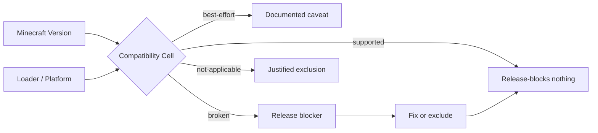
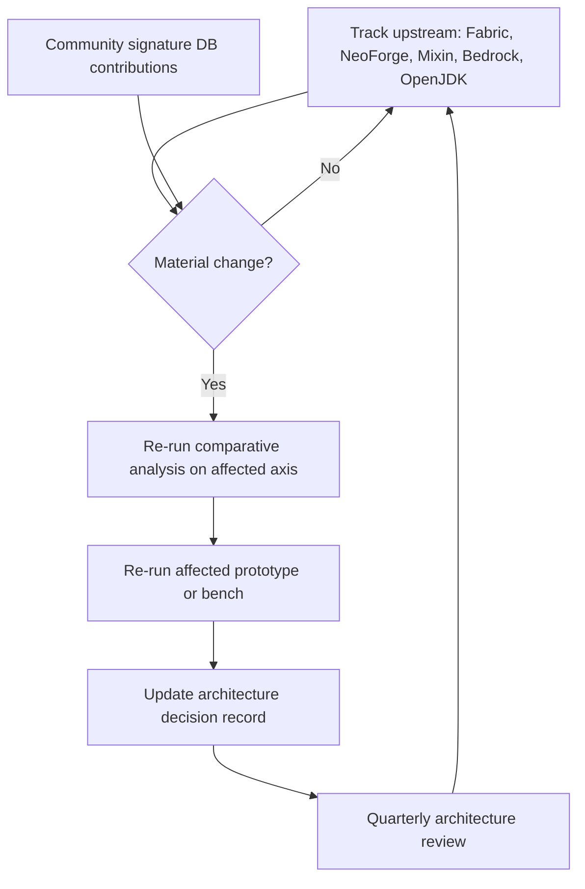

# Aprism Loader Product Technical Report and Research Methodology

> Document 5 of 8 | Aprism Loader Documentation Set
> Version: v26.0-Alpha1-Phase0 | Status: Development
> Author: BlockConnect@StarsailsClover
> Canonical language: English (Chinese copy maintained in parallel)

---

## 1. Executive Summary

This report documents the research and development methodology that produced the Aprism Loader architecture described in Document 1. It is distinct from the Feasibility Report (Document 4): the Feasibility Report asks "can this be built and shipped?", whereas this report asks "what did we investigate, how did we investigate it, and why do the chosen technologies outperform the alternatives we evaluated?".

The architecture outcomes that this report explains are: a JE native substrate built on a `premain` javaagent plus `ClassFileTransformer` over a tuned OpenJDK LTS build; a Knot-style shared classloader with opt-in isolation; SpongePowered Mixin as the single canonical transformation mechanism; a manifest superset with per-loader provider blocks; an Architectury Loom build pipeline with a custom packaging plugin; per-platform Bedrock injection (Windows P0, Android P1, iOS P2); a three-layer BE loader backed by a signature database; and standalone distribution via GitHub Releases with cosign keyless signing.

The R&D effort ran as four parallel research streams: (1) JE mod loader deep dive, (2) BE modding ecosystem survey, (3) per-platform native injection, and (4) JVM, Gradle, legal, and cross-version concerns. Each stream produced evidence that fed into a risk-driven decision process. The dominant finding across all streams is that the JE path is engineering scope, not research, while the BE path is research-dominated and version-fragile. The methodology described here is repeatable: it is intended to be re-applied quarterly as Minecraft, loaders, and platforms evolve.

---

## 2. Research Objectives

The R&D program was organized around seven questions that had to be answered before the architecture could be committed to code.

| ID | Question | Stream |
|----|----------|--------|
| Q1 | Can a single JVM-level entry point host adapters for Fabric, NeoForge, Forge, Quilt, and LiteLoader without forking the JVM? | JE / JVM |
| Q2 | Is a custom JVM or GraalVM Native Image viable, or must we use a stock-tuned OpenJDK? | JVM |
| Q3 | What classloader topology maximizes existing mod catalog coverage while minimizing conflict surface? | JE |
| Q4 | Which bytecode transformation mechanism is canonical, and how are refmap and intermediary concerns handled? | JE |
| Q5 | For each BE target platform (Windows, Android, iOS, BDS), what is the production-grade injection and hooking stack? | BE |
| Q6 | How is BE version fragility mitigated without a per-version fork of the loader? | BE |
| Q7 | Which distribution channels are legally available, and what signing and supply-chain controls are required? | Legal / Distribution |

Each question is decomposed into falsifiable hypotheses in Section 5, where the experimental validation plan is specified. A question was considered answered only when (a) at least two independent sources agreed, (b) a prototype or community project demonstrated the property, and (c) the legal and licensing implications were checked.

---

## 3. Research Methodology

The methodology has four layers that run concurrently: a source survey, a comparative analysis, feasibility prototyping, and risk-driven investigation. The layers are designed to be repeatable so that the same process can be re-applied when upstream projects release breaking changes.

### 3.1 Literature and Source Survey

Three categories of source were treated as primary evidence.

**Official documentation.** Fabric documentation (`fabricmc.net`), including `fabric.mod.json` v1, Knot classloader, TinyRemapper, and Intermediary; NeoForge documentation (`docs.neoforged.net`), including `neoforge.mods.toml`, `@Mod` annotation, `IEventBus`, and `ModClassLoader`; Microsoft / Mojang Add-On documentation (`learn.microsoft.com/minecraft/creator`), including the `manifest.json` schema, the Script API `@minecraft/server` module UUIDs, and stable versus beta tracks; Apple App Review Guideline 2.4.5(iv); Microsoft Store Policy 10.2; GitHub REST API rate limit documentation.

**Source code.** The FabricMC organizations (`FabricLoader`, `FabricAPI`, `tiny-remapper`, `fabric-loom`); the NeoForged organization (`NeoForge`, `ModDevGradle`); SpongePowered (`Mixin`, `MixingConfig`); the Amethyst project (`github.com/Frederox157/Amethyst`, C++ client loader using libhat, MinHook, and xmake, targeting BE 1.26.x); LeviLamina (`github.com/LiteLDev/LeviLamina`, BDS server C++ loader with a three-layer architecture and a `header_generator` fed by BedrockAnalyzer); MultiLoader-Template by Jared (`github.com/jaredlll02/MultiLoader-Template`, with common/fabric/neoforge splits and `IPlatformHelper` via `ServiceLoader`); the Neo-Loom fork by moritz-htk.

**Community resources.** The `bedrock-native-modding` wiki and Discord, the Bedrock-OSS wiki (`wiki.bedrock.dev`), Prism Launcher release infrastructure for GitHub Releases-as-CDN precedent, and the Quilt development notes recording the QSL discontinuation in December 2025 and the `ModContainer` identity bug fixed in 0.29.2.

Sources were tagged with a confidence level: official docs (high), source code (high), community wiki (medium), community Discord claims (low, requires corroboration). No architectural decision rests on a low-confidence source alone.

### 3.2 Comparative Analysis

Loaders were compared along four orthogonal axes so that no single axis dominated the decision.

| Axis | Compared properties |
|------|--------------------|
| Manifest schema | Field set, versioning, dependency grammar, entry-point declaration, provider extensibility |
| Classloader topology | Parent-first vs child-first, isolation level, transformation insertion point, mod visibility |
| Event system | Bus type, registration mechanism, subscriber dispatch, parallel dispatch safety |
| Transformation pipeline | Remapper, refmap source, Mixin insertion order, AT/coremod coexistence, retransform support |

The comparison was tabulated per loader (Fabric, NeoForge, LiteLoader, Quilt, Mixin as a cross-cutting concern) and then projected onto the Aprism superset. The projection rule is: the superset must accept every loader's manifest as a strict subset, and Aprism's own fields live in a separate `aprism` provider block so no upstream schema is shadowed.

### 3.3 Feasibility Prototyping

Four prototypes were specified to validate the load-bearing technical claims before commitment to the full architecture.

| Prototype | Validates | Success criterion |
|-----------|-----------|-------------------|
| P1: javaagent hook | A `premain` agent with a `ClassFileTransformer` can intercept the bootstrap classloader and inject a loader core before the main game class resolves. | Loader core prints its version before `net.minecraft.client.main.Main` runs. |
| P2: BE Windows DLL injection | A proxy `version.dll` placed beside `Minecraft.Windows.exe` loads a payload and installs a MinHook inline hook on a target function located via libhat signature scan. | Hook fires and logs on the BE 1.26.x client without a crash. |
| P3: Android container | A repackaged or containerized `com.mojang.minecraftpe` APK loads a Zygisk module that performs an inline hook via ShadowHook. | Hook fires on a rooted test device across an app restart. |
| P4: Signature scanning | A libhat compile-time signature resolves the same symbol across two BE point releases without manual offset updates. | Symbol resolution succeeds on both versions; diff in signature set reported. |

Prototypes P1 and P4 are required to pass before the corresponding architectural component is committed. P2 and P3 are required to pass before the BE Windows and BE Android milestones respectively leave the research phase.

### 3.4 Risk-Driven Investigation

Each identified architecture risk drove a specific research task, so that research effort was proportional to risk rather than to interest.

| Risk | Research task it drove |
|------|------------------------|
| BE version fragility (offset and signature drift each YY.MM release) | Signature database design study; survey of LeviLamina `header_generator` and BedrockAnalyzer; analysis of how Amethyst tracks BE 1.26.x. |
| Legal exposure on stores and consoles | EULA re-read; Microsoft Store Policy 10.2; Apple 2.4.5(iv); Xbox Live ban policy survey; BDS EULA for server modding. |
| Cross-loader Mixin refmap correctness | Study of Fabric intermediary stability, NeoForge SRG/Mojang names, and the MultiLoader-Template pattern for sharing Mixin configs across loaders. |
| Cross-version binary compatibility | Study of Fabric Intermediary as a stable naming layer; analysis of the 1.21.11 to 26.1 binary-compat break; JDK backward-compat policy. |
| Supply-chain integrity | Survey of cosign keyless signing via OIDC; Prism Launcher's GitHub Releases-as-CDN pattern; GitHub rate-limit budget (60 unauthenticated, 5000 authenticated per hour). |

This mapping ensures that no risk is researched in the abstract: every research task is bound to a concrete architectural decision that it informs.

---

## 4. Technology Selection Rationale

This section records, for each architectural choice, the alternatives that were evaluated and the verdict that was reached. Tables are the canonical form so that the comparison can be re-evaluated when upstream conditions change.

### 4.1 JE Aprism Native: javaagent + Tuned OpenJDK

| Option | Feasibility | Effort | Risk | Verdict |
|--------|-------------|--------|------|---------|
| Custom JVM (fork OpenJDK) | Low | Extreme (person-years) | High (maintenance burden eclipses product) | Rejected |
| `premain` javaagent + `ClassFileTransformer` over tuned OpenJDK | High (proven by Fabric, Quilt, Bytecode-Transformer-Tools) | Moderate | Low | **Selected** |
| GraalVM Native Image | Low (closed-world analysis incompatible with dynamic mod loading) | High | High (breaks the mod loading model) | Rejected |
| Project Leyden AOT cache | Medium (promising for startup, not for transformation) | Moderate (immature) | Medium (still early-access) | Watch; not a Phase-0 dependency |

The javaagent approach is selected because it is the only option that is simultaneously proven, low-effort, and compatible with arbitrary runtime-loaded mods. GraalVM Native Image is explicitly rejected because its closed-world assumption is fundamentally incompatible with a system whose defining property is dynamic loading of third-party code. Project Leyden is tracked as a future startup-time optimization once it stabilizes; it does not block Phase 0.

### 4.2 Classloader: Knot-Style Shared Default with Opt-In Isolation

| Topology | Mod catalog coverage | Conflict risk | Complexity | Verdict |
|----------|----------------------|---------------|------------|---------|
| Shared (Knot-style, child-first with shared parent) | Highest (Fabric and Quilt catalogs load natively) | Moderate (mitigated by isolation opt-in) | Moderate | **Selected as default** |
| Fully isolated (per-mod classloader, OSGi-style) | Lower (Fabric mods that assume shared visibility break) | Low | High | Rejected as default; available as opt-in |
| Hybrid (parent-first with selective child-first overrides) | Medium | Medium | High (rules engine) | Rejected (complexity not justified) |

The Knot-style shared classloader is selected as the default because it maximizes the catalog of mods that load without modification. Isolation is available as an opt-in declared in the manifest's `aprism` provider block for mods that ship conflicting dependencies. The decision mirrors Fabric Loader's `KnotClassLoader` and is consistent with Quilt's observation that the `ModContainer` identity bug fixed in 0.29.2 was a classloader-visibility defect, not a topology defect.

### 4.3 Transformation: Mixin as Canonical

Mixin is designated the single canonical JE bytecode transformation mechanism. No Access Transformer (AT) or coremod pipeline is supported as a first-class alternative. The rationale is empirical: every loader that Aprism adapts (Fabric, NeoForge, Forge, Quilt, LiteLoader) already uses Mixin, and every loader's refmap strategy can be expressed in Mixin terms.

| Alternative | Status | Reason |
|-------------|--------|--------|
| AT (Access Transformers) | Not first-class | Expressible as a Mixin `@Inject` plus `@Accessor`; redundant as a separate pipeline |
| Coremod (JS-based) | Rejected | NeoForge has deprecated JS coremods; security and maintenance burden too high |
| Competing Mixin transformer instance | Forbidden | Two Mixin transformers in one process corrupt each other; Aprism inserts exactly one, downstream of its remapper |

The refmap strategy is: Aprism's remapper produces the runtime naming layer (Intermediary for Fabric/Quilt, Mojang names for NeoForge), and the Mixin config's refmap is remapped in flight by Aprism before `MixinTransformer` runs. This is the pattern validated by the MultiLoader-Template common module.

### 4.4 BE Hooking: Per-Platform Library Selection

| Library | Platform | Hook type | Production use | License | Verdict |
|---------|----------|-----------|----------------|---------|---------|
| MinHook | Windows | Inline (trampoline) | Amethyst, OnixClient | BSD-2-Clause | **Selected (Windows)** |
| SafetyHook | Windows | Inline (alternative) | Modern alternatives | MIT | Alternate; not selected for ecosystem reasons |
| Detours (Microsoft) | Windows | Inline | Wide industry use | MIT | Alternate; heavier dependency |
| ShadowHook | Android | Inline | LSPosed, Zygisk modules | BSD-3-Clause | **Selected (Android)** |
| Dobby | Android/iOS | Inline | Various Dobby-based tools | Apache-2.0 | **Selected (iOS)** |
| And64InlineHook | Android | Inline | Legacy Android tools | MIT | Alternate; superseded by ShadowHook |
| libhat | Cross | Pattern scanning (not hooking) | Amethyst, LeviLamina | MIT | **Selected (signatures)** |

The selection is driven by production precedent: each chosen library is the one used by the most-maintained community loader on its platform. License compatibility was verified against Aprism's distribution license for each selection.

### 4.5 BE Signature Scanning: libhat

libhat is selected as the signature scanning library because it provides compile-time pattern signatures, SIMD-accelerated scanning, and is already used in production by Amethyst (BE Windows) and informs the LeviLamina BDS approach. Compile-time signatures are critical: they allow the signature set to be versioned alongside the loader and to be checked into the signature database without runtime string parsing. SIMD acceleration matters because BE binaries are large (hundreds of MB) and signature scanning runs at load time.

### 4.6 Build Tooling: Architectury Loom

| Build plugin | Fabric | NeoForge | Forge | Quilt | Multi-loader | Verdict |
|--------------|--------|----------|-------|-------|--------------|---------|
| Fabric Loom | Yes | No | No | Partial | No | Insufficient |
| NeoGradle / ModDevGradle | No | Yes | No | No | No | Insufficient |
| Architectury Loom | Yes | Yes | Yes | Partial | Yes (single pipeline) | **Selected** |

Architectury Loom is selected because it subsumes Fabric Loom and adds NeoForge and Forge support behind a single configuration surface. The `loom-no-remap` mode and the `libs.versions.toml` convention are reused. Aprism adds a custom packaging plugin on top to emit the Aprism manifest superset and to assemble the BE-side artifacts, but the underlying Gradle model is Architectury Loom's.

### 4.7 Distribution: Standalone + GitHub Releases

Distribution is standalone desktop only. Microsoft Store Policy 10.2 prohibits dynamic code execution in store-distributed applications, and Apple App Review Guideline 2.4.5(iv) imposes the equivalent constraint on iOS App Store distribution. Google Play has analogous restrictions. Consequently, the only legally defensible channel for an injection-capable loader is standalone distribution outside app stores.

GitHub Releases is selected as the content distribution network based on the Prism Launcher precedent: Prism Launcher distributes its builds through GitHub Releases at scale, demonstrating that the unauthenticated 60-requests-per-hour and authenticated 5000-requests-per-hour rate limits are sufficient when combined with a redirect or mirror layer. cosign keyless signing via OIDC is selected for supply-chain integrity, and CycloneDX SBOMs are emitted for every release.

---

## 5. Experimental Validation Plan

The validation plan converts each research hypothesis into a measurable test. A hypothesis is considered validated only when the success criterion is reproduced on a clean environment.

### 5.1 JE Validation

| Test | Procedure | Success criterion |
|------|-----------|-------------------|
| Load real Fabric mod via Aprism | Take a published Fabric mod (e.g., a release of Sodium), install via Aprism without modification, launch a JE instance. | Mod loads, behavior matches vanilla Fabric, no errors in Aprism log. |
| Load real NeoForge mod via Aprism | Take a published NeoForge mod, install via Aprism, launch. | Same as above against NeoForge. |
| Mixed modpack | Load a modpack containing Fabric and NeoForge mods simultaneously under Aprism. | All mods load; conflicts surfaced through manifest `aprism` provider blocks, not crashes. |
| Load-time comparison | Measure cold and warm startup time for the same modpack under Aprism, vanilla Fabric, and vanilla NeoForge. | Aprism startup time within 15 percent of the faster native loader. |

### 5.2 BE Validation

| Test | Procedure | Success criterion |
|------|-----------|-------------------|
| Windows injection | Place a proxy `version.dll` beside `Minecraft.Windows.exe`; payload installs a MinHook inline hook on `Dimension::getTimeOfDay` located via libhat signature. | Hook fires on BE 1.26.x; game does not crash over a 30-minute session. |
| Windows sample mod | Load a sample native mod that reads the hooked value and renders an overlay. | Overlay renders; frame time impact below a defined threshold (see 5.3). |
| Android injection (root) | Install a Zygisk module that loads into `com.mojang.minecraftpe` and installs a ShadowHook inline hook. | Hook fires; survives app restart on a rooted test device. |
| Android injection (non-root) | Container or NMLauncher-pattern repackaged APK with the same hook. | Hook fires on a non-rooted device; legal grey-area status documented. |

### 5.3 Performance Benchmarks

JE benchmarks measure startup time (cold and warm), peak resident set size, and steady-state frame rate against vanilla Fabric and vanilla NeoForge on identical hardware. BE benchmarks measure hook overhead per call (nanoseconds), frame time impact (95th and 99th percentile delta versus unhooked baseline), and load-time signature scanning cost. Benchmarks are run on a fixed reference machine configuration recorded in the test report so that results are reproducible.

### 5.4 Compatibility Matrix Testing

A two-dimensional matrix is maintained: supported Minecraft versions on one axis, supported loaders and platforms on the other. Each cell carries an explicit status: `supported`, `best-effort`, `broken`, or `not-applicable`. The matrix is regenerated on every release and is the authoritative statement of compatibility. Cells marked `broken` block the release until either the cell is fixed or the cell is downgraded to `not-applicable` with a recorded justification.

---

## 6. Key Research Findings

The fifteen most decision-relevant findings are condensed below. Each finding cites the source category (Official / Source / Community).

| # | Finding | Implication | Source |
|---|---------|-------------|--------|
| F1 | Fabric Intermediary provides stable cross-version names; the 1.21.11 to 26.1 transition breaks binary compatibility. | Aprism must use Intermediary as its stable naming layer and pin compatibility groups per SemVer. | Official / Source |
| F2 | `premain` + `ClassFileTransformer` is the proven javaagent pattern; Fabric and Quilt both rely on it. | No novel JVM research required for the JE substrate. | Source |
| F3 | GraalVM Native Image's closed-world assumption is incompatible with dynamic mod loading. | GraalVM rejected; Leyden tracked. | Official |
| F4 | Knot-style shared classloader maximizes mod catalog coverage; isolation is opt-in. | Selected as the default classloader topology. | Source |
| F5 | Every JE loader surveyed uses SpongePowered Mixin. | Mixin is the canonical transformation mechanism. | Source |
| F6 | The MultiLoader-Template pattern shares Mixin configs across Fabric and NeoForge via a common module. | Adopted as Aprism's adapter pattern. | Source |
| F7 | QSL was discontinued in December 2025; the `ModContainer` identity bug was fixed in Quilt 0.29.2. | Quilt support retained but de-prioritized relative to Fabric and NeoForge. | Community |
| F8 | Amethyst (BE Windows) uses libhat + MinHook + xmake against BE 1.26.x in production. | Validates the BE Windows stack selection. | Source |
| F9 | LeviLamina (BDS) ships a three-layer architecture and a `header_generator` fed by BedrockAnalyzer. | Adopted as the BE loader structure and signature-automation model. | Source |
| F10 | BDSX is archived; Geyser is a proxy, not a loader; Inner Core/Horizon is mobile-only. | Not adopted; narrows the BE reference set to Amethyst and LeviLamina. | Community |
| F11 | Bedrock uses a C++ binary, RenderDragon, and RakNet, with YY.MM migration causing version fragmentation. | Version adapter and signature database are the dominant BE engineering investment. | Official / Source |
| F12 | Microsoft Store Policy 10.2 and Apple 2.4.5(iv) prohibit dynamic code in store-distributed apps. | Distribution is standalone desktop only. | Official |
| F13 | Xbox Live applies server-side bans; there is no client-side anti-tamper on BE. | Client-side injection does not fight anti-cheat; network-policy compliance is the constraint. | Official / Community |
| F14 | TrollStore enables sideload on iOS 14.0 to 16.6.1 and 17.0 via CoreTrust bypass; `insert_dylib`/`optool` add `LC_LOAD_DYLIB`. | iOS remains research-only; too narrow a version window for a shipping target. | Community |
| F15 | Prism Launcher demonstrates GitHub Releases as a viable CDN; cosign keyless via OIDC is production-ready. | Selected distribution mechanism. | Source / Official |

---

## 7. Open Research Items

The following items are not yet resolved and are scheduled for investigation in subsequent phases. They are listed so that downstream documents and contributors know what is still in motion.

| ID | Open item | Why it is open | Phase |
|----|-----------|----------------|-------|
| O1 | iOS TrollStore BE specifics | No community BE iOS mod loader exists at scale; the version window (14.0 to 16.6.1, 17.0) is narrow. | P2 research |
| O2 | BE version adapter automation | The LeviLamina `header_generator` pattern is understood; automating it across YY.MM releases is not yet prototyped for Aprism's BE Windows target. | P0 follow-up |
| O3 | JE-to-BE conversion fidelity metrics | A quantitative fidelity metric (feature parity score) for converted mods does not yet exist. | Conversion module |
| O4 | Non-root Android legal posture | The container and NMLauncher patterns work technically but rest on APK repackaging, which is legally grey. | P1 gating |
| O5 | Project Leyden integration | Leyden AOT cache may reduce JE startup time; not yet stable enough to depend on. | Post-Phase-0 |
| O6 | Signature database contribution model | Whether the signature DB is hosted in-repo, as a separate repo, or federated across community contributors is undecided. | P0 follow-up |

---

## 8. Continuous Research Process

Research is not a one-time activity. Aprism adopts a continuous research process designed to keep the architecture current as upstream projects evolve.

The process has four concrete commitments. First, upstream tracking: the FabricMC, NeoForged, SpongePowered, LiteLDev, Frederox157 (Amethyst), and Mojang Bedrock release feeds are monitored; material changes are triaged within one week. Second, community signature database contributions: the BE signature DB is designed to accept external contributions, mirroring the LeviLamina header contribution model, because no single team can keep up with every BE point release. Third, quarterly architecture review: every quarter, each architectural decision in Section 4 is re-evaluated against the current upstream state, and the comparison tables are re-scored. Fourth, decision records: every material change to the architecture is recorded as a short decision record so that the rationale chain is auditable, not lost to chat history.

---

## 9. References

References are categorized so that a reader can re-run the source survey independently.

### 9.1 Official Documentation

- Fabric documentation and `fabric.mod.json` v1 schema: `fabricmc.net`
- NeoForge documentation and `neoforge.mods.toml` schema: `docs.neoforged.net`
- SpongePowered Mixin documentation (`*.mixins.json`, `@Mixin`, `@Inject`): `github.com/SpongePowered/Mixin`
- Microsoft / Mojang Add-On documentation (`manifest.json`, `@minecraft/server` Script API): `learn.microsoft.com/minecraft/creator`
- Microsoft Store Policy 10.2 (dynamic code execution): `learn.microsoft.com/windows/uwp/publish/store-policies`
- Apple App Review Guideline 2.4.5(iv): `developer.apple.com/app-store/review/guidelines`
- GitHub REST API rate limits: `docs.github.com/rest/overview/resources-in-the-rest-api`
- cosign keyless signing documentation: `github.com/sigstore/cosign`

### 9.2 Source Repositories

- FabricLoader (Knot, `fabric.mod.json`, ModContainer): `github.com/FabricMC/fabric-loader`
- tiny-remapper: `github.com/FabricMC/tiny-remapper`
- fabric-loom (Loom 26.2): `github.com/FabricMC/fabric-loom`
- NeoForge (`@Mod`, `IEventBus`, `ModClassLoader`): `github.com/neoforged/NeoForge`
- ModDevGradle: `github.com/neoforged/ModDevGradle`
- SpongePowered Mixin: `github.com/SpongePowered/Mixin`
- MultiLoader-Template (Jared): `github.com/jaredlll02/MultiLoader-Template`
- Neo-Loom fork (moritz-htk): `github.com/moritz-htk/neo-loom`
- Quilt Loader (`ModContainer` identity, 0.29.2 fix): `github.com/QuiltMC/quilt-loader`
- Amethyst (BE Windows C++ loader, libhat + MinHook + xmake): `github.com/Frederox157/Amethyst`
- LeviLamina (BDS C++ loader, three-layer, `header_generator`): `github.com/LiteLDev/LeviLamina`
- BedrockAnalyzer: referenced by LeviLamina header generation
- libhat (compile-time SIMD signature scanning): `github.com/SnowflakeIndustries/libhat`
- MinHook: `github.com/TsudaKageyu/minhook`
- ShadowHook: `github.com/bytedance/android-inline-hook`
- Dobby: `github.com/jmpews/Dobby`
- Prism Launcher (GitHub Releases-as-CDN precedent): `github.com/PrismLauncher/PrismLauncher`

### 9.3 Community Resources

- bedrock-native-modding wiki and Discord
- Bedrock-OSS wiki: `wiki.bedrock.dev`
- LiteLoader legacy documentation (`.litemod`, `litemod.json`, 1.12.2): `www.minecraftforum.net` and archived LiteLoader sources
- Inner Core / Horizon (mobile BE modding): community documentation
- Geyser (proxy, not loader): `github.com/GeyserMC/Geyser`
- BDSX (archived): `github.com/bdsx/bdsx`

---

End of Document 5.
