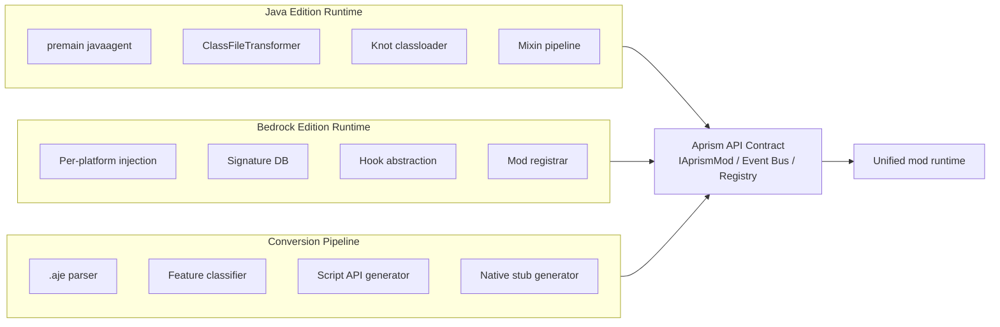
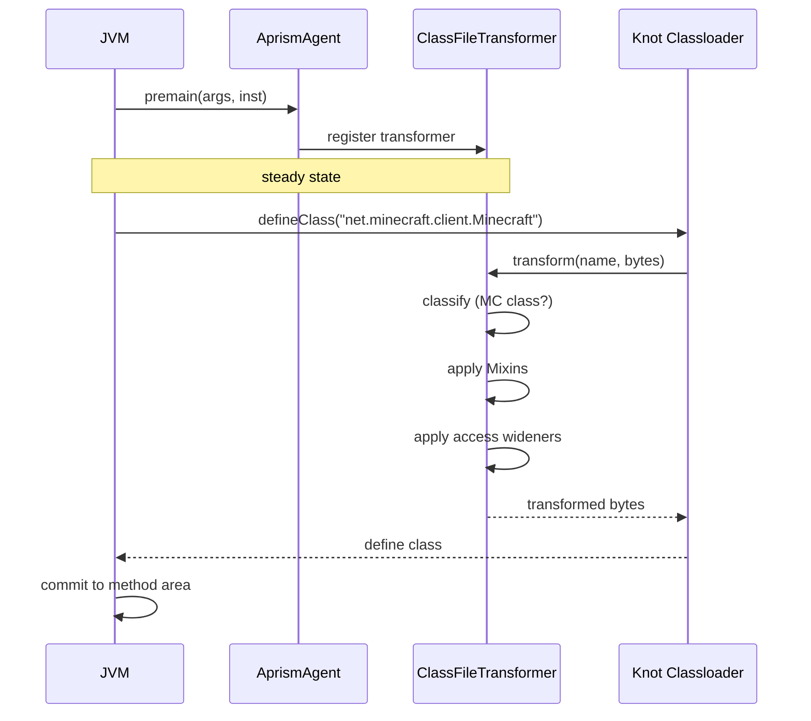
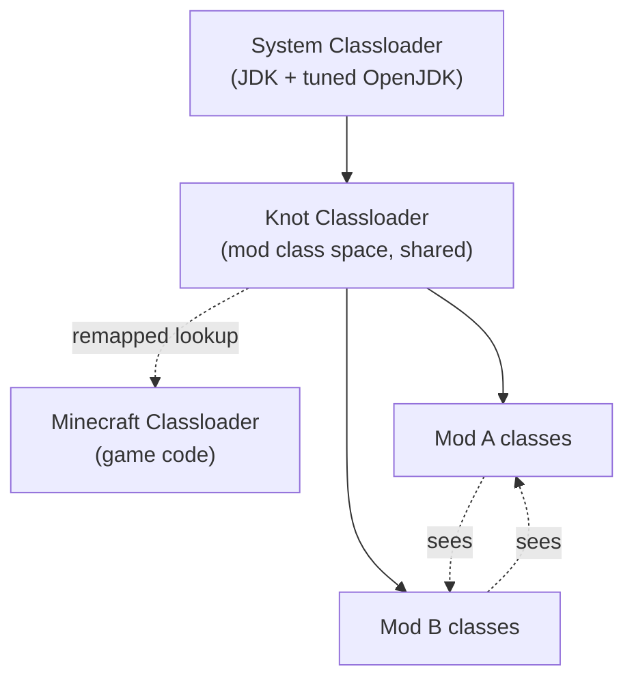
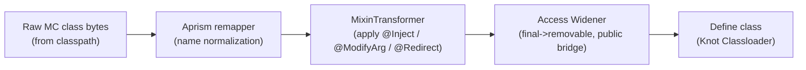
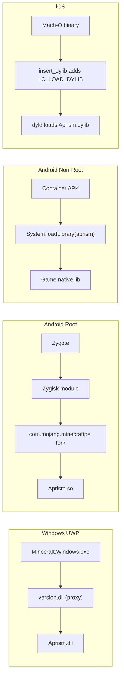
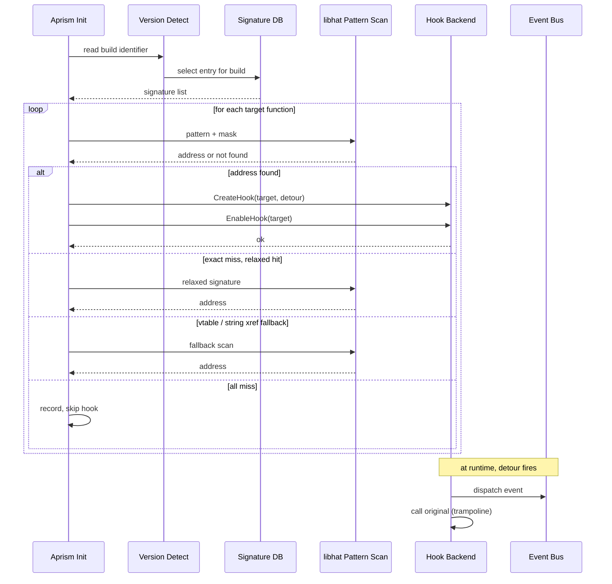
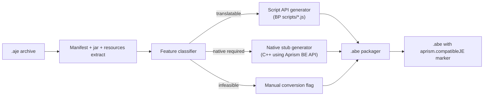

# Aprism Loader Product Principle Specification

> Document 6 of 8 | Aprism Loader Documentation Set
> Version: v26.0-Alpha1-Phase0 | Status: Development
> Author: BlockConnect@StarsailsClover
> Canonical language: English (Chinese copy maintained in parallel)

## 1. Executive Summary

This specification describes how Aprism Loader operates at the principle level. Where the Architecture Design document (Document 1) defines what components exist and how they are composed, this document explains the mechanisms by which those components exert their effect at runtime: how the Java Edition agent intercepts class definitions before the JVM commits them, how the Bedrock Edition native layer lands in each target platform's process, how the unified event bus merges two historically incompatible modding ecosystems onto one dispatch path, and how the JE-to-BE conversion pipeline rewrites mod behaviour into the Bedrock execution model.

The audience is engineers who need to reason about runtime internals, not mod authors who only consume the API. The document is structured around three operational domains that share a single API contract: the JE runtime, the BE runtime, and the conversion pipeline. Each domain is described in terms of its injection principle, its loading flow, its hook or transformation pipeline, and its lifecycle semantics. A final section covers failure modes and recovery, because the runtime must remain diagnosable when any of these mechanisms degrades.

Throughout the document, the term "monotonic contract" refers to the invariant that the Aprism API surface only expands across versions, deprecated entrypoints remain functional, and adapters bridge legacy consumers to the current API. This invariant is what permits the same mod archive to load across the v25 and v26 Minecraft families without recompilation.

## 2. Principle Overview

Aprism defines three operational domains. Each domain has a distinct injection surface, but all three publish through the same Aprism API contract so that mod code written against the contract is edition-agnostic wherever the feature set permits.



The contract is the load-bearing interface. The JE runtime implements it through JVM instrumentation; the BE runtime implements it through native hooks; the conversion pipeline rewrites mods that target one runtime so they execute on the other. Engineers modifying any single domain must preserve the contract, because the other two domains and every shipped mod depend on it.

## 3. JE Runtime Principles

### 3.1 Agent-Based Class Loading

Aprism JE is packaged as a Java agent JAR with a `META-INF/MANIFEST.MF` declaring `Premain-Class`. The JVM, launched over a tuned OpenJDK build, invokes the premain entry before the application main thread enters `main`:

```java
public final class AprismAgent {
    public static void premain(String args, Instrumentation inst) {
        AprismBootstrap.earlyInit(args);
        inst.addTransformer(new AprismClassTransformer(inst),
            /* canRetransform */ true);
        AprismBootstrap.completeInit();
    }
}
```

Once the transformer is registered, the JVM routes every class definition through `AprismClassTransformer.transform` before the class is committed to the method area. This is the only interception point Aprism uses on JE: there is no bytecode rewriting of already-loaded classes during steady state, and no JVMTI event other than class file load hook. The consequence is that Aprism intercepts every class the JVM defines, including JDK internals, and must therefore classify each class cheaply before deciding whether to do work.



The classifier checks the class name against the configured intermediary namespace. For pre-26.1 Minecraft, names are in Intermediary form (`net.minecraft.class_442`); for 26.1 and later, Aprism operates on the official obfuscated names shipped with the game. Non-Minecraft classes are returned unmodified, which keeps the transformer cost proportional to the number of Minecraft classes, not to the size of the class universe.

### 3.2 Mod Discovery and Dependency Resolution

Mod discovery is filesystem-driven. Aprism scans the `mods/` directory for archives carrying either the `.aje` extension (the canonical Aprism archive) or the legacy `.jar` extension carrying a recognised manifest inside. The manifest lookup order is:

1. `aprism.manifest.json` (canonical, superset schema with provider blocks)
2. `fabric.mod.json` (Fabric compatibility fallback)
3. `quilt.mod.json` (Quilt compatibility fallback)
4. `forge.mods.toml` (NeoForge / Forge compatibility fallback)
5. `pack.mcmeta` plus entrypoint hints (Bedrock-style fallback)

When only a fallback manifest is found, Aprism synthesises the canonical fields. The synthesized manifest is marked `aprism.manifest.source = "fallback"` so downstream tooling can distinguish native Aprism mods from adapted ones.

Dependency resolution builds a directed graph where each node is a mod and each edge expresses a versioned dependency, a load-after ordering, or a breaking conflict. Aprism topologically sorts the graph. Cycles are not tolerated: a cycle fails the entire load with a report listing the cycle members and the edges between them. Version ranges are resolved against the SemVer-ish range syntax defined in the Manifest Specification (Document 2); an unsatisfiable range causes the affected mod to be excluded with a recorded reason rather than aborting the whole session. This fail-soft behaviour is what permits a `mods/` directory containing mods for multiple MC versions to boot the subset that is mutually compatible.

### 3.3 Classloader Topology

Aprism uses a Knot-style shared classloader topology. A single `AprismClassLoader` (called `KnotClassLoader` in the code) owns the mod class space. Mod classes are defined into this loader regardless of which archive they came from, so a mod class referencing another mod's class resolves through the normal parent-delegation lookup with the Knot loader as the defining loader.



When a mod references a Minecraft class, the Knot loader routes the lookup through the configured remapper. For pre-26.1 the remapper translates Intermediary names back to the runtime names; for 26.1+ the names already match and the remapper is a passthrough. This routing is what makes it possible to write mods against stable names while the game ships with shifting obfuscation.

An opt-in isolation shim is provided for mods that declare `aprism.classloader.isolation = "shim"`. Such mods receive a child classloader of Knot whose `loadClass` first checks the mod's own archive, falls back to Knot, and only then delegates to the system loader. The shim exists to host mods that ship conflicting dependency versions of common libraries (e.g. a specific Gson or Netty build). Isolated mods cannot define Mixins that target classes outside their own archive, because their defining loader is not the loader that defines the Minecraft classes; this trade-off is documented and intentional.

### 3.4 Mixin Transformation Pipeline

Mixin is the canonical bytecode rewriting mechanism on JE. Aprism's transformer applies Mixins as part of the class load hook, in this order:



The Mixin transformer resolves injection points through `@At` descriptors, which can be plain method names, `@At("INVOKE")` targets, or `@At("FIELD")` targets. Resolution uses the refmap: a JSON sidecar bundled with the mod that maps descriptor keys to runtime obfuscated names. When the refmap is missing or the lookup misses, Aprism falls back to the canonical name and logs a soft warning; this keeps mods resilient to refmap drift across Minecraft versions.

Priority resolution follows the standard Mixin semantics: mixins targeting the same method are ordered by `priority` (lower first), with `@Coerce` and `@Group` semantics honoured. Aprism does not override this behaviour; it honours the upstream contract verbatim because the entire value of Mixin is its stable priority model, and diverging from it would silently change the behaviour of every existing mod.

Access wideners run after Mixins so that widened access is visible to subsequent bytecode consumers (reflection, downstream transformers). Aprism widener tokens are declared in the manifest under `aprism.accessWidener` and use the same syntax as Fabric's `access-widener` file; Aprism parses them once at boot and applies them lazily per-class on first transform.

### 3.5 Entrypoint and Lifecycle

Aprism JE declares a strict, ordered set of lifecycle phases. A mod publishes its work by registering an `IAprismMod` entrypoint in the manifest under `aprism.entrypoints.main`. The phase model is:

| Phase | Trigger | Mod may |
|---|---|---|
| PREINIT | After agent boot, before main | Register mixins, declare static config, register access wideners, declare registries |
| INIT | After mod graph is resolved | Instantiate entrypoints, register event listeners, build content |
| SETUP | After all INIT entrypoints returned | Wire cross-mod integrations, resolve registry content |
| COMPLETE | After SETUP wired | Finalise configs, emit readiness events |
| CLIENT | After MC client initialized | Register client-side rendering, keybindings, screens |
| SERVER | After MC server initialized | Register dedicated-server content, network handlers |

The `IAprismMod` contract is narrow on purpose: it carries a single lifecycle entrypoint and a metadata accessor. Phase-specific work happens through the event bus, not through additional interface methods, which keeps the contract stable as new phases are introduced.

```java
public interface IAprismMod {
    ModMetadata metadata();
    void onInitialize(AprismContext ctx);
}
```

`AprismContext` exposes the event bus, the registry, the logger, and the platform descriptor (edition, MC version, Aprism version). Contexts are phase-scoped: a context obtained during PREINIT refuses to return a populated registry, because the registry is not yet built. This is enforced at the API boundary, not by convention, so that calling order mistakes fail loudly instead of producing silent nulls.

### 3.6 Event Dispatch

The Aprism event bus is phase-strict: a listener registered to fire during INIT cannot fire during PREINIT, and an attempt to post an event in the wrong phase throws `IllegalStateException`. This strictness is the mechanism by which Aprism guarantees deterministic ordering across the mixed Fabric and Forge mod ecosystems.

Fabric-style functional adapters (`registerListener` overloads taking a `Consumer<T>`) and Forge-style `addListener` adapters both funnel into the same internal subscriber set. The adapters are thin wrappers; their only job is to accept the caller's preferred shape and produce a `Subscriber` record that the bus dispatches uniformly. There is no second bus, no parallel dispatch path, and no Forge-vs-Fabric separation at runtime.

Cancellation propagates through the event object itself. An event marked `@Cancellable` exposes `cancel()`; once cancelled, the bus stops dispatching to remaining subscribers of the same phase and returns the cancellation flag to the caller. Events that are not marked cancellable ignore the call.

## 4. BE Runtime Principles

### 4.1 Per-Platform Injection Mechanisms

Bedrock Edition ships as native binaries on four target platforms. Aprism must land in the process before the game finishes initialising, and the landing mechanism differs per platform.



On Windows, Aprism ships a proxy `version.dll` next to `Minecraft.Windows.exe`. The proxy forwards every legitimate export to the system `version.dll` and, in its `DllMain`, loads `Aprism.dll` and calls its initialiser. The initialiser performs version detection, signature DB selection, hook installation, mod registrar init, and finally a scan of `com.mojang/aprism_mods/` for `.abe` mods.

On Android with root, Aprism ships as a Zygisk module. Zygisk loads Aprism into the zygote process; when the zygote forks for `com.mojang.minecraftpe`, Aprism is already mapped. The same initialiser runs against `libminecraftpe.so`, using ShadowHook for inline hooks.

On Android without root, Aprism ships inside a container application (NMLauncher-style) that hosts the target APK in a sandbox. The container's `Application.onCreate` calls `System.loadLibrary("aprism")` before the game's native library loads, ensuring Aprism is resident when the game's first native call lands.

On iOS, the user's Mach-O is patched with `insert_dylib`, which adds an `LC_LOAD_DYLIB` load command pointing at `Aprism.dylib`. At launch `dyld` loads Aprism alongside the game; the Aprism initialiser runs and installs hooks via Dobby.

### 4.2 Hook Installation Pipeline

Regardless of platform, the hook installation pipeline is identical once Aprism is resident. The pipeline reads the game's build identifier from binary metadata, selects the matching signature DB entry, scans the relevant `.text` section for each function to hook, and installs the detour.



The fallback chain for each function is: exact signature, relaxed signature (fewer masked bytes), vtable lookup for virtual functions, and string cross-reference for functions that reference unique string literals. Only when all four miss does Aprism record the hook as unavailable; it never installs a hook at a guessed address. A missing hook is reported to the mod registrar so dependent mods can opt to fail loudly or degrade gracefully.

### 4.3 BE Mod Loading

After hooks are installed, Aprism scans `aprism_mods/` for `.abe` archives. Each archive's manifest declares its type: native or script. Native mods ship a `.so`, `.dll`, or `.dylib` matching the host platform; Aprism `dlopen`s the library and calls its entrypoint symbol (`aprism_mod_init`). Script mods declare a `Script API` entrypoint; Aprism registers them with the Bedrock script engine, which then evaluates the bundled JavaScript against `@minecraft/server`.

Event dispatch on BE mirrors JE. The same phase-strict bus is used; the same cancellation semantics apply. The only difference is that some events originate from native hooks rather than from JVM events, and some events are edition-specific (e.g. `BedrockRenderEvent` has no JE analogue).

### 4.4 Version Adapter and Signature DB

Each Bedrock build has an entry in the signature DB. An entry is a JSON document mapping logical function names (e.g. `Level::tick`) to pattern/mask pairs, plus the offset of the build identifier inside the binary and the address ranges of the `.text` section.

The DB is produced by `header_generator`, a tool that consumes `BedrockAnalyzer` dumps. `BedrockAnalyzer` is a static analyser that walks a Bedrock binary, extracts symbol and pattern information where available, and emits a structured dump. `header_generator` post-processes the dump into the canonical `mc/` header set used by Aprism and into the JSON signature entries consumed at runtime.

Community contribution is the primary mechanism for DB growth. When a build is not in the DB, a contributor runs `BedrockAnalyzer` against the new binary, submits the dump through the contribution flow, and the maintainers review and merge the derived signatures. Aprism refuses to install hooks for builds not present in the DB; it never extrapolates signatures from neighbouring builds, because adjacent Bedrock builds frequently shift codegen and would produce incorrect hooks.

### 4.5 Hook Abstraction Layer

Aprism exposes a single hook API to mod code. The implementation dispatches to a platform backend.

| Operation | Windows backend | Android backend | iOS backend |
|---|---|---|---|
| Create hook | MinHook `MH_CreateHook` | ShadowHook `shadowhook_hook_func` | Dobby `DobbyHook` |
| Enable hook | MinHook `MH_EnableHook` | Implicit on create | Implicit on create |
| Disable hook | MinHook `MH_DisableHook` | ShadowHook `shadowhook_unhook` | Dobby `DobbyDestroy` |
| Trampoline (call original) | MinHook trampoline ptr | ShadowHook orig-return | Dobby orig-return |
| Address resolution | libhat pattern scan | libhat pattern scan | libhat pattern scan |

The abstraction layer is intentionally thin. The performance-critical path (the detour itself) calls directly into the backend; the abstraction only normalises the create/enable/disable lifecycle. This keeps detour overhead at the backend's native cost (typically a single indirect branch) rather than paying for an extra layer of indirection on every hooked call.

## 5. Cross-Edition Principle: The Aprism API Contract

### 5.1 Unified IAprismMod Interface

The same interface shape is exposed on both editions. On JE it is a Java interface; on BE it is a C++ abstract class with the same method names and semantics. Mods written against the contract on one edition compile and run on the other where the feature set overlaps.

Java Edition:

```java
public interface IAprismMod {
    ModMetadata metadata();
    void onInitialize(AprismContext ctx);
}
```

Bedrock Edition:

```cpp
struct ModMetadata {
    const char* id;
    const char* version;
    const char* minecraft_range;
};

class IAprismMod {
public:
    virtual ~IAprismMod() = default;
    virtual const ModMetadata& metadata() const = 0;
    virtual void onInitialize(AprismContext& ctx) = 0;
};

extern "C" APRISM_EXPORT IAprismMod* aprism_mod_create();
```

The `aprism_mod_create` factory on BE mirrors the manifest-declared entrypoint on JE. Both factories are called once during INIT; both receive a context that exposes the same services (event bus, registry, logger, platform descriptor) under the same names.

### 5.2 Unified Event Bus

The same logical event fires on both editions. `BlockPlaceEvent`, for instance, is posted on JE when the player places a block through the JE pipeline, and on BE when the native hook intercepts `Block::place` in the Bedrock binary. Listener code written against `BlockPlaceEvent` runs unchanged on both, because the event object's fields and semantics are defined by the contract, not by the edition.

Edition-specific events exist where there is no analogue. `BedrockRenderEvent` is BE-only; `ClientPlayerTickEvent` in its JE-specific form is JE-only. Attempting to subscribe to a non-existent event on the wrong edition throws at registration time, not at dispatch time, so misconfiguration is caught early.

### 5.3 Unified Registry

The Aprism registry exposes blocks, items, and entities through a single API. On JE, registration delegates to the Minecraft registry through the appropriate Mixin-injected accessor; on BE, registration delegates to the Bedrock native registration path exposed through the Aprism BE API. The mod author calls `Registry.register(...)` and the runtime routes the call to the correct backend.

Identifiers are namespaced (`aprism:my_block`). On both editions Aprism preserves the namespace verbatim; it does not prefix or rewrite mod identifiers, because identifier stability is the precondition for world save compatibility across mod updates.

### 5.4 The Monotonic Contract

The Aprism API surface only expands across versions. Deprecated entrypoints remain functional, not merely present; the deprecation annotation signals intent to mod authors, but Aprism never removes a previously published method. When an old API cannot be implemented faithfully on a new Minecraft version, an adapter bridges the old API's semantics to the new runtime, so that a mod compiled against Aprism v24 still loads and runs on Aprism v26.

This monotonicity is what permits the JE-to-BE conversion pipeline to target a stable API. The conversion tooling does not need to track edition-specific quirks; it generates code against the contract, and the contract guarantees the generated code keeps running.

## 6. JE-to-BE Conversion Principles

### 6.1 Conversion Pipeline

The conversion pipeline takes a `.aje` archive and produces a `.abe` archive. It is offline, deterministic, and reproducible: the same input plus the same Aprism converter version produces byte-identical output, which is a precondition for supply-chain verification.



The classifier inspects the mod's declared entrypoints, its Mixin targets, and its registry calls. It partitions the mod's behaviour into three buckets. The first bucket is translated to Bedrock Script API JavaScript. The second bucket is translated to a native C++ stub that links against the Aprism BE API and implements the equivalent behaviour through native hooks. The third bucket is left for manual conversion; the converter emits a report describing what was infeasible and why.

### 6.2 Feature Classification Table

| JE feature | BE feasibility | Conversion path |
|---|---|---|
| Event listener on block place / break | Translatable | Generate `@minecraft/server` `world.afterEvents` JS |
| Entity spawn / teleport / despawn | Translatable | Generate JS calling `@minecraft/server` entity API |
| Block get / set | Translatable | Generate JS calling `dimension.getBlock` / `setBlock` |
| Command registration | Translatable | Generate JS registering via `@minecraft/server` custom command API |
| Custom block / item | Native required | Generate C++ stub using Aprism BE registration API |
| Custom dimension | Native required | Generate C++ stub; requires signature for dimension registry |
| Rendering hook | Native required | Generate C++ stub using Aprism render hook API |
| Input / keybinding | Native required | Generate C++ stub using Aprism input hook API |
| Deep bytecode Mixin with no BE equivalent | Infeasible | Flag manual; emit report |

The table is exhaustive at the principle level. Specific features are catalogued in the Feasibility Report (Document 4). The classifier uses the catalogue as its decision table; new features are added to the catalogue before the classifier is taught to recognise them.

### 6.3 Limitations and Manual Conversion Boundary

A mod is flagged as requiring manual conversion when any of its Mixins target code paths with no Bedrock analogue, when it depends on JE-specific facilities such as Forge capability handlers, or when it relies on JE-specific network protocols. The converter does not attempt partial conversion of such mods; a partially converted mod would behave inconsistently across its features and is worse than a clean failure.

The manual conversion report lists each infeasible feature, the JE class and method it targets, and the reason no Bedrock equivalent exists. A human converter uses this report as a worklist. The converter's value here is not the partial output but the inventory: it tells the converter exactly what needs hand-porting and where.

## 7. Security Principles

Aprism operates with elevated privileges on every target platform: it runs inside the JVM on JE, and inside the game process on BE. This elevation is the source of its capability, and it is also the source of its primary risk surface. The security model is therefore conservative.

On BE Windows UWP, the sandbox argument applies. The game runs in an AppContainer with restricted capabilities; Aprism's DLL injection does not escape the container, because Aprism is loaded by the game's own loader into the game's own address space. Aprism cannot reach outside the sandbox; the sandbox constrains Aprism exactly as it constrains the game. This is the same argument under which the original Bedrock modding tools operate.

Isolation between mods is enforced on the native side. Unsigned native mods are not executed. A `.abe` archive declaring a native component must carry a cosign signature over the archive digest; the Aprism initialiser verifies the signature against the configured trust roots before `dlopen` is permitted. A mod whose signature does not verify is refused load, and the refusal is logged with the archive's claimed identity and the verification failure reason. Script mods are not subject to cosign verification, because they execute under the Bedrock script engine's own sandbox and cannot escape it.

On Android and iOS, the same principle applies: native mods require cosign verification, script mods do not. The trust root set is platform-configurable so that an enterprise deployment can pin to a specific signing identity.

## 8. Failure Modes and Recovery

The runtime must remain diagnosable when a mechanism degrades. The table below catalogues the principal failure modes, their causes, how Aprism detects them, and the recovery action.

| Failure | Cause | Detection | Recovery |
|---|---|---|---|
| Agent injection failure (JE) | Manifest missing `Premain-Class`, or agent JAR not on `-javaagent` | Aprism heartbeat file not written within 2s of JVM start | Launcher reports; user re-runs launcher with agent wired correctly |
| ClassFileTransformer exception | Mixin or access widener throws on transform | Transformer catches, records class + cause, returns original bytes | Class loads without Aprism modifications; affected mod reported as broken |
| Mod crash during INIT | Entrypoint threw | Phase runner catches, records stack, isolates mod | Mod excluded from subsequent phases; rest of mod graph continues |
| Dependency missing | Required dep not in `mods/` | Graph builder reports unsatisfied edge | Mod excluded with reason; dependents transitively excluded |
| Version mismatch | Mod's `minecraft_range` not satisfied | Range check at graph build | Mod excluded with reason |
| Signature not found (BE) | Build not in DB, or pattern shifted | Pattern scan returns not found after fallback chain | Hook skipped; dependent mods notified; runtime continues with reduced feature set |
| Hook detour crash | Native mod returned invalid state | Aprism crash guard catches SEH/signal | Hook disabled for current session; event bus degrades to no-op for that hook |
| Cosign verification failure | Native mod unsigned or signed by untrusted identity | Signature check at load | Mod refused load; logged with claimed identity |
| Cycle in dependency graph | Mods mutually require each other | Topological sort detects back edge | Load fails with cycle report; user resolves cycle |
| Phase violation | Listener fired in wrong phase | Bus checks phase at post | `IllegalStateException` thrown; caller must defer to correct phase |

Two principles govern the recovery column. First, recovery is local wherever possible: a broken mod is excluded, not the whole runtime. Second, recovery is reported: every recovery action writes a structured record to the launcher's diagnostic log, so that a user filing a bug report can attach a complete account of what was excluded and why.

## 9. References

- Document 1, Aprism Architecture Design
- Document 2, Aprism Mod Manifest Specification
- Document 3, Aprism Launcher Guide
- Document 4, Aprism Feasibility Report
- Document 5, Aprism Developer Reference
- Document 7, Aprism Security Model
- Document 8, Aprism Contribution and Signature DB Workflow
- JVM Specification, chapter on class file load hook and instrumentation
- Mixin reference, injection point descriptors and priority resolution
- MinHook, ShadowHook, and Dobby project documentation
- libhat pattern scanning library
- Zygisk module format and Magisk Zygisk loader
- insert_dylib Mach-O load command injection tool
