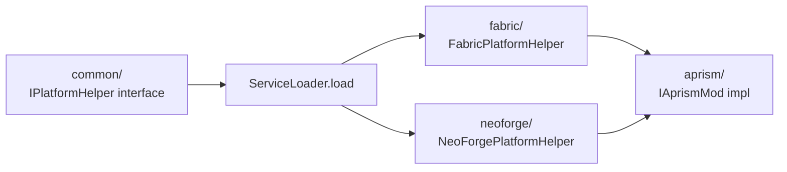

# Aprism Mod Developer Guide: Develop and Export .aje/.abe Modpacks

> Document 8 of 8 | Aprism Loader Documentation Set
> Version: v26.0-Alpha.1 | Status: Development
> Author: BlockConnect@StarsailsClover
> Canonical language: English (Chinese copy maintained in parallel)

## 1. Executive Summary

This document is the hands-on developer guide for authoring, building, and exporting Aprism mods. It targets two artifact formats: `.aje` (Aprism Java Edition pack) for JVM content consumed by the Aprism javaagent, and `.abe` (Aprism Bedrock Edition pack) for native and Script API content consumed by the Aprism native loader. A mod authored against the Aprism API contract can be exported to one or both formats from a single source tree.

The guide is prescriptive. It defines the recommended project layout, the `IAprismMod` entrypoint contract, the `aprism.manifest.json` authoring rules, the complete Gradle configuration built on Architectury Loom, and the custom `aprism-packaging` Gradle plugin that produces the final archives. It also covers cross-platform registration, compatibility-group build profiles, publication to GitHub Releases and Modrinth, and a C++ deep dive for Bedrock native mods. A developer following this guide end to end will produce a loadable, signed, publishable Aprism mod.

The guide is consistent with the architecture decisions recorded in Document 1 and the manifest schema in Document 2. Where a recommendation appears to conflict with those documents, the architecture and manifest documents are authoritative and this guide defers.

## 2. Prerequisites

| Tool | Version (Modern profile, 26.1+) | Version (Legacy profile, pre-26.1) | Purpose |
|---|---|---|---|
| JDK | Java 25 (Temurin/OpenJDK) | Java 17 for 1.20-1.20.4; Java 21 for 1.20.5-1.21.11 | Compile runtime |
| Gradle | 9.x | 8.x | Build orchestration |
| Git | 2.40+ | 2.40+ | Source control, signed commits |
| IDE | IntelliJ IDEA 2024.2+ or VS Code | same | Development |
| Architectury Loom | 1.7+ (loom-no-remap) | 1.6+ (loom) | Multi-loader MC build |
| Android NDK | r26+ | r26+ | BE native Android cross-build |
| C++ toolchain | MSVC 2022 (Win), Clang 17 (Android/iOS/Linux) | same | BE native compilation |
| cosign | 2.2+ | 2.2+ | Artifact signing |
| xmake or CMake | xmake 2.8+ / CMake 3.27+ | same | BE native build (alternative to Gradle) |

Additional requirements: a local Minecraft instance for smoke testing, the Aprism loader installed, and a GitHub account for release distribution. For Bedrock native development on Windows, install the latest Windows SDK and the Desktop C++ workload. For Android, install CMake and NDK through the Android SDK Manager. For iOS, a macOS host with Xcode 15+ is required, and TrollStore is the only supported deployment channel.

## 3. Project Structure for JE Mods

Aprism adopts the MultiLoader template layout: separate source sets for shared logic and per-loader entrypoints, plus an `aprism/` source set that carries the loader-agnostic Aprism implementation. The `common/` set depends only on vanilla Minecraft; `fabric/` and `neoforge/` depend on `common/`; `aprism/` depends on `common/` and the Aprism API, and is consumed by both loader sets.

### 3.1 Recommended tree

```
examplemod/
+-- settings.gradle
+-- build.gradle
+-- gradle.properties
+-- gradle/
|   +-- libs.versions.toml
|   +-- wrapper/
+-- common/
|   +-- build.gradle
|   +-- src/main/java/com/example/common/
+-- fabric/
|   +-- build.gradle
|   +-- src/main/java/com/example/fabric/
|   +-- src/main/resources/
|       +-- fabric.mod.json
+-- neoforge/
|   +-- build.gradle
|   +-- src/main/java/com/example/neoforge/
|   +-- src/main/resources/
|       +-- META-INF/neoforge.mods.toml
+-- aprism/
|   +-- build.gradle
|   +-- src/main/java/com/example/aprism/
|   +-- src/main/resources/
|       +-- aprism.manifest.json
|       +-- example.accesswidener
|       +-- mixins/
|           +-- example.mixins.json
+-- docs/
+-- .github/workflows/
```

### 3.2 Source set responsibilities

| Set | Depends on | Permitted APIs | Disallowed APIs |
|---|---|---|---|
| `common/` | vanilla Minecraft | Vanilla MC, JDK, Aprism API common | Fabric, NeoForge, Forge, Quilt, LiteLoader |
| `fabric/` | `common/`, Fabric Loader | Fabric Loader, Fabric API | NeoForge, Forge |
| `neoforge/` | `common/`, NeoForge | NeoForge mod loader | Fabric, Forge |
| `aprism/` | `common/`, Aprism API | Aprism API only | Loader-specific APIs |

The `aprism/` set is the unified entrypoint. The Fabric and NeoForge sets are thin adapters: their only job is to boot the loader-specific entrypoint and delegate to the `aprism/` `IAprismMod` implementation. All gameplay logic lives in `common/` and `aprism/`.

### 3.3 ServiceLoader wiring of IPlatformHelper

Cross-loader platform calls are resolved through a `IPlatformHelper` service loaded via `java.util.ServiceLoader`. Each loader set ships a provider file under `META-INF/services/` and a concrete implementation.



`common/` declares the interface:

```java
package com.example.common.platform;

public interface IPlatformHelper {
    String loaderName();
    boolean isDevelopmentEnvironment();
    Object createPlatformThing();
}
```

`fabric/` provides the implementation and registers it:

```java
package com.example.fabric.platform;

import com.example.common.platform.IPlatformHelper;

public class FabricPlatformHelper implements IPlatformHelper {
    @Override public String loaderName() { return "fabric"; }
    @Override public boolean isDevelopmentEnvironment() {
        return net.fabricmc.loader.api.FabricLoader.getInstance().isDevelopmentEnvironment();
    }
    @Override public Object createPlatformThing() { return new Object(); }
}
```

The provider file at `fabric/src/main/resources/META-INF/services/com.example.common.platform.IPlatformHelper` contains one line:

```
com.example.fabric.platform.FabricPlatformHelper
```

The `aprism/` set loads the helper lazily and caches it:

```java
IPlatformHelper helper = ServiceLoader.load(IPlatformHelper.class)
        .findFirst()
        .orElseThrow(() -> new IllegalStateException("No IPlatformHelper on classpath"));
```

This is the MultiLoader template pattern verbatim. It keeps `common/` free of loader symbols while still allowing per-loader behavior at runtime.

## 4. Project Structure for BE Native Mods

Bedrock native mods are C++ projects that compile to a per-platform binary and link against the Aprism BE API headers. The project layout mirrors the Amethyst and LeviLamina precedents: a `src/` tree, an `include/` tree carrying the Aprism BE API headers, a `resources/` tree carrying the manifest, and a build script.

### 4.1 Recommended tree

```
example_native_be/
+-- aprism.manifest.json
+-- build.gradle                  (optional; xmake.lua or CMakeLists.txt are alternatives)
+-- xmake.lua                     (alternative build script)
+-- include/
|   +-- AmethystAPI/              (Aprism BE API headers, vendored or includePath'd)
|   +-- libhat/                   (signature scanning headers)
|   +-- MinHook/                  (hook backend headers, Windows)
+-- src/
|   +-- main.cpp
|   +-- hooks/
|   |   +-- BlockPlaceHook.cpp
|   +-- events/
|       +-- EventHandler.cpp
+-- resources/
    +-- icon.png
+-- scripts/                      (optional, for hybrid mods)
    +-- companion.js
```

### 4.2 Linking against the Aprism BE API

The Aprism BE API is exposed as a header-only interface plus a small shared library (`aprism_be` on Linux/Android, `AprismBE.dll` on Windows) that provides the runtime registrar. At build time, the include path is set to `include/`, and the linker is pointed at the Aprism BE runtime library installed by the Aprism loader.

On Windows, the linker input is `AprismBE.lib` (import library) and the runtime resolves `AprismBE.dll` from the Aprism install. On Android, the input is `libaprism_be.so`. The native binary does not statically link the API; it links the runtime that the Aprism loader has already injected, so that there is exactly one registrar and one hook manager per process.

## 5. The IAprismMod Interface

`IAprismMod` is the single lifecycle entrypoint contract. It is intentionally narrow: one lifecycle method plus a metadata accessor. Phase-specific work is expressed through the event bus, not through additional interface methods, so that the contract stays stable as new phases are introduced.

### 5.1 Java interface (JE)

```java
package com.example.aprism;

import org.aprism.api.ModMetadata;
import org.aprism.api.AprismContext;

public interface IAprismMod {
    ModMetadata metadata();
    void onInitialize(AprismContext ctx);
}
```

`AprismContext` exposes the event bus, the registry, the logger, and the platform descriptor. Contexts are phase-scoped: a context obtained during PREINIT refuses to return a populated registry because the registry is not yet built. This is enforced at the API boundary.

### 5.2 C++ interface (BE)

```cpp
// include/AmethystAPI/IAprismMod.h
#pragma once
#include <AmethystAPI/ModMetadata.h>
#include <AmethystAPI/AprismContext.h>

class IAprismMod {
public:
    virtual ~IAprismMod() = default;
    virtual const ModMetadata& metadata() const = 0;
    virtual void onInitialize(AprismContext& ctx) = 0;
};

extern "C" APRISM_EXPORT IAprismMod* aprism_mod_create();
```

The `aprism_mod_create` factory on BE mirrors the manifest-declared entrypoint on JE. Both factories are called once during INIT and both receive a context that exposes the same services under the same names.

### 5.3 Lifecycle phases and the adapter

The phase model is PREINIT, INIT, SETUP, COMPLETE, CLIENT, SERVER. Because the interface carries only `onInitialize`, the canonical way to participate in later phases is to subscribe to the corresponding phase event. For convenience, Aprism ships `AprismLifecycleAdapter`, an abstract base class that subscribes to each phase event on your behalf and dispatches to overridable `onPreInitialize`, `onInitialize`, `onSetup`, and `onComplete` methods.

```java
package com.example.aprism;

import org.aprism.api.AprismContext;
import org.aprism.api.lifecycle.AprismLifecycleAdapter;

public final class ExampleMod extends AprismLifecycleAdapter {
    @Override public void onPreInitialize(AprismContext ctx) {
        ctx.logger().info("PreInit: registering mixins and access wideners");
    }
    @Override public void onInitialize(AprismContext ctx) {
        ctx.logger().info("Init: registering content");
        Blocks.register(ctx);
    }
    @Override public void onSetup(AprismContext ctx) {
        ctx.logger().info("Setup: wiring cross-mod integrations");
    }
    @Override public void onComplete(AprismContext ctx) {
        ctx.logger().info("Complete: emitting readiness");
    }
}
```

The adapter is the recommended authoring surface. Direct implementation of `IAprismMod` is permitted for mods that only need INIT behavior and want zero overhead.

### 5.4 Fabric delegation

The Fabric entrypoint implements `ModInitializer` and delegates to the Aprism entrypoint. No gameplay logic lives here.

```java
package com.example.fabric;

import com.example.aprism.ExampleMod;
import net.fabricmc.api.ModInitializer;
import org.aprism.api.Aprism;

public final class ExampleModFabric implements ModInitializer {
    @Override public void onInitialize() {
        Aprism.bootstrap(new ExampleMod());
    }
}
```

### 5.5 NeoForge delegation

The NeoForge entrypoint is a `@Mod`-annotated constructor that performs the same delegation.

```java
package com.example.neoforge;

import com.example.aprism.ExampleMod;
import net.neoforged.bus.api.IEventBus;
import net.neoforged.fml.common.Mod;
import org.aprism.api.Aprism;

@Mod("examplemod")
public final class ExampleModNeoForge {
    public ExampleModNeoForge(IEventBus modBus) {
        Aprism.bootstrap(new ExampleMod());
    }
}
```

## 6. Writing the Manifest

The manifest is `aprism.manifest.json` at the pack root. It is the only file Aprism reads first. See Document 2 for the full schema. The examples below cover the three authoring scenarios.

### 6.1 JE multi-loader manifest

```json
{
  "schemaVersion": 1,
  "id": "examplemod",
  "version": "1.0.0",
  "displayName": "Example Mod",
  "description": "A multi-loader reference mod for Aprism.",
  "authors": [{ "name": "BlockConnect" }],
  "license": "MIT",
  "icon": "icon.png",
  "contact": {
    "homepage": "https://example.com",
    "sources": "https://github.com/example/examplemod",
    "issues": "https://github.com/example/examplemod/issues"
  },
  "environment": "*",
  "entrypoints": {
    "main":   ["com.example.aprism.ExampleMod"],
    "client": ["com.example.aprism.ExampleModClient"]
  },
  "mixins": [
    "mixins/example.mixins.json",
    { "config": "mixins/example.client.mixins.json", "environment": "client" }
  ],
  "accessWidener": "example.accesswidener",
  "depends": {
    "aprism":        ">=26.0-Alpha1",
    "minecraft":     ">=1.20.4 <1.22",
    "java":          ">=21"
  },
  "recommends": { "modmenu": ">=7.0.0" },
  "platforms": {
    "fabric":   { "depends": { "fabricloader": ">=0.15.0", "fabric-api": ">=0.96.0" } },
    "neoforge": { "depends": { "neoforge": ">=20.4.0" }, "accessWidener": null },
    "forge":    { "depends": { "forge": ">=47.0.0" }, "entrypoints": { "main": ["com.example.neoforge.ExampleModNeoForge"] } }
  },
  "custom": { "examplemod:profile": "26.1" }
}
```

### 6.2 BE native manifest (C++)

```json
{
  "format_version": 2,
  "header": {
    "name": "Example Native BE Mod",
    "description": "Native C++ Bedrock mod",
    "uuid": "5f1d2b3a-9c8e-4f2a-b6d1-7e3c0a1b2d3e",
    "version": [1, 0, 0],
    "min_engine_version": [1, 21, 0]
  },
  "modules": [
    { "type": "data", "uuid": "6e2c3b4a-1d2e-4a3b-8c5f-9a0b1c2d3e4f", "version": [1, 0, 0] }
  ],
  "dependencies": [],
  "aprism": {
    "schemaVersion": 1,
    "modId": "example_native_be",
    "version": "1.0.0",
    "language": "cpp",
    "aprismApiVersion": ">=26.0-Alpha1",
    "gameVersionRange": ">=1.21.0 <1.22.0",
    "nativeEntrypoints": {
      "windows-x64":   { "binary": "native/windows-x64/example.dll",       "entry": "aprism_mod_load" },
      "android-arm64": { "binary": "native/android-arm64/libexample.so",   "entry": "aprism_mod_load" },
      "ios-arm64":     { "binary": "native/ios-arm64/example.dylib",       "entry": "aprism_mod_load" }
    },
    "depends": { "levilamina": ">=0.10.0" },
    "mixins": [ "hooks.example.json" ]
  }
}
```

Note that the BE factory export is `aprism_mod_load` in this manifest, while the C++ interface header declares `aprism_mod_create`. The two are reconciled by the Aprism BE loader: `aprism_mod_load` is the platform entry the loader calls first; it constructs the `IAprismMod` instance via `aprism_mod_create` and registers it with the registrar. Authors implementing only `aprism_mod_create` may alias the two symbols; authors needing pre-registration setup should implement `aprism_mod_load` explicitly.

### 6.3 BE script manifest (JavaScript)

```json
{
  "format_version": 2,
  "header": {
    "name": "Example Script BE Mod",
    "description": "JavaScript Script API mod",
    "uuid": "7a3b4c5d-6e7f-4a8b-9c0d-1e2f3a4b5c6d",
    "version": [1, 2, 0],
    "min_engine_version": [1, 21, 10]
  },
  "modules": [
    { "type": "script", "language": "javascript", "uuid": "8b4c5d6e-7f8a-4b9c-0d1e-2f3a4b5c6d7e", "version": [1, 2, 0], "entry": "scripts/main.js" }
  ],
  "dependencies": [
    { "module_name": "@minecraft/server", "version": "1.10.0" }
  ],
  "aprism": {
    "schemaVersion": 1,
    "modId": "example_script_be",
    "version": "1.2.0",
    "language": "javascript",
    "aprismApiVersion": ">=26.0-Alpha1",
    "gameVersionRange": ">=1.21.10",
    "scriptEntrypoints": { "main": "scripts/main.js", "client": "scripts/client.js" }
  }
}
```

### 6.4 Filling version ranges

Ranges use the SemVer syntax defined in Document 2, Section 6. Rules of thumb:

- `aprism`: always `>=26.0-Alpha1` for mods built against this guide.
- `minecraft`: use a closed range to pin a compatibility group, e.g. `>=1.20.4 <1.20.6` for a narrow 1.20.x build, or `>=1.21 <1.22` for the 1.21.x group. Open upper bounds (`>=1.21`) are discouraged because they imply support for versions you have not tested.
- `java`: match the JDK target of the profile (`>=17`, `>=21`, or `>=25`).
- Per-loader ranges go in the corresponding `platforms.<loader>.depends` block, not at the top level, so that a mod loaded under the wrong loader does not fail a top-level dependency check.

## 7. Gradle Configuration

### 7.1 settings.gradle

```groovy
pluginManagement {
    repositories {
        maven { url = "https://maven.architectury.dev/" }
        maven { url = "https://maven.fabricmc.net/" }
        maven { url = "https://maven.neoforged.net/releases/" }
        maven { url = "https://maven.pkg.github.com/aprism/aprism-packaging" }
        gradlePluginPortal()
        mavenCentral()
    }
}

dependencyResolutionManagement {
    repositories {
        mavenCentral()
        maven { url = "https://maven.fabricmc.net/" }
        maven { url = "https://maven.neoforged.net/releases/" }
        maven { url = "https://maven.architectury.dev/" }
    }
    versionCatalogs {
        libs { from(files("gradle/libs.versions.toml")) }
    }
}

rootProject.name = "examplemod"

include(":common", ":fabric", ":neoforge", ":aprism")
```

### 7.2 gradle/libs.versions.toml

```toml
[versions]
minecraft          = "1.21.1"
minecraftModern    = "26.1-alpha.1"
fabricLoader       = "0.16.0"
fabricApi          = "0.102.0+1.21.1"
neoforge           = "21.1.1"
architecturyLoom   = "1.7-SNAPSHOT"
aprismApi          = "26.0-Alpha.1"
shadow             = "8.1.1"
aprismPackaging    = "0.1.0"

[libraries]
minecraft-common   = { module = "com.mojang:minecraft", version.ref = "minecraft" }
fabric-loader      = { module = "net.fabricmc:fabric-loader", version.ref = "fabricLoader" }
fabric-api         = { module = "net.fabricmc.fabric-api:fabric-api", version.ref = "fabricApi" }
neoforge-modloader = { module = "net.neoforged:neoforge", version.ref = "neoforge" }
aprism-api         = { module = "org.aprism:aprism-api", version.ref = "aprismApi" }

[plugins]
architectury-loom  = { id = "dev.architectury.loom", version.ref = "architecturyLoom" }
shadow             = { id = "com.github.johnrengelman.shadow", version.ref = "shadow" }
aprism-packaging   = { id = "org.aprism.packaging", version.ref = "aprismPackaging" }
```

### 7.3 common/build.gradle

```groovy
plugins {
    id("dev.architectury.loom")
    id("java-library")
}

dependencies {
    minecraft(libs.minecraft.common)
    mappings loom.officialMojangMappings()
    api(libs.aprism.api)
}

java {
    sourceCompatibility = JavaVersion.VERSION_21
    targetCompatibility = JavaVersion.VERSION_21
}
```

For the Modern (26.1+) profile, replace the loom configuration with the no-remap profile and target Java 25:

```groovy
loom {
    noRemap = true
}
java {
    sourceCompatibility = JavaVersion.VERSION_25
    targetCompatibility = JavaVersion.VERSION_25
}
```

### 7.4 fabric/build.gradle

```groovy
plugins {
    id("dev.architectury.loom")
    id("java-library")
}

dependencies {
    minecraft(libs.minecraft.common)
    mappings loom.officialMojangMappings()
    modImplementation(libs.fabric.loader)
    modImplementation(libs.fabric.api)
    implementation(project(":common"))
    implementation(project(":aprism"))
}

loom {
    splitEnvironmentSourceSets()
    mods {
        examplemod {
            sourceSet sourceSets.main
            sourceSet project(":common").sourceSets.main
            sourceSet project(":aprism").sourceSets.main
        }
    }
}

java {
    sourceCompatibility = JavaVersion.VERSION_21
    targetCompatibility = JavaVersion.VERSION_21
}
```

### 7.5 neoforge/build.gradle

```groovy
plugins {
    id("dev.architectury.loom")
    id("java-library")
}

dependencies {
    minecraft(libs.minecraft.common)
    mappings loom.officialMojangMappings()
    neoForge(libs.neoforge.modloader)
    implementation(project(":common"))
    implementation(project(":aprism"))
}

java {
    sourceCompatibility = JavaVersion.VERSION_21
    targetCompatibility = JavaVersion.VERSION_21
}
```

### 7.6 aprism/build.gradle

```groovy
plugins {
    id("java-library")
    id("com.github.johnrengelman.shadow")
}

dependencies {
    api(project(":common"))
    api(libs.aprism.api)
}

jar {
    archiveBaseName.set("examplemod-aprism")
    from("../aprism/src/main/resources")
}

shadowJar {
    dependsOn(jar)
    from(zipTree(jar.archiveFile))
    archiveBaseName.set("examplemod-aprism")
    classifier.set("")
}
```

### 7.7 Root build.gradle applying the packaging plugin

```groovy
plugins {
    id("org.aprism.packaging") apply false
}

subprojects {
    repositories {
        mavenCentral()
        maven { url = "https://maven.fabricmc.net/" }
        maven { url = "https://maven.neoforged.net/releases/" }
    }
}

allprojects {
    apply(plugin: "org.aprism.packaging")

    aprismPackaging {
        manifestFile = file("${rootDir}/aprism/src/main/resources/aprism.manifest.json")
        includePlatform = ["fabric", "neoforge"]
        nativeTargets = []
        outputDir = layout.buildDirectory.dir("aprism")
    }
}
```

## 8. The aprism-packaging Gradle Plugin

The `aprism-packaging` plugin consumes the output of `shadowJar` and `remapJar` and repackages it into the `.aje` or `.abe` archive format defined in Document 7. It does not recompile or remap anything; it only assembles.

### 8.1 What the plugin does

1. Resolves the manifest file from the configured `manifestFile` property.
2. Collects the per-loader jars from each subproject's build output (`fabric/` jar, `neoforge/` jar).
3. Collects shared resources, mixin configs, and access wideners from the `aprism/` resources.
4. Emits a ZIP whose internal structure matches the canonical `.aje` or `.abe` tree.
5. Writes a `checksums.txt` next to the archive containing SHA-256 of the archive and of each member entry.

### 8.2 Tasks

| Task | Produces | Depends on |
|---|---|---|
| `packageAje` | `build/aprism/<modid>-<version>.aje` | `:fabric:remapJar`, `:neoforge:remapJar`, `:aprism:shadowJar` |
| `packageAbe` | `build/aprism/<modid>-<version>.abe` | native build task or `:scripts:bundle` |
| `packageAll` | both archives | `packageAje`, `packageAbe` |

### 8.3 Configuration block

```groovy
aprismPackaging {
    // Required: path to the manifest at the pack root.
    manifestFile = file("aprism/src/main/resources/aprism.manifest.json")

    // Required for .aje: which loader subdirs to populate.
    includePlatform = ["fabric", "neoforge"]

    // Required for .abe: native targets to bundle under native/.
    nativeTargets = ["windows-x64", "android-arm64", "ios-arm64"]

    // Optional: where to emit the archive. Defaults to build/aprism.
    outputDir = layout.buildDirectory.dir("aprism")

    // Optional: additional resources to merge into resources/.
    extraResources = fileTree("src/main/resources/shared")

    // Optional: mixin configs to place under mixins/.
    mixinConfigs = fileTree("aprism/src/main/resources/mixins")

    // Optional: compatibility group label embedded in the archive metadata.
    compatibilityGroup = project.findProperty("aprismProfile") ?: "legacy"
}
```

### 8.4 Running the build

```bash
./gradlew packageAje          # produces build/aprism/examplemod-1.0.0.aje
./gradlew packageAbe          # produces build/aprism/example_native_be-1.0.0.abe
./gradlew packageAll          # produces both
./gradlew -PaprismProfile=26.1 packageAje   # builds against the Modern profile
```

## 9. Cross-Platform Registration Patterns

The Aprism API exposes a single registration surface that routes to the correct backend per edition. The mod author calls the API once; the runtime does the per-edition dispatch.

### 9.1 Registering a block

In `common/`, register through the Aprism registry:

```java
package com.example.common;

import net.minecraft.world.level.block.Block;
import net.minecraft.world.level.block.state.BlockBehaviour;
import net.minecraft.world.level.material.MapColor;
import org.aprism.api.registry.Registry;
import org.aprism.api.Identifier;

public final class ExampleBlocks {
    public static final Block EXAMPLE_BLOCK = new Block(
        BlockBehaviour.Properties.of().mapColor(MapColor.STONE).strength(3.0f));

    public static void register() {
        Registry.register(Registry.BLOCK,
            Identifier.of("examplemod", "example_block"),
            EXAMPLE_BLOCK);
        Registry.register(Registry.ITEM,
            Identifier.of("examplemod", "example_block"),
            new net.minecraft.world.item.BlockItem(EXAMPLE_BLOCK,
                new net.minecraft.world.item.Item.Properties()));
    }
}
```

On JE, `Registry.register` delegates to the Minecraft registry through the Mixin-injected accessor for the active loader. On BE, the same call routes to the Bedrock native registration path exposed through the Aprism BE API, which in turn calls `CustomBlockComponent::register` in the Bedrock binary. Identifiers are namespaced `examplemod:example_block` on both editions and are never prefixed or rewritten.

### 9.2 Subscribing to events

```java
package com.example.aprism;

import org.aprism.api.AprismContext;
import org.aprism.api.event.block.BlockPlaceEvent;

public final class ExampleEvents {
    public static void register(AprismContext ctx) {
        ctx.eventBus().subscribe(BlockPlaceEvent.class, ExampleEvents::onBlockPlace);
    }

    private static void onBlockPlace(BlockPlaceEvent event) {
        ctx.logger().info("Block placed at {}", event.position());
    }
}
```

`BlockPlaceEvent` is posted on JE when the player places a block through the JE pipeline and on BE when the native hook intercepts `Block::place`. Listener code runs unchanged on both. Cancelling the event via `event.cancel()` prevents the placement on both editions.

### 9.3 Config

```java
package com.example.aprism;

import org.aprism.api.config.Config;
import org.aprism.api.config.ConfigSpec;

public final class ExampleConfig {
    public static final ConfigSpec SPEC = ConfigSpec.create("examplemod")
        .define("durabilityBonus", 5)
        .define("enableFancyRendering", true)
        .defineInRange("maxRange", 16, 1, 64);

    public static Config instance;

    public static void load(AprismContext ctx) {
        instance = ctx.config().load(SPEC);
    }
}
```

Config schemas are versioned with the monotonic rule: fields may be added and deprecated, never removed or renamed. A field marked deprecated remains functional for at least one LTS cycle and emits a warning on use.

### 9.4 Networking

```java
package com.example.aprism;

import org.aprism.api.network.NetworkChannel;
import org.aprism.api.AprismContext;

public final class ExampleNetworking {
    public static NetworkChannel CHANNEL;

    public static void register(AprismContext ctx) {
        CHANNEL = ctx.network().channel("examplemod:main");
        CHANNEL.register("sync_state", ExamplePayload.class, ExamplePayload::encode, ExamplePayload::decode);
        CHANNEL.subscribeServerbound("sync_state", (payload, ctx2) -> {
            ctx2.logger().info("Received state from client: {}", payload.value());
        });
    }
}
```

On JE, the channel wraps the loader's packet path. On BE, the channel wraps the Bedrock native network hook. Payload codecs are edition-agnostic because the Aprism API defines the wire format.

## 10. Building and Exporting

### 10.1 Export a .aje

```bash
./gradlew clean packageAje
```

Output: `build/aprism/examplemod-1.0.0.aje`. Internal structure:

```
examplemod-1.0.0.aje
+-- aprism.manifest.json
+-- examplemod-aprism.jar
+-- fabric/
|   +-- examplemod-fabric.jar
+-- neoforge/
|   +-- examplemod-neoforge.jar
+-- resources/
+-- mixins/
    +-- example.mixins.json
```

### 10.2 Export a .abe

```bash
./gradlew packageAbe
```

Output: `build/aprism/example_native_be-1.0.0.abe`. Internal structure:

```
example_native_be-1.0.0.abe
+-- aprism.manifest.json
+-- native/
|   +-- windows-x64/example.dll
|   +-- android-arm64/libexample.so
|   +-- ios-arm64/example.dylib
+-- resources/
    +-- icon.png
```

### 10.3 Verifying the pack

Treat the archive as a ZIP and inspect it. Do not rely on the file extension alone.

```bash
unzip -l build/aprism/examplemod-1.0.0.aje | head
unzip -p build/aprism/examplemod-1.0.0.aje aprism.manifest.json | jq .
```

Verify that: the manifest is at the ZIP root; the manifest `id` matches the archive base name; the manifest `version` matches the archive version segment; per-loader jars are present under the correct subdirectories; mixin configs referenced in the manifest exist under `mixins/`.

### 10.4 Testing locally

For JE, drop the `.aje` into the instance's `mods/` directory and launch through the Aprism loader. For BE, drop the `.abe` into `com.mojang/aprism_mods/` (the Aprism-introduced directory, not the standard `behavior_packs/`). Launch the game and watch the Aprism log for the mod's `Init` line. If the mod does not appear, consult the troubleshooting table.

## 11. Compatibility-Group Build Profiles

Aprism maintains two build profiles in parallel. A single source tree can target both by selecting the profile at build time.

| Profile | Minecraft range | Gradle | Java target | Loom mode | Intermediary |
|---|---|---|---|---|---|
| Legacy | pre-26.1 (1.20.x, 1.21.x) | 8.x | 17 or 21 | loom (remap) | Fabric Intermediary |
| Modern | 26.1+ | 9.x | 25 | loom-no-remap | none (unobfuscated) |

### 11.1 Setting up profiles

Profiles are selected by the `aprismProfile` Gradle property and routed through `gradle.properties` defaults:

```properties
# gradle.properties
aprismProfile=legacy
org.gradle.jvmargs=-Xmx4G
```

In each subproject's `build.gradle`, branch on the property:

```groovy
def profile = rootProject.findProperty("aprismProfile") ?: "legacy"

if (profile == "26.1") {
    loom { noRemap = true }
    java {
        sourceCompatibility = JavaVersion.VERSION_25
        targetCompatibility = JavaVersion.VERSION_25
    }
    dependencies {
        minecraft("com.mojang:minecraft:26.1-alpha.1")
    }
} else {
    java {
        sourceCompatibility = JavaVersion.VERSION_21
        targetCompatibility = JavaVersion.VERSION_21
    }
    dependencies {
        minecraft(libs.minecraft.common)
    }
}
```

### 11.2 JDK target per profile

| Minecraft range | JDK target |
|---|---|
| 1.20 - 1.20.4 | 17 |
| 1.20.5 - 1.21.11 | 21 |
| 26.x | 25 |

### 11.3 Selecting a profile

```bash
./gradlew -PaprismProfile=26.1 packageAje
./gradlew -PaprismProfile=legacy packageAje
```

### 11.4 Manifest adaptation per profile

The manifest's `minecraft` and `java` ranges must match the profile. Use the `custom.examplemod:profile` field to record which profile the artifact was built against, and adjust ranges in a profile-specific manifest fragment if your build produces multiple artifacts:

```json
"minecraft": ">=1.21 <1.22",
"java": ">=21",
"custom": { "examplemod:profile": "legacy" }
```

For the Modern profile, the same mod ships:

```json
"minecraft": ">=26.1",
"java": ">=25",
"custom": { "examplemod:profile": "26.1" }
```

## 12. Publishing

### 12.1 GitHub Releases

Tag the release with a conventional, signed tag and attach the archives plus checksums.

```bash
git tag -s v1.0.0 -m "Release 1.0.0"
git push origin v1.0.0
sha256sum build/aprism/examplemod-1.0.0.aje > build/aprism/checksums.txt
gh release create v1.0.0 build/aprism/examplemod-1.0.0.aje build/aprism/checksums.txt
```

GitHub Releases is the primary CDN. The Aprism launcher is GitHub-token-aware and follows cross-host redirects, stripping the `Authorization` header on `release-assets.githubusercontent.com`.

### 12.2 Modrinth upload

```bash
modrinth upload \
  --project examplemod \
  --version 1.0.0 \
  --game-version 1.21.1 \
  --loader fabric \
  --loader neoforge \
  --file build/aprism/examplemod-1.0.0.aje
```

Modrinth is a mirror for discoverability. Modrinth metadata should declare both loaders and the compatibility-group game versions.

### 12.3 CurseForge upload

CurseForge upload is performed through the CurseForge Maven or the curseforge Gradle plugin. Declare the plugin and configure the project id, then run `./gradlew curseforge`. CurseForge requires separate files per loader; the `aprism-packaging` plugin can emit per-loader variants on request.

### 12.4 Cosign signing

Sign the published artifacts with cosign keyless signing. The signature is stored alongside the release as a `.sig` file and a `.bundle` for verification.

```bash
cosign sign-blob --yes build/aprism/examplemod-1.0.0.aje \
  --output-signature build/aprism/examplemod-1.0.0.aje.sig \
  --output-certificate build/aprism/examplemod-1.0.0.aje.pem
```

Verification by a downstream launcher uses the bundle and the Fulcio certificate chain. The Aprism launcher verifies signatures before installing a mod when the user has enabled strict verification.

## 13. BE Native Mod Development (C++ deep dive)

### 13.1 Setting up the project

The C++ project links against the Aprism BE API headers and the Aprism BE runtime library. The headers are vendored under `include/AmethystAPI/` or referenced through an include path. The runtime library is provided by the installed Aprism loader; do not bundle it.

A minimal `xmake.lua`:

```lua
add_rules("mode.debug", "mode.release")

target("example_native_be")
    set_kind("shared")
    set_languages("c++20")

    add_includedirs("include")
    add_files("src/main.cpp", "src/hooks/*.cpp", "src/events/*.cpp")

    add_links("aprism_be")
    add_linkdirs("$(APRISM_BE_LIBDIR)")

    if is_plat("windows") then
        set_filename("example.dll")
    elseif is_plat("android") then
        set_filename("libexample.so")
    elseif is_plat("macosx", "ios") then
        set_filename("example.dylib")
    end
```

### 13.2 Implementing the entrypoint

```cpp
// src/main.cpp
#include <AmethystAPI/IAprismMod.h>
#include <AmethystAPI/AprismContext.h>
#include "hooks/BlockPlaceHook.h"

class ExampleNativeMod : public IAprismMod {
public:
    const ModMetadata& metadata() const override {
        static ModMetadata m{ "example_native_be", "1.0.0", ">=1.21.0 <1.22.0" };
        return m;
    }

    void onInitialize(AprismContext& ctx) override {
        ctx.logger.info("ExampleNativeMod init");
        BlockPlaceHook::install(ctx);
    }
};

extern "C" APRISM_EXPORT IAprismMod* aprism_mod_create() {
    return new ExampleNativeMod();
}

extern "C" APRISM_EXPORT void aprism_mod_load(AprismContext& ctx) {
    // Called by the Aprism BE loader before aprism_mod_create.
    // Use for early, pre-registration setup if needed.
    ctx.logger.info("aprism_mod_load entry hit");
}
```

### 13.3 Hooking a game function

Hook installation uses libhat for signature scanning and MinHook (Windows), ShadowHook (Android), or Dobby (iOS) for the detour. The Aprism BE API wraps the backend behind a uniform `Hook` interface.

```cpp
// src/hooks/BlockPlaceHook.cpp
#include <libhat/Scanner.hpp>
#include <AmethystAPI/Hook.h>
#include <AmethystAPI/Events.h>

using BlockPlaceFn = void(*)(void* self, void* player, void* pos, void* face);

static BlockPlaceFn original_BlockPlace = nullptr;

static void detour_BlockPlace(void* self, void* player, void* pos, void* face) {
    // Fire the Aprism event before the original call.
    aprism::events::BlockPlaceEvent event{ player, pos };
    aprism::events::post(event);
    if (event.cancelled()) return;

    original_BlockPlace(self, player, pos, face);
}

void BlockPlaceHook::install(AprismContext& ctx) {
    // Pattern is looked up in the version signature DB; the DB key is the build id.
    auto pattern = ctx.signatureDb.pattern("Block::place");
    auto scan = hat::find_pattern(pattern.start, pattern.end);
    if (!scan.has_result()) {
        ctx.logger.error("Block::place pattern not found for this build");
        return;
    }
    void* target = reinterpret_cast<void*>(scan.get());
    AprismHook::create(target, reinterpret_cast<void*>(&detour_BlockPlace),
                       reinterpret_cast<void**>(&original_BlockPlace));
    ctx.logger.info("Block::place hook installed");
}
```

### 13.4 Firing Aprism events from native code

Native code posts events through `aprism::events::post`. The event object is a plain struct whose fields are defined by the contract; the same struct shape is used on JE. Cancellation is honored by checking `event.cancelled()` before calling the original function, as shown above.

### 13.5 Building per platform

```bash
# Windows (DLL), MSVC
xmake f -p windows -a x64 -m release
xmake

# Android (.so), NDK
xmake f -p android -a arm64-v8a -m release --ndk=$ANDROID_NDK_HOME
xmake

# iOS (.dylib), Clang on macOS host
xmake f -p iphoneos -a arm64 -m release
xmake
```

The outputs land in `build/<plat>/<arch>/release/`. The `aprism-packaging` plugin's `packageAbe` task picks them up from the configured `nativeTargets` and places each under `native/<platform>/`.

## 14. Troubleshooting

| Problem | Likely cause | Solution |
|---|---|---|
| Manifest not found (`CHKAPRISM-MANIFEST-001`) | `aprism.manifest.json` is not at the ZIP root, or the archive was re-zipped with a wrapping directory. | Re-export with `aprism-packaging`; verify with `unzip -l` that the manifest is at the top level. |
| Mod not loading | Version range in `depends` is unsatisfied (Minecraft, Java, Aprism, or loader). | Check the Aprism log for `CHKAPRISM-DEP-001/002`; widen or correct the range in the manifest. |
| Hook crash on BE | Signature pattern did not match the running build; the build id is not in the signature DB. | Confirm the build id against the signature DB; ship an updated pattern or restrict `gameVersionRange` to known builds. |
| Version mismatch on dependency | A required mod is present but at an incompatible version. | Align the `depends` range with the installed dependency, or pin the dependency. |
| Build failure: remap errors (Legacy) | Intermediary mismatch between Loom version and Minecraft version. | Align `architecturyLoom` version and the Minecraft dependency in the catalog. |
| Build failure: no-remap expected (Modern) | Loom is still trying to remap a 26.1+ jar. | Set `loom { noRemap = true }` and ensure the profile is selected with `-PaprismProfile=26.1`. |
| `IAprismMod` not found at runtime | Aprism API dependency is `implementation` instead of `api`, or the API jar is not on the runtime classpath. | Use `api(libs.aprism.api)` in `common/` and `aprism/`. |
| ServiceLoader returns no `IPlatformHelper` | The `META-INF/services/` provider file is missing or misnamed. | Verify the file name matches the fully-qualified interface name and is on the classpath of the active loader set. |
| `.abe` native binary not loaded | Binary is under the wrong platform directory, or the manifest `nativeEntrypoints` path is wrong. | Confirm the directory name matches `native/<platform>/` exactly and the manifest path is relative to the pack root. |
| Duplicate mod error (`CHKAPRISM-DEP-004`) | Two mods `provides` the same alias. | Remove the alias from one mod, or align versions so the intended winner is higher. |

## 15. Reference Template Repository

The canonical starting point is the `aprism-mod-template` repository. Its structure mirrors Section 3.1 for JE mods and Section 4.1 for BE native mods, with a CI workflow that runs `packageAje`, `packageAbe`, cosign signing, and a GitHub Release upload on tag.

```
aprism-mod-template/
+-- common/ fabric/ neoforge/ aprism/
+-- native/                       (BE C++ project, optional)
+-- .github/workflows/build.yml
+-- gradle/libs.versions.toml
+-- settings.gradle
+-- build.gradle
+-- CONTRIBUTING.md
```

Clone it, rename `examplemod` to your mod id, update the manifest identity fields, and run `./gradlew packageAje`. The template is the fastest path to a loadable, signed artifact.

## 16. References

1. Document 1 - Aprism Loader Overall Architecture Design. Sections 9 (Unified API Surface) and 10 (Build and Packaging Pipeline) are the authoritative source for the `IAprismMod` contract and the `aprism-packaging` plugin.
2. Document 2 - Aprism JE / BE Mod Manifest. Sections 3, 4, and 6 define the manifest schema and version range syntax used throughout this guide.
3. Document 7 - Aprism Mods Pack (.aje/.abe) Classification, Structure and Per-Platform Placement. Section 3 and 4 define the archive internal structure that the `aprism-packaging` plugin emits.
4. Document 6 - Product Principle Specification. Section 5 defines the cross-edition `IAprismMod` contract and the monotonic API rule.
5. MultiLoader-Template (Jared): common/fabric/neoforge source sets with `IPlatformHelper` via `ServiceLoader`.
6. Architectury Loom: multi-loader fork of Fabric Loom; `loom-no-remap` profile for unobfuscated 26.1+ jars.
7. Fabric Loom 26.2: `splitEnvironmentSourceSets()`, `remapJar`, access widener, jar-in-jar.
8. Shadow plugin: `shadowJar { dependsOn(jar); from(zipTree(jar.archiveFile)) }` preserves Loom modifications.
9. Amethyst BE native pattern: `mod.json` manifest, C++ mod compiled to DLL, AmethystAPI headers, libhat signature scanning, MinHook detours, xmake build.
10. LeviLamina multi-language manifest: `type` field selecting `cpp`/`lua`/`csharp`/`rust`/`javascript` runtime.
11. FACT.md - Architecture Decisions 9.6 (Build Tooling) and 9.7 (Cross-Version Compatibility): compatibility-group jars, split profiles, JDK targets per profile.
