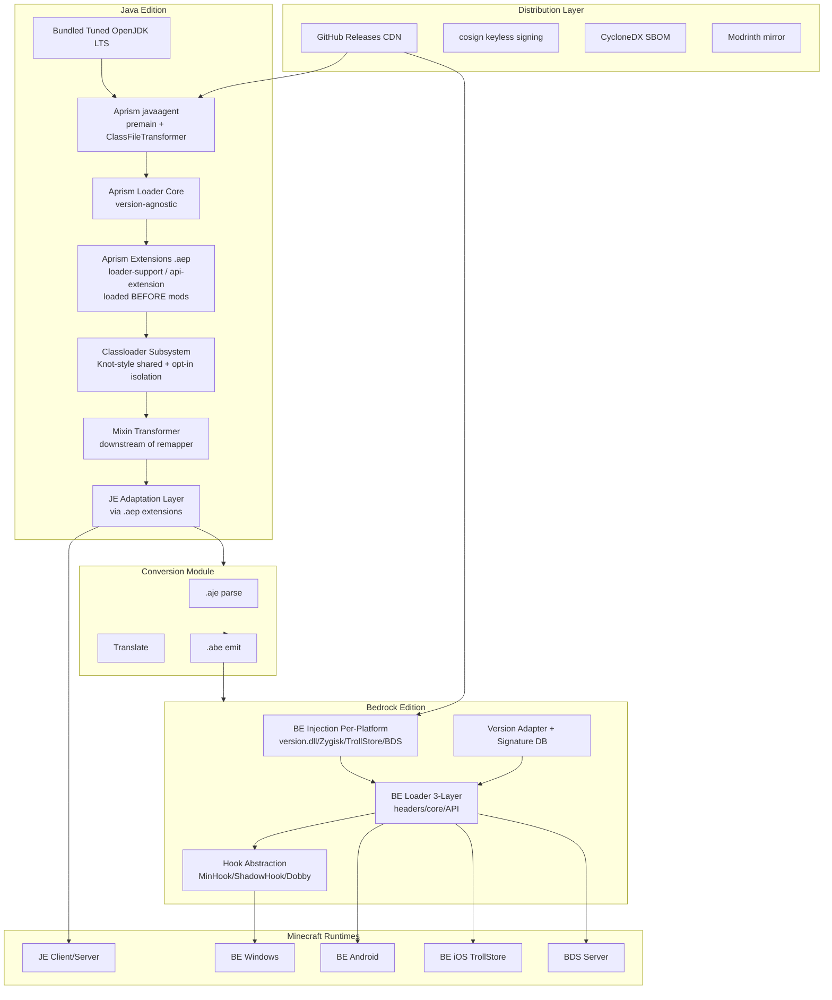
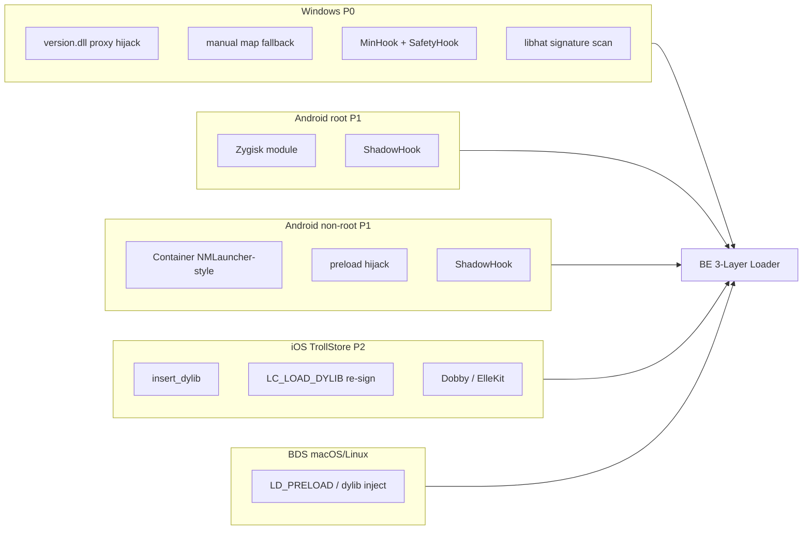
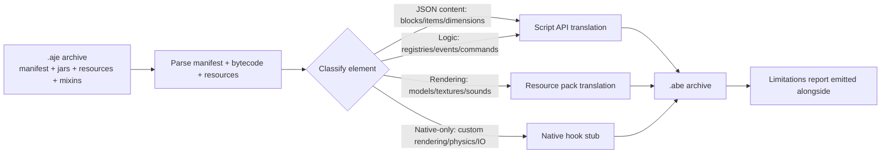
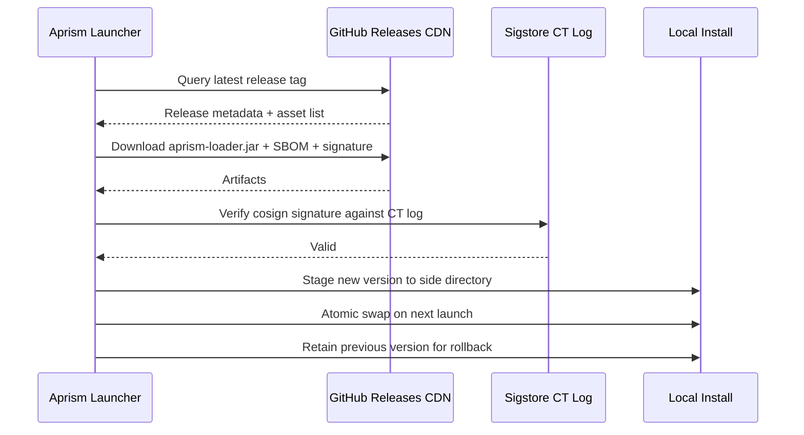

# Aprism Loader 总体架构设计

> 文档 1 / 8 | Aprism Loader 文档集
> 版本：v26.0-Alpha.1 | 状态：开发中
> 作者：BlockConnect@StarsailsClover
> 规范语言：英文（中文副本同步维护）

## 1. 执行摘要

Aprism 是一个统一的、跨版本、跨平台的 Minecraft 模组开发平台，它在单一的开发者面向 API 表面之下横跨 Java Edition（JE）与 Bedrock Edition（BE）。它并非单个 loader，而是一个分层系统：JE 原生基础层构建于 premain javaagent 与 `ClassFileTransformer` 之上，运行在一份打包并调校过的 OpenJDK LTS 构建上；适配层负责消费既有的 Fabric、NeoForge、Forge、Quilt 与 LiteLoader 模组格式；BE 注入与 loader 子系统在 Windows、Android、iOS 与 BDS 上执行各平台特定的原生二进制打补丁；JE-to-BE 转换模块将 JE 模组产物重新定向为 Bedrock 行为包/资源包与原生钩子；分发流水线构建于 GitHub Releases 之上，使用 cosign 无密钥签名与 CycloneDX SBOM。

本设计受四项不可妥协的不变量约束。第一，mod container 暴露的引用标识在系统内所有查找 API 中保持稳定。第二，公共接口契约单调递增：允许新增与弃用，禁止移除与重命名。第三，每一个受支持的 Minecraft 版本都通过一个具有显式 SemVer 范围的兼容性组来寻址；不存在任何"尽力而为"。第四，分发仅限独立桌面下载，因为 Microsoft Store Policy 10.2 与 Apple App Review Guideline 2.4.5(iv) 在法律上禁止在商店分发的应用中进行动态代码注入。

本文档是规范的架构参考。所有其他 Aprism 文档（构建工具、清单 schema、API 参考、BE 内部机制、转换、分发、版本管理与安全）均派生自本文档，且必须与本文档所记录的决策保持一致。

## 2. 设计目标与原则

### 2.1 目标

| 目标 | 陈述 |
|------|-----------|
| 统一接口 | 针对 Aprism API 编写的模组，在语义允许的情况下，无需源码改动即可运行于每一个受支持的 Minecraft 版本与 loader。 |
| 单调版本递增 | 公共 API 表面只增不减。弃用至少允许保留一个 LTS 周期；移除与重命名被禁止。 |
| 跨版本 | JE 与 BE 共享同一清单超集与同一转换流水线，因此单一源产物可同时面向两个版本。 |
| 跨平台 | JE 面向 Windows、macOS 与 Linux 桌面。BE 面向 Windows、Android（root 与非 root）、iOS（TrollStore），以及在 macOS/Linux 上的 BDS。 |
| 强制兼容性 | 兼容性通过兼容性组 SemVer 范围预先声明，并在加载时强制校验。范围未满足的模组将不被加载，而非加载后再出错。 |

### 2.2 原则

- **基底而非重写。** Aprism 构建于调校过的 OpenJDK 之上，而非自定义 JVM。loader 核心与版本无关，并镜像 Fabric Loader 架构，使最大体量的既有模组目录（Fabric、Quilt、LiteLoader）能够原生加载。
- **规范注入。** SpongePowered Mixin 是 JE 唯一的字节码注入机制。系统中仅存在一个 Mixin transformer，插入在 Aprism 自有 remapper 的下游，绝不作为与之竞争的转换 pass 存在。
- **各平台现实主义。** BE 注入被明确承认为版本脆弱的。版本适配器与签名数据库是工程投入的主要方向，而非事后补丁。
- **法律洁净。** Aprism 永不重新分发修改过的 Minecraft jar，永不上架禁止代码注入的应用商店，永不修改 Xbox Live 网络流量。

## 3. 高层架构

JE 路径是一条严格的流水线：打包的 JDK 承载 Aprism javaagent，后者在 loader 核心之上安装一个 `ClassFileTransformer`。loader 核心首先扫描 `aprism-extensions/`，注册 loader-support 扩展，然后持有 classloader、Mixin transformer 与适配层（由扩展提供）。BE 路径与之并行：各平台注入器引导三层 loader，后者在通过平台特定的 hook 后端安装钩子之前，会先查询版本适配器与签名数据库。转换模块桥接两者：它消费打包好的 `.aje` 产物并产出 `.abe` 产物，在语义对齐时委派给 Script API，否则委派给原生钩子。

**Aprism 原生超集**：Aprism JE Native API 是所有其他 JE loader API 的严格超集。Aprism BE Native API 在平台允许的范围内镜像 JE Native。针对 Aprism 原生（`.aje` / `.abe`）编写的模组获得最大能力；loader 专属模组（通过扩展）仅获得该 loader 的能力。

**BE 支持范围**：Aprism BE 自版本 26.x 起支持 Minecraft Bedrock Edition。低于 26.x 的 BE 版本不受支持。

## 4. JE Aprism 原生基础

该基础层是一个 premain javaagent 与 `ClassFileTransformer` 的组合，运行在派生自 Eclipse Temurin 的打包并调校过的 OpenJDK LTS 构建之上。agent JAR 通过 JE 启动命令行的 `-javaagent:aprism-loader.jar` 附加，并在应用 classloader 解析任何 Minecraft 类之前注册其 transformer。这保证了每一个 Minecraft 类都恰好一次、并以确定性顺序经过 Aprism 转换流水线。

### 4.1 为何不采用自定义 JVM 或 GraalVM Native Image

自定义 JVM 能够对 classloading、GC 与 JIT 策略提供最大控制权，但会带来永久性的维护负担，偏离上游安全修复，并破坏与用户各类 JVM 工具（profiler、agent、debugger）的兼容性。对于模组平台而言，成本收益比并不有利。因此 Aprism 追踪上游 OpenJDK LTS，并应用一组经过精选的补丁集（分层编译调优、用于加速温启动的 class data sharing，以及元数据缩减），而非进行 fork。

GraalVM Native Image 保留给可选的、预烘焙的 modpack bundle：一个闭世界的模组集合，预先编译为原生可执行文件，以在低端硬件上实现亚秒级冷启动。这并非默认运行时，因为闭世界分析与动态模组加载、重度依赖反射的模组以及运行时 Mixin 应用互不兼容。原生 bundle 是一个分发目标，而非基础层。

Project Leyden 因其提前进行类链接与方法 profiling 快照的承诺而受到跟踪，这将显著改善启动器温启动。当 Leyden 输出格式在上游 LTS 中稳定后，Aprism 将予以采纳；在此之前，AppCDS 作为温启动的缓解手段使用。

### 4.2 与版本无关的 Loader 核心

loader 核心暴露一个稳定的内部 SPI，不引用任何 Minecraft 版本符号。它镜像 Fabric Loader 的分解方式：一个 `Loader` 持有一组 `ModContainer` 实例，每个实例由一个 `ModClassLoader` 支撑；一个 `Knot` 风格的 classloader 图负责解析类；转换被委派给一个可插拔的、等价于 `IMixinPlatformAgent` 的组件。Minecraft 版本相关的逻辑（映射名、按版本门控的适配器）位于适配层，绝不位于核心之中。

## 5. Classloader 与转换子系统

### 5.1 默认共享类空间

默认的 classloader 策略是 Fabric Knot 风格的共享类空间。所有模组共享单一父 classloader，后者暴露其导出包的并集，而每个模组的子 classloader 对共享类委派给父级，仅隔离其内部包。这最大化了可寻址的模组目录：Fabric、Quilt（通过兼容 shim 加载 Fabric 模组）与 LiteLoader 模组都期望共享空间，并在更严格的隔离下会出错。

### 5.2 可选的隔离 ModClassLoader Shim

Forge 风格的模组需要隔离的 `ModClassLoader`，因为 Forge 模组假定其自身的 classloader 是其类的定义 loader，并依赖 `getClass().getClassLoader()` 返回一个模组专属实例。Aprism 在 `aprism.manifest.json` 中暴露一个可选的 `isolated` 标志。设置后，该模组会被包裹在 `IsolatedModClassLoader` shim 中，既满足 Forge 对 classloader 标识的期望，同时仍将转换路由通过中央流水线进行。

### 5.3 ModContainer 引用标识不变量

任何查找 API（`Loader.getModContainer`、事件 payload、注册表回调、依赖解析）返回的每一个 `ModContainer` 都是同一个对象实例。不存在每个 API 各自的副本。该不变量由单一容器注册表强制保障，并是支撑适配层 provider 无需重新包装即可互操作的关键假设。

### 5.4 Mixin 作为规范注入

SpongePowered Mixin 是唯一的字节码注入机制。Aprism 在其 `ClassFileTransformer` 链中仅注册一个 `MixinTransformer`，位于 Aprism 自有 remapper 的下游。这镜像了 Fabric 与 NeoForge 的集成方式：Mixin 看到的是已经 remap 完成的名称，并基于稳定的 intermediary 进行操作。任何与之竞争的注入框架（自定义 ASM 注入 pass 等）都不被允许进入转换链。AccessWidener 不是注入机制，而是一条独立的访问扩展 pass，在流水线中位于 Mixin **之后**（转换顺序：预注册转换 → Mixin → AccessWidener，见文档 6 §3.4 与 `AprismClassTransformer` 实现）：扩展后的访问标志因此对后续字节码消费者（反射、后续查找）可见；AccessWidener 只改写访问标志、不新增成员或方法体，因此不会与 Mixin 的注入点发生冲突。

### 5.5 Remapping 策略

对于 26.1 之前的 Minecraft 版本，Aprism 消费 Fabric Intermediary 映射，并在加载时应用等价于 TinyRemapper 的 remap，使针对 intermediary 编写的模组在运行时混淆名称上能够正确解析。对于 26.1 及之后版本，Mojang 发布未混淆的 jar，因此 Aprism 以 no-remap 模式运行：remapper 是一个 pass-through，Mixin 直接基于官方名称操作。Refmap（模组 jar 内部携带的、从开发名称到 intermediary 名称的 YAML 映射）在 remapped 模式下被尊重，在 no-remap 模式下被忽略。

## 6. JE 适配层（经由 Aprism Extensions）

Aprism 原生并不理解 Fabric、Forge、NeoForge、Quilt 或 LiteLoader 模组格式。Loader 支持由 Aprism Extensions（`.aep`）提供，它们增强 Aprism 自身，并在任何模组之前加载。每个 `loader-support` 扩展提供一个 loader 运行时，扫描其对应的 `<loader>-mods/` 目录，解析原生清单，构造 `ModContainer` 实例，注册 entrypoint，并将其原生事件/注册模型桥接到 Aprism 事件总线。

| Extension | Loader Key | 原生清单 | Entrypoint 模型 | Mod 文件夹 |
|-----------|-----------|-----------------|------------------|------------|
| Fabric-Support.aep | `Fa` | `fabric.mod.json` v1 | `main`/`client`/`server` entrypoint | `fabric-mods/` |
| NeoForge-Support.aep | `N` | `META-INF/neoforge.mods.toml` | `@Mod` 注解，`IEventBus` | `neoforge-mods/` |
| Forge-Support.aep | `Fo` | `META-INF/mods.toml` | `@Mod` 注解，`@SubscribeEvent` | `forge-mods/` |
| Quilt-Support.aep | `Q` | `quilt.mod.json` | QSL entrypoint | `quilt-mods/` |
| LiteLoader-Support.aep | `L` | `litemod.json` | `init()` 生命周期 | `liteloader-mods/` |

若某个 loader 的 Support 扩展未安装，则对应的 `<loader>-mods/` 文件夹简单地不被扫描。`mods/` 中的 Aprism 原生 `.aje` 模组不需要任何扩展。

### 6.1 Entrypoint 与事件总线适配器

每个 loader-support 扩展暴露一个适配器，将其原生 entrypoint 契约翻译到 Aprism 阶段严格的事件总线上。Fabric 函数式注册适配器将 `Registry.register` 调用与 `RegistryHelper` 回调映射到 Aprism 的 `SETUP` 阶段。Forge 的 `addListener` 适配器将 `IEventBus.addListener` 订阅映射到对应的 Aprism 阶段。两个适配器都由同一个总线实例支撑；不存在每个 loader 一套的总线。

### 6.2 自动发现回退

当一个 loader 专属模组未携带 `aprism.manifest.json` 发布时，扩展的 loader 运行时自动发现其原生清单（`fabric.mod.json`、`quilt.mod.json`、`META-INF/neoforge.mods.toml`、`META-INF/mods.toml` 或 `litemod.json`，完整顺序见文档 2 第 5 节），并合成一个 Aprism 清单。合成过程是有损的：仅填充具有明确 Aprism 对等项的字段。需要 Aprism 专属功能（跨版本转换、兼容性组声明）的模组必须随附显式的 `aprism.manifest.json`，并以 `.aje` 形式打包至 `mods/`。

### 6.3 Aprism 原生超集原则

Aprism JE Native API 是所有其他 JE loader API 的严格超集。Fabric、Forge、NeoForge、Quilt 或 LiteLoader 中可用的每一项能力都有 Aprism 原生对等项或更优项。针对 Aprism 原生（`mods/` 中的 `.aje`）编写的模组获得最大能力。使用 loader 专属 API（通过扩展，`<loader>-mods/` 中的 `.jar`）的模组仅获得该 loader 的能力。要访问完整超集，模组必须为 Aprism 原生编写。

### 6.4 扩展加载

扩展在模组扫描之前的一个专用阶段加载。Aprism 核心扫描 `aprism-extensions/`，将每个扩展的 `aprismRange` 与 `mcVersion` 对照运行环境进行校验，解析扩展依赖，注册能力，然后才开始扫描模组目录。完整的 `.aep` 规范见文档 7 第 12 节。

## 7. BE 注入与 Loader 子系统

Bedrock Edition 是闭源 C++ 二进制，没有官方原生模组 SDK。Script API（`@minecraft/server`）是一个沙箱化的 JavaScript 运行时，无法创建超出 JSON 定义内容之外的自定义方块、物品或维度。因此，原生模组开发是实现与 JE 模组功能对等的唯一路径。Amethyst（一个 Windows 客户端 loader）与 LeviLamina（一个 BDS 服务端 loader）证明了其可行性，但都版本脆弱：函数偏移在每次 Bedrock 更新时都会发生漂移。

### 7.1 各平台注入

| 平台 | 优先级 | 注入向量 | Hook 引擎 | 备注 |
|----------|----------|------------------|-------------|-------|
| Windows | P0 | `version.dll` 代理劫持 + 手动映射回退 | MinHook + SafetyHook | libhat 用于 pattern 扫描；主要开发目标。 |
| Android（root） | P1 | Zygisk 模块 | ShadowHook | 通过 Zygote 进行逐进程注入。 |
| Android（非 root） | P1 | NMLauncher 风格容器 + preload 劫持 | ShadowHook | 不修改系统；隔离容器。 |
| iOS（TrollStore） | P2 研究 | `insert_dylib` + `LC_LOAD_DYLIB` 重签名 | Dobby / ElleKit | 仅限 TrollStore 侧载；无 App Store 路径。 |
| macOS / Linux | N/A（客户端） | 仅 BDS 服务端 | LD_PRELOAD / dylib | 这些平台没有 BE 客户端。 |
| 主机平台 | 不可能 | N/A | N/A | OS 锁定；无注入面。 |

### 7.2 三层 Loader 架构

BE loader 遵循 LeviLamina 的三层模式。

1. **逆向工程头文件层。** 由 `BedrockAnalyzer` 输出驱动的 `header_generator` 工具链自动生成。该层将 C++ 类布局、vtable 索引与函数签名作为可消费的头文件暴露，使 loader 代码与手工维护的偏移解耦。
2. **核心层。** 持有模组注册器、hook 管理器与版本数据库。hook 管理器对平台 hook 引擎进行抽象，是唯一被允许安装 inline 或 vtable hook 的组件。
3. **公共 API 层。** 向模组代码暴露事件、命令与注册表。模组仅面向该层；核心层与头文件层为内部。

源码拆分于 `src/`（共享）、`src-client/`（仅客户端钩子，如渲染）与 `src-server/`（仅 BDS 钩子，如区块序列化）。

### 7.3 版本适配器与签名数据库

版本适配器是 BE 子系统中最为重要的工程投入。Bedrock 更新会以不可预测的方式改变函数偏移与结构布局。Aprism 通过签名数据库解决此问题：函数位置以 libhat pattern 签名（带通配符掩码的字节模式）存储，维护于一个社区版本化仓库中。加载时，适配器针对运行中的二进制解析签名，填充函数指针表，并在任何必需签名无法解析时拒绝加载。模组声明其支持的 Bedrock 版本范围；不匹配时按 fail-closed 处理。

### 7.4 Hook 抽象

hook 管理器向模组呈现统一的 `installHook(target, detour)` API，并分派至平台引擎：Windows 上为 MinHook 或 SafetyHook，Android 上为 ShadowHook，iOS 上为 Dobby 或 ElleKit。模组永不直接调用平台 hook 引擎。

## 8. JE-to-BE 转换模块

转换模块消费打包的 `.aje` 产物并产出 `.abe` 产物。它并非通用翻译器；它是一个具有显式回退语义的尽力而为流水线。

### 8.1 翻译目标

- **Script API 候选：** JSON 定义的内容（方块、物品、维度）、注册表回调、命令注册，以及语义与 `@minecraft/server` 事件匹配的事件处理器。这些翻译为行为包脚本。
- **资源包候选：** 模型、纹理、声音与语言文件。这些翻译为 Bedrock 资源包资产，在 schema 不同时进行格式转换。
- **原生钩子候选：** 自定义渲染、自定义物理、文件系统 I/O，以及 Script API 未暴露的任何能力。转换器产出一个 `native/` 目录桩，其中包含 C++ 骨架，由模组作者完成。转换器不合成原生代码；它产出一个可构建的脚手架与一个 `type: native` 清单条目。

### 8.2 局限性

转换器无法翻译 Mixin。使用 `@Inject` 或 `@Redirect` 改变 Minecraft 内部的 JE 模组没有 Script API 对等项，必须作为 BE 原生模组重新实现。转换器检测 Mixin 使用情况并产出一份局限性报告，列出每一个不可翻译的元素。`.abe` 产物始终会被产出；至于其是否在功能上等价于 `.aje` 源，会被显式报告，绝不作假定。

## 9. 统一 API 表面

### 9.1 IAprismMod 接口

每一个模组 entrypoint 都实现 `IAprismMod`，即单一生命周期接口。桥接原生 entrypoint（Fabric `ModInitializer`、NeoForge `@Mod` 构造函数）的 provider 将原生 entrypoint 包裹在 `IAprismMod` 适配器中，使系统其余部分看到的是统一类型。

### 9.2 阶段严格事件总线

事件总线被划分为严格排序的阶段。为某个阶段注册的处理器仅在该阶段触发，且在某阶段已完成之后的注册将以错误拒绝，而非被静默丢弃。

| 阶段 | 语义 | 典型用途 |
|-------|-----------|-------------|
| PREINIT | 清单已解析，classloader 就绪，未触碰任何 Minecraft 类。 | Mixin 配置注册，早期日志。 |
| INIT | Minecraft 类加载已开始；注册表已开放。 | 注册表订阅，配置加载。 |
| SETUP | 注册表已冻结；内容可新增但不可重定义。 | 模组间布线，能力注册。 |
| COMPLETE | 所有注册最终化。 | 晚期校验，跨模组完整性检查。 |
| CLIENT | 仅客户端上下文激活。 | 渲染、输入、界面注册。 |
| SERVER | 仅服务端上下文激活。 | 专用服务端逻辑，世界生命周期。 |

### 9.3 注册表、配置与单调契约

注册表 API 仅暴露新增操作。配置 schema 以相同的单调规则进行版本化：字段可被新增与弃用，永不移除或重命名。被标记为弃用的字段在至少一个 LTS 周期内保持可用，并在使用时发出警告。该契约由构建时 API 兼容性检查强制保障，该检查将公共表面对照上一发布基线进行比对。

## 10. 构建与打包流水线

### 10.1 Architectury Loom 基础

构建基础是 Architectury Loom，即 Fabric Loom 的多 loader fork。对于 Minecraft 26.1 及之后版本，使用 `loom-no-remap` profile，因为 Mojang 发布未混淆的 jar。对于更早版本，使用标准的 remapping Loom 流水线。

### 10.2 aprism-packaging Gradle 插件

一个自定义的 `aprism-packaging` Gradle 插件产出 `.aje` 与 `.abe` 归档。该插件消费已编译的产物集、清单、Mixin 配置与平台子目录，并按第 12 节定义的格式产出归档。

### 10.3 兼容性组 Jar

模组以兼容性组 jar 形式打包：单个产物声明其支持的 Minecraft 版本 SemVer 范围以及所属的兼容性组。loader 在运行时根据当前运行的 Minecraft 版本选择正确的产物。

### 10.4 拆分 Profile

并行维护两套构建 profile。

| Profile | Minecraft 范围 | Gradle | Java Target |
|---------|-----------------|--------|-------------|
| Legacy | pre-26.1（remapped） | Gradle 8.x | Java 8/11（1.16.5）、Java 17（1.18-1.20.4）、Java 21（1.20.5-1.21.11），按 Mojang 官方基线 |
| Modern | 26.1+（no-remap） | Gradle 9.x | Java 25 |

### 10.5 版本目录

单一的 `gradle/libs.versions.toml` 中央目录钉定构建中所有依赖的版本。插件与依赖版本不被内联声明。

## 11. 分发与更新架构

### 11.1 渠道

分发仅限独立桌面下载。Aprism 不发布至 Microsoft Store 或 Apple App Store，因为商店政策（Microsoft Store Policy 10.2、Apple App Review Guideline 2.4.5(iv)）禁止在商店分发应用中进行动态代码注入。Alpha 版本以 GitHub Pre-Release 发布，小版本正式版（裸版本号）与年度版以 GitHub Release 发布。Modrinth 用作镜像，而非主渠道，因为 Modrinth 托管的是模组产物，而非 loader 本身。

Minecraft 二进制在安装时从 Mojang 授权的来源下载。Aprism 永不重新分发修改过的 Minecraft jar。

### 11.2 完整性

每一个发布产物都使用 cosign 无密钥签名（OIDC 绑定、证书透明性日志记录）签名，并附带一份 CycloneDX SBOM。校验在安装时与每次更新时执行。

### 11.3 更新流程

更新是原子的：新版本被暂存于既有安装旁，在下一次启动时切换，旧版本保留一个周期以支持回滚。签名校验失败会在任何文件系统变更之前中止更新。

## 12. 版本管理与兼容性契约

### 12.1 版本方案

Aprism 版本遵循 `v<Year>.<minor>[-Alpha.<n>][-<MCEdit>-<MCVer>]`。一个大版本线对应一个自然年：`v26` 即 2026 年线，包含十个小版本 `v26.0`、`v26.1` … `v26.9`（年度首个构建为 `v26.0-Alpha.1`，年度最后一个小版本为 `v26.9`）。每个小版本内依次发布 `Alpha.1` 至 `Alpha.9`，作为 GitHub Pre-Release 发布；正常迭代节奏为每两周一个 Alpha。小版本正式版为裸版本号（例如 `v26.2`，不带任何稳定性后缀），作为 GitHub Release 发布；每个小版本的最后一个 Alpha（Alpha.9）即其发布候选，不使用 "Alpha 10" 这一称呼。年度版采用 `v<Year>.<完整年份>` 形式，例如 `v26.2026`，是 `v26.9` 的最后改进版，于每年 12 月作为 GitHub Release 发布。不计划开设 Beta。2027 年 5 月为当前全部已承诺交付物的预计交付日期。Phase（0-9）为内部开发阶段追踪器，不对公显示，仅记录于 FACT.md 会话日志。示例产物：`Aprism-v26.0-Alpha.1-JE-1.21.4`（开发）、`Aprism-v26.2-JE-26.2`（小版本正式版）。

### 12.2 JDK Target

| Minecraft 范围 | JDK Target |
|-----------------|------------|
| 1.16.5 | Java 8/11 |
| 1.17 - 1.19.x | Java 16/17（按 Mojang 官方基线） |
| 1.20 - 1.20.4 | Java 17 |
| 1.20.5 - 1.21.11 | Java 21 |
| 26.x | Java 25 |

### 12.3 单调接口契约

公共接口契约是单调的。新增任何时候都被允许。弃用被允许且必须携带移除周期目标，但被弃用的表面在至少一个 LTS 周期内保持可用。移除与重命名被禁止；被重命名的 API 是与旧 API 共存的新 API。该契约由构建时兼容性检查强制保障，该检查将公共表面与上一基线进行 diff，对任何非新增性变更使构建失败。

### 12.4 兼容性组

兼容性组是一组共享公共映射与适配器表面的 Minecraft 版本集合。模组通过 SemVer 范围声明其面向的组。loader 将运行中的版本与声明的范围进行解析，对范围不包含当前运行版本的模组拒绝加载。

## 13. 安全考量

### 13.1 供应链

每一个发布产物都使用 cosign 无密钥签名，并附带一份 CycloneDX SBOM。依赖来源在构建时校验。版本目录在上游 registry 支持时将每个依赖钉定为 digest-pinned 坐标。从不可信来源加载的模组默认被沙箱化：文件系统与网络访问需要显式清单声明与安装时用户同意。

### 13.2 Bedrock 封禁风险披露

触及网络流量的 BE 客户端模组带有真实的 Xbox Live 执法风险。Microsoft 可能对影响在线对战的客户端修改发出账号或设备封禁。Aprism 在安装时披露该风险，并将 BE 客户端模组默认为仅离线运行。影响网络的钩子需要按模组进行显式用户选择启用。BDS 服务端模组不带有 Xbox Live 风险，因为 BDS 是服务端产品；这是最安全的 BE 目标，也是 BE 模组作者推荐的起点。

### 13.3 沙箱论证

Aprism 沙箱基于能力：模组的清单声明其所需的能力（文件系统路径、网络端点、原生钩子、跨模组反射）。loader 恰好授予所声明的能力，并拒绝其余一切。沙箱并非针对持有原生钩子的恶意模组的安全边界；原生钩子按定义即为逃逸。沙箱是针对意外越权的防御，也是一种披露机制：模组的能力在安装前对用户可见。

## 14. 风险登记表

| 风险 | 可能性 | 影响 | 缓解 |
|------|-----------|--------|------------|
| Bedrock 更新改变偏移，破坏所有 BE 模组。 | 高 | 高 | 社区维护 pattern 的签名数据库；版本适配器 fail-closed；快速签名更新流水线。 |
| Microsoft Store / App Store 政策对相关工具进行执法。 | 低 | 高 | 仅独立桌面分发；无商店存在；分发渠道法律审查。 |
| Xbox Live 对 BE 客户端模组用户执法。 | 中 | 高 | BE 客户端模组默认离线；网络钩子显式选择启用；显著披露。 |
| Mixin transformer 与 provider 专属转换冲突。 | 低 | 中 | 单一 Mixin transformer，位于 remapper 下游；无竞争性注入框架。 |
| Quilt QSL 弃用（2025 年 12 月）使 Quilt 专属模组失去支持。 | 中 | 低 | Quilt provider 通过兼容 shim 加载 Fabric 模组；Quilt 专属表面按尽力而为处理。 |
| GraalVM 原生 bundle 维护负担。 | 低 | 低 | 保留给可选预烘焙 modpack bundle；非默认运行时；需要闭世界范围。 |
| Project Leyden 格式在 LTS 稳定前发生变动。 | 中 | 低 | AppCDS 作为临时温启动缓解手段使用；Leyden 采纳推迟至 LTS 稳定。 |
| LiteLoader 遗留模组使用废弃的 1.12.2 专属 API。 | 低 | 低 | 只读兼容；无前向移植。 |
| JE-to-BE 转换器产出功能不完整的 `.abe` 产物。 | 高 | 中 | 每次转换伴随局限性报告；为不可翻译功能提供原生脚手架；绝不假定等价。 |
| 捆绑依赖的供应链入侵。 | 低 | 高 | cosign 无密钥签名；CycloneDX SBOM；digest-pinned 依赖；能力沙箱。 |

## 15. 参考

- Fabric Loader、Knot classloader、TinyRemapper、Intermediary 映射。`fabric.mod.json` schema v1，含 entrypoints、mixins、depends、accessWidener。
- SpongePowered Mixin：`*.mixins.json` 配置，`@Mixin` / `@Inject` / `@Redirect` / `@ModifyArg`，`MixinTransformer` 位于 remapping 下游。
- NeoForge：`META-INF/neoforge.mods.toml`，`@Mod` 注解，`IEventBus`，`ModClassLoader` 隔离。2023 年 7 月从 Forge 分叉。
- Minecraft Forge：`META-INF/mods.toml`，`@Mod`，`@SubscribeEvent`，隔离 classloader 模型。
- Quilt Loader：`quilt.mod.json`，QSL 于 2025 年 12 月停止维护，Fabric 兼容 shim，`ModContainer` 标识修复于 0.29.2。
- LiteLoader：`.litemod` 格式，`litemod.json`，仅限 1.12.2，2017 年废弃。
- MultiLoader-Template：common / fabric / neoforge 源集，通过 `ServiceLoader` 提供 `IPlatformHelper`。Neo-Loom fork（moritz-htk）从单一 Loom 流水线构建 Fabric 与 NeoForge。
- Architectury Loom；用于未混淆 26.1+ jar 的 `loom-no-remap` profile。
- Bedrock Edition：C++ 二进制，闭源，Script API（`@minecraft/server`）沙箱化 JavaScript。
- Amethyst：Bedrock 客户端 C++ loader，Windows。
- LeviLamina：Bedrock 服务端 C++ loader，BDS；三层架构模式。
- libhat：原生二进制的签名与 pattern 扫描库。
- MinHook、SafetyHook：Windows inline hook 引擎。
- ShadowHook：Zygisk 模块使用的 Android inline hook 引擎。
- Dobby、ElleKit：iOS inline hook 引擎。
- `insert_dylib`、`LC_LOAD_DYLIB` 重签名：iOS Mach-O 加载命令注入。
- Zygisk：Magisk 模块格式，用于通过 Zygote 进行逐进程 Android 注入。
- cosign、Sigstore：基于 OIDC 与证书透明性的无密钥代码签名。
- CycloneDX：软件物料清单标准。
- Microsoft Store Policy 10.2；Apple App Review Guideline 2.4.5(iv)：禁止在商店分发应用中进行动态代码注入。
- Project Leyden：OpenJDK 提前类链接与方法 profiling 项目。
- Eclipse Temurin：用作 Aprism 捆绑 JDK 基础的 OpenJDK LTS 发行版。
- Gradle `libs.versions.toml`：中央版本目录。

## 版本线（v26.1-Alpha.7）

Aprism 通过 `VersionLineRegistry` 支持 **1.20 .. 26.2** 的 JE 版本线。每个版本解析为一个 `VersionLineEntry`，描述其混淆配置（26.1 之前为 REMAPPED，26.1 及以后为 NO_REMAP）、Java 基线（17 / 21 / 25）与映射来源（Intermediary / 无）。低于 1.20 的版本在支持线之外；高于 26.2 的版本遵循未混淆线，但会被报告为超出显式窗口。

## 底层 API（v26.1-Alpha.8）

Aprism 在 `com.aprism.loader.lowlevel` 中暴露一个底层能力层（目标 #2，与 MCJEBooster 层对齐）：

- **ClassRedefiner** —— 基于 `java.lang.instrument.Instrumentation` 的运行时类重定义与重转换，用于在 JVM 启动后重塑已加载的类（例如服务端 tick 循环）。
- **MethodHookRegistry** —— 按 类/方法/描述符 键控的编程式方法钩子，由注入的字节码触发。
- **MethodHookTransformer** —— 在被钩住方法入口处注入分发调用的 ASM 处理；作为类转换器的第四道处理（位于注册转换、Mixin、access widener 之后）。

钩子为方法进入式，空闲时代价极低（未注册钩子时直通）。抛出异常的钩子会被记录并吞掉，故障钩子永远不会使宿主游戏崩溃。

## 更强的 AEP 能力（v26.1-Alpha.9）

Aprism Extension（.aep）模型获得三项生产能力（目标 #3），使扩展层满足 AprismRefract 的 loader-support 需求：

- **优先级排序** —— `aprism.extension.json` 接受可选的 `priority` 整数（缺省为 0）。扩展按优先级降序初始化，因此基础扩展（例如其他扩展所依赖的 loader-support 桥接）可以声明自己必须先行。
- **依赖校验** —— 扩展的 `depends` 映射在实例化前针对完整的已发现集合进行校验。可用集合包含每个扩展 id 与每个已声明的 `provides` 能力，因此扩展既可以依赖具体扩展，也可以依赖抽象能力。未满足的依赖只隔离该扩展（记录日志并写入加载报告）；启动继续进行。
- **生命周期钩子** —— `IAprismExtension` 声明两个新的默认空实现方法：`onPostInitialize`（在全部扩展完成 `onInitialize` 后运行一次，用于跨扩展接线）与 `onShutdown`（在运行时关闭时运行，用于释放原生或操作系统资源）。shutdown 钩子在运行时空置共享对象之前运行，因此交给 `onShutdown` 的上下文仍暴露可用的事件总线与注册表。抛出异常的钩子只隔离该扩展。

接口契约说明：两个钩子均为增量式 `default` 方法；既有扩展无需修改即可编译运行。

## 结构化日志（v26.2-Alpha.1）

Aprism 在 `com.aprism.loader.logging` 中提供结构化日志设施（目标 #6），叠加在既有的按单元日志器之上：

- **AprismLogging** —— 中央设施。持有接收器分发、级别阈值（缺省 INFO）与保留环形缓冲。故障安全：抛出异常的接收器会被隔离，永远不会传播到日志调用点。
- **AprismLogger** —— 廉价的按单元日志器（模组 id、扩展 id 或运行时组件），从设施获取；提供 TRACE/DEBUG/INFO/WARN/ERROR 便捷方法与带级别+异常对象的日志方法。
- **AprismLogRecord** —— 不可变记录（时钟、级别、单元、消息、可选异常对象），渲染为 `[ISO-8601] LEVEL unit - message`。
- **AprismLogRingBuffer** —— 有界内存保留（缺省 5000 条），始终挂载；支撑崩溃报告与加载报告。
- **ConsoleSink** —— TRACE..INFO 输出到 stdout，WARN/ERROR 输出到 stderr。
- **FileSink** —— 在已知游戏根目录后（于 `performLoad` 中挂载）将渲染后的记录追加写入 `<game-root>/aprism-logs/aprism.log`；写入失败会被吞掉。

运行时接线：设施在 `initialize()` 中创建（控制台接收器），文件接收器在 `performLoad()` 中挂载，`shutdown()` 时刷新并关闭设施。访问器：`AprismRuntime.getLogging()` 与 `AprismRuntime.getLogger(unit)`。

## 原生模组列表（v26.2-Alpha.2）

Aprism 在 `com.aprism.loader.modmenu` 中提供可在运行时查询的原生模组列表（目标 #7 第一部分），作为未来游戏内模组菜单（对标 Fabric Mod Menu / NeoForge 原生模组菜单）的注册表：

- **ModListEntry** —— 按单元的不可变快照：id、版本、显示名、描述、种类（`mod`/`extension`）、loader key、来源归档名、依赖声明与生命周期状态。
- **ModListState** —— DISCOVERED / LOADED / FAILED / DISABLED。
- **ModListRegistry** —— 每次加载都从头重建；提供按 id 排序的 `getAll` / `getMods` / `getExtensions` / `getFailed`。

运行时接线：`performLoad()` 在加载后调用 `rebuildModList()`，从每个已加载的模组与扩展容器填充 LOADED 条目，并从加载报告的失败记录填充 FAILED 条目（`loadReport` 按需创建，使直接调用 `performLoad` 的一方也能看到失败）。访问器：`AprismRuntime.getModList()`。`shutdown()` 时清空。

## 模组设置（v26.2-Alpha.3）

Aprism 提供类型化的按模组设置系统（目标 #7 第二部分）：

- **清单 schema** —— 模组在 `aprism.manifest.json` 的 `custom.aprism.settings` 下声明设置。每条声明携带 `type`（string / integer / double / boolean / enum）、`default`、`label`，枚举类型另带 `options`。
- **SettingType / SettingDeclaration / SettingsDeclarationReader**（aprism-manifest）—— 防御式解析声明：未知类型降级为 STRING，畸形条目被跳过，因此损坏的设置块永远不会破坏模组加载。
- **ModSettings**（aprism-loader-core）—— 按模组的存储，以声明的默认值为种子；`get/set` 带类型化访问器（`getString`、`getLong`、`getDouble`、`getBoolean`）；`set` 按声明类型与枚举选项集校验，违规时以清晰错误拒绝。
- **SettingsRegistry** —— 中央注册表，在 `performLoad` 期间从每个已加载模组的清单填充。用户值按模组持久化为 `<game-root>/config/aprism-settings/<modid>.json`。持久化故障安全：损坏的文件与非法值回退到声明的默认值，不会中止启动。脏存储在 `shutdown()` 与显式 `persist()` 调用时刷盘。

访问器：`AprismRuntime.getSettings()`。

## Loader 支持剥离完成（v26.2-Alpha.5）

目标 #4 关闭。过渡性的内置外部 loader 桥接（`FabricEntrypointBridge`、`ForgeEntrypointBridge`、`NeoForgeEntrypointBridge`、`LiteLoaderEntrypointBridge`、Forge/NeoForge 事件总线）、内置 loader-support 扩展（`com.aprism.ext.*`）以及外部 loader shim 类型（`net.fabricmc.api.*`、`net.neoforged.*`、`net.minecraftforge.*`、`com.mumfrey.*`）已从 aprism-loader-core 与生产产物中移除。

核心现在只保留：loader-key 常量、`LoaderEntrypointHandler` 契约、`LoaderEntrypointRegistry` 与 Aprism 原生分发。外部模组仍由未改动的 `ModDiscoverer` 发现，但其入口点分发由 SPI 独占：来自对应 AprismRefract 分支（`fabric` / `forge` / `neoforge` / `quilt` / `liteloader`）的 loader-support 扩展为其 loader key 注册处理器。没有注册处理器的外部模组会被发现但永不分发 —— 核心绝不猜测外部约定。

验证：五个跨仓库 E2E 测试（`Refract*AepE2ETest`）将各分支构建的 `.aep` 归档在真实运行时上运行，全部通过。

## 崩溃报告加固（v26.2-Alpha.6）

Agent 的尽力崩溃报告（`<gameRoot>/aprism-crashes/`）在原始堆栈之外得到增强，使启动失败可操作：

- **原因（Cause）** —— 故障的完整堆栈跟踪。
- **近期日志（Recent log）** —— 结构化日志环形缓冲（目标 #6）的最近 50 条记录，渲染为 `[ISO-8601] LEVEL unit - message`。
- **模组列表（Mod list）** —— 模组列表快照（目标 #7），含每个单元的状态、种类、id、版本与 loader key。

为使日志尾部可操作，运行时将关键生命周期事件（initialize、performLoad 开始/完成）镜像到结构化设施。所有报告读取均为防御式：崩溃时运行时可能仅部分初始化，且报告写入器自身绝不抛出。

## 游戏事件分发（v26.3-Alpha.1）

QA0 缺口 #1（无游戏事件分发）由 `com.aprism.api.gameevent` + `com.aprism.loader.gameevent` 中的游戏事件基础解决：

- **类型化游戏事件** 扩展密封的 `AprismEvent.GameEvent` 扩展点：`GameTickEvent`（START/END 阶段；START 可取消）、`ClientRenderEvent`（部分 tick + 帧计数，可取消）、`WorldLoadEvent` / `WorldUnloadEvent`（世界 id）。
- **GameEventDispatcher** —— 原生注入器所触发的运行时侧接缝。将钩子调用翻译为投递到共享 `AprismEventBus` 的类型化事件；持有 tick/帧计数器；故障安全（抛出异常的监听器永远不会传播到游戏循环）。默认未附着：附着前触发的事件会被丢弃，使早期启动的钩子不会到达半初始化的监听器。
- **运行时接线** —— `AprismRuntime.getGameEventDispatcher()`；关闭时重置并置空。

实际的游戏内钩子（tick/渲染/世界切换）由平台代码经底层方法钩子 API（v26.1-Alpha.8，目标 #2）安装；本 Alpha 交付它们所触发的分发基础。

## 类型化注册表绑定（v26.3-Alpha.2）

QA0 缺口 #2（仅有泛型注册表）由 `com.aprism.api.registry` + `com.aprism.loader.registry` 中的类型化注册表层解决：

- **ResourceKey** —— 经验证的命名空间标识符（`namespace:name`）；片段为小写字母数字加 `_`/`-`；`parse()` 拆分组合形式并拒绝畸形输入。
- **TypedRegistry<T>** —— 类型化内容注册表契约：经验证的注册（拒绝重复键与空条目）、按键查找、按注册顺序列出键。
- **内容记录** —— `BlockContent`（硬度、抗性、亮度 0-15）、`ItemContent`（最大堆叠 1-64）、`EntityContent`（factoryClass 必填、clientTracked）。各自验证自身约束。
- **TypedRegistryImpl / GameRegistries** —— 内存实现与聚合持有者，暴露类型化的 `blocks()` / `items()` / `entities()` 注册表。

运行时接线：`AprismRuntime.getGameRegistries()`；关闭时清空。原生游戏绑定（将已注册内容投射到真实 Minecraft 注册表）委托给平台适配层，不在加载器核心范围内。

## 网络 API（v26.3-Alpha.3）

QA0 缺口 #4（无网络 API）由 `com.aprism.api.networking` + `com.aprism.loader.networking` 中的传输无关网络基础解决：

- **PacketChannel** —— 经验证的命名空间通道 id（`namespace:name`）；模组使用前必须先注册通道。
- **NetworkPacket** —— 通道加传输无关的字节载荷；（反）序列化由模组自行负责。
- **NetworkDirection** —— CLIENT_TO_SERVER / SERVER_TO_CLIENT。
- **NetworkListener** —— 接收某通道的（数据包，方向）对。
- **NetworkTransport** —— 在真实游戏连接上搬运字节的接缝。加载器核心不携带真实传输；未附着传输时注册表 fail-closed（发送被拒绝，绝不静默丢弃）。

**NetworkingRegistry** —— 通道注册（拒绝重复）、监听订阅/退订、fail-closed 的 `send`（未注册通道、缺少传输、传输不可用均拒绝），以及带逐监听器隔离的 `deliver`（抛出异常的监听器不会中断对其余监听器的投递）。

运行时接线：`AprismRuntime.getNetworking()`；关闭时清空。

## AI 支持（v26.3-Alpha.4）—— 实验性 / 仅供参考

目标 #8 以明确的实验性参考面交付，位于 `com.aprism.api.ai` + `com.aprism.loader.ai`：

- **AiRequest** —— 提示词 + 可选上下文行 + maxTokens + temperature（经验证；拒绝空白提示词）。
- **AiResponse** —— 生成文本、模型 id、token 计量、结束原因；`refused()` 工厂用于不可用/被拒的完成。
- **AiAssistant** —— 能力契约：`name()`、`model()`、`isAvailable()`、`complete(request)`。能力门控：对不可用助手的完成返回拒绝，绝不向游戏抛出。
- **LocalModelAdapter** —— 本地/局域网模型运行时（如 Ollama 兼容服务）的接缝；具体适配器随提供方 ai-extension 发布，核心永不依赖特定运行时。
- **ExtensionType.AI_EXTENSION**（`ai-extension`）—— AI 能力提供方的 .aep 类型。
- **ExtensionContext.registerAiAssistant(Object)** —— 注册接缝（Object 类型以避免 api -> loader-core 循环依赖；实现在注册时校验 AiAssistant 契约）。
- **AiRegistry** —— 能力门控的完成（`complete(name, request)` 对未知/不可用/抛异常的助手返回拒绝）、可用助手列表、经 `AprismRuntime.getAiRegistry()` 的运行时接线，关闭时清空。

该表面不附带任何生产保证；模组必须将其视为尽力而为并优雅降级。

## 渲染管线创新（v26.3-Alpha.5）—— 实验性 / 仅供参考

目标 #9 以明确的实验性参考面交付，位于 `com.aprism.api.rendering` + `com.aprism.loader.rendering`。

### 生态背景（截至 2026-08）

Mojang 于 2026 年 2 月宣布《我的世界》Java 版从 OpenGL 迁移到 Vulkan；自 2026 年 7 月起 Vulkan 1.3 已成为最低图形要求，macOS 因弃用 OpenGL 而通过转换层运行 Vulkan。因此后端的战略顺序为 Vulkan 优先，Apple Metal 与 Microsoft DirectX 12 作为实验性替代方案而非上游目标。

### 参考面

- **RenderBackend** —— OPENGL（上游已弃用）、VULKAN（上游宣布的后继者）、METAL（实验性）、DX12（实验性），带大小写不敏感的清单解析。
- **RenderCapability** —— 后端在某台机器上暴露的特性集（特性令牌如 `ray-query` / `compute` / `mesh-shader`，以及最大纹理尺寸）。
- **RenderingProvider** —— 提供者契约：支持的后端、按后端的能力查询、就绪状态。实际的原生渲染库随提供方 rendering-extension 发布；核心永不依赖特定渲染库。
- **ExtensionType.RENDERING_EXTENSION**（`rendering-extension`）—— 渲染能力提供方的 .aep 类型。
- **ExtensionContext.registerRenderingProvider(Object)** —— 注册接缝（Object 类型以避免循环依赖；注册时校验 RenderingProvider 契约）。
- **RenderingRegistry** —— 能力门控的能力查询（`queryCapability(name, backend)` 对未知/未就绪提供者、不支持后端与抛异常提供者返回空）、经 `AprismRuntime.getRenderingRegistry()` 的运行时接线，关闭时清空。

该表面不附带任何生产保证；它是未来原生渲染库支持线的参考。

## 事件总线优先级（v26.3-Alpha.6）—— Forge/NeoForge 同款

目标：Forge EventPriority 同款能力。Aprism 事件总线现按优先级分发监听器，同时保留取消语义。

- **EventPriority** —— HIGHEST / HIGH / NORMAL / LOW / LOWEST，对齐 Forge/NeoForge 分发层级；提供 `dispatchesBefore(other)` 辅助方法。
- **AprismEventBus.register(type, listener, priority)** —— 新的默认方法重载；两参数形式保留并以 NORMAL 优先级委托，既有实现在不改动代码的情况下继续编译通过。
- **AprismEventBusImpl** —— 按事件类型以 (priority, listener) 对存储监听器，同层级保持注册顺序；新监听器按优先级排序位置插入；分发遍历排序后的桶并在事件被取消时短路，因此 HIGHEST 取消会跳过所有更低层级。
- null 优先级回退为 NORMAL；注销在任意优先级下均可移除监听器。

九个测试覆盖排序、同层级注册顺序、默认/null 优先级回退、后注册的高优先级、跨层级取消短路，以及与优先级无关的注销。

## 跨模组通信（v26.3-Alpha.7）—— Forge/NeoForge 同款

目标：Forge/NeoForge `InterModComms` 同款能力。模组间以方法字符串为键交换单向消息。

- **ImcMessage** —— 不可变记录（targetModId、methodKey、senderModId、payload）；空白地址字段被拒绝；载荷有意保持无类型（`Object`），与 Forge 语义一致，即收发双方在带外约定载荷契约。
- **InterModComms** —— API 面：`sendTo`（仅在 INIT 阶段开始后接受；更早则 fail-closed）、`hasMessages`、`getMessages`（按发送顺序排空接收队列）、按方法键过滤的排空（不匹配的消息留在缓冲）、`clear`。
- **InterModCommsImpl** —— 按目标线程安全的 `ConcurrentLinkedQueue` 缓冲；运行时在 `invokeEntrypoints(INIT)` 中打开发送窗口，并在关闭时清空窗口。
- **AprismContext.getInterModComms()** —— 每个模组通过其生命周期上下文获得共享通信面（唯一的 `AprismContextImpl` 实现已更新；单一构造点）。

十一个测试覆盖阶段门控（INIT 前拒绝、INIT 后接受、clear 重置窗口）、地址校验、排空语义（一次性排空、发送顺序、未知接收者）、方法键过滤（匹配排空 + 不匹配保留、null 过滤器），以及运行时接线（表面暴露 + 关闭清空）。

## 命令与按键注册（v26.3-Alpha.8）—— Fabric 同款

目标：Fabric `CommandRegistrationCallback` 与 `KeyBindingRegistry` 同款能力。两个注册面遵循同一一次性注册窗口模型：窗口在 INIT 阶段开始时打开，在 COMPLETE 阶段触发时冻结；窗口外的注册被 fail-closed 拒绝。

- **CommandSpec** ——（name、description、handler）；handler 无类型（`Object`），使加载器级规格独立于任何命令分发器 API；空白名称与 null handler 被拒绝。
- **CommandRegistration / CommandRegistrationImpl** —— 线程安全的 `CopyOnWriteArrayList` 存储、重复命令名拒绝、注册顺序保持、窗口门控、冻结标志、关闭时清空。
- **KeyBindingSpec** ——（id、category、defaultKeyCode，采用 GLFW 键码约定）；空白 id/category 被拒绝。
- **KeyBindingRegistry / KeyBindingRegistryImpl** —— 与命令相同的窗口模型与存储保证，附带重复 id 拒绝。
- 运行时接线：`invokeEntrypoints(INIT)` 打开两个窗口，`invokeEntrypoints(COMPLETE)` 冻结它们，关闭时清空；两个表面经 `AprismRuntime.getCommandRegistration()` 与 `AprismRuntime.getKeyBindingRegistry()` 暴露。

二十二个测试覆盖窗口门控（之前/之后/冻结）、重复拒绝、规格校验、注册顺序，以及带关闭清空的运行时接线。

## Tick 调度器与资源重载（v26.3-Alpha.9）—— Fabric 同款

目标：Fabric `ServerTickEvents`/`ClientTickEvents` 与 `ResourceManagerReloadListener` 同款能力。

- **TickSide** —— CLIENT / SERVER 分发侧选择器。
- **ScheduledTask** ——（side、intervalTicks、repeating、handler）；间隔必须至少为 1；handler 无类型（`Object`），触发时按 `Runnable` 语义调用。
- **TickScheduler / TickSchedulerImpl** —— 按侧的任务列表并记录下次触发 tick；`schedule`（重复）与 `scheduleOnce`（一次性，触发后移除）；`runTick(side, tickNumber)` 失败安全地触发所有到期任务（抛异常的 handler 被记录且永不中断其余任务）；两侧相互独立。
- **ResourceReloadListener / ResourceReloadRegistry / ResourceReloadRegistryImpl** —— 一次性注册窗口（INIT 打开、COMPLETE 冻结）、重复拒绝、失败安全的 `fireReload()`（抛异常的监听器被记录且永不中断其余监听器）、关闭时清空。
- 运行时接线：`invokeEntrypoints(INIT)` 打开资源重载窗口，`invokeEntrypoints(COMPLETE)` 冻结它，关闭时清空调度器与注册表；经 `AprismRuntime.getTickScheduler()` 与 `AprismRuntime.getResourceReloadRegistry()` 暴露。

二十四个测试覆盖调度（重复/一次性/间隔/handler 校验/取消调度）、tick 触发（到期 tick 一次性、重复间隔、侧独立、抛异常 handler 隔离）、资源重载窗口门控、重复拒绝、失败安全触发，以及运行时接线。

## 深度字节码钩子 API（v26.4-Alpha.3）—— 底层接缝深化

目标：将 Aprism JE 原生 API 深化到更底层的位置。本 Alpha 在既有
ClassRedefiner/MethodHook 接缝之上添加了类型化的字节码结构层。

- **ClassShape** —— 从字节码解析的类型化类文件快照（斜杠名、超类、接口、
  访问标志、带 hook-form 键的方法、字段）；带校验的防御性记录。
- **ClassShapeDiff** —— 两个形状之间的结构差异：增删的方法与字段、超类
  与接口变更，附 isEmpty() 与 isStructural()（结构性 = 原生
  Instrumentation.redefineClasses 无法执行的变更）。支持重定义前校验
  工作流。
- **ClassShapeAnalyzer** —— 基于 ASM 的引擎：analyze(bytes) ->
  ClassShape（畸形字节 fail-closed）、diff(old, new) -> ClassShapeDiff。
- **ClassLoadObserver / ClassLoadObserverRegistry** —— 只读、失败安全
  的加载期观察者：抛异常的观察者被记录并跳过；永不中断类加载或游戏。
- **管线接线** —— AprismClassTransformer 在每次转换管线末尾通知观察者
  （无注册观察者时零开销）；AprismRuntime 暴露 getClassLoadObservers()
  并在关闭时清空注册表。

二十一个测试覆盖形状分析（真实类、接口、hook-form 键、畸形字节拒绝）、
结构差异（相同、新增方法、移除字段、层级变更），以及观察者行为
（注册、重复拒绝、失败安全通知、转换器接线、无观察者时的不变透传）。

## JVM 内省（v26.4-Alpha.4）—— 深度 API 第二层

目标：对 JVM 运行时状态提供类型化、稳定的视图，为 AprismateAgent 的
性能工作（v26.4-Alpha.6）奠基。

- **API 记录** —— `ThreadInsight`（id、名称、状态、栈深度、有界顶部帧）、
  `ClassStats`（已加载/已卸载/总计）、`HeapSummary`（堆已用/已提交/最大
  + 非堆已用）、`GcSummary`（收集器名、次数、耗时）、
  `CompilationSummary`（JIT 名称、总编译耗时、可用性）。
- **JvmInsight** 门面 —— threads()、classStats()、heap()、
  gcCollectors()、compilation()、uptimeMs()、vmName()、vmVendor()、
  javaVersion()。
- **JvmInsightImpl** —— 通过标准 `ManagementFactory` MXBeans 读取，
  因此在任何合规 JVM（包括 AprismJDK，后者未来可用更深的接缝替换单个
  方法而不改变契约）上均可工作；每线程栈捕获上限 16 帧。
- 运行时接线：`AprismRuntime.getJvmInsight()` 返回共享实例（无状态，
  无需关闭清理）。

九个测试覆盖活跃线程列表（含当前线程）、帧上限、类统计合理性、堆合理
性、GC 收集器命名、JIT 状态契约、VM 身份，以及运行时接线稳定性。

## 原生互操作桥（v26.4-Alpha.5）—— 深度 API 第三层

目标：加载器层的原生互操作接缝，标准化在 AprismJDK 设计（§6 跨语言
过渡）所命名的 Foreign Function &amp; Memory 模型上。由于 FFM 在 Java 21
构建基线上不是稳定 API，本 Alpha 交付**契约与能力门控注册表**；FFM 后
端在 AprismJDK（JDK 22+）上通过该接缝注册。在无后端的原生 JVM 上，所有
操作均被 fail-closed 拒绝——绝不向游戏抛异常。

- **API 类型** —— `NativeSymbol`（库、名称、FUNCTION/DATA 种类）、
  `NativeLibraryHandle`（身份 + 生命周期状态）、`NativeResult`（成功/
  拒绝并附原因，永不抛异常）。
- **NativeBridgeProvider** —— 提供者契约：loadLibrary / unloadLibrary /
  findSymbol / invoke / loadedLibraries，覆盖 AprismJDK 设计命名的三项
  职责：库生命周期、调用、内存/符号解析。
- **NativeBridgeRegistry** —— 能力门控的提供者注册表（AiRegistry 模
  式）：重复名称拒绝、可用性过滤（getAvailableProviderNames /
  hasAvailableProvider）、对未知/不可用/抛异常提供者的拒绝语义。
- 运行时接线：`AprismRuntime.getNativeBridgeRegistry()`，关闭时清空；
  `ExtensionContext.registerNativeBridgeProvider(Object)` 允许
  native-extension .aep 注册其后端（对提供者契约做校验）。

十五个测试覆盖注册（重复拒绝、可用性过滤、清空）、能力门控（未知/不可
用/抛异常提供者拒绝、门控的 findSymbol+invoke）、值校验（符号、句柄、
结果工厂），以及运行时接线（暴露 + 关闭清空）。

## AprismateAgent 参考（v26.4-Alpha.6）—— 深度 API 第四层

目标：AprismJDK 设计（§3）所命名的 AprismateAgent 的加载器侧参考实
现。本 Alpha 交付加载器层对等物；搭载于 AprismJDK 镜像内的 JDK 内嵌
agent 是 AprismJDK 线的里程碑。

- **AprismateCapability** —— 单个能力单元（名称、可用性、详情）。
- **AprismateAgentDescriptor** —— 对"此运行时暴露哪些 AprismJDK 能
  力？"的应答（present 标志、运行时名、能力集、hasCapability/
  availableCapabilityNames 查询）。
- **AprismateAgent** —— 经 `aprismate.jdk.version` 系统属性检测运行时
  （由 AprismJDK 镜像设置；失败安全：缺失即视为原生），并装配**被证
  明**的能力集：class-redefinition 与 method-hooks 要求一个报告支持
  的活跃 Instrumentation 句柄；jvm-introspection 与 native-bridge 在
  任何 JVM 上由加载器提供。
- 运行时接线：在 `initialize` 中装配，经
  `AprismRuntime.getAprismateDescriptor()` 暴露，关闭时清空（依据运
  行时重置契约，initialize 之前描述符为 null）。

十一个测试覆盖检测（原生 vs AprismJDK 属性）、能力装配（null
instrumentation 降级、恒四报告、一致性）、值校验，以及运行时接线
（initialize 后的描述符、initialize 前为 null）。

## 性能与硬件融合（v26.4-Alpha.7）—— 深度 API 第五层

目标：将建议性硬件感知作为一等、稳定的 API —— AprismJDK 设计的"建
议性、永不强制"原则（§5），现以加载器级参考交付，带可替换的深度
探测。

- **CpuFeatures** —— 架构、OS 名、处理器数、已证明的指令集令牌；
  `hasFeature` 大小写不敏感。
- **HardwareInsight** —— CPU 特性 + 缓存行大小 + NUMA 节点数；未知
  量携带 `-1` 哨兵（cacheLineKnown / numaKnown 辅助方法）。
- **HardwareProbe** —— 探测接缝：默认探测仅报告原生 JVM 可证明的内
  容（os.* 属性、处理器数，以及架构保证的令牌 —— amd64/x86_64 上的
  SSE2、aarch64/arm64 上的 NEON）；更深的探测（AprismJDK 原生探测）
  可注册并激活，以硬件支撑值替换洞察。
- **HardwareRegistry** —— 默认探测始终激活；按名称注册/激活；抛异
  常的探测回退到默认洞察；关闭时重置为默认。
- 运行时接线：`AprismRuntime.getHardwareRegistry()`。

十四个测试覆盖默认探测保证（已证明值、未知哨兵、仅 ISA 保证令牌、
大小写不敏感）、注册表激活（深度探测、重复拒绝、未知探测、抛异常探
测回退、清空重置）、值校验，以及运行时接线。

## 跨语言运行时（v26.4-Alpha.8）—— Cpp2Java / Rust2Java 参考

目标：AprismJDK 设计 §6 跨语言过渡的运行时一半，构建在 v26.4-Alpha.5
的 NativeBridge 接缝之上。本 Alpha 交付加载器级 ABI 词汇、绑定注册表
与能力门控调用；绑定生成器（头文件消费、桩代码生成）是构建期关注点，
另行交付。

- **ForeignType** —— 共享的 ABI 映射词汇：VOID、BOOL、I8..I64、F32、
  F64、POINTER、STRING。结构体以带约定布局的 POINTER 跨界，保持 ABI
  表面小而稳定。
- **ForeignSignature** —— 完全以 ForeignType 表达的函数签名（名称、
  参数类型、返回类型、元数）。
- **OwnershipPolicy** —— "谁分配、谁释放"约定：CALLER_FREES /
  CALLEE_OWNS / ARENA_SCOPED。
- **ForeignBinding** —— 已绑定函数：id、库、符号名、类型化签名、所有
  权、源语言（CPP / RUST）。
- **CrossLanguageRuntime** —— 绑定注册表 + 经原生桥接缝的能力门控调
  用：未知绑定 -> 拒绝，无提供者/符号未解析 -> 拒绝，永不抛异常。
- 运行时接线：`AprismRuntime.getCrossLanguageRuntime()`（惰性），关
  闭时清空。

十三个测试覆盖 ABI 词汇（void 拒绝作为参数、返回有效性、元数）、值校
验（绑定/签名）、绑定注册表（注册/查找/重复拒绝）、能力门控调用
（未知绑定、无提供者拒绝），以及运行时接线。

## 注解扫描入口点发现（v26.5-Alpha.1）- QA0 差距 #5 已关闭

当模组清单未声明显式 `entrypoints` 映射（或缺少 `main` 键）时，加载
器扫描模组提取的嵌入 jar 中标注了 `@AprismMod` 的类，将其作为 `main`
入口点。这关闭了最后一个 QA0 差距：入口点发现不再仅依赖清单。

- **`@AprismMod`**（`com.aprism.api.AprismMod`）：运行时可见注解，标记
  类为 Aprism 模组入口点。被标注的类必须实现 `IAprismMod`。可选的
  `value()` 指定模组 id；存在时必须与清单 `id` 匹配。缺失时，模组 jar
  中任何 `@AprismMod` 类均被接受。
- **`AnnotationScanner`**（`com.aprism.loader.AnnotationScanner`）：
  基于 ASM 的扫描器，直接读取类文件（不加载类）以发现标注了
  `@AprismMod` 的类。按扫描顺序返回全限定类名。
- **集成**：`AprismRuntime.invokeModEntrypoint` 在清单无 `main` 入口点
  时委托给扫描器。扫描结果成为所有生命周期阶段的入口点列表。
- 模组 id 过滤：当存在 `@AprismMod("mymod")` 时，扫描器验证值与清单 id
  匹配；不匹配的注解被静默跳过。
- 外部加载器不受影响：注解扫描仅适用于 Aprism 原生模组（loader key
  缺失或为空）。

十二个测试覆盖：单注解发现、多注解、空 jar、模组 id 过滤（匹配/不匹
配/空/null）、单 jar 多类、以及非 IAprismMod 标注类。

## 扩展依赖 SemVer 范围匹配（v26.5-Alpha.2）- 已知问题 #6 已关闭

扩展 `depends` 条目现在使用完整的 Aprism SemVer 范围语法验证，而
不仅仅是存在性检查。当扩展声明 `depends: { "base-ext": ">=2.0.0,<3.0.0" }`
时，加载器解析依赖扩展的 `version` 字段并使用 `VersionRange` 进行范围
检查。范围为 `*`、空或 null 的依赖匹配任何版本（向后兼容
v26.1-Alpha.9 的存在性检查）。不可解析的范围回退为"满足"，以避免不
合规清单阻断启动。

- **`AprismExtensionManifest.version`** —— 新增可选字段（SemVer 字符
  串）；省略时为 null。Gson 将缺失的 JSON 字段反序列化为 null，因此
  没有 `version` 的现有清单继续工作。
- **`AprismRuntime.extensionDependenciesSatisfied`** —— 现在接受
  `Map<String, String>`（id -> 版本）而非 `Set<String>`，并对每个依赖
  调用 `extensionRangeSatisfied`。
- **能力依赖** —— 当扩展依赖 `provides` 能力而非具体 id 时，使用提供
  该能力的扩展的版本进行范围匹配。
- **模组列表** —— 扩展的 `ModListEntry` 现在优先使用 `version` 字段
  而非 `loaderRange` 作为版本列。

七个新测试覆盖：满足范围加载、范围不匹配隔离、caret 范围满足、
caret 范围不匹配隔离、通配符范围为存在性检查、带版本范围的能力依赖、
以及依赖无版本时向后兼容的存在性检查。

## 游戏事件真实派发（v26.5-Alpha.3）- 方法钩子接入 MC 游戏循环

v26.3-Alpha.1 的游戏事件派发器是一个被动接缝：它暴露了 fire 方法
但无法从运行中的游戏内部实际调用它们。本 Alpha 添加了桥梁：
{@code GameEventHookInstaller} 使用 v26.1-Alpha.8 的
{@code MethodHookRegistry} 注册针对 Minecraft tick、render、
world-load/unload 方法的 on-enter 钩子。当
{@code MethodHookTransformer} 注入分发调用且被钩方法运行时，
回调在共享的 {@code AprismEventBus} 上触发对应的游戏事件。

- **{@code GameEventHookInstaller}**（`com.aprism.loader.gameevent`）：
  接受 {@code HookTarget} 记录（slashed 类名 + 方法名 + JVM 描述符 +
  事件类型），通过 {@code MethodHookRegistry.register} 注册
  {@code Runnable} 回调。安装器不硬编码 Minecraft 类名 — 平台
  适配层（知道运行 MC 版本的混淆配置）提供正确的目标，保持加载器
  核心版本无关。
- **{@code EventType}** 枚举：TICK_START、TICK_END、RENDER、
  WORLD_LOAD、WORLD_UNLOAD — 映射到对应的
  {@code GameEventDispatcher.fireXxx} 方法。
- **{@code HookTarget}** 记录：经校验（className、methodName、
  descriptor、eventType）；{@code isValid()} 检查非空字段。
- **运行时接线**：在 {@code initialize()} 中创建，通过
  {@code AprismRuntime.getGameEventHookInstaller()} 暴露；
  {@code uninstallAll()} 在 {@code shutdown()} 中于派发器重置前运行。
- **故障安全**：抛出异常的回调被 {@code MethodHookRegistry.fire}
  捕获并记录，永不传播到游戏循环。在派发器附加前触发的事件被丢弃
 （与 v26.3-Alpha.1 相同）。

十六个测试覆盖：钩子注册（单个、多个、null 无操作、不可变快照）、
钩子触发（tick 开始/结束、渲染、世界加载/卸载）、钩子生命周期
（卸载移除钩子、分离的派发器丢弃事件、同一方法的多个目标触发两个
事件）、钩子目标校验（有效、空白类名、null 事件类型），以及构造
函数校验（null 派发器抛异常）。

## 命令绑定安装器（v26.5-Alpha.4）- MC 命令调度器绑定

v26.3-Alpha.8 的命令注册表面是仅注册契约：模组通过名称 + 描述 + 处理
器声明命令，加载器在 COMPLETE 阶段冻结列表。本 Alpha 添加了桥梁，将
冻结的命令列表中的每个命令通过平台提供的
{@code CommandDispatcherBridge} 绑定到真实的 Minecraft 命令调度器。

- **{@code CommandDispatcherBridge}**（`com.aprism.loader.commands`）：
  平台提供的接口，含 {@code bind(CommandSpec)} 和 {@code unbindAll()}。
  实现由平台适配层提供（知道运行 MC 版本的命令调度器 API，如
  {@code com.mojang.brigadier.CommandDispatcher}）。加载器核心永不直接
  引用 MC 命令类。
- **{@code CommandBindingInstaller}**：持有 {@code CommandRegistration}
  表面；{@code setBridge()} 附接平台桥；{@code bindCommands()} 遍历
  冻结命令列表并对每个命令调用 {@code bridge.bind(spec)}。绑定是故障
  安全的：抛出异常的绑定仅隔离失败命令。未附接桥时，绑定是空操作
 （命令已注册但永不分发）。
- **运行时接线**：在 {@code initialize()} 中创建，通过
  {@code AprismRuntime.getCommandBindingInstaller()} 暴露；
  {@code unbindAll()} 在 {@code shutdown()} 中于清空注册前运行。

十二个测试覆盖：桥附接（默认无桥、附接、null 分离）、绑定（无桥空
操作、全部命令绑定、空列表、失败命令不阻断其他、幂等重绑）、解绑
（桥 unbindAll 被调用、无桥空操作、抛异常桥被捕获），以及构造函数
校验（null 注册抛异常）。

## 按键绑定安装器（v26.5-Alpha.5）- MC 输入系统映射

v26.3-Alpha.8 的按键绑定注册表面是仅注册契约。本 Alpha 添加了桥梁，
将冻结的按键绑定列表中的每个条目通过平台提供的
{@code InputSystemBridge} 绑定到真实的 MC 输入系统。

- **{@code InputSystemBridge}**（`com.aprism.loader.keybinding`）：
  平台提供的接口，含 {@code bind(KeyBindingSpec)} 和
  {@code unbindAll()}。实现由平台适配层提供（知道运行 MC 版本的
  输入 API，如 GLFW 按键回调或 MC 的 {@code KeyMapping} 类）。
- **{@code KeyBindingBindingInstaller}**：持有
  {@code KeyBindingRegistry}；{@code setBridge()} 附接平台桥；
  {@code bindKeyBindings()} 遍历冻结绑定列表并对每个调用
  {@code bridge.bind(spec)}。故障安全：抛出异常的绑定仅隔离失败项。
  无桥 = 空操作。
- **运行时接线**：在 {@code initialize()} 中创建，通过
  {@code AprismRuntime.getKeyBindingBindingInstaller()} 暴露；
  解绑在 {@code shutdown()} 中运行。

十一个测试覆盖：桥附接、绑定（空操作、全部绑定、空列表、失败隔离）、
解绑（被调用、空操作、抛异常捕获）、构造函数。

## Tick 调度器驱动器（v26.5-Alpha.6）- MC tick 循环驱动

v26.3-Alpha.9 的 tick 调度器是被动表面：它暴露
{@code runTick(side, tickNumber)} 但无人调用。本驱动器注册为共享事件
总线上的 {@code GameTickEvent} 监听器；当 v26.5-Alpha.3 的游戏事件钩子
触发 TICK_START 时，本驱动器在活动侧调用 {@code runTick}。

- **{@code TickSchedulerDriver}**（`com.aprism.loader.scheduler`）：
  持有 {@code TickScheduler} 和 {@code AprismEventBus}。
  {@code setActiveSide(TickSide)} 设置活动侧（CLIENT 或 SERVER）；
  {@code attach()} 注册 tick 事件监听器；{@code detach()} 移除监听器
  并清空活动侧。活动侧为 null 或驱动器未附接时，tick 事件被忽略。
- **侧隔离**：仅活动侧的任务被驱动。客户端 tick 不触发服务端任务，
  反之亦然。
- **故障安全**：抛出异常的计划任务被 {@code TickScheduler.runTick}
  捕获（逐任务隔离）；驱动器还捕获调度器的意外 {@code RuntimeException}。
- **运行时接线**：在 {@code initialize()} 中创建，通过
  {@code AprismRuntime.getTickSchedulerDriver()} 暴露；
  {@code detach()} 在 {@code shutdown()} 中于清空调度器前运行。

十四个测试覆盖：构造（null 调度器、null 事件总线）、附接（默认、附接、
幂等附接、分离、幂等分离）、活动侧（默认 null、设置、分离清除）、
tick 驱动（事件驱动调度器、侧 null 忽略、未附接忽略、tick end 不驱动、
多 tick、跨侧隔离、抛异常任务不中断驱动器）。

## 用户安装器与启动配置生成（v26.6-Alpha.1）

面向用户的安装器表面（com.aprism.loader.installer）让首次 Aprism 安装从
手动编辑 javaagent 参数变为引导式流程：

- **LauncherType**：受支持的启动器（Prism、ATLauncher、GDLauncher、
  Generic）。每者携带其实例配置文件名用于检测与生成。
- **LaunchProfile**：Aprism 安装的不可变描述（aprismVersion、mcVersion、
  agentJarPath、gameRoot、额外 JVM 参数），javaagentArg() 渲染器产出完整
  的 -javaagent:...=key=value;... 字符串（符合文档化的 agent 参数格式）。
- **LaunchProfileGenerator**：按启动器生成配置。Prism 获得 instance.cfg
  PreLaunchCommand；ATLauncher/GDLauncher 获得 JSON 配置；Generic 回退到独立
  的 .bat/.sh 启动脚本。零依赖 JSON 写入器保持加载器核心精简。
- **LauncherDetector**：从特征文件检测启动器类型（instance.cfg +
  mmc-pack.json -> Prism；instance.json + minecraft.json -> ATLauncher；
  含 modpackVersion/customJavaArgs 的 config.json -> GDLauncher）；
  detectFromParent() 对实例目录做多数投票。
- **InstallationValidator**：agent jar（存在/可读/大小）、游戏根目录、
  mods/extensions 目录（仅警告）、版本字符串格式的 fail-closed 校验；
  validateAndReport() 渲染可读文本报告。
- **FirstRunReport**：面向最终用户的报告，组合配置摘要、校验状态、后续
  步骤、启动器特定说明与支持链接。

二十八个测试覆盖：配置构建/校验（5）、启动器检测单实例+父目录（7）、
按启动器的配置/脚本生成（9）、安装校验错误/警告/报告（7）。

## MDL 深度集成：机器可读状态（v26.6-Alpha.2）

加载器现于每次加载里程碑后向 <gameRoot>/aprism-status.json 发布机器可读的
状态文档（schema aprism.status/v1），让启动器工具（MDL diagnose）、安装器
首次运行报告与支持流程查询单一文件，而非解析游戏日志：

- **StatusPublisher.buildSnapshot** 从运行时状态装配文档：schemaVersion、
  aprismVersion、mcEdit、mcVersion、generatedAt、phase（LOADED / SHUTDOWN）、
  okCount/failureCount，以及逐单元条目（kind、id、version、loaderKey、state），
  并在 LoadReport 可用时补充逐单元耗时。
- **原子发布**：先写 .tmp 再 ATOMIC_MOVE，并发读取者永远不会看到半写文档；
  对不支持原子移动的文件系统回退到非原子替换。
- **故障安全**：IO 错误以 FINE 级记录并吞掉；只读或缺失的游戏根目录绝不
  破坏启动。
- **运行时接线**：performLoad 结束时以 phase=LOADED 发布；shutdown() 开始时
  在状态仍可查询时以 phase=SHUTDOWN 刷新。

十个测试覆盖发布/重发布/撤销发布、schema 身份字段、null 参数处理、tmp 文件
清理、从模组列表计数单元、从加载报告补充耗时，以及 null 字段规范化。

## Modrinth 镜像分发（v26.6-Alpha.3）- 已知问题 #13 已关闭

Aprism 制品现镜像至 Modrinth 以便发现；GitHub Releases 仍是主要的、
校验权威的渠道：

- **DistributionChannel** 枚举：github-releases（主）与 modrinth（镜像），
  携带稳定的机器可读 id。
- **DistributionResolver**：纯 URL 解析 - 规范制品名
  （Aprism-<version>-JE-<mcVer>.jar）、确定性的 GitHub tag 下载 URL、
  仅主渠道的 checksums.txt（镜像依赖 Modrinth 自身的 sidecar 哈希加上内嵌
  cosign bundle），以及供状态文档与工具使用的 describe() 映射。
- **release.yml 镜像步骤**：GitHub Release 创建后，同一签名 jar 经 v2 API
  上传至 Modrinth；以 MODRINTH_TOKEN 密钥门控，fork 无密钥时保持绿色。
  版本类型映射：Alpha 为 beta，裸号正式为 release。

七个测试覆盖制品命名（正式 + Alpha）、null 拒绝、主渠道优先排序、确定性
GitHub URL、Modrinth 项目页、仅主渠道校验和，以及稳定的 describe() 文档。

## 支持报告（v26.6-Alpha.4）

aprism-report 支持包是用户提交缺陷报告时附带的单一制品
（SupportReportBuilder，com.aprism.loader.report）：

- 环境标识：Aprism 版本、MC 版别/版本、JVM/供应商、OS/架构、核心数、最大堆。
- 加载结果：启动 LoadReport 摘要，外加逐失败明细行及其可操作的初步提示
  （按常见失败特征映射：缺失依赖、循环依赖、未满足的版本区间、清单畸形、
  ClassNotFound、重复 id）。
- 互斥警告：当 aprism.agent.active 与 Prismate 标记属性同时置位时，报告在
  失败小节顶部醒目呈现该不受支持的组合。
- 最近结构化日志尾部（最后 100 条）与模组列表快照。
- 故障安全：build() 绝不抛出；write(gameRoot, ...) 渲染到
  <gameRoot>/aprism-report.txt，IO 失败时返回 null 而不抛出。

九个测试覆盖头部/环境渲染、null 字段稳定性、无运行时路径、有无游戏根目录的
文件写入、提示映射（六个已知特征 + 未知/null），以及互斥警告的触发与静默两态。

## 真实内容注册（v26.7-Alpha.1）- QA2 内容超集缺口

Aprism 原生内容记录现已绑定到真实 Minecraft 注册表。在 NO_REMAP profile
（MC 26.1+，无混淆）下，GameContentBindingInstaller 通过静态 Registry.register
助手把 GameRegistries 中的每个 ItemContent/BlockContent 反射绑定到
BuiltInRegistries.ITEM/.BLOCK，标识为 aprism:<key>。绑定的物品存在于真实游戏
注册表中（创造栏、/give）。故障安全契约：重映射 profile 拒绝
PROFILE_UNSUPPORTED；MC 表面缺失时拒绝 TARGET_UNRESOLVED；逐条目隔离
ENTRY_FAILED；绝不向游戏抛出。运行时接线：bootstrapProduction 在通用生命周期
之后为 JE 加载调用绑定器，由 McProfile 门控。四个单元测试针对 test-sourceset
的 MC 桩运行（真实游戏证明随冒烟 harness 落地）。生产制品不携带任何 Minecraft 类。
