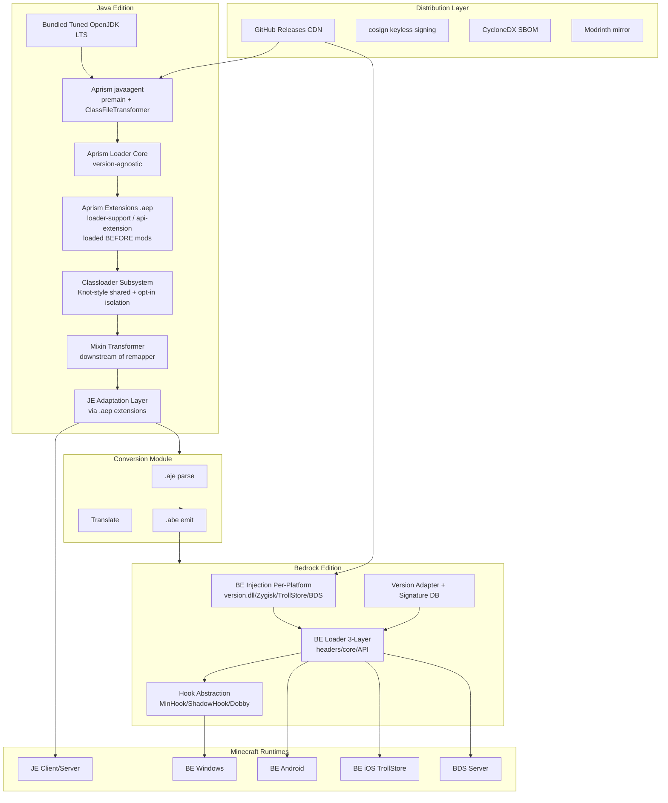
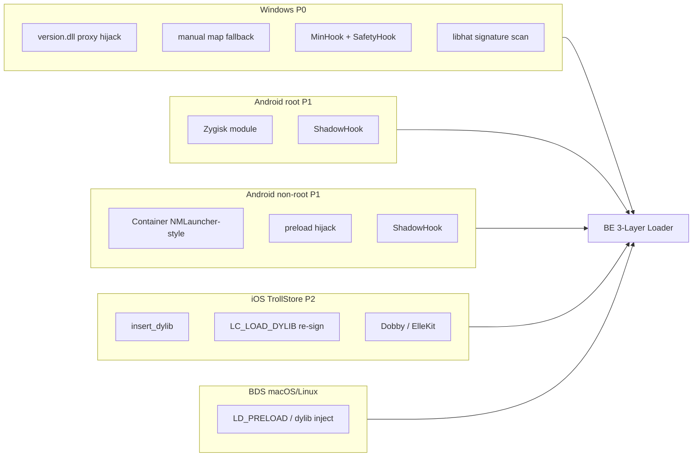
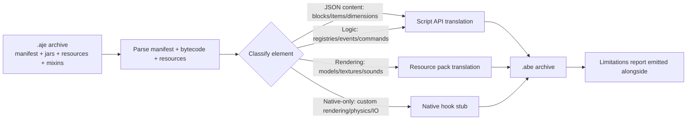
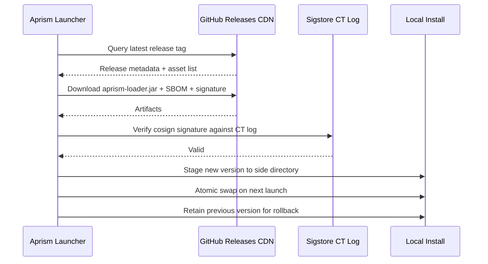

# Aprism Loader 总体架构设计

> 文档 1 / 8 | Aprism Loader 文档集
> 版本：v26.0-Alpha.1 | 状态：开发中
> 作者：BlockConnect@StarsailsClover
> 规范语言：英文（中文副本同步维护）

## 1. 执行摘要

Aprism 是一个统一的、跨版本、跨平台的 Minecraft 模组开发平台，它在单一的开发者面向 API 表面之下横跨 Java Edition（JE）与 Bedrock Edition（BE）。它并非单个 loader，而是一个分层系统：JE 原生基础层构建于 premain javaagent 与 `ClassFileTransformer` 之上，运行在一份打包并调校过的 OpenJDK LTS 构建上；适配层负责消费既有的 Fabric、NeoForge、Forge、Quilt 与 LiteLoader 模组格式；BE 注入与 loader 子系统在 Windows、Android、iOS 与 BDS 上执行各平台特定的原生二进制打补丁；JE-to-BE 转换模块将 JE 模组产物重新定向为 Bedrock 行为包/资源包与原生钩子；分发流水线构建于 GitHub Releases 之上，使用 cosign 无密钥签名与 CycloneDX SBOM。

本设计受四项不可妥协的不变量约束。第一，mod container 暴露的引用标识在系统内所有查找 API 中保持稳定。第二，公共接口契约单调递增：允许新增与弃用，禁止移除与重命名。第三，每一个受支持的 Minecraft 版本都通过一个具有显式 SemVer 范围的兼容性组来寻址；不存在任何"尽力而为"。第四，分发仅限独立桌面下载，因为 Microsoft Store Policy 10.2 与 Apple App Review Guideline 2.4.5(iv) 在法律上禁止在商店分发的应用中进行动态代码注入。

本文档是规范的架构参考。所有其他 Aprism 文档（构建工具、清单 schema、API 参考、BE 内部机制、转换、分发、版本管理与安全）均派生自本文档，且必须与本文档所记录的决策保持一致。

## 2. 设计目标与原则

### 2.1 目标

| 目标 | 陈述 |
|------|-----------|
| 统一接口 | 针对 Aprism API 编写的模组，在语义允许的情况下，无需源码改动即可运行于每一个受支持的 Minecraft 版本与 loader。 |
| 单调版本递增 | 公共 API 表面只增不减。弃用至少允许保留一个 LTS 周期；移除与重命名被禁止。 |
| 跨版本 | JE 与 BE 共享同一清单超集与同一转换流水线，因此单一源产物可同时面向两个版本。 |
| 跨平台 | JE 面向 Windows、macOS 与 Linux 桌面。BE 面向 Windows、Android（root 与非 root）、iOS（TrollStore），以及在 macOS/Linux 上的 BDS。 |
| 强制兼容性 | 兼容性通过兼容性组 SemVer 范围预先声明，并在加载时强制校验。范围未满足的模组将不被加载，而非加载后再出错。 |

### 2.2 原则

- **基底而非重写。** Aprism 构建于调校过的 OpenJDK 之上，而非自定义 JVM。loader 核心与版本无关，并镜像 Fabric Loader 架构，使最大体量的既有模组目录（Fabric、Quilt、LiteLoader）能够原生加载。
- **规范注入。** SpongePowered Mixin 是 JE 唯一的字节码注入机制。系统中仅存在一个 Mixin transformer，插入在 Aprism 自有 remapper 的下游，绝不作为与之竞争的转换 pass 存在。
- **各平台现实主义。** BE 注入被明确承认为版本脆弱的。版本适配器与签名数据库是工程投入的主要方向，而非事后补丁。
- **法律洁净。** Aprism 永不重新分发修改过的 Minecraft jar，永不上架禁止代码注入的应用商店，永不修改 Xbox Live 网络流量。

## 3. 高层架构

JE 路径是一条严格的流水线：打包的 JDK 承载 Aprism javaagent，后者在 loader 核心之上安装一个 `ClassFileTransformer`。loader 核心首先扫描 `aprism-extensions/`，注册 loader-support 扩展，然后持有 classloader、Mixin transformer 与适配层（由扩展提供）。BE 路径与之并行：各平台注入器引导三层 loader，后者在通过平台特定的 hook 后端安装钩子之前，会先查询版本适配器与签名数据库。转换模块桥接两者：它消费打包好的 `.aje` 产物并产出 `.abe` 产物，在语义对齐时委派给 Script API，否则委派给原生钩子。

**Aprism 原生超集**：Aprism JE Native API 是所有其他 JE loader API 的严格超集。Aprism BE Native API 在平台允许的范围内镜像 JE Native。针对 Aprism 原生（`.aje` / `.abe`）编写的模组获得最大能力；loader 专属模组（通过扩展）仅获得该 loader 的能力。

**BE 支持范围**：Aprism BE 自版本 26.x 起支持 Minecraft Bedrock Edition。低于 26.x 的 BE 版本不受支持。

## 4. JE Aprism 原生基础

该基础层是一个 premain javaagent 与 `ClassFileTransformer` 的组合，运行在派生自 Eclipse Temurin 的打包并调校过的 OpenJDK LTS 构建之上。agent JAR 通过 JE 启动命令行的 `-javaagent:aprism-loader.jar` 附加，并在应用 classloader 解析任何 Minecraft 类之前注册其 transformer。这保证了每一个 Minecraft 类都恰好一次、并以确定性顺序经过 Aprism 转换流水线。

### 4.1 为何不采用自定义 JVM 或 GraalVM Native Image

自定义 JVM 能够对 classloading、GC 与 JIT 策略提供最大控制权，但会带来永久性的维护负担，偏离上游安全修复，并破坏与用户各类 JVM 工具（profiler、agent、debugger）的兼容性。对于模组平台而言，成本收益比并不有利。因此 Aprism 追踪上游 OpenJDK LTS，并应用一组经过精选的补丁集（分层编译调优、用于加速温启动的 class data sharing，以及元数据缩减），而非进行 fork。

GraalVM Native Image 保留给可选的、预烘焙的 modpack bundle：一个闭世界的模组集合，预先编译为原生可执行文件，以在低端硬件上实现亚秒级冷启动。这并非默认运行时，因为闭世界分析与动态模组加载、重度依赖反射的模组以及运行时 Mixin 应用互不兼容。原生 bundle 是一个分发目标，而非基础层。

Project Leyden 因其提前进行类链接与方法 profiling 快照的承诺而受到跟踪，这将显著改善启动器温启动。当 Leyden 输出格式在上游 LTS 中稳定后，Aprism 将予以采纳；在此之前，AppCDS 作为温启动的缓解手段使用。

### 4.2 与版本无关的 Loader 核心

loader 核心暴露一个稳定的内部 SPI，不引用任何 Minecraft 版本符号。它镜像 Fabric Loader 的分解方式：一个 `Loader` 持有一组 `ModContainer` 实例，每个实例由一个 `ModClassLoader` 支撑；一个 `Knot` 风格的 classloader 图负责解析类；转换被委派给一个可插拔的、等价于 `IMixinPlatformAgent` 的组件。Minecraft 版本相关的逻辑（映射名、按版本门控的适配器）位于适配层，绝不位于核心之中。

## 5. Classloader 与转换子系统

### 5.1 默认共享类空间

默认的 classloader 策略是 Fabric Knot 风格的共享类空间。所有模组共享单一父 classloader，后者暴露其导出包的并集，而每个模组的子 classloader 对共享类委派给父级，仅隔离其内部包。这最大化了可寻址的模组目录：Fabric、Quilt（通过兼容 shim 加载 Fabric 模组）与 LiteLoader 模组都期望共享空间，并在更严格的隔离下会出错。

### 5.2 可选的隔离 ModClassLoader Shim

Forge 风格的模组需要隔离的 `ModClassLoader`，因为 Forge 模组假定其自身的 classloader 是其类的定义 loader，并依赖 `getClass().getClassLoader()` 返回一个模组专属实例。Aprism 在 `aprism.manifest.json` 中暴露一个可选的 `isolated` 标志。设置后，该模组会被包裹在 `IsolatedModClassLoader` shim 中，既满足 Forge 对 classloader 标识的期望，同时仍将转换路由通过中央流水线进行。

### 5.3 ModContainer 引用标识不变量

任何查找 API（`Loader.getModContainer`、事件 payload、注册表回调、依赖解析）返回的每一个 `ModContainer` 都是同一个对象实例。不存在每个 API 各自的副本。该不变量由单一容器注册表强制保障，并是支撑适配层 provider 无需重新包装即可互操作的关键假设。

### 5.4 Mixin 作为规范注入

SpongePowered Mixin 是唯一的字节码注入机制。Aprism 在其 `ClassFileTransformer` 链中仅注册一个 `MixinTransformer`，位于 Aprism 自有 remapper 的下游。这镜像了 Fabric 与 NeoForge 的集成方式：Mixin 看到的是已经 remap 完成的名称，并基于稳定的 intermediary 进行操作。任何与之竞争的注入框架（自定义 ASM 注入 pass 等）都不被允许进入转换链。AccessWidener 不是注入机制，而是一条独立的访问扩展 pass，在流水线中位于 Mixin **之后**（转换顺序：预注册转换 → Mixin → AccessWidener，见文档 6 §3.4 与 `AprismClassTransformer` 实现）：扩展后的访问标志因此对后续字节码消费者（反射、后续查找）可见；AccessWidener 只改写访问标志、不新增成员或方法体，因此不会与 Mixin 的注入点发生冲突。

### 5.5 Remapping 策略

对于 26.1 之前的 Minecraft 版本，Aprism 消费 Fabric Intermediary 映射，并在加载时应用等价于 TinyRemapper 的 remap，使针对 intermediary 编写的模组在运行时混淆名称上能够正确解析。对于 26.1 及之后版本，Mojang 发布未混淆的 jar，因此 Aprism 以 no-remap 模式运行：remapper 是一个 pass-through，Mixin 直接基于官方名称操作。Refmap（模组 jar 内部携带的、从开发名称到 intermediary 名称的 YAML 映射）在 remapped 模式下被尊重，在 no-remap 模式下被忽略。

## 6. JE 适配层（经由 Aprism Extensions）

Aprism 原生并不理解 Fabric、Forge、NeoForge、Quilt 或 LiteLoader 模组格式。Loader 支持由 Aprism Extensions（`.aep`）提供，它们增强 Aprism 自身，并在任何模组之前加载。每个 `loader-support` 扩展提供一个 loader 运行时，扫描其对应的 `<loader>-mods/` 目录，解析原生清单，构造 `ModContainer` 实例，注册 entrypoint，并将其原生事件/注册模型桥接到 Aprism 事件总线。

| Extension | Loader Key | 原生清单 | Entrypoint 模型 | Mod 文件夹 |
|-----------|-----------|-----------------|------------------|------------|
| Fabric-Support.aep | `Fa` | `fabric.mod.json` v1 | `main`/`client`/`server` entrypoint | `fabric-mods/` |
| NeoForge-Support.aep | `N` | `META-INF/neoforge.mods.toml` | `@Mod` 注解，`IEventBus` | `neoforge-mods/` |
| Forge-Support.aep | `Fo` | `META-INF/mods.toml` | `@Mod` 注解，`@SubscribeEvent` | `forge-mods/` |
| Quilt-Support.aep | `Q` | `quilt.mod.json` | QSL entrypoint | `quilt-mods/` |
| LiteLoader-Support.aep | `L` | `litemod.json` | `init()` 生命周期 | `liteloader-mods/` |

若某个 loader 的 Support 扩展未安装，则对应的 `<loader>-mods/` 文件夹简单地不被扫描。`mods/` 中的 Aprism 原生 `.aje` 模组不需要任何扩展。

### 6.1 Entrypoint 与事件总线适配器

每个 loader-support 扩展暴露一个适配器，将其原生 entrypoint 契约翻译到 Aprism 阶段严格的事件总线上。Fabric 函数式注册适配器将 `Registry.register` 调用与 `RegistryHelper` 回调映射到 Aprism 的 `SETUP` 阶段。Forge 的 `addListener` 适配器将 `IEventBus.addListener` 订阅映射到对应的 Aprism 阶段。两个适配器都由同一个总线实例支撑；不存在每个 loader 一套的总线。

### 6.2 自动发现回退

当一个 loader 专属模组未携带 `aprism.manifest.json` 发布时，扩展的 loader 运行时自动发现其原生清单（`fabric.mod.json`、`quilt.mod.json`、`META-INF/neoforge.mods.toml`、`META-INF/mods.toml` 或 `litemod.json`，完整顺序见文档 2 第 5 节），并合成一个 Aprism 清单。合成过程是有损的：仅填充具有明确 Aprism 对等项的字段。需要 Aprism 专属功能（跨版本转换、兼容性组声明）的模组必须随附显式的 `aprism.manifest.json`，并以 `.aje` 形式打包至 `mods/`。

### 6.3 Aprism 原生超集原则

Aprism JE Native API 是所有其他 JE loader API 的严格超集。Fabric、Forge、NeoForge、Quilt 或 LiteLoader 中可用的每一项能力都有 Aprism 原生对等项或更优项。针对 Aprism 原生（`mods/` 中的 `.aje`）编写的模组获得最大能力。使用 loader 专属 API（通过扩展，`<loader>-mods/` 中的 `.jar`）的模组仅获得该 loader 的能力。要访问完整超集，模组必须为 Aprism 原生编写。

### 6.4 扩展加载

扩展在模组扫描之前的一个专用阶段加载。Aprism 核心扫描 `aprism-extensions/`，将每个扩展的 `aprismRange` 与 `mcVersion` 对照运行环境进行校验，解析扩展依赖，注册能力，然后才开始扫描模组目录。完整的 `.aep` 规范见文档 7 第 12 节。

## 7. BE 注入与 Loader 子系统

Bedrock Edition 是闭源 C++ 二进制，没有官方原生模组 SDK。Script API（`@minecraft/server`）是一个沙箱化的 JavaScript 运行时，无法创建超出 JSON 定义内容之外的自定义方块、物品或维度。因此，原生模组开发是实现与 JE 模组功能对等的唯一路径。Amethyst（一个 Windows 客户端 loader）与 LeviLamina（一个 BDS 服务端 loader）证明了其可行性，但都版本脆弱：函数偏移在每次 Bedrock 更新时都会发生漂移。

### 7.1 各平台注入

| 平台 | 优先级 | 注入向量 | Hook 引擎 | 备注 |
|----------|----------|------------------|-------------|-------|
| Windows | P0 | `version.dll` 代理劫持 + 手动映射回退 | MinHook + SafetyHook | libhat 用于 pattern 扫描；主要开发目标。 |
| Android（root） | P1 | Zygisk 模块 | ShadowHook | 通过 Zygote 进行逐进程注入。 |
| Android（非 root） | P1 | NMLauncher 风格容器 + preload 劫持 | ShadowHook | 不修改系统；隔离容器。 |
| iOS（TrollStore） | P2 研究 | `insert_dylib` + `LC_LOAD_DYLIB` 重签名 | Dobby / ElleKit | 仅限 TrollStore 侧载；无 App Store 路径。 |
| macOS / Linux | N/A（客户端） | 仅 BDS 服务端 | LD_PRELOAD / dylib | 这些平台没有 BE 客户端。 |
| 主机平台 | 不可能 | N/A | N/A | OS 锁定；无注入面。 |

### 7.2 三层 Loader 架构

BE loader 遵循 LeviLamina 的三层模式。

1. **逆向工程头文件层。** 由 `BedrockAnalyzer` 输出驱动的 `header_generator` 工具链自动生成。该层将 C++ 类布局、vtable 索引与函数签名作为可消费的头文件暴露，使 loader 代码与手工维护的偏移解耦。
2. **核心层。** 持有模组注册器、hook 管理器与版本数据库。hook 管理器对平台 hook 引擎进行抽象，是唯一被允许安装 inline 或 vtable hook 的组件。
3. **公共 API 层。** 向模组代码暴露事件、命令与注册表。模组仅面向该层；核心层与头文件层为内部。

源码拆分于 `src/`（共享）、`src-client/`（仅客户端钩子，如渲染）与 `src-server/`（仅 BDS 钩子，如区块序列化）。

### 7.3 版本适配器与签名数据库

版本适配器是 BE 子系统中最为重要的工程投入。Bedrock 更新会以不可预测的方式改变函数偏移与结构布局。Aprism 通过签名数据库解决此问题：函数位置以 libhat pattern 签名（带通配符掩码的字节模式）存储，维护于一个社区版本化仓库中。加载时，适配器针对运行中的二进制解析签名，填充函数指针表，并在任何必需签名无法解析时拒绝加载。模组声明其支持的 Bedrock 版本范围；不匹配时按 fail-closed 处理。

### 7.4 Hook 抽象

hook 管理器向模组呈现统一的 `installHook(target, detour)` API，并分派至平台引擎：Windows 上为 MinHook 或 SafetyHook，Android 上为 ShadowHook，iOS 上为 Dobby 或 ElleKit。模组永不直接调用平台 hook 引擎。

## 8. JE-to-BE 转换模块

转换模块消费打包的 `.aje` 产物并产出 `.abe` 产物。它并非通用翻译器；它是一个具有显式回退语义的尽力而为流水线。

### 8.1 翻译目标

- **Script API 候选：** JSON 定义的内容（方块、物品、维度）、注册表回调、命令注册，以及语义与 `@minecraft/server` 事件匹配的事件处理器。这些翻译为行为包脚本。
- **资源包候选：** 模型、纹理、声音与语言文件。这些翻译为 Bedrock 资源包资产，在 schema 不同时进行格式转换。
- **原生钩子候选：** 自定义渲染、自定义物理、文件系统 I/O，以及 Script API 未暴露的任何能力。转换器产出一个 `native/` 目录桩，其中包含 C++ 骨架，由模组作者完成。转换器不合成原生代码；它产出一个可构建的脚手架与一个 `type: native` 清单条目。

### 8.2 局限性

转换器无法翻译 Mixin。使用 `@Inject` 或 `@Redirect` 改变 Minecraft 内部的 JE 模组没有 Script API 对等项，必须作为 BE 原生模组重新实现。转换器检测 Mixin 使用情况并产出一份局限性报告，列出每一个不可翻译的元素。`.abe` 产物始终会被产出；至于其是否在功能上等价于 `.aje` 源，会被显式报告，绝不作假定。

## 9. 统一 API 表面

### 9.1 IAprismMod 接口

每一个模组 entrypoint 都实现 `IAprismMod`，即单一生命周期接口。桥接原生 entrypoint（Fabric `ModInitializer`、NeoForge `@Mod` 构造函数）的 provider 将原生 entrypoint 包裹在 `IAprismMod` 适配器中，使系统其余部分看到的是统一类型。

### 9.2 阶段严格事件总线

事件总线被划分为严格排序的阶段。为某个阶段注册的处理器仅在该阶段触发，且在某阶段已完成之后的注册将以错误拒绝，而非被静默丢弃。

| 阶段 | 语义 | 典型用途 |
|-------|-----------|-------------|
| PREINIT | 清单已解析，classloader 就绪，未触碰任何 Minecraft 类。 | Mixin 配置注册，早期日志。 |
| INIT | Minecraft 类加载已开始；注册表已开放。 | 注册表订阅，配置加载。 |
| SETUP | 注册表已冻结；内容可新增但不可重定义。 | 模组间布线，能力注册。 |
| COMPLETE | 所有注册最终化。 | 晚期校验，跨模组完整性检查。 |
| CLIENT | 仅客户端上下文激活。 | 渲染、输入、界面注册。 |
| SERVER | 仅服务端上下文激活。 | 专用服务端逻辑，世界生命周期。 |

### 9.3 注册表、配置与单调契约

注册表 API 仅暴露新增操作。配置 schema 以相同的单调规则进行版本化：字段可被新增与弃用，永不移除或重命名。被标记为弃用的字段在至少一个 LTS 周期内保持可用，并在使用时发出警告。该契约由构建时 API 兼容性检查强制保障，该检查将公共表面对照上一发布基线进行比对。

## 10. 构建与打包流水线

### 10.1 Architectury Loom 基础

构建基础是 Architectury Loom，即 Fabric Loom 的多 loader fork。对于 Minecraft 26.1 及之后版本，使用 `loom-no-remap` profile，因为 Mojang 发布未混淆的 jar。对于更早版本，使用标准的 remapping Loom 流水线。

### 10.2 aprism-packaging Gradle 插件

一个自定义的 `aprism-packaging` Gradle 插件产出 `.aje` 与 `.abe` 归档。该插件消费已编译的产物集、清单、Mixin 配置与平台子目录，并按第 12 节定义的格式产出归档。

### 10.3 兼容性组 Jar

模组以兼容性组 jar 形式打包：单个产物声明其支持的 Minecraft 版本 SemVer 范围以及所属的兼容性组。loader 在运行时根据当前运行的 Minecraft 版本选择正确的产物。

### 10.4 拆分 Profile

并行维护两套构建 profile。

| Profile | Minecraft 范围 | Gradle | Java Target |
|---------|-----------------|--------|-------------|
| Legacy | pre-26.1（remapped） | Gradle 8.x | Java 8/11（1.16.5）、Java 17（1.18-1.20.4）、Java 21（1.20.5-1.21.11），按 Mojang 官方基线 |
| Modern | 26.1+（no-remap） | Gradle 9.x | Java 25 |

### 10.5 版本目录

单一的 `gradle/libs.versions.toml` 中央目录钉定构建中所有依赖的版本。插件与依赖版本不被内联声明。

## 11. 分发与更新架构

### 11.1 渠道

分发仅限独立桌面下载。Aprism 不发布至 Microsoft Store 或 Apple App Store，因为商店政策（Microsoft Store Policy 10.2、Apple App Review Guideline 2.4.5(iv)）禁止在商店分发应用中进行动态代码注入。Alpha 版本以 GitHub Pre-Release 发布，小版本正式版（裸版本号）与年度版以 GitHub Release 发布。Modrinth 用作镜像，而非主渠道，因为 Modrinth 托管的是模组产物，而非 loader 本身。

Minecraft 二进制在安装时从 Mojang 授权的来源下载。Aprism 永不重新分发修改过的 Minecraft jar。

### 11.2 完整性

每一个发布产物都使用 cosign 无密钥签名（OIDC 绑定、证书透明性日志记录）签名，并附带一份 CycloneDX SBOM。校验在安装时与每次更新时执行。

### 11.3 更新流程

更新是原子的：新版本被暂存于既有安装旁，在下一次启动时切换，旧版本保留一个周期以支持回滚。签名校验失败会在任何文件系统变更之前中止更新。

## 12. 版本管理与兼容性契约

### 12.1 版本方案

Aprism 版本遵循 `v<Year>.<minor>[-Alpha.<n>][-<MCEdit>-<MCVer>]`。一个大版本线对应一个自然年：`v26` 即 2026 年线，包含十个小版本 `v26.0`、`v26.1` … `v26.9`（年度首个构建为 `v26.0-Alpha.1`，年度最后一个小版本为 `v26.9`）。每个小版本内依次发布 `Alpha.1` 至 `Alpha.9`，作为 GitHub Pre-Release 发布；正常迭代节奏为每两周一个 Alpha。小版本正式版为裸版本号（例如 `v26.2`，不带任何稳定性后缀），作为 GitHub Release 发布；每个小版本的最后一个 Alpha（Alpha.9）即其发布候选，不使用 "Alpha 10" 这一称呼。年度版采用 `v<Year>.<完整年份>` 形式，例如 `v26.2026`，是 `v26.9` 的最后改进版，于每年 12 月作为 GitHub Release 发布。不计划开设 Beta。2027 年 5 月为当前全部已承诺交付物的预计交付日期。Phase（0-9）为内部开发阶段追踪器，不对公显示，仅记录于 FACT.md 会话日志。示例产物：`Aprism-v26.0-Alpha.1-JE-1.21.4`（开发）、`Aprism-v26.2-JE-26.2`（小版本正式版）。

### 12.2 JDK Target

| Minecraft 范围 | JDK Target |
|-----------------|------------|
| 1.16.5 | Java 8/11 |
| 1.17 - 1.19.x | Java 16/17（按 Mojang 官方基线） |
| 1.20 - 1.20.4 | Java 17 |
| 1.20.5 - 1.21.11 | Java 21 |
| 26.x | Java 25 |

### 12.3 单调接口契约

公共接口契约是单调的。新增任何时候都被允许。弃用被允许且必须携带移除周期目标，但被弃用的表面在至少一个 LTS 周期内保持可用。移除与重命名被禁止；被重命名的 API 是与旧 API 共存的新 API。该契约由构建时兼容性检查强制保障，该检查将公共表面与上一基线进行 diff，对任何非新增性变更使构建失败。

### 12.4 兼容性组

兼容性组是一组共享公共映射与适配器表面的 Minecraft 版本集合。模组通过 SemVer 范围声明其面向的组。loader 将运行中的版本与声明的范围进行解析，对范围不包含当前运行版本的模组拒绝加载。

## 13. 安全考量

### 13.1 供应链

每一个发布产物都使用 cosign 无密钥签名，并附带一份 CycloneDX SBOM。依赖来源在构建时校验。版本目录在上游 registry 支持时将每个依赖钉定为 digest-pinned 坐标。从不可信来源加载的模组默认被沙箱化：文件系统与网络访问需要显式清单声明与安装时用户同意。

### 13.2 Bedrock 封禁风险披露

触及网络流量的 BE 客户端模组带有真实的 Xbox Live 执法风险。Microsoft 可能对影响在线对战的客户端修改发出账号或设备封禁。Aprism 在安装时披露该风险，并将 BE 客户端模组默认为仅离线运行。影响网络的钩子需要按模组进行显式用户选择启用。BDS 服务端模组不带有 Xbox Live 风险，因为 BDS 是服务端产品；这是最安全的 BE 目标，也是 BE 模组作者推荐的起点。

### 13.3 沙箱论证

Aprism 沙箱基于能力：模组的清单声明其所需的能力（文件系统路径、网络端点、原生钩子、跨模组反射）。loader 恰好授予所声明的能力，并拒绝其余一切。沙箱并非针对持有原生钩子的恶意模组的安全边界；原生钩子按定义即为逃逸。沙箱是针对意外越权的防御，也是一种披露机制：模组的能力在安装前对用户可见。

## 14. 风险登记表

| 风险 | 可能性 | 影响 | 缓解 |
|------|-----------|--------|------------|
| Bedrock 更新改变偏移，破坏所有 BE 模组。 | 高 | 高 | 社区维护 pattern 的签名数据库；版本适配器 fail-closed；快速签名更新流水线。 |
| Microsoft Store / App Store 政策对相关工具进行执法。 | 低 | 高 | 仅独立桌面分发；无商店存在；分发渠道法律审查。 |
| Xbox Live 对 BE 客户端模组用户执法。 | 中 | 高 | BE 客户端模组默认离线；网络钩子显式选择启用；显著披露。 |
| Mixin transformer 与 provider 专属转换冲突。 | 低 | 中 | 单一 Mixin transformer，位于 remapper 下游；无竞争性注入框架。 |
| Quilt QSL 弃用（2025 年 12 月）使 Quilt 专属模组失去支持。 | 中 | 低 | Quilt provider 通过兼容 shim 加载 Fabric 模组；Quilt 专属表面按尽力而为处理。 |
| GraalVM 原生 bundle 维护负担。 | 低 | 低 | 保留给可选预烘焙 modpack bundle；非默认运行时；需要闭世界范围。 |
| Project Leyden 格式在 LTS 稳定前发生变动。 | 中 | 低 | AppCDS 作为临时温启动缓解手段使用；Leyden 采纳推迟至 LTS 稳定。 |
| LiteLoader 遗留模组使用废弃的 1.12.2 专属 API。 | 低 | 低 | 只读兼容；无前向移植。 |
| JE-to-BE 转换器产出功能不完整的 `.abe` 产物。 | 高 | 中 | 每次转换伴随局限性报告；为不可翻译功能提供原生脚手架；绝不假定等价。 |
| 捆绑依赖的供应链入侵。 | 低 | 高 | cosign 无密钥签名；CycloneDX SBOM；digest-pinned 依赖；能力沙箱。 |

## 15. 参考

- Fabric Loader、Knot classloader、TinyRemapper、Intermediary 映射。`fabric.mod.json` schema v1，含 entrypoints、mixins、depends、accessWidener。
- SpongePowered Mixin：`*.mixins.json` 配置，`@Mixin` / `@Inject` / `@Redirect` / `@ModifyArg`，`MixinTransformer` 位于 remapping 下游。
- NeoForge：`META-INF/neoforge.mods.toml`，`@Mod` 注解，`IEventBus`，`ModClassLoader` 隔离。2023 年 7 月从 Forge 分叉。
- Minecraft Forge：`META-INF/mods.toml`，`@Mod`，`@SubscribeEvent`，隔离 classloader 模型。
- Quilt Loader：`quilt.mod.json`，QSL 于 2025 年 12 月停止维护，Fabric 兼容 shim，`ModContainer` 标识修复于 0.29.2。
- LiteLoader：`.litemod` 格式，`litemod.json`，仅限 1.12.2，2017 年废弃。
- MultiLoader-Template：common / fabric / neoforge 源集，通过 `ServiceLoader` 提供 `IPlatformHelper`。Neo-Loom fork（moritz-htk）从单一 Loom 流水线构建 Fabric 与 NeoForge。
- Architectury Loom；用于未混淆 26.1+ jar 的 `loom-no-remap` profile。
- Bedrock Edition：C++ 二进制，闭源，Script API（`@minecraft/server`）沙箱化 JavaScript。
- Amethyst：Bedrock 客户端 C++ loader，Windows。
- LeviLamina：Bedrock 服务端 C++ loader，BDS；三层架构模式。
- libhat：原生二进制的签名与 pattern 扫描库。
- MinHook、SafetyHook：Windows inline hook 引擎。
- ShadowHook：Zygisk 模块使用的 Android inline hook 引擎。
- Dobby、ElleKit：iOS inline hook 引擎。
- `insert_dylib`、`LC_LOAD_DYLIB` 重签名：iOS Mach-O 加载命令注入。
- Zygisk：Magisk 模块格式，用于通过 Zygote 进行逐进程 Android 注入。
- cosign、Sigstore：基于 OIDC 与证书透明性的无密钥代码签名。
- CycloneDX：软件物料清单标准。
- Microsoft Store Policy 10.2；Apple App Review Guideline 2.4.5(iv)：禁止在商店分发应用中进行动态代码注入。
- Project Leyden：OpenJDK 提前类链接与方法 profiling 项目。
- Eclipse Temurin：用作 Aprism 捆绑 JDK 基础的 OpenJDK LTS 发行版。
- Gradle `libs.versions.toml`：中央版本目录。

## 版本线（v26.1-Alpha.7）

Aprism 通过 `VersionLineRegistry` 支持 **1.20 .. 26.2** 的 JE 版本线。每个版本解析为一个 `VersionLineEntry`，描述其混淆配置（26.1 之前为 REMAPPED，26.1 及以后为 NO_REMAP）、Java 基线（17 / 21 / 25）与映射来源（Intermediary / 无）。低于 1.20 的版本在支持线之外；高于 26.2 的版本遵循未混淆线，但会被报告为超出显式窗口。

## 底层 API（v26.1-Alpha.8）

Aprism 在 `com.aprism.loader.lowlevel` 中暴露一个底层能力层（目标 #2，与 MCJEBooster 层对齐）：

- **ClassRedefiner** —— 基于 `java.lang.instrument.Instrumentation` 的运行时类重定义与重转换，用于在 JVM 启动后重塑已加载的类（例如服务端 tick 循环）。
- **MethodHookRegistry** —— 按 类/方法/描述符 键控的编程式方法钩子，由注入的字节码触发。
- **MethodHookTransformer** —— 在被钩住方法入口处注入分发调用的 ASM 处理；作为类转换器的第四道处理（位于注册转换、Mixin、access widener 之后）。

钩子为方法进入式，空闲时代价极低（未注册钩子时直通）。抛出异常的钩子会被记录并吞掉，故障钩子永远不会使宿主游戏崩溃。

## 更强的 AEP 能力（v26.1-Alpha.9）

Aprism Extension（.aep）模型获得三项生产能力（目标 #3），使扩展层满足 AprismRefract 的 loader-support 需求：

- **优先级排序** —— `aprism.extension.json` 接受可选的 `priority` 整数（缺省为 0）。扩展按优先级降序初始化，因此基础扩展（例如其他扩展所依赖的 loader-support 桥接）可以声明自己必须先行。
- **依赖校验** —— 扩展的 `depends` 映射在实例化前针对完整的已发现集合进行校验。可用集合包含每个扩展 id 与每个已声明的 `provides` 能力，因此扩展既可以依赖具体扩展，也可以依赖抽象能力。未满足的依赖只隔离该扩展（记录日志并写入加载报告）；启动继续进行。
- **生命周期钩子** —— `IAprismExtension` 声明两个新的默认空实现方法：`onPostInitialize`（在全部扩展完成 `onInitialize` 后运行一次，用于跨扩展接线）与 `onShutdown`（在运行时关闭时运行，用于释放原生或操作系统资源）。shutdown 钩子在运行时空置共享对象之前运行，因此交给 `onShutdown` 的上下文仍暴露可用的事件总线与注册表。抛出异常的钩子只隔离该扩展。

接口契约说明：两个钩子均为增量式 `default` 方法；既有扩展无需修改即可编译运行。

## 结构化日志（v26.2-Alpha.1）

Aprism 在 `com.aprism.loader.logging` 中提供结构化日志设施（目标 #6），叠加在既有的按单元日志器之上：

- **AprismLogging** —— 中央设施。持有接收器分发、级别阈值（缺省 INFO）与保留环形缓冲。故障安全：抛出异常的接收器会被隔离，永远不会传播到日志调用点。
- **AprismLogger** —— 廉价的按单元日志器（模组 id、扩展 id 或运行时组件），从设施获取；提供 TRACE/DEBUG/INFO/WARN/ERROR 便捷方法与带级别+异常对象的日志方法。
- **AprismLogRecord** —— 不可变记录（时钟、级别、单元、消息、可选异常对象），渲染为 `[ISO-8601] LEVEL unit - message`。
- **AprismLogRingBuffer** —— 有界内存保留（缺省 5000 条），始终挂载；支撑崩溃报告与加载报告。
- **ConsoleSink** —— TRACE..INFO 输出到 stdout，WARN/ERROR 输出到 stderr。
- **FileSink** —— 在已知游戏根目录后（于 `performLoad` 中挂载）将渲染后的记录追加写入 `<game-root>/aprism-logs/aprism.log`；写入失败会被吞掉。

运行时接线：设施在 `initialize()` 中创建（控制台接收器），文件接收器在 `performLoad()` 中挂载，`shutdown()` 时刷新并关闭设施。访问器：`AprismRuntime.getLogging()` 与 `AprismRuntime.getLogger(unit)`。

## 原生模组列表（v26.2-Alpha.2）

Aprism 在 `com.aprism.loader.modmenu` 中提供可在运行时查询的原生模组列表（目标 #7 第一部分），作为未来游戏内模组菜单（对标 Fabric Mod Menu / NeoForge 原生模组菜单）的注册表：

- **ModListEntry** —— 按单元的不可变快照：id、版本、显示名、描述、种类（`mod`/`extension`）、loader key、来源归档名、依赖声明与生命周期状态。
- **ModListState** —— DISCOVERED / LOADED / FAILED / DISABLED。
- **ModListRegistry** —— 每次加载都从头重建；提供按 id 排序的 `getAll` / `getMods` / `getExtensions` / `getFailed`。

运行时接线：`performLoad()` 在加载后调用 `rebuildModList()`，从每个已加载的模组与扩展容器填充 LOADED 条目，并从加载报告的失败记录填充 FAILED 条目（`loadReport` 按需创建，使直接调用 `performLoad` 的一方也能看到失败）。访问器：`AprismRuntime.getModList()`。`shutdown()` 时清空。

## 模组设置（v26.2-Alpha.3）

Aprism 提供类型化的按模组设置系统（目标 #7 第二部分）：

- **清单 schema** —— 模组在 `aprism.manifest.json` 的 `custom.aprism.settings` 下声明设置。每条声明携带 `type`（string / integer / double / boolean / enum）、`default`、`label`，枚举类型另带 `options`。
- **SettingType / SettingDeclaration / SettingsDeclarationReader**（aprism-manifest）—— 防御式解析声明：未知类型降级为 STRING，畸形条目被跳过，因此损坏的设置块永远不会破坏模组加载。
- **ModSettings**（aprism-loader-core）—— 按模组的存储，以声明的默认值为种子；`get/set` 带类型化访问器（`getString`、`getLong`、`getDouble`、`getBoolean`）；`set` 按声明类型与枚举选项集校验，违规时以清晰错误拒绝。
- **SettingsRegistry** —— 中央注册表，在 `performLoad` 期间从每个已加载模组的清单填充。用户值按模组持久化为 `<game-root>/config/aprism-settings/<modid>.json`。持久化故障安全：损坏的文件与非法值回退到声明的默认值，不会中止启动。脏存储在 `shutdown()` 与显式 `persist()` 调用时刷盘。

访问器：`AprismRuntime.getSettings()`。

## Loader 支持剥离完成（v26.2-Alpha.5）

目标 #4 关闭。过渡性的内置外部 loader 桥接（`FabricEntrypointBridge`、`ForgeEntrypointBridge`、`NeoForgeEntrypointBridge`、`LiteLoaderEntrypointBridge`、Forge/NeoForge 事件总线）、内置 loader-support 扩展（`com.aprism.ext.*`）以及外部 loader shim 类型（`net.fabricmc.api.*`、`net.neoforged.*`、`net.minecraftforge.*`、`com.mumfrey.*`）已从 aprism-loader-core 与生产产物中移除。

核心现在只保留：loader-key 常量、`LoaderEntrypointHandler` 契约、`LoaderEntrypointRegistry` 与 Aprism 原生分发。外部模组仍由未改动的 `ModDiscoverer` 发现，但其入口点分发由 SPI 独占：来自对应 AprismRefract 分支（`fabric` / `forge` / `neoforge` / `quilt` / `liteloader`）的 loader-support 扩展为其 loader key 注册处理器。没有注册处理器的外部模组会被发现但永不分发 —— 核心绝不猜测外部约定。

验证：五个跨仓库 E2E 测试（`Refract*AepE2ETest`）将各分支构建的 `.aep` 归档在真实运行时上运行，全部通过。

## 崩溃报告加固（v26.2-Alpha.6）

Agent 的尽力崩溃报告（`<gameRoot>/aprism-crashes/`）在原始堆栈之外得到增强，使启动失败可操作：

- **原因（Cause）** —— 故障的完整堆栈跟踪。
- **近期日志（Recent log）** —— 结构化日志环形缓冲（目标 #6）的最近 50 条记录，渲染为 `[ISO-8601] LEVEL unit - message`。
- **模组列表（Mod list）** —— 模组列表快照（目标 #7），含每个单元的状态、种类、id、版本与 loader key。

为使日志尾部可操作，运行时将关键生命周期事件（initialize、performLoad 开始/完成）镜像到结构化设施。所有报告读取均为防御式：崩溃时运行时可能仅部分初始化，且报告写入器自身绝不抛出。

## 游戏事件分发（v26.3-Alpha.1）

QA0 缺口 #1（无游戏事件分发）由 `com.aprism.api.gameevent` + `com.aprism.loader.gameevent` 中的游戏事件基础解决：

- **类型化游戏事件** 扩展密封的 `AprismEvent.GameEvent` 扩展点：`GameTickEvent`（START/END 阶段；START 可取消）、`ClientRenderEvent`（部分 tick + 帧计数，可取消）、`WorldLoadEvent` / `WorldUnloadEvent`（世界 id）。
- **GameEventDispatcher** —— 原生注入器所触发的运行时侧接缝。将钩子调用翻译为投递到共享 `AprismEventBus` 的类型化事件；持有 tick/帧计数器；故障安全（抛出异常的监听器永远不会传播到游戏循环）。默认未附着：附着前触发的事件会被丢弃，使早期启动的钩子不会到达半初始化的监听器。
- **运行时接线** —— `AprismRuntime.getGameEventDispatcher()`；关闭时重置并置空。

实际的游戏内钩子（tick/渲染/世界切换）由平台代码经底层方法钩子 API（v26.1-Alpha.8，目标 #2）安装；本 Alpha 交付它们所触发的分发基础。
