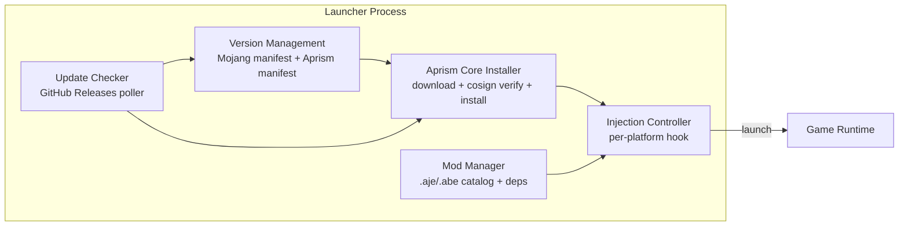
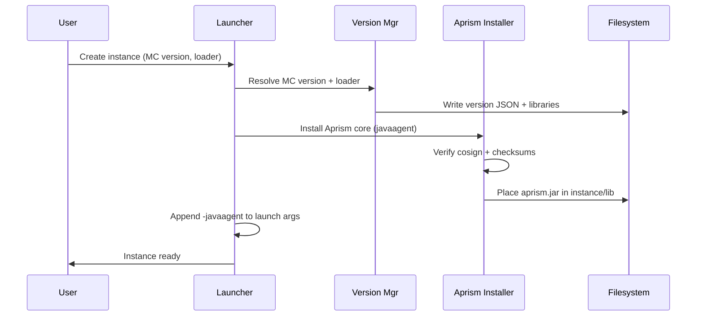
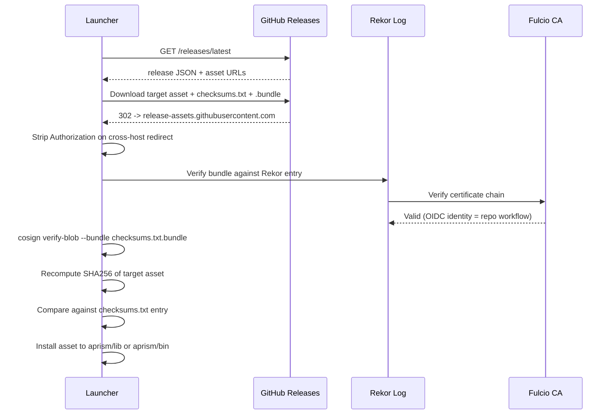
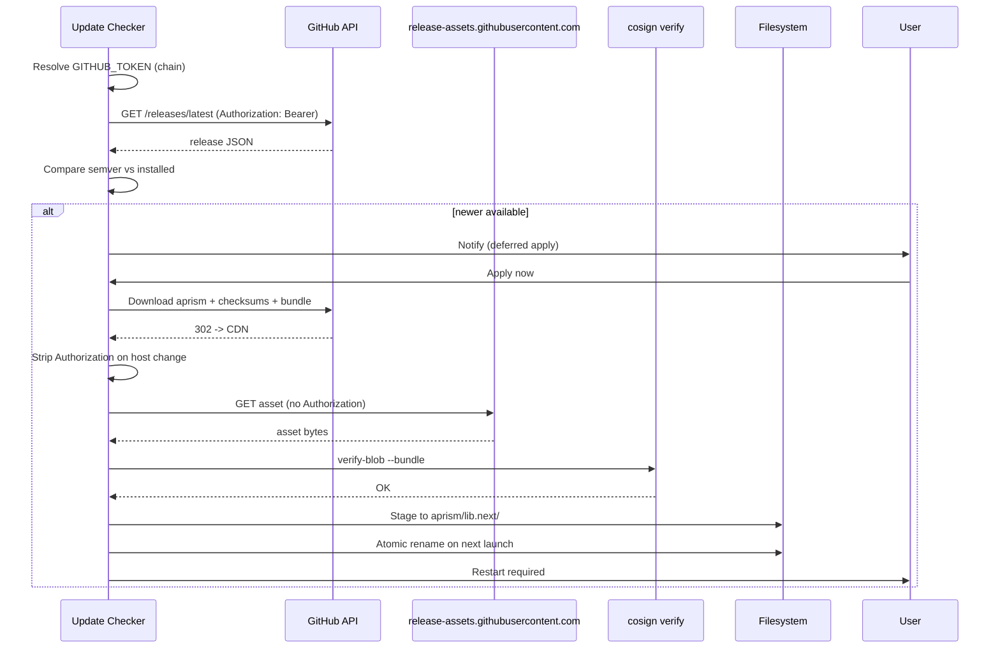

# Minecraft JE/BE 启动器 Aprism 适配、下载安装与管理模块开发指南

> 文档 3 / 8 | Aprism Loader 文档集
> 版本：v26.0-Alpha.1 | 状态：开发中
> 作者：BlockConnect@StarsailsClover
> 规范语言：英文（中文副本同步维护）

## 1. 执行摘要

本指南规定了 Aprism Loader 与第三方或第一方 Minecraft 启动器之间的集成面。它涵盖每一个合规启动器都必须实现的四项生命周期关注点：（1）从 GitHub Releases 发现并下载 Aprism 核心制品，并进行 cosign 验证；（2）将 loader 按平台安装到 Java Edition（JE）与 Bedrock Edition（BE）的客户端/服务端运行时中；（3）Aprism mod（`.aje` / `.abe`）的下载、依赖解析与管理；（4）在用户机器上对 Aprism 核心进行自更新。

分发仅限于独立桌面下载。Aprism 制品绝不发布到 Microsoft Store、Apple App Store 或 Realms 渠道。JE Minecraft jar 始终从 Mojang 授权的源获取；Aprism 绝不分发修改过的 Mojang jar。BE 注入技术因平台而异，记录于第 4 节。所有 GitHub Releases 制品均使用 cosign 无密钥签名（Fulcio 签发的 X.509 证书、Rekor 透明日志条目）进行签名，启动器必须在调用任何 Aprism 二进制之前验证签名。

目标读者是将 Aprism 集成到既有或新启动器产品的启动器开发者（C++/Qt、C#/.NET、Kotlin、Swift、Go）。JE 侧存在针对 Prism Launcher、MultiMC、ATLauncher 以及官方启动器适配层的参考实现；Android 上存在 NMLauncher 模式的容器启动器参考实现；iOS 上存在基于 TrollStore 的工作流参考实现。

## 2. 启动器集成概览

一个合规的 Aprism 启动器由五个逻辑组件构成。它们可以是进程内模块，也可以是通过本地 IPC 通道通信的独立进程，但职责是固定的。



| 组件 | 职责 | 持久化 |
| --- | --- | --- |
| 版本管理 | 获取并缓存 JE `version_manifest_v2.json`、BE BDS 下载索引、Aprism 清单 | `versions/` 缓存，TTL 30 分钟 |
| Aprism 核心安装器 | 下载制品、验证 cosign + 校验和、按平台安装 | `aprism/lib/`、`aprism/bin/` |
| Mod 管理器 | 从 Modrinth/CurseForge/GitHub/本地发现 mod、解析依赖、写入 mod 列表 | `mods/`、`behavior_packs/` |
| 注入控制器 | 应用平台特定钩子（javaagent、proxy DLL、Zygisk、insert_dylib、直接链接） | 每实例状态 |
| 更新检查器 | 轮询 GitHub Releases `/latest`、比较 semver、调度更新窗口 | `aprism/state/updates.json` |

各组件通过一个共享的 `AprismContext` 对象通信，该对象持有已解析的路径、活动的 Java 运行时、已解析的 GitHub token 以及用户的更新渠道偏好。注入控制器是唯一被允许修改游戏启动参数的组件。

## 3. JE 启动器集成

### 3.1 创建带 Aprism 的实例

JE 启动器实例是一个自包含的游戏配置，拥有自己的版本 JSON、库、mod 和运行时参数。Aprism 以 Java agent 形式在 JVM 启动时附加集成。启动器将以下内容追加到 JVM 参数列表：

```
-javaagent:${aprism_home}/lib/aprism.jar=${aprism_args}
```

当 Fabric 或 NeoForge 存在时，Aprism 必须作为协作 agent 而非 mixin 参与者加载，以避免重复转换冲突。推荐顺序是：loader 链（Fabric Loader 或 NeoForge userdev）在前，Aprism agent 在后。Aprism 通过 `fabric.mod.json` / `neoforge.mods.toml` 元数据检测 loader，并对由共存 loader 拥有的类延迟 mixin 应用。

实例创建流程：



### 3.2 版本清单获取与缓存

JE 版本元数据从 `https://piston-meta.mojang.com/mc/game/version_manifest_v2.json` 获取。启动器将该文件缓存到 `versions/manifest_v2.json`，附带 ETag 与 30 分钟 TTL。`versions` 数组中的每一项指向一个按版本的 JSON 文档，包含 `libraries`、`downloads.client.url`、`assetIndex` 与 `arguments.game`。启动器不得发明或重写版本 JSON；它们须原样消费 Mojang 发布的文档。

对于离线启动，直接使用已缓存的清单和已下载的版本 JSON。如果清单过期超过 7 天，启动器警告用户，并在所有必需制品已存在于磁盘上的情况下继续运行。

### 3.3 Java 运行时检测与推荐

JE 版本按 Mojang 官方配置映射到所需的 Java 运行时。启动器维护一张表，将每个主要 Minecraft 版本映射到其要求的 Java 主版本（依据 Mojang 官方基线：1.16.5 及更早 = Java 8；1.17 - 1.17.1 = Java 16；1.18 - 1.20.4 = Java 17；1.20.5 起 = Java 21；26.1 起 = Java 25）：

| MC 版本范围 | Java 主版本 | 备注 |
| --- | --- | --- |
| 1.0 - 1.16.5 | 8 | Aprism 仅支持 1.16.5（优先目标） |
| 1.17 - 1.17.1 | 16 | 过渡版本，Aprism 不作优先目标 |
| 1.18 - 1.20.4 | 17 | 按 Fabric 覆盖线跟进 |
| 1.20.5 - 1.21.11 | 21 | 优先目标含 1.21.4、1.21.10 |
| 26.1+ | 25 | Aprism Modern（no-remap），优先目标含 26.1.2、26.2 |

Aprism 的运行基线分为两层。**启动器进程**要求 Java 21 及以上。**注入的 agent** 按构建 profile 分基线：Modern 制品（26.1+）以 `--release 21` 字节码构建并对 Java 25 前向兼容；Legacy 制品（1.16.5-1.21.11）以 `--release 8` 字节码构建，可运行于该 profile 各版本所要求的 Java 8/11/16/17/21 之上。每个发布版本的 agent 因此以两个基线制品分发（`aprism-<version>-agent-modern.jar` / `aprism-<version>-agent-legacy.jar`），启动器按所选实例的 Minecraft 版本选择对应制品。模组清单中的 `java` 字段声明的是该模组自身对游戏 JVM 的要求；Aprism 在加载时将其与运行中的 JDK 求交集（文档 7 校验阶段 7），因此声明 `>=8` 的 Legacy 模组不会被 Java 21 基线一刀切地排除。如果在用户的 PATH 或已配置的运行时列表中未检测到匹配的运行时，启动器应提议安装 Mojang 提供的 Java 运行时（来自版本 JSON 中的 `javaRuntimeManifest`）。

### 3.4 Mod 目录管理

Aprism 按 loader 划分模组。每个 loader 在实例根目录下拥有自己的目录。Aprism 原生 mod（`.aje`）放入 `mods/`；loader 专属 mod 放入 `<loader>-mods/`，并要求在 `aprism-extensions/` 中安装对应的 Aprism Extension（`.aep`）。

```
.minecraft/
  aprism-extensions/
    Fabric-Support-A[26.0,27.0)-Fa[0.16,0.17)-JE-1.21.4.aep
    NeoForge-Support-A[26.0,27.0)-N[21.4,21.5)-JE-1.21.4.aep
  mods/
    example-aprism-mod.aje
    another-native-mod.aje
  fabric-mods/
    fabric-api.jar
    jei.jar
  neoforge-mods/
    jei-neoforge.jar
```

Aprism agent 先扫描 `aprism-extensions/`（阶段 1），注册 loader-support 扩展，然后扫描 `mods/` 中的 `.aje` 文件（阶段 2a）以及每个已注册的 `<loader>-mods/` 文件夹中的 loader 专属 mod（阶段 2b）。若某个 loader 的 Support 扩展未安装，则对应的 `<loader>-mods/` 文件夹简单地不被扫描。

默认禁用嵌套目录扫描，以避免拾取某些启动器用作暂存区的 `<disabled>/` 存放目录。启动器提供一个显式的"Aprism mod 文件夹"视图，列出 `mods/` 中的 `.aje` 文件，以及各自 `<loader>-mods/` 文件夹中共存的 `.jar` / `.litemod` mod。启动器不得将 `<loader>-mods/` 展平到 `mods/` 中；这样做是不符合规范的。

### 3.5 既有启动器的适配器模式

| 启动器 | 适配器模式 | 钩子点 |
| --- | --- | --- |
| Prism Launcher | `InstanceLaunchTask` 修改、自定义组件 `net.aprism:aprism` | `LaunchStep::makeJavaLaunchCommand` 追加 `-javaagent` |
| MultiMC | 组件系统（类似 `net.fabricmc:fabric-loader`） | `OneSixProfileStrategy::createProfile` |
| ATLauncher | `InstanceSettings#launchArgs` 后处理器 | `Instance#launch` 参数注入 |
| 官方启动器 | 进程外包装脚本（`aprism-launch.bat`/`.sh`） | 在调用 `MinecraftLauncher.exe` 前设置 `JVM_ARGS` 环境变量 |

Prism Launcher 是参考实现目标，因为它已经附带一个开源的 GitHub Releases 自更新器（PrismExternalUpdater/GitHubRelease.cpp），Aprism 更新检查器可以镜像该实现。

## 4. BE 启动器集成 - 按平台

BE 注入是平台特定的，与 JE 存在根本性差异。这里没有 Java agent；loader 是一个原生共享库，通过 OS 特定的钩子机制加载到游戏进程中。

### 4.1 Windows（优先级 P0）

BE Windows 客户端是一个 UWP 应用，安装在 `C:\Program Files\WindowsApps\Microsoft.MinecraftUWP_*\` 下。用户可写的数据目录是 `%LocalAppData%\Packages\Microsoft.MinecraftUWP_*\LocalState\games\com.mojang\`。由于 ACL 限制，启动器无法直接写入 `WindowsApps`。

主要的注入技术是 proxy DLL 劫持。Aprism 启动器将一个 `version.dll`（重命名后的 Aprism loader）放置在 `Minecraft.Windows.exe` 旁边。Windows loader 在检查 System32 之前先从可执行文件目录解析 `version.dll`，从而允许 proxy 通过 `GetProcAddress` 将合法调用转发到真正的 `version.dll`，同时通过 `DllMain`（或一个延迟初始化例程）加载 Aprism 核心。钩子使用 MinHook 执行；libhat 提供类型擦除的函数指针存储，用于转发表。

当 proxy DLL 被杀毒软件或 Microsoft Defender Application Control（WDAC）阻断时，ExLoader 或手动映射作为兜底方案。该兜底需要提权权限，且仅在用户显式选择时启用。

UWP 沙箱注意事项：

- 启动器以标准用户进程运行。要将 `version.dll` 写入包安装文件夹，它必须通过 `takeown` + `icacls` 获取所有权，这需要管理员权限。
- 一种替代方案是通过侧载的辅助程序安装到包的 local state，但这要求应用按路径加载该 DLL，而应用对 `version.dll` 并不会这样做。因此受支持的路径是提权安装到 `WindowsApps`。
- proxy DLL 的 AV 白名单指引见第 11 节。

### 4.2 Android Root（优先级 P1）

已 root 的 Android 设备使用以 Magisk 模块 zip 分发的 Zygisk 模块。该模块的 `service.sh` 或 `post-fs-data.sh` 启动 Zygisk companion，后者在 `Application.onCreate` 运行之前注入到由 `zygote` 派生的 `com.mojang.minecraftpe` 进程中。ShadowHook 用于原生内联钩子；libhat 提供间接层。

Magisk 模块结构：

```
aprism-zygisk/
  module.prop          # id=aprism, name, version, author
  zygisk/
    arm64-v8a.so       # Aprism loader for arm64
    armeabi-v7a.so     # Aprism loader for armv7
  service.sh           # start Zygisk companion
  post-fs-data.sh      # mount .abe mods directory
```

该模块从 `/data/adb/aprism/config.json` 读取其配置，将其管理的 `.abe` mod 暂存于 `/data/adb/aprism/staging/`，再通过 bind mount 挂载到规范目录 `/sdcard/games/com.mojang/aprism_mods/`（Aprism BE loader 唯一扫描的模组目录，跨平台一致，见文档 7 §7）。到 `/sdcard/games/com.mojang/behavior_packs/` 的符号链接允许世界作用域的包被解析。

### 4.3 Android 非 Root（优先级 P1）

非 root Android 使用容器启动器模式，遵循 NMLauncher 参考架构。宿主启动器将官方 Minecraft APK 与注入到 `lib/armeabi-v7a/` 和 `lib/arm64-v8a/` 中的 Aprism `.so` 一起重新打包，然后将修补后的 APK 安装到一个沙箱化配置中。


宿主应用通过在重新打包的 `AndroidManifest.xml` 中替换 `android:name` 属性来控制 `Application.onCreate`。Aprism `.so` 作为 `lib/<abi>/libaprism.so` 条目被添加，并通过一个构造函数在原生 Minecraft 库之前被加载。由于修补后的 APK 必须使用调试密钥或用户选择的密钥签名，启动器无法保留原始 Mojang 签名；这一点会在安装前向用户说明。

### 4.4 iOS（优先级 P2）

iOS 注入使用 TrollStore 安装一个带有任意 entitlements 的永久签名 IPA。工作流如下：

1. 获取原始 Minecraft IPA（用户提供；Aprism 绝不分发）。
2. 使用 `insert_dylib` 添加一个 `LC_LOAD_DYLIB` 加载命令，指向 `@executable_path/Frameworks/Aprism.dylib`。
3. 将 `Aprism.dylib` 放入 IPA 的 `Frameworks/` 目录。
4. 使用开发者身份或 TrollStore 允许的身份对 IPA 重新签名。
5. 通过 TrollStore 安装。

由于 TrollStore 安装是按 IPA 进行的，每一次来自 Mojang 的 BE 更新都需要重新运行注入工作流。启动器维护一条"上次注入的 BE 版本"记录，并在通过 App Store 或 TrollStore 更新 API 检测到更新时提示用户重新注入。

### 4.5 BE BDS 服务端（优先级 P0）

Bedrock Dedicated Server（Windows 上的 `bedrock_server.exe`、Linux 上的 `bedrock_server`）无需注入。Aprism loader 被直接链接进一个包装可执行文件，该文件导出服务端二进制所期望的相同符号。启动器将用户的 `bedrock_server` 调用替换为 `aprism-bds-launcher`，后者 `dlopen` 原始二进制并转发其入口点。

`server.properties` 集成：启动器将 Aprism 特定的键写入 `server.properties`，置于 `aprism.` 命名空间下（例如 `aprism.mod-directory=./games/com.mojang/aprism_mods`）。默认值即规范目录；Aprism BDS loader 在启动时读取这些键。

### 4.6 平台注入对比

| 平台 | 技术 | 启动器要求 | 需要 Root | 用户摩擦 |
| --- | --- | --- | --- | --- |
| Windows（UWP） | Proxy DLL 劫持（version.dll） | 提权安装到 WindowsApps | 否 | 一次性管理员提示，AV 可能标记 |
| Windows（UWP）兜底 | ExLoader / 手动映射 | 提权启动器 | 否 | 高；AV 几乎必然标记 |
| Android root | Zygisk + ShadowHook | 安装 Magisk 模块 | 是 | root 后较低 |
| Android 非 root | 容器 + preload 劫持 | 重新打包 + 重装 APK | 否 | 中；签名丢失警告 |
| iOS | TrollStore + insert_dylib | 每次更新重新注入 IPA | 否 | 高；每次更新都有工作流 |
| BDS Windows | 直接链接 | 包装可执行文件 | 否 | 低 |
| BDS Linux | 直接链接 | 包装可执行文件 | 否 | 低 |
| macOS/Linux BE 客户端 | 不适用 | 不适用 | 不适用 | 不支持（仅 BDS） |

## 5. Aprism 核心安装模块

### 5.1 下载流程

Aprism 核心通过 GitHub Releases 分发。每个版本按目标发布以下制品：

- `aprism-<version>-javaagent.jar`（JE）
- `aprism-<version>-win-x64.dll`（BE Windows）
- `aprism-<version>-android-arm64.so`、`-armv7.so`（BE Android）
- `aprism-<version>-ios-arm64.dylib`（BE iOS）
- `aprism-<version>-bds-<platform>`（BDS）
- `checksums.txt`（每个制品的 SHA256）
- `checksums.txt.bundle`（`checksums.txt` 的 cosign bundle）
- `checksums.txt.sig`（传统 PGP 兼容签名，可选）

安装器仅下载与已解析目标匹配的制品。cosign 验证流程是强制性的：



如果任何验证步骤失败，安装器拒绝安装，并向用户报告失败的检查项，附带修复提示（重新下载、检查网络是否存在 MITM、验证 Rekor 可用性）。

### 5.2 按平台安装布局

| 平台 | 安装路径 | 加载方式 |
| --- | --- | --- |
| JE | `${aprism_home}/lib/aprism.jar` | `-javaagent:` JVM 标志 |
| BE Windows | `<WindowsApps>/.../version.dll` | Windows loader 解析 |
| BE Android（root） | `/data/adb/modules/aprism/zygisk/<abi>.so` | Zygisk companion |
| BE Android（非 root） | 修补后 APK 内的 `lib/<abi>/libaprism.so` | System.loadLibrary |
| BE iOS | IPA 内的 `Frameworks/Aprism.dylib` | LC_LOAD_DYLIB |
| BDS | `${bds_root}/aprism-bds-launcher(.exe)` | 用户调用包装器 |

### 5.3 版本固定与更新检测

Aprism 清单是一个 JSON 文档，随每个版本一同发布，描述版本、最低启动器协议版本、最低 Java 版本以及已知不兼容的 mod 版本。安装器按 JE 实例或 BE 安装固定到特定的 Aprism 版本，并拒绝静默升级某个实例；升级是显式的用户操作。更新检测使用 semver 优先级规则，将已安装版本与 GitHub Releases 的 `latest` 标签进行比较。

## 6. Mod 下载与安装模块

### 6.1 Mod 源抽象

Aprism mod（JE 为 `.aje`，BE 为 `.abe`）通过统一的 `ModSource` 接口从四类提供方获取：

| 提供方 | 端点 | 鉴权 | 缓存 TTL |
| --- | --- | --- | --- |
| GitHub Releases | `api.github.com/repos/<owner>/<repo>/releases` | 感知 GITHUB_TOKEN | 5 分钟 |
| Modrinth | `api.modrinth.com/v2/search`、`/project`、`/version` | 要求 User-Agent | 15 分钟 |
| CurseForge | `api.curseforge.com/v1/mods/search` | `$CF_API_KEY` | 15 分钟 |
| 本地文件 | `file://` | 无 | 直接 |

每个 `ModSource` 返回一个规范化的 `ModDescriptor`，包含 `id`、`version`、`displayName`、`description`、`iconUrl`、`sourceType`、`sourceUri`、`sha256` 与 `dependencies[]`。

### 6.2 下载、验证、放置

下载流水线：

1. 从搜索结果或直接 URL 解析所选的 `ModDescriptor`。
2. 将制品下载到暂存目录（`aprism/cache/mods/<id>-<version>.part`）。
3. 计算 SHA256；与 `descriptor.sha256` 比较。不匹配时删除 part 文件并重试一次。
4. 验证签名。`.aje`/`.abe` 的签名是独立分发的 detached 签名（`<pack>.sig` 与 `<pack>.bundle`），随制品一并下载；校验方式与 Aprism 发布产物相同，采用 cosign keyless 验证（文档 7 第 10 节）。校验失败的制品进入未签名策略（见下方默认拒绝规则）。
5. 将已验证的文件按其类型移动到目标目录：
   - JE `.aje`（Aprism 原生）：`.minecraft/mods/<id>-<version>.aje`
   - JE `.jar`（特定 loader）：`.minecraft/<loader>-mods/<id>-<version>.jar`（例如 `fabric-mods/`）
   - JE `.aep`（扩展）：`.minecraft/aprism-extensions/<extension-file-name>.aep`
   - BE `.abe` native：`games/com.mojang/aprism_mods/<id>/`（解包后）
   - BE `.abe` script：`games/com.mojang/behavior_packs/<id>/`（解包后）
   - BE BDS：`<bds_root>/games/com.mojang/aprism_mods/<id>/`（native）或 `<bds_root>/behavior_packs/<id>/`（script）
6. 用新条目和 `enabled=true` 更新 mod 列表状态文件。

默认情况下，未签名的 Aprism mod 不得被加载。用户可以为特定实例显式选择运行未签名 mod，该选择记录在 `aprism/state/unsigned-allowlist.json` 中。

### 6.3 依赖解析与自动下载

每个 mod 清单将 `dependencies` 声明为 `{id, versionRange, required}` 的列表。解析器对依赖图执行拓扑排序，从用户的默认 `ModSource`（默认 Modrinth，兜底 CurseForge）拉取缺失的必需依赖。可选依赖在 UI 中展示，但绝不自动安装。

冲突解析按以下顺序应用规则：

1. 重复 `id` 且 `versionRange` 冲突 -> 错误，用户必须选择。
2. 重复 `id` 且 `versionRange` 重叠 -> 选择最高且互相满足的版本。
3. 依赖循环 -> 错误，向用户展示该循环。
4. 缺失必需依赖且没有 `ModSource` 返回匹配项 -> 错误。

### 6.4 Mod 列表 UI 数据模型

启动器的 mod 列表视图绑定到一组 `ModListEntry` 对象：

| 字段 | 类型 | 描述 |
| --- | --- | --- |
| `id` | string | 稳定的 mod 标识符 |
| `version` | string | 已安装版本 |
| `displayName` | string | 人类可读名称 |
| `description` | string | 简短描述 |
| `icon` | URI | 图标 URL 或本地路径 |
| `enabled` | bool | 当前启用状态 |
| `source` | enum | `github`/`modrinth`/`curseforge`/`local` |
| `updateAvailable` | bool | 最新版本与已安装版本不同 |
| `loadOrder` | int | 已解析的拓扑索引 |
| `conflicts` | string[] | 活动冲突标识符 |

## 7. Mod 管理模块

### 7.1 启用 / 禁用

启用和禁用 mod 在不删除文件的情况下执行。Aprism loader 读取一个 `aprism/mods-state.json` 文件，列出已禁用 mod 的 `id`；扫描时跳过该集合中的 mod。这使 mod 文件保留在磁盘上以便重新启用，并保留用户的安装。在 JE 上，如果 Aprism agent 来不及读取状态文件（例如 pre-boot loader），已禁用的 `.aje` 文件会被重命名为 `.aje.disabled`。在 BE 上，禁用集合由 loader 的包枚举例程遵守。

### 7.2 更新检测与批量更新

更新检查器按计划（默认：每 6 小时，可配置）轮询每个 mod 的 `ModSource` 以获取更新版本。结果填充每个 `ModListEntry` 的 `updateAvailable`。批量更新按依赖顺序应用所有可用更新，对每个下载的制品重新验证校验和与签名。在批量更新之前会通过快照当前 mod 目录状态创建一个回滚点。

### 7.3 冲突检测

冲突检测在三个时机运行：mod 安装时、实例启动时，以及用户显式请求时。检测到的冲突按类别划分：

- 重复 mod id（同一 id，存在不同版本）。
- 版本范围违规（依赖方要求一个超出已安装范围的版本）。
- 依赖循环（A 依赖 B，B 依赖 A）。
- 不兼容的 loader 声明（一个声明 `loader: fabric` 的 mod 被加载进 NeoForge 实例）。

每个冲突都附带一条修复建议（移除重复项、升级/降级、打破循环）。

### 7.4 Mod 加载顺序

默认加载顺序是依赖图的拓扑排序。启动器以只读树形展示已解析的顺序；"高级"开关暴露拖拽方式的手动覆盖，持久化到 `aprism/mods-order.json`。手动覆盖会被验证：如果手动顺序违反 `required` 依赖方向，启动器拒绝应用并解释原因。

### 7.5 配置文件与世界作用域 Mod 列表

每个 JE 实例都有自己的 `.minecraft/mods/` 目录，因此每实例作用域是自动的。BE 客户端世界在每个世界目录内的 `world_behavior_packs.json` 中声明其活动行为包，在 `world_resource_packs.json` 中声明资源包。启动器读取这些文件以确定某个给定世界有哪些 Aprism mod 处于活动状态，并在用户为某个世界切换 mod 时写回活动集合。

对于 BDS，活动包集合从 `worlds/<world>/world_behavior_packs.json` 与服务器根目录下的全局 `valid_known_packs.json` 读取。

## 8. 更新架构

### 8.1 自更新流程



### 8.2 感知 GITHUB_TOKEN 的客户端

HTTP 客户端在任何 API 调用之前，按以下顺序通过该链解析 GitHub token：

1. 如果已安装并完成认证的 `gh` CLI，则使用 `gh auth token`。
2. `GITHUB_TOKEN` 环境变量。
3. `GH_TOKEN` 环境变量。
4. 匿名（无 Authorization 头）；依赖响应缓存以保持在 60/小时未认证限额之下。

已解析的 token 仅保存在内存中；绝不写入 Aprism 配置文件。解析结果在启动器进程生命周期内被缓存。

### 8.3 跨主机重定向处理

GitHub Releases 制品下载最初从 `api.github.com` 或 `github.com` 返回 302，跳转到 `release-assets.githubusercontent.com`（Azure CDN）或 `objects.githubusercontent.com`。当原始请求与重定向目标之间的主机发生变化时，必须剥离 Authorization 头。未这样做会将 token 泄漏给 CDN 边缘节点，而后者会记录请求头。Aprism HTTP 客户端实现了一个重定向处理器，将 `Location` 的主机与请求主机进行比较，当两者不同时移除 `Authorization`（以及任何 `Cookie`）头。

### 8.4 速率限制处理

GitHub 返回 `X-RateLimit-Remaining`、`X-RateLimit-Reset` 与 `X-RateLimit-Limit` 头。客户端：

- 将所有 GET 响应缓存源对应的 TTL 时间（GitHub Releases 为 5 分钟，Modrinth/CurseForge 为 15 分钟）。
- 在 403/429 响应上遵守 `Retry-After`，采用指数退避（1 秒、2 秒、4 秒、8 秒，上限 60 秒）。
- 如果已认证 token 被限流（仅当 token 被多个客户端共享时才会发生），回退到匿名访问。
- 将剩余配额信息展示到启动器 UI，让用户知道下一次轮询更新何时能成功。

## 9. 配置与状态管理

### 9.1 启动器配置 schema

启动器配置位于 `${aprism_home}/config.json`。schema（节选）：

```json
{
  "aprismHome": "${userHome}/.aprism",
  "javaRuntimes": {
    "17": "/path/to/java17",
    "21": "/path/to/java21"
  },
  "modSources": ["modrinth", "curseforge", "github"],
  "defaultSource": "modrinth",
  "updateChannel": "stable",
  "selfUpdateIntervalHours": 6,
  "githubTokenResolution": ["gh-cli", "env", "anonymous"],
  "allowUnsignedMods": false,
  "diagnostics": {
    "logLevel": "info",
    "crashDumpCollection": true
  }
}
```

更新渠道：`stable`、`alpha`。每个渠道映射到一个 GitHub Releases 标签模式：`stable` 匹配裸版本号正式版标签（如 `v26.2`、年度版 `v26.2026`）；`alpha` 匹配预发布版本标签（如 `v26.2-Alpha.3`，即 GitHub Pre-Release）。不计划 beta 与 nightly 渠道。

### 9.2 每实例与每世界状态

JE 实例将 Aprism 状态存储在 `<instance>/aprism/` 下：

- `aprism/mods-state.json` - 已禁用 mod 集合。
- `aprism/mods-order.json` - 手动加载顺序覆盖。
- `aprism/instance.json` - 固定的 Aprism 核心版本、mod loader 信息。
- `aprism/state/unsigned-allowlist.json` - 已选择加入未签名执行的 mod。

BE 世界将 Aprism 状态存储在世界目录内，与 `world_behavior_packs.json` 并列：

- `aprism/state.json` - 该世界的活动 Aprism mod。

BE 客户端全局状态与模组位于 `games/com.mojang/` 下：

- `aprism/installed.json` - Aprism 核心版本、安装时间戳。
- `aprism_mods/<id>/` - 解包后的 `.abe` mod 内容（规范模组目录，loader 在启动时扫描，见文档 7 §7；跨平台路径前缀不同但 `aprism_mods/` 子目录一致）。

### 9.3 从既有启动器迁移

迁移工具检测既有的 JE 启动器安装（Prism、MultiMC、ATLauncher、官方启动器），并将它们的实例导入到感知 Aprism 的启动器中。迁移步骤：

1. 定位源启动器配置（每个启动器的已知路径）。
2. 对每个实例，复制版本 JSON、库和 mod。
3. 将 `-javaagent` 追加到实例启动参数。
4. 可选地为导入的实例安装 Aprism 核心。
5. 写入迁移报告，列出已导入实例、已跳过实例（含原因）以及建议的后续操作（例如针对 Modrinth 重新解析 mod 以更新 `updateAvailable`）。

对于 BE，从 NMLauncher 或类似容器启动器的迁移会导入之前注入的 APK 签名，并使用 Aprism loader 重新注入，同时保留用户在 `games/com.mojang/behavior_packs/` 中的包配置。

## 10. 错误处理与诊断

### 10.1 常见失败模式

| 失败 | 原因 | 恢复 |
| --- | --- | --- |
| 注入失败（BE Windows） | `version.dll` 未加载；AV 已移除 | 在 AV 排除指引下重新安装；安装后验证文件存在 |
| 版本不匹配（JE） | Aprism 核心为比实例更新的 MC 构建 | 固定与 MC 版本兼容的 Aprism 版本；警告用户 |
| Mod 损坏 | SHA256 不匹配或下载被截断 | 从源重新下载；若持续存在，标记源不可用 |
| Windows UWP 注入被 AV 标记 | Proxy DLL 启发式匹配恶意软件 | 提供签名二进制（在可用时使用 EV 证书）；记录排除路径 |
| cosign 验证失败 | Rekor 不可用、OIDC 身份不匹配、MITM | 针对镜像重新尝试 Rekor；验证证书 SAN 中的工作流身份；失败即关闭 |
| 超出速率限制 | 匿名配额耗尽 | 提示用户执行 `gh auth login` 或设置 `GITHUB_TOKEN` |
| BE Android 重新打包失败 | APK 签名方案不匹配 | 使用 `apksigner` 配合 `--v1-signing-attr` 与 `--v2-signing-enabled` |
| iOS insert_dylib 失败 | IPA 使用加密二进制 | 使用解密 IPA（用户责任）；记录 FairPlay 限制 |

### 10.2 诊断日志

启动器以 JSON Lines 格式将结构化日志写入 `${aprism_home}/logs/launcher-<date>.log`。日志级别：`trace`、`debug`、`info`、`warn`、`error`。Aprism 核心一旦加载，会将自己的日志写入同一目录，前缀为 `aprism-<date>.log`。敏感字段（token、在某些平台上包含用户名的完整文件路径）在日志层被脱敏。

崩溃转储：在 Windows 上，启动器配置 `MiniDumpWriteDump` 以在 Aprism 核心崩溃时生成 minidump。在 Linux/BSD 上，记录了 `coredumpctl` 集成。在 Android 上，`tombstone` 文件通过 Zygisk 模块的状态面板展示。在 iOS 上，启动器请求用户从"设置 > 隐私 > 分析"导出 `.ips`。

### 10.3 面向用户的错误消息

所有错误消息写入一个以稳定代码（例如 `aprism.error.injection_failed.proxy_dll_missing`）为键的翻译表。默认英文文案随启动器打包；社区翻译从 `${aprism_home}/locales/<lang>.json` 加载。每条错误消息包含：

- 一行适合 toast 的摘要。
- 错误对话框中更长的说明。
- 一个"显示详情"展开项，展示底层异常链。
- 一个"复制诊断"按钮，将错误前后的日志行与系统配置复制到剪贴板。

## 11. 安全考量

- cosign 验证对所有 Aprism 核心下载是强制性的。启动器拒绝安装任何 bundle 无法针对 Rekor 验证、或证书链无法针对 Fulcio 根验证的制品。证书主体可选名称中的 OIDC 身份必须匹配 `BlockConnect/Aprism` 仓库工作流。
- 未签名的 Aprism mod（缺少有效 detached cosign 签名 `<pack>.sig`/`<pack>.bundle` 的 `.aje`/`.abe`）默认不加载。选择加入的允许列表是每实例的，绝非全局，因此恶意 mod 无法通过在一个实例中被允许而获得提权。
- 启动器绝不执行 Aprism 核心或已验证 mod 之外的已下载代码。mod 附带的辅助脚本在支持该能力的平台上运行于受限沙箱中。
- Windows UWP 注入：proxy DLL 在可能时已签名。启动器为 Microsoft Defender 用户提供 AV 排除指引文档，涵盖对 `version.dll` 安装位置的 `Add-MpPreference -ExclusionPath`。对于第三方 AV，启动器建议将二进制提交到厂商的误报表单。Aprism 不会指示用户全面禁用 AV 软件。
- 当从 `gh auth token` 或环境变量解析出 GITHUB_TOKEN 时，它仅用于 GitHub API 调用，并在跨主机重定向时被剥离（第 8.3 节）。它绝不记录到日志，也绝不持久化到 Aprism 配置。
- BE Android 非 root 容器启动器使用用户选择的密钥对 APK 重新签名。启动器警告用户原始 Mojang 签名已丢失，更新必须通过启动器的重新打包流水线获取，而非 Google Play。
- iOS TrollStore 工作流对 IPA 永久签名。启动器不绕过 FairPlay DRM；用户负责获取解密 IPA。Aprism 仅提供 `insert_dylib` 与重新签名步骤的工具。

## 12. 平台支持矩阵

| 平台 | JE 支持 | BE 客户端支持 | BE 服务端（BDS）支持 | 注入方法 | 优先级 |
| --- | --- | --- | --- | --- | --- |
| Windows x64 | 是 | 是（P0） | 是（P0） | Java agent / proxy DLL / 直接链接 | P0 |
| Windows arm64 | 是 | 有限 | 是 | Java agent / proxy DLL / 直接链接 | P1 |
| macOS（Intel） | 是 | 不适用 | 是 | Java agent / 直接链接 | P1 |
| macOS（Apple Silicon） | 是 | 不适用 | 是 | Java agent / 直接链接 | P1 |
| Linux x64 | 是 | 不适用 | 是 | Java agent / 直接链接 | P1 |
| Linux arm64 | 是 | 不适用 | 是 | Java agent / 直接链接 | P2 |
| Android（root，arm64） | 不适用 | 是（P1） | 不适用 | Zygisk + ShadowHook | P1 |
| Android（root，armv7） | 不适用 | 是（P1） | 不适用 | Zygisk + ShadowHook | P2 |
| Android（非 root，arm64） | 不适用 | 是（P1） | 不适用 | 容器 + preload 劫持 | P1 |
| Android（非 root，armv7） | 不适用 | 是（P1） | 不适用 | 容器 + preload 劫持 | P2 |
| iOS（arm64，TrollStore） | 不适用 | 是（P2） | 不适用 | insert_dylib + 重新签名 | P2 |
| iOS（非 TrollStore） | 不适用 | 否 | 不适用 | 不适用 | 不支持 |

## 13. 参考资料

- Aprism Loader 架构设计（内部，文档 1 / 8）
- Aprism Mod 开发者指南（内部，文档 8 / 8）
- Prism Launcher 源码：`PrismExternalUpdater/GitHubRelease.cpp` - 参考 GitHub Releases 客户端实现
- Mojang 版本清单：`https://piston-meta.mojang.com/mc/game/version_manifest_v2.json`
- Mojang Java 运行时清单：由版本 JSON 的 `javaVersion.component` 链接
- Minecraft Bedrock Dedicated Server 下载：`https://www.minecraft.net/download/server/bedrock`
- GitHub REST API - Releases：`https://docs.github.com/en/rest/releases/releases`
- GitHub API 速率限制：`https://docs.github.com/en/rest/overview/resources-in-the-rest-api#rate-limiting`
- cosign 无密钥签名：`https://github.com/sigstore/cosign/blob/main/KEYLESS.md`
- Fulcio 证书颁发机构：`https://github.com/sigstore/fulcio`
- Rekor 透明日志：`https://github.com/sigstore/rekor`
- Modrinth API v2：`https://docs.modrinth.com/api/`
- CurseForge API v1：`https://docs.curseforge.com/`
- MinHook：`https://github.com/TsudaKageyu/minhook`
- libhat：`https://github.com/Staturns/libhat`
- ShadowHook：`https://github.com/bytedance/android-inline-hook`
- Zygisk：`https://github.com/topjohnwu/Magisk/blob/master/docs/guides.md`
- insert_dylib：`https://github.com/Tyilo/insert_dylib`
- TrollStore：`https://github.com/opa334/TrollStore`
- NMLauncher 参考模式：用于非 root Android mod 加载的容器启动器架构
- UWP 应用包隔离：`https://learn.microsoft.com/en-us/windows/uwp/packaging/`
- Android `com.mojang` 路径在 Android 11/12 上的变化：`https://developer.android.com/about/versions/11/privacy/storage`
