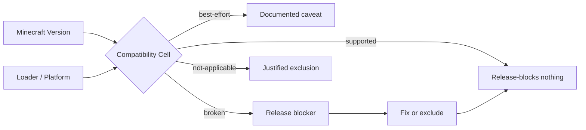
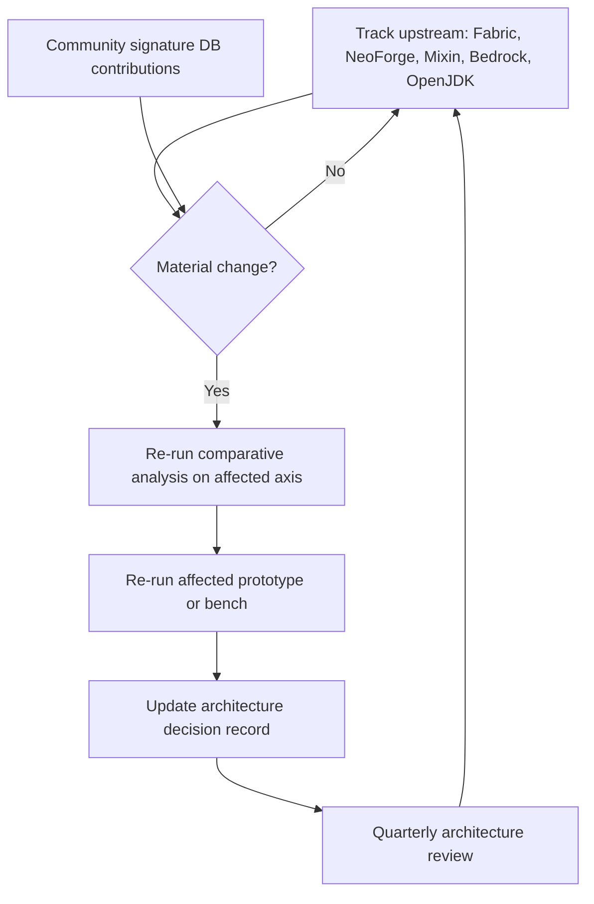

# Aprism Loader 产品技术报告与研究方法

> 文档 5 / 8 | Aprism Loader 文档集
> 版本：v26.0-Alpha.1 | 状态：开发中
> 作者：BlockConnect@StarsailsClover
> 规范语言：英文（中文副本同步维护）

---

## 1. 执行摘要

本报告记录了产出文档 1 中所描述 Aprism Loader 架构的研究与开发方法。它与可行性报告（文档 4）有所区别：可行性报告问的是"这个东西能构建并交付吗？"，而本报告问的是"我们调查了什么、如何调查，以及为什么所选技术优于我们所评估的替代方案？"。

本报告所解释的架构成果包括：基于 `premain` javaagent 加 `ClassFileTransformer`、构建于调优过的 OpenJDK LTS 构建之上的 JE 原生底层；带可选隔离的 Knot 风格共享类加载器；以 SpongePowered Mixin 作为唯一规范转换机制；带按 loader 区分的 provider 块的清单超集；使用自定义打包插件的 Architectury Loom 构建流水线；按平台区分的 Bedrock 注入（Windows P0、Android P1、iOS P2）；由签名数据库支撑的三层 BE loader；以及通过 GitHub Releases 进行独立分发并使用 cosign 无密钥签名。

研发工作以四条并行的研究流展开：（1）JE 模组 loader 深度调研，（2）BE 模组生态调研，（3）按平台区分的原生注入，（4）JVM、Gradle、法律与跨版本问题。每条流所产生的证据都汇入一个风险驱动的决策过程。横跨所有流的主要发现是：JE 路径属于工程范围，而非研究；BE 路径则由研究主导且对版本高度脆弱。本文所述方法可重复执行：其设计意图是随着 Minecraft、loader 与平台的演进而按季度重新应用。

---

## 2. 研究目标

研发计划围绕七个问题组织，这些问题必须在架构被固化进代码之前得到回答。

| ID | 问题 | 流 |
|----|------|----|
| Q1 | 单一 JVM 级入口点能否在不 fork JVM 的前提下承载 Fabric、NeoForge、Forge、Quilt 与 LiteLoader 的适配器？ | JE / JVM |
| Q2 | 定制 JVM 或 GraalVM Native Image 是否可行，还是必须使用调优过的标准 OpenJDK？ | JVM |
| Q3 | 哪种类加载器拓扑能在最大化既有模组目录覆盖率的同时最小化冲突面？ | JE |
| Q4 | 哪种字节码转换机制是规范性的，refmap 与 intermediary 相关问题如何处理？ | JE |
| Q5 | 对每个 BE 目标平台（Windows、Android、iOS、BDS），生产级的注入与 hook 栈是什么？ | BE |
| Q6 | 如何在不为每个版本 fork 一次 loader 的前提下缓解 BE 版本脆弱性？ | BE |
| Q7 | 哪些分发渠道在法律上可用，需要何种签名与供应链管控？ | 法律 / 分发 |

每个问题在第 5 节中被分解为可证伪的假设，并在其中规定了实验验证计划。一个问题被认为已回答的条件是：（a）至少有两个独立来源达成一致，（b）有原型或社区项目展示了该属性，且（c）已核查法律与许可影响。

---

## 3. 研究方法

该方法由并行运行的四个层次组成：来源调研、对比分析、可行性原型与风险驱动调查。各层次被设计为可重复，以便在上游项目发布破坏性变更时可以重新应用同一流程。

### 3.1 文献与来源调研

三类来源被视为一级证据。

**官方文档。** Fabric 文档（`fabricmc.net`），包括 `fabric.mod.json` v1、Knot 类加载器、TinyRemapper 与 Intermediary；NeoForge 文档（`docs.neoforged.net`），包括 `neoforge.mods.toml`、`@Mod` 注解、`IEventBus` 与 `ModClassLoader`；Microsoft / Mojang Add-On 文档（`learn.microsoft.com/minecraft/creator`），包括 `manifest.json` 模式、Script API `@minecraft/server` 模块 UUID，以及稳定轨道与 beta 轨道；Apple App Review Guideline 2.4.5(iv)；Microsoft Store Policy 10.2；GitHub REST API 速率限制文档。

**源代码。** FabricMC 组织（`FabricLoader`、`FabricAPI`、`tiny-remapper`、`fabric-loom`）；NeoForged 组织（`NeoForge`、`ModDevGradle`）；SpongePowered（`Mixin`、`MixingConfig`）；Amethyst 项目（`github.com/Frederox157/Amethyst`，使用 libhat、MinHook 与 xmake 的 C++ 客户端 loader，目标为 BE 1.26.x）；LeviLamina（`github.com/LiteLDev/LeviLamina`，BDS 服务端 C++ loader，采用三层架构以及由 BedrockAnalyzer 喂入的 `header_generator`）；Jared 的 MultiLoader-Template（`github.com/jaredlll02/MultiLoader-Template`，含 common/fabric/neoforge 切分以及通过 `ServiceLoader` 提供的 `IPlatformHelper`）；moritz-htk 的 Neo-Loom fork。

**社区资源。** `bedrock-native-modding` wiki 与 Discord、Bedrock-OSS wiki（`wiki.bedrock.dev`）、Prism Launcher 的发布基础设施（作为 GitHub Releases 作为 CDN 的先例），以及 Quilt 开发笔记，其中记录了 2025 年 12 月 QSL 的停止维护以及在 0.29.2 中修复的 `ModContainer` 身份 bug。

来源被标注了置信级别：官方文档（高）、源代码（高）、社区 wiki（中）、社区 Discord 说法（低，需要佐证）。没有任何架构决策仅依赖于一个低置信度来源。

### 3.2 对比分析

各 loader 沿四条正交轴线进行比较，以确保没有任何单条轴线主导决策。

| 轴线 | 比较的属性 |
|------|------------|
| 清单模式 | 字段集合、版本化、依赖语法、入口点声明、provider 可扩展性 |
| 类加载器拓扑 | 父优先 vs 子优先、隔离级别、转换插入点、模组可见性 |
| 事件系统 | 总线类型、注册机制、订阅者分发、并行分发安全性 |
| 转换流水线 | 重映射器、refmap 来源、Mixin 插入顺序、AT/coremod 共存、retransform 支持 |

比较按 loader（Fabric、NeoForge、LiteLoader、Quilt，以及作为横切关注点的 Mixin）分别制表，然后投影到 Aprism 超集上。投影规则是：超集必须接受每个 loader 的清单作为严格子集，而 Aprism 自身的字段位于独立的 `aprism` provider 块中，从而不会遮蔽任何上游模式。

### 3.3 可行性原型

在承诺完整架构之前，指定了四个原型以验证承担关键技术主张的声明。

| 原型 | 验证内容 | 成功准则 |
|------|----------|----------|
| P1：javaagent hook | 一个带 `ClassFileTransformer` 的 `premain` agent 能否拦截引导类加载器并在主游戏类被解析之前注入 loader 核心。 | Loader 核心在 `net.minecraft.client.main.Main` 运行之前打印其版本。 |
| P2：BE Windows DLL 注入 | 放置在 `Minecraft.Windows.exe` 旁边的代理 `version.dll` 能否加载 payload 并通过 libhat 签名扫描定位的目标函数上安装 MinHook inline hook。 | Hook 在 BE 1.26.x 客户端上触发并记录日志，且不崩溃。 |
| P3：Android 容器 | 重新打包或容器化的 `com.mojang.minecraftpe` APK 能否加载一个 Zygisk 模块，该模块通过 ShadowHook 执行 inline hook。 | Hook 在 root 测试设备上跨应用重启触发。 |
| P4：签名扫描 | libhat 的编译期签名能否在两个 BE 点发布版本之间解析同一符号，而无需手动更新偏移。 | 符号解析在两个版本上都成功；并报告签名集合的差异。 |

P1 与 P4 原型必须在对应的架构组件被固化之前通过。P2 与 P3 必须在 BE Windows 与 BE Android 里程碑分别离开研究阶段之前通过。

### 3.4 风险驱动调查

每个已识别的架构风险都驱动一个具体的研究任务，从而使研究投入与风险成正比，而非与兴趣成正比。

| 风险 | 它所驱动的研究任务 |
|------|---------------------|
| BE 版本脆弱性（每次 YY.MM 发布都带来偏移与签名漂移） | 签名数据库设计研究；调研 LeviLamina `header_generator` 与 BedrockAnalyzer；分析 Amethyst 如何跟踪 BE 1.26.x。 |
| 商店与主机端上的法律暴露 | 重新阅读 EULA；Microsoft Store Policy 10.2；Apple 2.4.5(iv)；Xbox Live 封禁政策调研；用于服务端模组的 BDS EULA。 |
| 跨 loader Mixin refmap 正确性 | 研究 Fabric intermediary 稳定性、NeoForge SRG/Mojang 名字，以及跨 loader 共享 Mixin 配置的 MultiLoader-Template 模式。 |
| 跨版本二进制兼容性 | 研究 Fabric Intermediary 作为稳定命名层；分析 1.21.11 到 26.1 的二进制兼容性破坏；JDK 向后兼容策略。 |
| 供应链完整性 | 调研通过 OIDC 的 cosign 无密钥签名；Prism Launcher 的 GitHub Releases 作为 CDN 模式；GitHub 速率限制预算（未认证 60 次/小时，认证 5000 次/小时）。 |

这一映射确保没有任何风险被抽象地研究：每个研究任务都绑定到它所支撑的具体架构决策。

---

## 4. 技术选型理由

本节针对每个架构选择，记录所评估的替代方案与所达成的裁决。表格是规范形式，以便在上游条件变化时可以重新评估比较。

### 4.1 JE Aprism Native：javaagent + 调优 OpenJDK

| 选项 | 可行性 | 工作量 | 风险 | 裁决 |
|------|--------|--------|------|------|
| 定制 JVM（fork OpenJDK） | 低 | 极高（以人年计） | 高（维护负担盖过产品本身） | 拒绝 |
| 在调优 OpenJDK 之上的 `premain` javaagent + `ClassFileTransformer` | 高（已被 Fabric、Quilt、Bytecode-Transformer-Tools 证明） | 中等 | 低 | **选定** |
| GraalVM Native Image | 低（封闭世界分析与动态模组加载不兼容） | 高 | 高（破坏模组加载模型） | 拒绝 |
| Project Leyden AOT 缓存 | 中（对启动有前景，对转换无帮助） | 中等（不成熟） | 中（仍是 early-access） | 观察；非 Phase-0 依赖 |

之所以选定 javaagent 方案，是因为它是唯一同时被证明、低工作量且兼容任意运行时加载模组的选项。GraalVM Native Image 被明确拒绝，因为其封闭世界假设与一个以动态加载第三方代码为定义属性的系统根本不兼容。Project Leyden 被作为未来启动时间优化进行跟踪，待其稳定后再考虑；它不阻塞 Phase 0。

### 4.2 类加载器：Knot 风格的共享默认 + 可选隔离

| 拓扑 | 模组目录覆盖率 | 冲突风险 | 复杂度 | 裁决 |
|------|----------------|----------|--------|------|
| 共享（Knot 风格，子优先带共享父加载器） | 最高（Fabric 与 Quilt 目录原生加载） | 中等（通过可选隔离缓解） | 中等 | **选定为默认** |
| 完全隔离（按模组类加载器，OSGi 风格） | 较低（假设共享可见性的 Fabric 模组会破坏） | 低 | 高 | 拒绝作为默认；可作为可选启用 |
| 混合（父优先带选择性子优先覆盖） | 中 | 中 | 高（规则引擎） | 拒绝（复杂度不合理） |

之所以选定 Knot 风格共享类加载器作为默认，是因为它最大化了无需修改即可加载的模组目录。隔离可作为清单中 `aprism` provider 块里声明的可选项，供随附冲突依赖的模组使用。该决策镜像了 Fabric Loader 的 `KnotClassLoader`，并与 Quilt 的观察一致：在 0.29.2 中修复的 `ModContainer` 身份 bug 是一个类加载器可见性缺陷，而非拓扑缺陷。

### 4.3 转换：以 Mixin 为规范

Mixin 被指定为唯一的规范 JE 字节码转换机制。不支持任何 Access Transformer（AT）或 coremod 流水线作为一等替代方案。理由是经验性的：Aprism 所适配的每个 loader（Fabric、NeoForge、Forge、Quilt、LiteLoader）都已使用 Mixin，且每个 loader 的 refmap 策略都可以用 Mixin 术语表达。

| 替代方案 | 状态 | 原因 |
|----------|------|------|
| AT（Access Transformers） | 非一等 | 可表达为 Mixin `@Inject` 加 `@Accessor`；作为独立流水线是冗余的 |
| Coremod（基于 JS） | 拒绝 | NeoForge 已弃用 JS coremods；安全与维护负担过高 |
| 竞争性 Mixin transformer 实例 | 禁止 | 单进程中两个 Mixin transformer 会相互破坏；Aprism 恰好插入一个，位于其重映射器的下游 |

refmap 策略是：Aprism 的重映射器产出运行时命名层（Fabric/Quilt 用 Intermediary，NeoForge 用 Mojang 名字），且 Mixin 配置的 refmap 在 `MixinTransformer` 运行之前由 Aprism 在飞行中重映射。这就是 MultiLoader-Template common 模块所验证的模式。

### 4.4 BE Hook：按平台选择库

| 库 | 平台 | Hook 类型 | 生产使用 | 许可证 | 裁决 |
|----|------|-----------|----------|--------|------|
| MinHook | Windows | Inline（trampoline） | Amethyst、OnixClient | BSD-2-Clause | **选定（Windows）** |
| SafetyHook | Windows | Inline（替代） | 现代替代方案 | MIT | 备选；因生态原因未选定 |
| Detours（Microsoft） | Windows | Inline | 广泛工业使用 | MIT | 备选；依赖较重 |
| ShadowHook | Android | Inline | LSPosed、Zygisk 模块 | BSD-3-Clause | **选定（Android）** |
| Dobby | Android/iOS | Inline | 多种基于 Dobby 的工具 | Apache-2.0 | **选定（iOS）** |
| And64InlineHook | Android | Inline | 旧式 Android 工具 | MIT | 备选；已被 ShadowHook 取代 |
| libhat | 跨平台 | 模式扫描（非 hook） | Amethyst、LeviLamina | MIT | **选定（签名）** |

选型由生产先例驱动：每个所选库都是其平台上由维护最活跃的社区 loader 所使用的库。每项选定的许可证兼容性都已对照 Aprism 的分发许可证进行了验证。

### 4.5 BE 签名扫描：libhat

libhat 被选定为签名扫描库，因为它提供编译期模式签名、SIMD 加速扫描，并且已在 Amethyst（BE Windows）的生产中使用，也为 LeviLamina 的 BDS 方案提供了参考。编译期签名至关重要：它们允许签名集合与 loader 一起版本化，并被签入签名数据库而无需运行时字符串解析。SIMD 加速之所以重要，是因为 BE 二进制文件很大（数百 MB），且签名扫描在加载时运行。

### 4.6 构建工具：Architectury Loom

| 构建插件 | Fabric | NeoForge | Forge | Quilt | 多 loader | 裁决 |
|----------|--------|----------|-------|-------|-----------|------|
| Fabric Loom | 是 | 否 | 否 | 部分 | 否 | 不足 |
| NeoGradle / ModDevGradle | 否 | 是 | 否 | 否 | 否 | 不足 |
| Architectury Loom | 是 | 是 | 是 | 部分 | 是（单一流水线） | **选定** |

之所以选定 Architectury Loom，是因为它包含 Fabric Loom 并在单一配置面之下增加了对 NeoForge 与 Forge 的支持。`loom-no-remap` 模式与 `libs.versions.toml` 约定被复用。Aprism 在其之上增加了一个自定义打包插件以产出 Aprism 清单超集并组装 BE 侧工件，但底层 Gradle 模型是 Architectury Loom 的。

### 4.7 分发：独立 + GitHub Releases

分发仅为独立桌面。Microsoft Store Policy 10.2 禁止在商店分发应用中执行动态代码，Apple App Review Guideline 2.4.5(iv) 对 iOS App Store 分发施加了等价约束。Google Play 有类似的限制。因此，对一个具备注入能力的 loader 而言，唯一在法律上可辩护的渠道是在应用商店之外的独立分发。

GitHub Releases 被选定为内容分发网络，依据是 Prism Launcher 先例：Prism Launcher 通过 GitHub Releases 大规模分发其构建，证明在配合重定向或镜像层的情况下，未认证的 60 次/小时与认证的 5000 次/小时速率限制是足够的。通过 OIDC 的 cosign 无密钥签名被选定用于供应链完整性，并且每次发布都会产出 CycloneDX SBOM。

---

## 5. 实验验证计划

验证计划将每个研究假设转换为可测量的测试。一个假设被认为已验证的条件是：成功准则在干净环境中被复现。

### 5.1 JE 验证

| 测试 | 流程 | 成功准则 |
|------|------|----------|
| 通过 Aprism 加载真实 Fabric 模组 | 取一个已发布的 Fabric 模组（例如某个 Sodium 的发布版），通过 Aprism 安装而不做修改，启动一个 JE 实例。 | 模组加载、行为与原生 Fabric 一致、Aprism 日志中无错误。 |
| 通过 Aprism 加载真实 NeoForge 模组 | 取一个已发布的 NeoForge 模组，通过 Aprism 安装，启动。 | 同上，对照 NeoForge。 |
| 混合 modpack | 在 Aprism 之下同时加载一个包含 Fabric 与 NeoForge 模组的 modpack。 | 所有模组加载；冲突通过清单 `aprism` provider 块浮现，而非崩溃。 |
| 加载时比较 | 在相同硬件上测量同一 modpack 在 Aprism、原生 Fabric 与原生 NeoForge 之下的冷启动与热启动时间。 | Aprism 启动时间在较快的原生 loader 的 15% 以内。 |

### 5.2 BE 验证

| 测试 | 流程 | 成功准则 |
|------|------|----------|
| Windows 注入 | 在 `Minecraft.Windows.exe` 旁边放置代理 `version.dll`；payload 通过 libhat 签名在 `Dimension::getTimeOfDay` 上安装 MinHook inline hook。 | Hook 在 BE 1.26.x 上触发；游戏在 30 分钟会话中不崩溃。 |
| Windows 示例模组 | 加载一个读取被 hook 值并渲染叠加层的示例原生模组。 | 叠加层渲染；帧时间影响低于定义的阈值（见 5.3）。 |
| Android 注入（root） | 安装一个 Zygisk 模块，加载进 `com.mojang.minecraftpe` 并安装 ShadowHook inline hook。 | Hook 触发；在 root 测试设备上跨应用重启存活。 |
| Android 注入（非 root） | 容器或 NMLauncher 模式的重打包 APK 使用相同 hook。 | Hook 在非 root 设备上触发；记录法律灰色地带状态。 |

### 5.3 性能基准

JE 基准在相同硬件上对照原生 Fabric 与原生 NeoForge 测量启动时间（冷与热）、峰值常驻集大小以及稳态帧率。BE 基准测量每次调用的 hook 开销（纳秒）、帧时间影响（相对未 hook 基线的第 95 与第 99 百分位差值）以及加载时签名扫描成本。基准在一台固定的参考机器配置上运行并记录于测试报告中，以便结果可复现。

### 5.4 兼容性矩阵测试

维护一个二维矩阵：一条轴是支持的 Minecraft 版本，另一条轴是支持的 loader 与平台。每个单元带有一个明确状态：`supported`、`best-effort`、`broken` 或 `not-applicable`。矩阵在每次发布时重新生成，并且是兼容性的权威声明。被标记为 `broken` 的单元会阻塞发布，直到该单元被修复，或该单元被降级为 `not-applicable` 并附有记录在案的正当理由。

---

## 6. 关键研究发现

对决策最相关的十五项发现浓缩如下。每项发现都引用了来源类别（Official / Source / Community）。

| # | 发现 | 含义 | 来源 |
|---|------|------|------|
| F1 | Fabric Intermediary 提供稳定的跨版本名字；1.21.11 到 26.1 的过渡破坏了二进制兼容性。 | Aprism 必须使用 Intermediary 作为其稳定命名层，并按 SemVer 固定兼容性组。 | Official / Source |
| F2 | `premain` + `ClassFileTransformer` 是被证明的 javaagent 模式；Fabric 与 Quilt 都依赖它。 | JE 底层无需新的 JVM 研究。 | Source |
| F3 | GraalVM Native Image 的封闭世界假设与动态模组加载不兼容。 | GraalVM 被拒绝；Leyden 被跟踪。 | Official |
| F4 | Knot 风格共享类加载器最大化模组目录覆盖率；隔离为可选。 | 选定为默认类加载器拓扑。 | Source |
| F5 | 所调研的每个 JE loader 都使用 SpongePowered Mixin。 | Mixin 是规范转换机制。 | Source |
| F6 | MultiLoader-Template 模式通过 common 模块在 Fabric 与 NeoForge 之间共享 Mixin 配置。 | 作为 Aprism 的适配器模式采用。 | Source |
| F7 | QSL 于 2025 年 12 月停止维护；`ModContainer` 身份 bug 在 Quilt 0.29.2 中被修复。 | Quilt 支持保留，但相对于 Fabric 与 NeoForge 降级优先。 | Community |
| F8 | Amethyst（BE Windows）在生产中使用 libhat + MinHook + xmake 对 BE 1.26.x。 | 验证了 BE Windows 栈选型。 | Source |
| F9 | LeviLamina（BDS）交付了三层架构以及由 BedrockAnalyzer 喂入的 `header_generator`。 | 作为 BE loader 结构与签名自动化模型采用。 | Source |
| F10 | BDSX 已归档；Geyser 是代理而非 loader；Inner Core/Horizon 仅限移动端。 | 不采用；将 BE 参考集合收窄至 Amethyst 与 LeviLamina。 | Community |
| F11 | Bedrock 使用 C++ 二进制、RenderDragon 与 RakNet，YY.MM 迁移导致版本碎片化。 | 版本适配器与签名数据库是 BE 工程投入的主要方向。 | Official / Source |
| F12 | Microsoft Store Policy 10.2 与 Apple 2.4.5(iv) 禁止在商店分发应用中执行动态代码。 | 分发仅为独立桌面。 | Official |
| F13 | Xbox Live 应用服务端封禁；BE 上没有客户端侧反篡改。 | 客户端注入不与反作弊对抗；网络政策合规才是约束。 | Official / Community |
| F14 | TrollStore 通过 CoreTrust bypass 启用 iOS 14.0 至 16.6.1 与 17.0 的 sideload；`insert_dylib`/`optool` 添加 `LC_LOAD_DYLIB`。 | iOS 仍仅作研究；版本窗口对发布目标而言过窄。 | Community |
| F15 | Prism Launcher 证明 GitHub Releases 作为可行 CDN；通过 OIDC 的 cosign 无密钥签名已具备生产能力。 | 选定的分发机制。 | Source / Official |

---

## 7. 待研究项

以下项目尚未解决，已排定在后续阶段调查。列出它们是为了让下游文档与贡献者知道哪些事项仍在进行中。

| ID | 待决项 | 为何待决 | 阶段 |
|----|--------|----------|------|
| O1 | iOS TrollStore BE 细节 | 不存在规模化的社区 BE iOS 模组 loader；版本窗口（14.0 至 16.6.1、17.0）过窄。 | P2 研究 |
| O2 | BE 版本适配器自动化 | LeviLamina `header_generator` 模式已被理解；但将其跨 YY.MM 发布自动化尚未为 Aprism 的 BE Windows 目标原型化。 | P0 跟进 |
| O3 | JE-to-BE 转换保真度指标 | 用于已转换模组的量化保真度指标（功能对等评分）尚不存在。 | 转换模块 |
| O4 | 非 root Android 法律姿态 | 容器与 NMLauncher 模式在技术上可行，但依赖 APK 重打包，在法律上属于灰色地带。 | P1 关卡 |
| O5 | Project Leyden 集成 | Leyden AOT 缓存可能降低 JE 启动时间；尚未稳定到可作为依赖的程度。 | Phase-0 之后 |
| O6 | 签名数据库贡献模型 | 签名数据库是仓库内托管、作为独立仓库，还是跨社区贡献者联邦化，尚未决定。 | P0 跟进 |

---

## 8. 持续研究流程

研究不是一次性活动。Aprism 采用一种持续研究流程，设计用于在上游项目演进时保持架构的时效性。

该流程有四项具体承诺。第一，上游跟踪：监控 FabricMC、NeoForged、SpongePowered、LiteLDev、Frederox157（Amethyst）与 Mojang Bedrock 的发布源；重大变更在一周内分诊。第二，社区签名数据库贡献：BE 签名数据库被设计为接受外部贡献，镜像 LeviLamina 的 header 贡献模型，因为没有任何单一团队能跟上每个 BE 点发布版本。第三，季度架构评审：每季度对第 4 节中的每个架构决策对照当前上游状态重新评估，并对比对表重新打分。第四，决策记录：对架构的每一项重大变更都被记录为一份简短决策记录，从而使理由链可审计，而非流失于聊天记录之中。

---

## 9. 参考文献

参考文献按类别分组，以便读者可以独立重跑来源调研。

### 9.1 官方文档

- Fabric 文档与 `fabric.mod.json` v1 模式：`fabricmc.net`
- NeoForge 文档与 `neoforge.mods.toml` 模式：`docs.neoforged.net`
- SpongePowered Mixin 文档（`*.mixins.json`、`@Mixin`、`@Inject`）：`github.com/SpongePowered/Mixin`
- Microsoft / Mojang Add-On 文档（`manifest.json`、`@minecraft/server` Script API）：`learn.microsoft.com/minecraft/creator`
- Microsoft Store Policy 10.2（动态代码执行）：`learn.microsoft.com/windows/uwp/publish/store-policies`
- Apple App Review Guideline 2.4.5(iv)：`developer.apple.com/app-store/review/guidelines`
- GitHub REST API 速率限制：`docs.github.com/rest/overview/resources-in-the-rest-api`
- cosign 无密钥签名文档：`github.com/sigstore/cosign`

### 9.2 源代码仓库

- FabricLoader（Knot、`fabric.mod.json`、ModContainer）：`github.com/FabricMC/fabric-loader`
- tiny-remapper：`github.com/FabricMC/tiny-remapper`
- fabric-loom（Loom 26.2）：`github.com/FabricMC/fabric-loom`
- NeoForge（`@Mod`、`IEventBus`、`ModClassLoader`）：`github.com/neoforged/NeoForge`
- ModDevGradle：`github.com/neoforged/ModDevGradle`
- SpongePowered Mixin：`github.com/SpongePowered/Mixin`
- MultiLoader-Template（Jared）：`github.com/jaredlll02/MultiLoader-Template`
- Neo-Loom fork（moritz-htk）：`github.com/moritz-htk/neo-loom`
- Quilt Loader（`ModContainer` 身份、0.29.2 修复）：`github.com/QuiltMC/quilt-loader`
- Amethyst（BE Windows C++ loader，libhat + MinHook + xmake）：`github.com/Frederox157/Amethyst`
- LeviLamina（BDS C++ loader，三层，`header_generator`）：`github.com/LiteLDev/LeviLamina`
- BedrockAnalyzer：被 LeviLamina header 生成所引用
- libhat（编译期 SIMD 签名扫描）：`github.com/SnowflakeIndustries/libhat`
- MinHook：`github.com/TsudaKageyu/minhook`
- ShadowHook：`github.com/bytedance/android-inline-hook`
- Dobby：`github.com/jmpews/Dobby`
- Prism Launcher（GitHub Releases 作为 CDN 先例）：`github.com/PrismLauncher/PrismLauncher`

### 9.3 社区资源

- bedrock-native-modding wiki 与 Discord
- Bedrock-OSS wiki：`wiki.bedrock.dev`
- LiteLoader 旧式文档（`.litemod`、`litemod.json`、1.12.2）：`www.minecraftforum.net` 与归档的 LiteLoader 源码
- Inner Core / Horizon（移动端 BE 模组）：社区文档
- Geyser（代理，非 loader）：`github.com/GeyserMC/Geyser`
- BDSX（已归档）：`github.com/bdsx/bdsx`

---

文档 5 结束。
