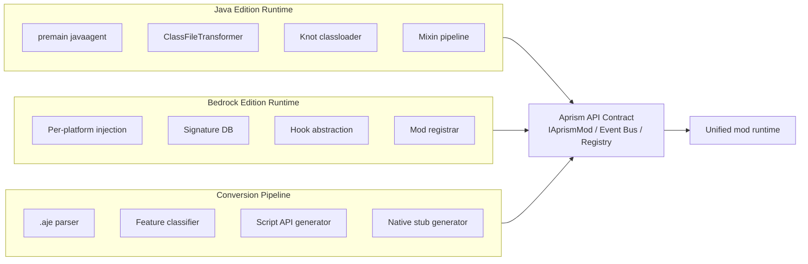
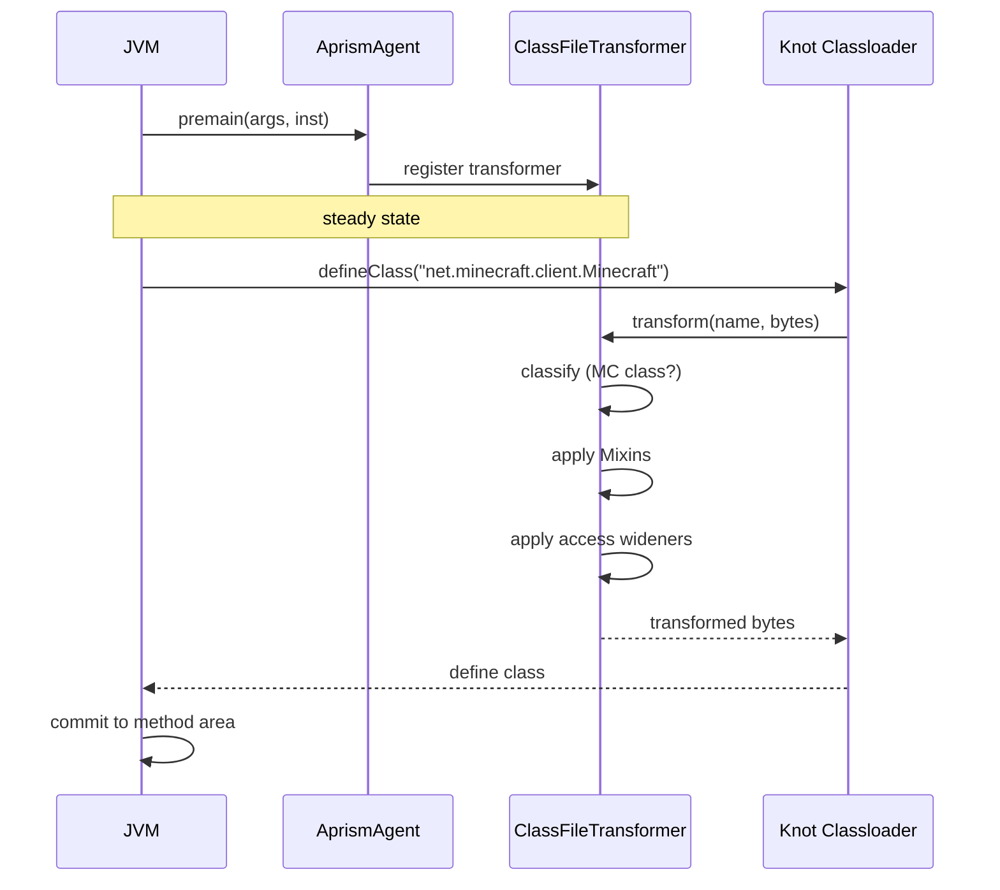
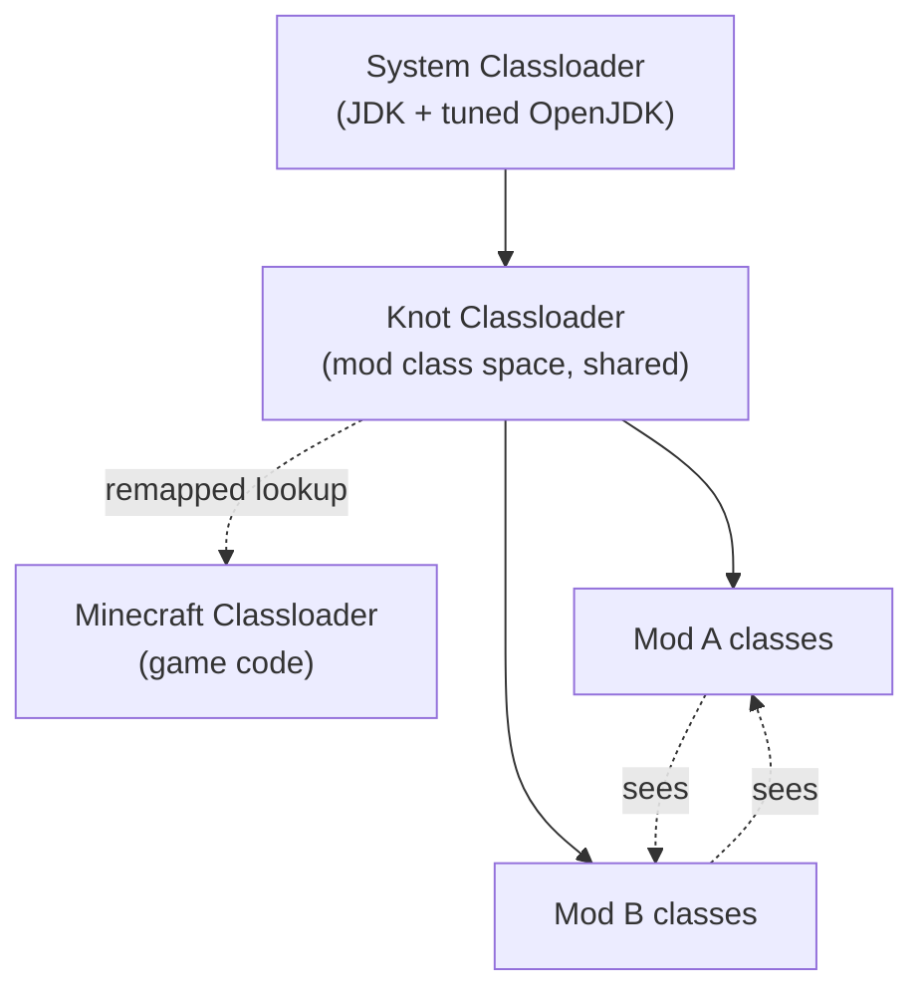
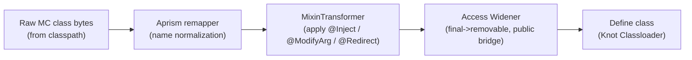
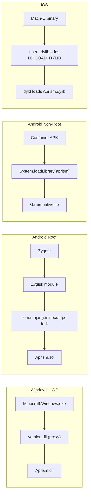
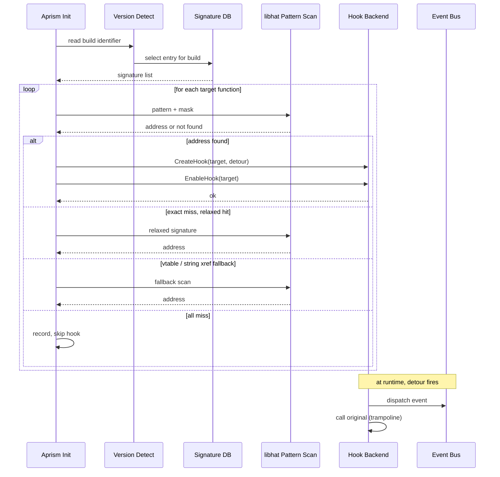
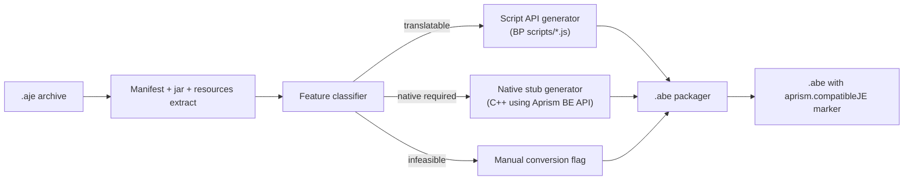

# Aprism Loader 产品原理说明书

> 文档 6 / 8 | Aprism Loader 文档集
> 版本：v26.0-Alpha.1 | 状态：开发中
> 作者：BlockConnect@StarsailsClover
> 规范语言：英文（中文副本同步维护）

## 1. 执行摘要

本说明书描述 Aprism Loader 在原理层面的运作方式。架构设计文档（文档 1）定义了存在哪些组件以及它们如何组合，而本文档则解释这些组件在运行时产生效果所依赖的机制：Java Edition agent 如何在 JVM 提交类定义之前拦截它们，Bedrock Edition 原生层如何落地到各目标平台的进程中，统一事件总线如何将两套历史上互不兼容的模组生态合并到同一条派发路径上，以及 JE-to-BE 转换流水线如何将模组行为改写为 Bedrock 执行模型。

本文档的读者是需要推理运行时内部机制的工程师，而非仅消费 API 的模组作者。文档围绕三个共享同一 API 契约的运作域组织：JE 运行时、BE 运行时，以及转换流水线。每个域都从其注入原理、加载流程、钩子或转换流水线、以及生命周期语义四个角度加以描述。最后一节涵盖失败模式与恢复，因为当上述任一机制发生退化时，运行时必须保持可诊断性。

在本文档中，“monotonic contract”（单调契约）一词指代这样一项不变量：Aprism API 表面在各版本间只扩张不收缩，被弃用的入口点保持可用，并且由适配器将旧消费者桥接到当前 API。正是这一不变量使得同一份模组归档能够跨 v25 与 v26 Minecraft 家族加载而无需重新编译。

## 2. 原理概览

Aprism 定义了三个运作域。每个域拥有独立的注入面，但三者都通过同一份 Aprism API 契约对外发布，使得针对该契约编写的模组代码在特性集允许的范围内与具体版本无关。



该契约是承重接口。JE 运行时通过 JVM instrumentation 实现它；BE 运行时通过原生钩子实现它；转换流水线则将面向某一运行时的模组改写为可在另一运行时上执行。修改任一单独域的工程师必须保留该契约，因为另外两个域以及每一个已发布的模组都依赖它。

## 3. JE 运行时原理

### 3.1 基于 Agent 的类加载

Aprism JE 以 Java agent JAR 形式打包，其 `META-INF/MANIFEST.MF` 声明了 `Premain-Class`。JVM 在一份调校过的 OpenJDK 构建上启动，并在应用主线程进入 `main` 之前调用 premain 入口：

```java
public final class AprismAgent {
    public static void premain(String args, Instrumentation inst) {
        AprismBootstrap.earlyInit(args);
        inst.addTransformer(new AprismClassTransformer(inst),
            /* canRetransform */ true);
        AprismBootstrap.completeInit();
    }
}
```

transformer 一旦注册，JVM 在将每一个类提交到方法区之前，都会先将其类定义路由经过 `AprismClassTransformer.transform`。这是 Aprism 在 JE 上使用的唯一拦截点：在稳态期间不存在对已加载类的字节码改写，也不存在除类文件加载钩子之外的任何 JVMTI 事件。其后果是 Aprism 会拦截 JVM 定义的所有类，包括 JDK 内部类，因此必须在决定是否执行工作之前廉价地对每个类进行分类。



分类器根据已配置的 intermediary 命名空间校验类名。对于 26.1 之前的 Minecraft，名称采用 Intermediary 形式（`net.minecraft.class_442`）；对于 26.1 及以后版本，Aprism 直接在游戏自带的官方混淆名称上运作。非 Minecraft 类原样返回，从而将 transformer 的开销保持为与 Minecraft 类的数量成正比，而非与整个类宇宙的规模成正比。

### 3.2 模组发现与依赖解析

模组发现由文件系统驱动。Aprism 扫描 `mods/` 目录，查找带有 `.aje` 扩展名（规范的 Aprism 归档）或带有可识别清单的旧式 `.jar` 扩展名的归档。清单查找顺序如下：

1. `aprism.manifest.json`（规范清单，含 provider 块的超集 schema）
2. `fabric.mod.json`（Fabric 兼容性回退）
3. `quilt.mod.json`（Quilt 兼容性回退）
4. `forge.mods.toml`（NeoForge / Forge 兼容性回退）
5. `pack.mcmeta` 加入口提示（Bedrock 风格回退）

当仅找到回退清单时，Aprism 会合成规范字段。合成清单被标记为 `aprism.manifest.source = "fallback"`，以便下游工具能够区分原生 Aprism 模组与被适配的模组。

依赖解析构建一个有向图，其中每个节点是一个模组，每条边表示一条带版本的依赖、一条加载顺序约束，或一条破坏性冲突。Aprism 对该图进行拓扑排序。环不被容忍：一个环会使整个加载失败，并附带一份列出环成员及它们之间边的报告。版本范围依据清单说明书（文档 2）中定义的类 SemVer 范围语法解析；不可满足的范围会使受影响的模组被排除并记录原因，而非中止整个会话。正是这种失败软化的行为，使得一个包含多个 MC 版本模组的 `mods/` 目录能够启动其中相互兼容的子集。

### 3.3 类加载器拓扑

Aprism 使用 Knot 风格的共享类加载器拓扑。单个 `AprismClassLoader`（在代码中称为 `KnotClassLoader`）持有模组类空间。无论模组类来自哪个归档，都被定义到该加载器中，因此一个模组类引用另一个模组的类时，会通过以 Knot 加载器为定义加载器的常规父委托查找来解析。



当模组引用某个 Minecraft 类时，Knot 加载器通过已配置的 remapper 路由该查找。对于 26.1 之前的版本，remapper 将 Intermediary 名称翻译回运行时名称；对于 26.1 及以后版本，名称本就匹配，remapper 是直通的。正是这种路由使得针对稳定名称编写模组成为可能，而游戏却以不断变动的混淆发布。

对于声明 `aprism.classloader.isolation = "shim"` 的模组，提供一个可选的隔离垫片。这类模组会获得一个 Knot 的子类加载器，其 `loadClass` 会先检查模组自身的归档，回退到 Knot，最后才委托给系统加载器。该垫片存在的目的是托管那些携带常见库冲突依赖版本的模组（例如某个特定的 Gson 或 Netty 构建）。隔离模组无法定义针对其自身归档之外类的 Mixin，因为它们的定义加载器并不是定义 Minecraft 类的加载器；这一权衡是有意为之并已被记录。

### 3.4 Mixin 转换流水线

Mixin 是 JE 上规范的字节码改写机制。Aprism 的 transformer 在类加载钩子中按下述顺序应用 Mixin：



Mixin transformer 通过 `@At` 描述符解析注入点，它们可以是普通方法名、`@At("INVOKE")` 目标，或 `@At("FIELD")` 目标。解析使用 refmap：与模组一同打包的 JSON 伴随文件，将描述符键映射到运行时混淆名。当 refmap 缺失或查找未命中时，Aprism 回退到规范名称并记录一条软警告；这使模组能够抵御跨 Minecraft 版本的 refmap 漂移。

优先级解析遵循标准 Mixin 语义：针对同一方法的 mixin 按 `priority` 排序（数值低者优先），并遵循 `@Coerce` 与 `@Group` 语义。Aprism 不覆盖该行为；它逐字遵循上游契约，因为 Mixin 的全部价值就在于其稳定的优先级模型，偏离它将默默改变每一个既有模组的行为。

访问扩展器在 Mixin 之后运行，以便扩展后的访问权限对后续字节码消费者（反射、下游 transformer）可见。Aprism 的扩展器 token 在清单的 `aprism.accessWidener` 字段下声明，并使用与 Fabric 的 `access-widener` 文件相同的语法；Aprism 在启动时解析一次，并在首次 transform 时按类惰性应用。

### 3.5 入口点与生命周期

Aprism JE 声明了一组严格有序的生命周期阶段。模组通过在清单的 `aprism.entrypoints.main` 下注册一个 `IAprismMod` 入口点来发布其工作。阶段模型如下：

| 阶段 | 触发时机 | 模组可执行 |
|---|---|---|
| PREINIT | agent 启动后，main 之前 | 注册 mixin，声明静态配置，注册访问扩展器，声明注册表 |
| INIT | 模组图解析完毕后 | 实例化入口点，注册事件监听器，构建内容 |
| SETUP | 所有 INIT 入口点返回后 | 串联跨模组集成，解析注册表内容 |
| COMPLETE | SETUP 串联完成后 | 最终化配置，发出就绪事件 |
| CLIENT | MC 客户端初始化后 | 注册客户端渲染、按键绑定、界面 |
| SERVER | MC 服务端初始化后 | 注册专用服务端内容、网络处理器 |

`IAprismMod` 契约刻意保持窄小：它仅承载一个生命周期入口点和一个元数据访问器。阶段特定的工作通过事件总线完成，而非通过额外的接口方法，从而使契约在新阶段引入时保持稳定。

```java
public interface IAprismMod {
    ModMetadata metadata();
    void onInitialize(AprismContext ctx);
}
```

`AprismContext` 暴露事件总线、注册表、日志器和平台描述符（版本、MC 版本、Aprism 版本）。Context 是阶段作用域的：在 PREINIT 期间获得的 context 拒绝返回已填充的注册表，因为注册表尚未构建。这在 API 边界上强制执行，而非依赖约定，从而让调用顺序错误明显失败，而非产生静默的 null。

### 3.6 事件派发

Aprism 事件总线是阶段严格的：注册为在 INIT 期间触发的监听器无法在 PREINIT 期间触发，在错误阶段尝试发布事件会抛出 `IllegalStateException`。这种严格性正是 Aprism 在混合的 Fabric 与 Forge 模组生态间保证确定性顺序的机制。

Fabric 风格的函数式适配器（接收 `Consumer<T>` 的 `registerListener` 重载）与 Forge 风格的 `addListener` 适配器都汇入同一个内部订阅者集合。这些适配器是薄包装；它们唯一的职责是接受调用方偏好的形式，并生成一个由总线统一派发的 `Subscriber` 记录。运行时不存在第二条总线，不存在并行派发路径，也不存在 Forge 与 Fabric 之间的分离。

取消操作通过事件对象本身传播。标记为 `@Cancellable` 的事件暴露 `cancel()`；一旦取消，总线停止向同一阶段的剩余订阅者派发，并将取消标志返回给调用方。未标记为可取消的事件会忽略该调用。

## 4. BE 运行时原理

### 4.1 各平台注入机制

Bedrock Edition 以原生二进制形式发布于四个目标平台。Aprism 必须在游戏完成初始化之前落地到进程中，而落地机制因平台而异。



在 Windows 上，Aprism 在 `Minecraft.Windows.exe` 旁发布一个代理 `version.dll`。该代理将每一个合法导出转发给系统 `version.dll`，并在其 `DllMain` 中加载 `Aprism.dll` 并调用其初始化器。初始化器执行版本检测、签名 DB 选择、钩子安装、模组注册器初始化，最后扫描 `com.mojang/aprism_mods/` 以查找 `.abe` 模组。

在有 root 的 Android 上，Aprism 以 Zygisk 模块形式发布。Zygisk 将 Aprism 加载进 zygote 进程；当 zygote 为 `com.mojang.minecraftpe` 而派生（fork）时，Aprism 已被映射。同一初始化器针对 `libminecraftpe.so` 运行，使用 ShadowHook 进行 inline hook。

在无 root 的 Android 上，Aprism 内嵌于一个容器应用（NMLauncher 风格）中，该应用在沙箱中托管目标 APK。容器的 `Application.onCreate` 在游戏原生库加载之前调用 `System.loadLibrary("aprism")`，确保当游戏的第一次原生调用落地时 Aprism 已驻留。

在 iOS 上，用户的 Mach-O 通过 `insert_dylib` 被打补丁，添加一条指向 `Aprism.dylib` 的 `LC_LOAD_DYLIB` 加载命令。启动时 `dyld` 将 Aprism 与游戏一同加载；Aprism 初始化器运行并通过 Dobby 安装钩子。

### 4.2 钩子安装流水线

不论平台如何，一旦 Aprism 驻留，钩子安装流水线都是相同的。该流水线从二进制元数据中读取游戏的构建标识，选择匹配的签名 DB 条目，扫描相关 `.text` 段以查找每个待钩函数，并安装 detour。



每个函数的回退链为：精确签名、放松签名（更少的掩码字节）、虚函数的 vtable 查找，以及引用唯一字符串字面量的函数的字符串交叉引用。只有当这四者全部未命中时，Aprism 才将该钩子记录为不可用；它绝不在猜测的地址上安装钩子。缺失的钩子会被报告给模组注册器，以便依赖该钩子的模组可以选择显式失败或优雅退化。

### 4.3 BE 模组加载

钩子安装完成后，Aprism 扫描 `aprism_mods/` 以查找 `.abe` 归档。每个归档的清单声明其类型：原生或脚本。原生模组随附与宿主平台匹配的 `.so`、`.dll` 或 `.dylib`；Aprism 对该库执行 `dlopen` 并调用其入口点符号（`aprism_mod_init`）。脚本模组声明一个 `Script API` 入口点；Aprism 将其注册到 Bedrock 脚本引擎，随后由脚本引擎针对 `@minecraft/server` 求值所打包的 JavaScript。

BE 上的事件派发与 JE 镜像。使用同一阶段严格的总线；适用同样的取消语义。唯一区别在于，部分事件源自原生钩子而非 JVM 事件，部分事件是版本特定的（例如 `BedrockRenderEvent` 在 JE 上没有对应物）。

### 4.4 版本适配器与签名 DB

每一个 Bedrock 构建在签名 DB 中都有一条条目。条目是一份 JSON 文档，将逻辑函数名（例如 `Level::tick`）映射到 pattern/mask 对，并附上二进制内构建标识的偏移以及 `.text` 段的地址范围。

该 DB 由 `header_generator` 生成，这是一个消费 `BedrockAnalyzer` 转储的工具。`BedrockAnalyzer` 是一个静态分析器，它遍历 Bedrock 二进制文件，在可得处提取符号与 pattern 信息，并输出结构化转储。`header_generator` 将该转储后处理为 Aprism 使用的规范 `mc/` 头文件集合，以及运行时消费的 JSON 签名条目。

社区贡献是 DB 增长的主要机制。当某个构建不在 DB 中时，贡献者对新二进制运行 `BedrockAnalyzer`，通过贡献流程提交转储，由维护者审核并合并派生的签名。Aprism 拒绝为 DB 中不存在的构建安装钩子；它绝不从相邻构建外推签名，因为相邻的 Bedrock 构建经常变动代码生成，会产生错误的钩子。

### 4.5 钩子抽象层

Aprism 向模组代码暴露单一的钩子 API。其实现派发到某个平台后端。

| 操作 | Windows 后端 | Android 后端 | iOS 后端 |
|---|---|---|---|
| 创建钩子 | MinHook `MH_CreateHook` | ShadowHook `shadowhook_hook_func` | Dobby `DobbyHook` |
| 启用钩子 | MinHook `MH_EnableHook` | 创建时隐式启用 | 创建时隐式启用 |
| 禁用钩子 | MinHook `MH_DisableHook` | ShadowHook `shadowhook_unhook` | Dobby `DobbyDestroy` |
| Trampoline（调用原函数） | MinHook trampoline ptr | ShadowHook orig-return | Dobby orig-return |
| 地址解析 | libhat pattern scan | libhat pattern scan | libhat pattern scan |

抽象层刻意保持薄。性能关键路径（detour 本身）直接调用后端；抽象层只规范化创建/启用/禁用的生命周期。这使得 detour 开销保持为后端的原生成本（通常为一次间接分支），而非为每一次被钩调用支付额外的一层间接。

## 5. 跨版本原理：Aprism API 契约

### 5.1 统一 IAprismMod 接口

两个版本上暴露相同的接口形状。在 JE 上它是 Java 接口；在 BE 上它是具有相同方法名与语义的 C++ 抽象类。针对契约在一个版本上编写的模组，在特性集重叠之处可在另一版本上编译并运行。

Java Edition：

```java
public interface IAprismMod {
    ModMetadata metadata();
    void onInitialize(AprismContext ctx);
}
```

Bedrock Edition：

```cpp
struct ModMetadata {
    const char* id;
    const char* version;
    const char* minecraft_range;
};

class IAprismMod {
public:
    virtual ~IAprismMod() = default;
    virtual const ModMetadata& metadata() const = 0;
    virtual void onInitialize(AprismContext& ctx) = 0;
};

extern "C" APRISM_EXPORT IAprismMod* aprism_mod_create();
```

BE 上的 `aprism_mod_create` 工厂与 JE 上由清单声明的入口点相对应。两个工厂都在 INIT 期间被调用一次；两者都收到一个在相同名称下暴露相同服务（事件总线、注册表、日志器、平台描述符）的 context。

### 5.2 统一事件总线

同一逻辑事件在两个版本上都会触发。例如 `BlockPlaceEvent`，在 JE 上当玩家通过 JE 流水线放置方块时被发布，在 BE 上当原生钩子在 Bedrock 二进制中拦截到 `Block::place` 时被发布。针对 `BlockPlaceEvent` 编写的监听代码在两者上均无需改动即可运行，因为事件对象的字段与语义由契约定义，而非由版本定义。

在没有对应物之处存在版本特定事件。`BedrockRenderEvent` 仅限 BE；`ClientPlayerTickEvent` 在其 JE 特定形式下仅限 JE。在错误版本上订阅不存在的事件会在注册时抛出异常，而非在派发时，从而尽早捕获配置错误。

### 5.3 统一注册表

Aprism 注册表通过单一 API 暴露方块、物品与实体。在 JE 上，注册通过适当的 Mixin 注入访问器委托给 Minecraft 注册表；在 BE 上，注册通过 Aprism BE API 暴露的 Bedrock 原生注册路径委托。模组作者调用 `Registry.register(...)`，运行时将调用路由到正确的后端。

标识符是带命名空间的（`aprism:my_block`）。在两个版本上 Aprism 都逐字保留命名空间；它不前缀或改写模组标识符，因为标识符稳定性是跨模组更新的存档兼容性的前提。

### 5.4 单调契约

Aprism API 表面在各版本间只扩张不收缩。被弃用的入口点保持可用，而非仅仅保留存在；弃用注解向模组作者表达意图，但 Aprism 永不移除先前已发布的方法。当旧 API 无法在新 Minecraft 版本上忠实实现时，由适配器将旧 API 的语义桥接到新运行时，从而使针对 Aprism v24 编译的模组仍能在 Aprism v26 上加载并运行。

正是这种单调性使得 JE-to-BE 转换流水线能够针对一个稳定的 API。转换工具无需追踪版本特定的怪癖；它针对契约生成代码，而契约保证所生成的代码持续可运行。

## 6. JE-to-BE 转换原理

### 6.1 转换流水线

转换流水线接收一个 `.aje` 归档并产出一个 `.abe` 归档。它是离线的、确定性的、可复现的：相同输入加上相同 Aprism 转换器版本产出逐字节相同的输出，这是供应链验证的前提。



分类器检查模组声明的入口点、其 Mixin 目标及其注册表调用。它将模组的行为划分为三类。第一类被翻译为 Bedrock Script API JavaScript。第二类被翻译为原生 C++ stub，链接 Aprism BE API 并通过原生钩子实现等价行为。第三类留作手动转换；转换器输出一份报告，描述何者不可行及其原因。

### 6.2 特性分类表

| JE 特性 | BE 可行性 | 转换路径 |
|---|---|---|
| 方块放置/破坏的事件监听 | 可翻译 | 生成 `@minecraft/server` `world.afterEvents` JS |
| 实体生成/传送/销毁 | 可翻译 | 生成调用 `@minecraft/server` 实体 API 的 JS |
| 方块读取/设置 | 可翻译 | 生成调用 `dimension.getBlock` / `setBlock` 的 JS |
| 命令注册 | 可翻译 | 生成通过 `@minecraft/server` 自定义命令 API 注册的 JS |
| 自定义方块/物品 | 需原生 | 生成使用 Aprism BE 注册 API 的 C++ stub |
| 自定义维度 | 需原生 | 生成 C++ stub；需要维度注册表的签名 |
| 渲染钩子 | 需原生 | 生成使用 Aprism 渲染钩子 API 的 C++ stub |
| 输入/按键绑定 | 需原生 | 生成使用 Aprism 输入钩子 API 的 C++ stub |
| 无 BE 对应的深度字节码 Mixin | 不可行 | 标记为手动；输出报告 |

该表在原理层面是穷尽的。具体特性编目于可行性报告（文档 4）。分类器以该编目作为决策表；新特性在被教会识别之前先被加入编目。

### 6.3 限制与手动转换边界

当模组的任一 Mixin 针对没有 Bedrock 对应物的代码路径、当它依赖 JE 特定设施（例如 Forge capability 处理器）、或当它依赖 JE 特定网络协议时，模组会被标记为需要手动转换。转换器不尝试对此类模组进行部分转换；部分转换的模组会在其各特性间表现不一致，比一次干净的失败更糟。

手动转换报告列出每一个不可行的特性、它所针对的 JE 类与方法，以及不存在 Bedrock 对等物的原因。人类转换者将该报告作为工作清单使用。转换器在此处的价值不在于部分输出，而在于清单：它精确地告诉转换者何者需要手工移植以及位于何处。

## 7. 安全原理

Aprism 在每一个目标平台上都以提升的权限运作：在 JE 上它运行在 JVM 之内，在 BE 上它运行在游戏进程之内。这种提升是其能力的来源，也是其首要风险面的来源。因此其安全模型是保守的。

在 BE Windows UWP 上，沙箱论证成立。游戏运行在具有受限能力的 AppContainer 中；Aprism 的 DLL 注入并不逃逸该容器，因为 Aprism 是由游戏自身的加载器加载进游戏自身的地址空间的。Aprism 无法触及沙箱之外；沙箱约束 Aprism 的方式与约束游戏完全相同。这正是原始 Bedrock 模组工具运作所依据的同一论证。

模组之间的隔离在原生侧强制执行。未签名的原生模组不会被执行。声明了原生组件的 `.abe` 归档必须携带针对归档摘要的 cosign 签名；Aprism 初始化器在允许 `dlopen` 之前会根据已配置的信任根校验该签名。签名校验失败的模组将被拒绝加载，并将该拒绝连同归档所声称的身份与校验失败原因一并记录。脚本模组不受 cosign 校验约束，因为它们运行在 Bedrock 脚本引擎自身的沙箱之下，无法逃逸。

在 Android 与 iOS 上，同一原则适用：原生模组需要 cosign 校验，脚本模组不需要。信任根集合可按平台配置，以便企业部署能够钉住某个特定的签名身份。

## 8. 失败模式与恢复

当某项机制退化时，运行时必须保持可诊断性。下表编目了主要的失败模式、其原因、Aprism 如何检测它们，以及恢复动作。

| 失败 | 原因 | 检测 | 恢复 |
|---|---|---|---|
| Agent 注入失败（JE） | 清单缺少 `Premain-Class`，或 agent JAR 不在 `-javaagent` 上 | JVM 启动后 2 秒内未写入 Aprism 心跳文件 | 启动器报告；用户以正确接入 agent 的方式重新运行启动器 |
| ClassFileTransformer 异常 | Mixin 或访问扩展器在 transform 时抛出 | Transformer 捕获，记录类与原因，返回原始字节 | 类在无 Aprism 修改的情况下加载；受影响模组被报告为损坏 |
| 模组在 INIT 期间崩溃 | 入口点抛出异常 | 阶段运行器捕获，记录堆栈，隔离模组 | 模组被排除出后续阶段；模组图的其余部分继续 |
| 依赖缺失 | 所需依赖不在 `mods/` 中 | 图构建器报告未满足的边 | 模组被排除并附原因；依赖者被传递性排除 |
| 版本不匹配 | 模组的 `minecraft_range` 未满足 | 图构建时的范围检查 | 模组被排除并附原因 |
| 签名未找到（BE） | 构建不在 DB 中，或 pattern 漂移 | 回退链执行后 pattern 扫描返回未找到 | 跳过钩子；通知依赖模组；运行时以缩减的特性集继续 |
| 钩子 detour 崩溃 | 原生模组返回了无效状态 | Aprism 崩溃守卫捕获 SEH/signal | 当前会话禁用该钩子；事件总线对该钩子退化为 no-op |
| Cosign 校验失败 | 原生模组未签名或由不受信任的身份签名 | 加载时签名检查 | 模组被拒绝加载；附所声称的身份记录 |
| 依赖图中存在环 | 模组互相要求 | 拓扑排序检测到回边 | 加载失败并附环报告；用户解决环 |
| 阶段违规 | 监听器在错误阶段触发 | 总线在发布时检查阶段 | 抛出 `IllegalStateException`；调用方必须推迟到正确阶段 |

两条原则支配恢复列。其一，恢复尽可能局部：被排除的是损坏的模组，而非整个运行时。其二，恢复是可报告的：每一次恢复动作都向启动器的诊断日志写入一条结构化记录，使得提交 bug 报告的用户能够附上一份关于何者被排除及其原因的完整陈述。

## 9. 参考

- 文档 1，Aprism 架构设计
- 文档 2，Aprism 模组清单说明书
- 文档 3，Aprism 启动器指南
- 文档 4，Aprism 可行性报告
- 文档 5，Aprism 开发者参考
- 文档 7，Aprism 安全模型
- 文档 8，Aprism 贡献与签名 DB 工作流
- JVM 规范，类文件加载钩子与 instrumentation 章节
- Mixin 参考，注入点描述符与优先级解析
- MinHook、ShadowHook 与 Dobby 项目文档
- libhat pattern 扫描库
- Zygisk 模块格式与 Magisk Zygisk loader
- insert_dylib Mach-O 加载命令注入工具
