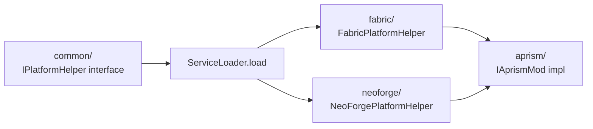

# Aprism Mod 开发者指南：开发并导出 .aje/.abe 模组包

> 文档 8 / 8 | Aprism Loader 文档集
> 版本：v26.0-Alpha1-Phase0 | 状态：开发中
> 作者：BlockConnect@StarsailsClover
> 规范语言：英文（中文副本同步维护）

## 1. 执行摘要

本文档是面向 Aprism 模组编写、构建与导出的实操开发者指南。它针对两种产物格式：`.aje`（Aprism Java Edition 包），用于被 Aprism javaagent 消费的 JVM 内容；以及 `.abe`（Aprism Bedrock Edition 包），用于被 Aprism 原生 loader 消费的原生与 Script API 内容。基于 Aprism API 契约编写的模组可从同一源代码树导出为上述一种或两种格式。

本指南具有规范性。它定义了推荐的项目布局、`IAprismMod` 入口点契约、`aprism.manifest.json` 编写规则、基于 Architectury Loom 构建的完整 Gradle 配置，以及产出最终归档的自定义 `aprism-packaging` Gradle 插件。它还涵盖跨平台注册、兼容组构建 profile、向 GitHub Releases 与 Modrinth 发布，以及面向 Bedrock 原生模组的 C++ 深度讲解。开发者按本指南端到端执行，将产出一个可加载、已签名、可发布的 Aprism 模组。

本指南与文档 1 中记录的架构决策以及文档 2 中的 manifest schema 保持一致。当某项建议看似与上述文档冲突时，架构与 manifest 文档具有权威性，本指南予以遵从。

## 2. 前置条件

| 工具 | 版本（Modern profile，26.1+） | 版本（Legacy profile，pre-26.1） | 用途 |
|---|---|---|---|
| JDK | Java 25（Temurin/OpenJDK） | 1.20-1.20.4 使用 Java 17；1.20.5-1.21.11 使用 Java 21 | 编译运行时 |
| Gradle | 9.x | 8.x | 构建编排 |
| Git | 2.40+ | 2.40+ | 源码控制、签名提交 |
| IDE | IntelliJ IDEA 2024.2+ 或 VS Code | 同上 | 开发 |
| Architectury Loom | 1.7+（loom-no-remap） | 1.6+（loom） | 多 loader Minecraft 构建 |
| Android NDK | r26+ | r26+ | BE 原生 Android 交叉编译 |
| C++ 工具链 | MSVC 2022（Windows）、Clang 17（Android/iOS/Linux） | 同上 | BE 原生编译 |
| cosign | 2.2+ | 2.2+ | 产物签名 |
| xmake 或 CMake | xmake 2.8+ / CMake 3.27+ | 同上 | BE 原生构建（Gradle 的替代方案） |

附加要求：用于冒烟测试的本地 Minecraft 实例、已安装的 Aprism loader、用于 release 分发的 GitHub 账号。在 Windows 上进行 Bedrock 原生开发时，请安装最新的 Windows SDK 与 Desktop C++ workload。在 Android 上，请通过 Android SDK Manager 安装 CMake 与 NDK。在 iOS 上，需要配备 Xcode 15+ 的 macOS 主机，且仅支持通过 TrollStore 部署。

## 3. JE 模组的项目结构

Aprism 采用 MultiLoader 模板布局：分别为共享逻辑与各 loader 入口点设置独立源集，外加一个承载 loader 无关 Aprism 实现的 `aprism/` 源集。`common/` 源集仅依赖原版 Minecraft；`fabric/` 与 `neoforge/` 依赖 `common/`；`aprism/` 依赖 `common/` 与 Aprism API，并被两个 loader 源集共同消费。

### 3.1 推荐目录树

```
examplemod/
+-- settings.gradle
+-- build.gradle
+-- gradle.properties
+-- gradle/
|   +-- libs.versions.toml
|   +-- wrapper/
+-- common/
|   +-- build.gradle
|   +-- src/main/java/com/example/common/
+-- fabric/
|   +-- build.gradle
|   +-- src/main/java/com/example/fabric/
|   +-- src/main/resources/
|       +-- fabric.mod.json
+-- neoforge/
|   +-- build.gradle
|   +-- src/main/java/com/example/neoforge/
|   +-- src/main/resources/
|       +-- META-INF/neoforge.mods.toml
+-- aprism/
|   +-- build.gradle
|   +-- src/main/java/com/example/aprism/
|   +-- src/main/resources/
|       +-- aprism.manifest.json
|       +-- example.accesswidener
|       +-- mixins/
|           +-- example.mixins.json
+-- docs/
+-- .github/workflows/
```

### 3.2 源集职责

| 源集 | 依赖 | 允许的 API | 禁止的 API |
|---|---|---|---|
| `common/` | 原版 Minecraft | Vanilla MC、JDK、Aprism API common | Fabric、NeoForge、Forge、Quilt、LiteLoader |
| `fabric/` | `common/`、Fabric Loader | Fabric Loader、Fabric API | NeoForge、Forge |
| `neoforge/` | `common/`、NeoForge | NeoForge mod loader | Fabric、Forge |
| `aprism/` | `common/`、Aprism API | 仅 Aprism API | loader 专属 API |

`aprism/` 源集是统一入口点。Fabric 与 NeoForge 源集是轻量适配器：其唯一职责是启动 loader 专属入口点并委托给 `aprism/` 的 `IAprismMod` 实现。所有玩法逻辑都位于 `common/` 与 `aprism/` 中。

### 3.3 IPlatformHelper 的 ServiceLoader 接线

跨 loader 的平台调用通过由 `java.util.ServiceLoader` 加载的 `IPlatformHelper` 服务进行解析。每个 loader 源集在 `META-INF/services/` 下提供一个 provider 文件及一个具体实现。



`common/` 声明接口：

```java
package com.example.common.platform;

public interface IPlatformHelper {
    String loaderName();
    boolean isDevelopmentEnvironment();
    Object createPlatformThing();
}
```

`fabric/` 提供实现并注册：

```java
package com.example.fabric.platform;

import com.example.common.platform.IPlatformHelper;

public class FabricPlatformHelper implements IPlatformHelper {
    @Override public String loaderName() { return "fabric"; }
    @Override public boolean isDevelopmentEnvironment() {
        return net.fabricmc.loader.api.FabricLoader.getInstance().isDevelopmentEnvironment();
    }
    @Override public Object createPlatformThing() { return new Object(); }
}
```

位于 `fabric/src/main/resources/META-INF/services/com.example.common.platform.IPlatformHelper` 的 provider 文件包含一行：

```
com.example.fabric.platform.FabricPlatformHelper
```

`aprism/` 源集延迟加载并缓存 helper：

```java
IPlatformHelper helper = ServiceLoader.load(IPlatformHelper.class)
        .findFirst()
        .orElseThrow(() -> new IllegalStateException("No IPlatformHelper on classpath"));
```

这是 MultiLoader 模板模式的完整复刻。它使 `common/` 不含 loader 符号，同时仍允许在运行时呈现按 loader 区分的行为。

## 4. BE 原生模组的项目结构

Bedrock 原生模组是 C++ 项目，编译为按平台区分的二进制文件，并链接到 Aprism BE API 头文件。项目布局沿用 Amethyst 与 LeviLamina 的先例：一个 `src/` 树、一个包含 Aprism BE API 头文件的 `include/` 树、一个包含 manifest 的 `resources/` 树，以及一个构建脚本。

### 4.1 推荐目录树

```
example_native_be/
+-- aprism.manifest.json
+-- build.gradle                  （可选；xmake.lua 或 CMakeLists.txt 为替代方案）
+-- xmake.lua                     （替代构建脚本）
+-- include/
|   +-- AmethystAPI/              （Aprism BE API 头文件，vendored 或通过 includePath 引用）
|   +-- libhat/                   （签名扫描头文件）
|   +-- MinHook/                  （hook 后端头文件，Windows）
+-- src/
|   +-- main.cpp
|   +-- hooks/
|   |   +-- BlockPlaceHook.cpp
|   +-- events/
|       +-- EventHandler.cpp
+-- resources/
    +-- icon.png
+-- scripts/                      （可选，用于混合模组）
    +-- companion.js
```

### 4.2 链接到 Aprism BE API

Aprism BE API 以 header-only 接口加一个小型共享库（Linux/Android 上为 `aprism_be`，Windows 上为 `AprismBE.dll`）的形式提供，该库提供运行时 registrar。构建时，include path 设置为 `include/`，链接器指向由 Aprism loader 安装的 Aprism BE 运行时库。

在 Windows 上，链接器输入为 `AprismBE.lib`（导入库），运行时从 Aprism 安装目录解析 `AprismBE.dll`。在 Android 上，输入为 `libaprism_be.so`。原生二进制不静态链接 API；它链接 Aprism loader 已注入的运行时，从而保证每个进程恰好有一个 registrar 与一个 hook 管理器。

## 5. IAprismMod 接口

`IAprismMod` 是单一生命周期入口点契约。它有意保持精简：一个生命周期方法加一个元数据访问器。特定阶段的工作通过事件总线表达，而非通过额外的接口方法，从而使契约在引入新阶段时保持稳定。

### 5.1 Java 接口（JE）

```java
package com.example.aprism;

import org.aprism.api.ModMetadata;
import org.aprism.api.AprismContext;

public interface IAprismMod {
    ModMetadata metadata();
    void onInitialize(AprismContext ctx);
}
```

`AprismContext` 暴露事件总线、注册表、logger 与平台描述符。Context 按阶段作用域化：在 PREINIT 期间获得的 context 会拒绝返回已填充的注册表，因为注册表尚未构建。此约束在 API 边界强制执行。

### 5.2 C++ 接口（BE）

```cpp
// include/AmethystAPI/IAprismMod.h
#pragma once
#include <AmethystAPI/ModMetadata.h>
#include <AmethystAPI/AprismContext.h>

class IAprismMod {
public:
    virtual ~IAprismMod() = default;
    virtual const ModMetadata& metadata() const = 0;
    virtual void onInitialize(AprismContext& ctx) = 0;
};

extern "C" APRISM_EXPORT IAprismMod* aprism_mod_create();
```

BE 上的 `aprism_mod_create` 工厂与 JE 上 manifest 声明的入口点对应。两个工厂都在 INIT 期间被调用一次，且都接收一个以相同名称暴露相同服务的 context。

### 5.3 生命周期阶段与适配器

阶段模型为 PREINIT、INIT、SETUP、COMPLETE、CLIENT、SERVER。由于接口仅包含 `onInitialize`，参与后续阶段的规范方式是订阅相应的阶段事件。为方便起见，Aprism 提供 `AprismLifecycleAdapter`，这是一个抽象基类，它会代为订阅每个阶段事件，并派发到可覆写的 `onPreInitialize`、`onInitialize`、`onSetup` 与 `onComplete` 方法。

```java
package com.example.aprism;

import org.aprism.api.AprismContext;
import org.aprism.api.lifecycle.AprismLifecycleAdapter;

public final class ExampleMod extends AprismLifecycleAdapter {
    @Override public void onPreInitialize(AprismContext ctx) {
        ctx.logger().info("PreInit: registering mixins and access wideners");
    }
    @Override public void onInitialize(AprismContext ctx) {
        ctx.logger().info("Init: registering content");
        Blocks.register(ctx);
    }
    @Override public void onSetup(AprismContext ctx) {
        ctx.logger().info("Setup: wiring cross-mod integrations");
    }
    @Override public void onComplete(AprismContext ctx) {
        ctx.logger().info("Complete: emitting readiness");
    }
}
```

该适配器是推荐的编写界面。对于仅需 INIT 行为且希望零开销的模组，允许直接实现 `IAprismMod`。

### 5.4 Fabric 委托

Fabric 入口点实现 `ModInitializer` 并委托给 Aprism 入口点。此处不含任何玩法逻辑。

```java
package com.example.fabric;

import com.example.aprism.ExampleMod;
import net.fabricmc.api.ModInitializer;
import org.aprism.api.Aprism;

public final class ExampleModFabric implements ModInitializer {
    @Override public void onInitialize() {
        Aprism.bootstrap(new ExampleMod());
    }
}
```

### 5.5 NeoForge 委托

NeoForge 入口点是一个带 `@Mod` 注解的构造函数，执行相同的委托。

```java
package com.example.neoforge;

import com.example.aprism.ExampleMod;
import net.neoforged.bus.api.IEventBus;
import net.neoforged.fml.common.Mod;
import org.aprism.api.Aprism;

@Mod("examplemod")
public final class ExampleModNeoForge {
    public ExampleModNeoForge(IEventBus modBus) {
        Aprism.bootstrap(new ExampleMod());
    }
}
```

## 6. 编写 Manifest

manifest 是位于包根目录的 `aprism.manifest.json`。它是 Aprism 首先读取的唯一文件。完整 schema 见文档 2。下方示例覆盖三种编写场景。

### 6.1 JE 多 loader manifest

```json
{
  "schemaVersion": 1,
  "id": "examplemod",
  "version": "1.0.0",
  "displayName": "Example Mod",
  "description": "A multi-loader reference mod for Aprism.",
  "authors": [{ "name": "BlockConnect" }],
  "license": "MIT",
  "icon": "icon.png",
  "contact": {
    "homepage": "https://example.com",
    "sources": "https://github.com/example/examplemod",
    "issues": "https://github.com/example/examplemod/issues"
  },
  "environment": "*",
  "entrypoints": {
    "main":   ["com.example.aprism.ExampleMod"],
    "client": ["com.example.aprism.ExampleModClient"]
  },
  "mixins": [
    "mixins/example.mixins.json",
    { "config": "mixins/example.client.mixins.json", "environment": "client" }
  ],
  "accessWidener": "example.accesswidener",
  "depends": {
    "aprism":        ">=26.0-Alpha1",
    "minecraft":     ">=1.20.4 <1.22",
    "java":          ">=21"
  },
  "recommends": { "modmenu": ">=7.0.0" },
  "platforms": {
    "fabric":   { "depends": { "fabricloader": ">=0.15.0", "fabric-api": ">=0.96.0" } },
    "neoforge": { "depends": { "neoforge": ">=20.4.0" }, "accessWidener": null },
    "forge":    { "depends": { "forge": ">=47.0.0" }, "entrypoints": { "main": ["com.example.neoforge.ExampleModNeoForge"] } }
  },
  "custom": { "examplemod:profile": "26.1" }
}
```

### 6.2 BE 原生 manifest（C++）

```json
{
  "format_version": 2,
  "header": {
    "name": "Example Native BE Mod",
    "description": "Native C++ Bedrock mod",
    "uuid": "5f1d2b3a-9c8e-4f2a-b6d1-7e3c0a1b2d3e",
    "version": [1, 0, 0],
    "min_engine_version": [1, 21, 0]
  },
  "modules": [
    { "type": "data", "uuid": "6e2c3b4a-1d2e-4a3b-8c5f-9a0b1c2d3e4f", "version": [1, 0, 0] }
  ],
  "dependencies": [],
  "aprism": {
    "schemaVersion": 1,
    "modId": "example_native_be",
    "version": "1.0.0",
    "language": "cpp",
    "aprismApiVersion": ">=26.0-Alpha1",
    "gameVersionRange": ">=1.21.0 <1.22.0",
    "nativeEntrypoints": {
      "windows-x64":   { "binary": "native/windows-x64/example.dll",       "entry": "aprism_mod_load" },
      "android-arm64": { "binary": "native/android-arm64/libexample.so",   "entry": "aprism_mod_load" },
      "ios-arm64":     { "binary": "native/ios-arm64/example.dylib",       "entry": "aprism_mod_load" }
    },
    "depends": { "levilamina": ">=0.10.0" },
    "mixins": [ "hooks.example.json" ]
  }
}
```

注意：此 manifest 中的 BE 工厂导出为 `aprism_mod_load`，而 C++ 接口头文件声明的是 `aprism_mod_create`。二者由 Aprism BE loader 协调：`aprism_mod_load` 是 loader 首先调用的平台入口；它通过 `aprism_mod_create` 构造 `IAprismMod` 实例并注册到 registrar。仅实现 `aprism_mod_create` 的作者可将两个符号别名化；需要预注册设置的作者应显式实现 `aprism_mod_load`。

### 6.3 BE 脚本 manifest（JavaScript）

```json
{
  "format_version": 2,
  "header": {
    "name": "Example Script BE Mod",
    "description": "JavaScript Script API mod",
    "uuid": "7a3b4c5d-6e7f-4a8b-9c0d-1e2f3a4b5c6d",
    "version": [1, 2, 0],
    "min_engine_version": [1, 21, 10]
  },
  "modules": [
    { "type": "script", "language": "javascript", "uuid": "8b4c5d6e-7f8a-4b9c-0d1e-2f3a4b5c6d7e", "version": [1, 2, 0], "entry": "scripts/main.js" }
  ],
  "dependencies": [
    { "module_name": "@minecraft/server", "version": "1.10.0" }
  ],
  "aprism": {
    "schemaVersion": 1,
    "modId": "example_script_be",
    "version": "1.2.0",
    "language": "javascript",
    "aprismApiVersion": ">=26.0-Alpha1",
    "gameVersionRange": ">=1.21.10",
    "scriptEntrypoints": { "main": "scripts/main.js", "client": "scripts/client.js" }
  }
}
```

### 6.4 填写版本范围

版本范围使用文档 2 第 6 节定义的 SemVer 语法。经验法则如下：

- `aprism`：对于按本指南构建的模组，始终为 `>=26.0-Alpha1`。
- `minecraft`：使用闭区间以固定兼容组，例如对窄版 1.20.x 构建使用 `>=1.20.4 <1.20.6`，对 1.21.x 组使用 `>=1.21 <1.22`。不鼓励使用开上界（`>=1.21`），因为它暗示支持你尚未测试的版本。
- `java`：与 profile 的 JDK 目标匹配（`>=17`、`>=21` 或 `>=25`）。
- 各 loader 专属范围应放入对应的 `platforms.<loader>.depends` 块中，而非顶层，从而避免模组在错误 loader 下加载时因顶层依赖检查失败。

## 7. Gradle 配置

### 7.1 settings.gradle

```groovy
pluginManagement {
    repositories {
        maven { url = "https://maven.architectury.dev/" }
        maven { url = "https://maven.fabricmc.net/" }
        maven { url = "https://maven.neoforged.net/releases/" }
        maven { url = "https://maven.pkg.github.com/aprism/aprism-packaging" }
        gradlePluginPortal()
        mavenCentral()
    }
}

dependencyResolutionManagement {
    repositories {
        mavenCentral()
        maven { url = "https://maven.fabricmc.net/" }
        maven { url = "https://maven.neoforged.net/releases/" }
        maven { url = "https://maven.architectury.dev/" }
    }
    versionCatalogs {
        libs { from(files("gradle/libs.versions.toml")) }
    }
}

rootProject.name = "examplemod"

include(":common", ":fabric", ":neoforge", ":aprism")
```

### 7.2 gradle/libs.versions.toml

```toml
[versions]
minecraft          = "1.21.1"
minecraftModern    = "26.1-alpha.1"
fabricLoader       = "0.16.0"
fabricApi          = "0.102.0+1.21.1"
neoforge           = "21.1.1"
architecturyLoom   = "1.7-SNAPSHOT"
aprismApi          = "26.0-Alpha1-Phase0"
shadow             = "8.1.1"
aprismPackaging    = "0.1.0"

[libraries]
minecraft-common   = { module = "com.mojang:minecraft", version.ref = "minecraft" }
fabric-loader      = { module = "net.fabricmc:fabric-loader", version.ref = "fabricLoader" }
fabric-api         = { module = "net.fabricmc.fabric-api:fabric-api", version.ref = "fabricApi" }
neoforge-modloader = { module = "net.neoforged:neoforge", version.ref = "neoforge" }
aprism-api         = { module = "org.aprism:aprism-api", version.ref = "aprismApi" }

[plugins]
architectury-loom  = { id = "dev.architectury.loom", version.ref = "architecturyLoom" }
shadow             = { id = "com.github.johnrengelman.shadow", version.ref = "shadow" }
aprism-packaging   = { id = "org.aprism.packaging", version.ref = "aprismPackaging" }
```

### 7.3 common/build.gradle

```groovy
plugins {
    id("dev.architectury.loom")
    id("java-library")
}

dependencies {
    minecraft(libs.minecraft.common)
    mappings loom.officialMojangMappings()
    api(libs.aprism.api)
}

java {
    sourceCompatibility = JavaVersion.VERSION_21
    targetCompatibility = JavaVersion.VERSION_21
}
```

对于 Modern（26.1+）profile，将 loom 配置替换为 no-remap profile，并将目标设为 Java 25：

```groovy
loom {
    noRemap = true
}
java {
    sourceCompatibility = JavaVersion.VERSION_25
    targetCompatibility = JavaVersion.VERSION_25
}
```

### 7.4 fabric/build.gradle

```groovy
plugins {
    id("dev.architectury.loom")
    id("java-library")
}

dependencies {
    minecraft(libs.minecraft.common)
    mappings loom.officialMojangMappings()
    modImplementation(libs.fabric.loader)
    modImplementation(libs.fabric.api)
    implementation(project(":common"))
    implementation(project(":aprism"))
}

loom {
    splitEnvironmentSourceSets()
    mods {
        examplemod {
            sourceSet sourceSets.main
            sourceSet project(":common").sourceSets.main
            sourceSet project(":aprism").sourceSets.main
        }
    }
}

java {
    sourceCompatibility = JavaVersion.VERSION_21
    targetCompatibility = JavaVersion.VERSION_21
}
```

### 7.5 neoforge/build.gradle

```groovy
plugins {
    id("dev.architectury.loom")
    id("java-library")
}

dependencies {
    minecraft(libs.minecraft.common)
    mappings loom.officialMojangMappings()
    neoForge(libs.neoforge.modloader)
    implementation(project(":common"))
    implementation(project(":aprism"))
}

java {
    sourceCompatibility = JavaVersion.VERSION_21
    targetCompatibility = JavaVersion.VERSION_21
}
```

### 7.6 aprism/build.gradle

```groovy
plugins {
    id("java-library")
    id("com.github.johnrengelman.shadow")
}

dependencies {
    api(project(":common"))
    api(libs.aprism.api)
}

jar {
    archiveBaseName.set("examplemod-aprism")
    from("../aprism/src/main/resources")
}

shadowJar {
    dependsOn(jar)
    from(zipTree(jar.archiveFile))
    archiveBaseName.set("examplemod-aprism")
    classifier.set("")
}
```

### 7.7 应用 packaging 插件的根 build.gradle

```groovy
plugins {
    id("org.aprism.packaging") apply false
}

subprojects {
    repositories {
        mavenCentral()
        maven { url = "https://maven.fabricmc.net/" }
        maven { url = "https://maven.neoforged.net/releases/" }
    }
}

allprojects {
    apply(plugin: "org.aprism.packaging")

    aprismPackaging {
        manifestFile = file("${rootDir}/aprism/src/main/resources/aprism.manifest.json")
        includePlatform = ["fabric", "neoforge"]
        nativeTargets = []
        outputDir = layout.buildDirectory.dir("aprism")
    }
}
```

## 8. aprism-packaging Gradle 插件

`aprism-packaging` 插件消费 `shadowJar` 与 `remapJar` 的输出，并将其重新打包为文档 7 定义的 `.aje` 或 `.abe` 归档格式。它不会重新编译或重新映射任何内容；它只负责组装。

### 8.1 插件所做工作

1. 从配置的 `manifestFile` 属性解析 manifest 文件。
2. 从每个子项目的构建输出收集各 loader 的 jar（`fabric/` jar、`neoforge/` jar）。
3. 从 `aprism/` 资源收集共享资源、mixin 配置与 access widener。
4. 输出一个内部结构匹配规范 `.aje` 或 `.abe` 树的 ZIP。
5. 在归档旁写入一个 `checksums.txt`，包含归档及每个成员条目的 SHA-256。

### 8.2 任务

| 任务 | 产出 | 依赖 |
|---|---|---|
| `packageAje` | `build/aprism/<modid>-<version>.aje` | `:fabric:remapJar`、`:neoforge:remapJar`、`:aprism:shadowJar` |
| `packageAbe` | `build/aprism/<modid>-<version>.abe` | 原生构建任务或 `:scripts:bundle` |
| `packageAll` | 两个归档 | `packageAje`、`packageAbe` |

### 8.3 配置块

```groovy
aprismPackaging {
    // 必填：包根目录下 manifest 的路径。
    manifestFile = file("aprism/src/main/resources/aprism.manifest.json")

    // .aje 必填：要填充哪些 loader 子目录。
    includePlatform = ["fabric", "neoforge"]

    // .abe 必填：要打包到 native/ 下的原生目标。
    nativeTargets = ["windows-x64", "android-arm64", "ios-arm64"]

    // 可选：归档输出位置。默认为 build/aprism。
    outputDir = layout.buildDirectory.dir("aprism")

    // 可选：合并到 resources/ 的额外资源。
    extraResources = fileTree("src/main/resources/shared")

    // 可选：放置到 mixins/ 下的 mixin 配置。
    mixinConfigs = fileTree("aprism/src/main/resources/mixins")

    // 可选：嵌入归档元数据的兼容组标签。
    compatibilityGroup = project.findProperty("aprismProfile") ?: "legacy"
}
```

### 8.4 运行构建

```bash
./gradlew packageAje          # 产出 build/aprism/examplemod-1.0.0.aje
./gradlew packageAbe          # 产出 build/aprism/example_native_be-1.0.0.abe
./gradlew packageAll          # 产出两者
./gradlew -PaprismProfile=26.1 packageAje   # 按 Modern profile 构建
```

## 9. 跨平台注册模式

Aprism API 暴露单一注册入口，按版本路由到正确的后端。模组作者调用一次 API；运行时完成按版本的派发。

### 9.1 注册一个方块

在 `common/` 中通过 Aprism 注册表注册：

```java
package com.example.common;

import net.minecraft.world.level.block.Block;
import net.minecraft.world.level.block.state.BlockBehaviour;
import net.minecraft.world.level.material.MapColor;
import org.aprism.api.registry.Registry;
import org.aprism.api.Identifier;

public final class ExampleBlocks {
    public static final Block EXAMPLE_BLOCK = new Block(
        BlockBehaviour.Properties.of().mapColor(MapColor.STONE).strength(3.0f));

    public static void register() {
        Registry.register(Registry.BLOCK,
            Identifier.of("examplemod", "example_block"),
            EXAMPLE_BLOCK);
        Registry.register(Registry.ITEM,
            Identifier.of("examplemod", "example_block"),
            new net.minecraft.world.item.BlockItem(EXAMPLE_BLOCK,
                new net.minecraft.world.item.Item.Properties()));
    }
}
```

在 JE 上，`Registry.register` 通过 Mixin 注入的访问器委托给当前 loader 的 Minecraft 注册表。在 BE 上，同一调用路由到由 Aprism BE API 暴露的 Bedrock 原生注册路径，后者进而调用 Bedrock 二进制中的 `CustomBlockComponent::register`。标识符在两个版本上均为带命名空间的 `examplemod:example_block`，且从不被加前缀或重写。

### 9.2 订阅事件

```java
package com.example.aprism;

import org.aprism.api.AprismContext;
import org.aprism.api.event.block.BlockPlaceEvent;

public final class ExampleEvents {
    public static void register(AprismContext ctx) {
        ctx.eventBus().subscribe(BlockPlaceEvent.class, ExampleEvents::onBlockPlace);
    }

    private static void onBlockPlace(BlockPlaceEvent event) {
        ctx.logger().info("Block placed at {}", event.position());
    }
}
```

`BlockPlaceEvent` 在 JE 上当玩家通过 JE 管线放置方块时被 post，在 BE 上当原生 hook 拦截 `Block::place` 时被 post。监听器代码在两端运行不变。通过 `event.cancel()` 取消事件可同时阻止两端的发生。

### 9.3 配置

```java
package com.example.aprism;

import org.aprism.api.config.Config;
import org.aprism.api.config.ConfigSpec;

public final class ExampleConfig {
    public static final ConfigSpec SPEC = ConfigSpec.create("examplemod")
        .define("durabilityBonus", 5)
        .define("enableFancyRendering", true)
        .defineInRange("maxRange", 16, 1, 64);

    public static Config instance;

    public static void load(AprismContext ctx) {
        instance = ctx.config().load(SPEC);
    }
}
```

配置 schema 按单调规则进行版本化：字段可被添加和弃用，从不被移除或重命名。被标记为弃用的字段在至少一个 LTS 周期内保持可用，并在使用时发出警告。

### 9.4 网络

```java
package com.example.aprism;

import org.aprism.api.network.NetworkChannel;
import org.aprism.api.AprismContext;

public final class ExampleNetworking {
    public static NetworkChannel CHANNEL;

    public static void register(AprismContext ctx) {
        CHANNEL = ctx.network().channel("examplemod:main");
        CHANNEL.register("sync_state", ExamplePayload.class, ExamplePayload::encode, ExamplePayload::decode);
        CHANNEL.subscribeServerbound("sync_state", (payload, ctx2) -> {
            ctx2.logger().info("Received state from client: {}", payload.value());
        });
    }
}
```

在 JE 上，channel 包装 loader 的数据包路径。在 BE 上，channel 包装 Bedrock 原生网络 hook。Payload 编解码器与版本无关，因为 Aprism API 定义了线路格式。

## 10. 构建与导出

### 10.1 导出 .aje

```bash
./gradlew clean packageAje
```

输出：`build/aprism/examplemod-1.0.0.aje`。内部结构：

```
examplemod-1.0.0.aje
+-- aprism.manifest.json
+-- examplemod-aprism.jar
+-- fabric/
|   +-- examplemod-fabric.jar
+-- neoforge/
|   +-- examplemod-neoforge.jar
+-- resources/
+-- mixins/
    +-- example.mixins.json
```

### 10.2 导出 .abe

```bash
./gradlew packageAbe
```

输出：`build/aprism/example_native_be-1.0.0.abe`。内部结构：

```
example_native_be-1.0.0.abe
+-- aprism.manifest.json
+-- native/
|   +-- windows-x64/example.dll
|   +-- android-arm64/libexample.so
|   +-- ios-arm64/example.dylib
+-- resources/
    +-- icon.png
```

### 10.3 校验包

将归档视为 ZIP 并进行检查。不要仅依赖文件扩展名。

```bash
unzip -l build/aprism/examplemod-1.0.0.aje | head
unzip -p build/aprism/examplemod-1.0.0.aje aprism.manifest.json | jq .
```

校验：manifest 位于 ZIP 根目录；manifest 的 `id` 与归档基名匹配；manifest 的 `version` 与归档版本段匹配；各 loader 的 jar 位于正确的子目录下；manifest 中引用的 mixin 配置存在于 `mixins/` 下。

### 10.4 本地测试

对于 JE，将 `.aje` 放入实例的 `mods/` 目录并通过 Aprism loader 启动。对于 BE，将 `.abe` 放入 `com.mojang/aprism_mods/`（Aprism 引入的目录，而非标准的 `behavior_packs/`）。启动游戏并在 Aprism 日志中观察模组的 `Init` 行。若模组未出现，请查阅故障排查表。

## 11. 兼容组构建 Profile

Aprism 并行维护两个构建 profile。通过在构建时选择 profile，单一源代码树可同时针对两者。

| Profile | Minecraft 范围 | Gradle | Java 目标 | Loom 模式 | Intermediary |
|---|---|---|---|---|---|
| Legacy | pre-26.1（1.20.x、1.21.x） | 8.x | 17 或 21 | loom（remap） | Fabric Intermediary |
| Modern | 26.1+ | 9.x | 25 | loom-no-remap | 无（未混淆） |

### 11.1 配置 profile

profile 通过 `aprismProfile` Gradle 属性选择，并经 `gradle.properties` 默认值路由：

```properties
# gradle.properties
aprismProfile=legacy
org.gradle.jvmargs=-Xmx4G
```

在每个子项目的 `build.gradle` 中，按该属性分支：

```groovy
def profile = rootProject.findProperty("aprismProfile") ?: "legacy"

if (profile == "26.1") {
    loom { noRemap = true }
    java {
        sourceCompatibility = JavaVersion.VERSION_25
        targetCompatibility = JavaVersion.VERSION_25
    }
    dependencies {
        minecraft("com.mojang:minecraft:26.1-alpha.1")
    }
} else {
    java {
        sourceCompatibility = JavaVersion.VERSION_21
        targetCompatibility = JavaVersion.VERSION_21
    }
    dependencies {
        minecraft(libs.minecraft.common)
    }
}
```

### 11.2 各 profile 的 JDK 目标

| Minecraft 范围 | JDK 目标 |
|---|---|
| 1.20 - 1.20.4 | 17 |
| 1.20.5 - 1.21.11 | 21 |
| 26.x | 25 |

### 11.3 选择 profile

```bash
./gradlew -PaprismProfile=26.1 packageAje
./gradlew -PaprismProfile=legacy packageAje
```

### 11.4 各 profile 的 manifest 适配

manifest 的 `minecraft` 与 `java` 范围必须与 profile 匹配。使用 `custom.examplemod:profile` 字段记录产物构建时所用的 profile，并在构建产出多个产物时通过 profile 专属 manifest 片段调整范围：

```json
"minecraft": ">=1.21 <1.22",
"java": ">=21",
"custom": { "examplemod:profile": "legacy" }
```

对于 Modern profile，同一模组发布为：

```json
"minecraft": ">=26.1",
"java": ">=25",
"custom": { "examplemod:profile": "26.1" }
```

## 12. 发布

### 12.1 GitHub Releases

使用常规的签名 tag 标记 release，并附上归档与校验和。

```bash
git tag -s v1.0.0 -m "Release 1.0.0"
git push origin v1.0.0
sha256sum build/aprism/examplemod-1.0.0.aje > build/aprism/checksums.txt
gh release create v1.0.0 build/aprism/examplemod-1.0.0.aje build/aprism/checksums.txt
```

GitHub Releases 是主 CDN。Aprism launcher 感知 GitHub token，并遵循跨主机重定向，在 `release-assets.githubusercontent.com` 上剥离 `Authorization` 头。

### 12.2 Modrinth 上传

```bash
modrinth upload \
  --project examplemod \
  --version 1.0.0 \
  --game-version 1.21.1 \
  --loader fabric \
  --loader neoforge \
  --file build/aprism/examplemod-1.0.0.aje
```

Modrinth 是用于提升可发现性的镜像。Modrinth 元数据应声明两个 loader 与兼容组游戏版本。

### 12.3 CurseForge 上传

CurseForge 上传通过 CurseForge Maven 或 curseforge Gradle 插件完成。声明插件并配置项目 id，然后运行 `./gradlew curseforge`。CurseForge 要求每个 loader 单独文件；`aprism-packaging` 插件可按需输出各 loader 变体。

### 12.4 cosign 签名

使用 cosign 无密钥签名对已发布产物进行签名。签名作为 `.sig` 文件与 `.bundle` 与 release 一并存储以供校验。

```bash
cosign sign-blob --yes build/aprism/examplemod-1.0.0.aje \
  --output-signature build/aprism/examplemod-1.0.0.aje.sig \
  --output-certificate build/aprism/examplemod-1.0.0.aje.pem
```

下游 launcher 使用 bundle 与 Fulcio 证书链进行校验。当用户启用严格校验时，Aprism launcher 在安装模组前会校验签名。

## 13. BE 原生模组开发（C++ 深度讲解）

### 13.1 搭建项目

C++ 项目链接到 Aprism BE API 头文件与 Aprism BE 运行时库。头文件以 vendored 方式置于 `include/AmethystAPI/` 下，或通过 include path 引用。运行时库由已安装的 Aprism loader 提供；请勿打包它。

最小化的 `xmake.lua`：

```lua
add_rules("mode.debug", "mode.release")

target("example_native_be")
    set_kind("shared")
    set_languages("c++20")

    add_includedirs("include")
    add_files("src/main.cpp", "src/hooks/*.cpp", "src/events/*.cpp")

    add_links("aprism_be")
    add_linkdirs("$(APRISM_BE_LIBDIR)")

    if is_plat("windows") then
        set_filename("example.dll")
    elseif is_plat("android") then
        set_filename("libexample.so")
    elseif is_plat("macosx", "ios") then
        set_filename("example.dylib")
    end
```

### 13.2 实现入口点

```cpp
// src/main.cpp
#include <AmethystAPI/IAprismMod.h>
#include <AmethystAPI/AprismContext.h>
#include "hooks/BlockPlaceHook.h"

class ExampleNativeMod : public IAprismMod {
public:
    const ModMetadata& metadata() const override {
        static ModMetadata m{ "example_native_be", "1.0.0", ">=1.21.0 <1.22.0" };
        return m;
    }

    void onInitialize(AprismContext& ctx) override {
        ctx.logger.info("ExampleNativeMod init");
        BlockPlaceHook::install(ctx);
    }
};

extern "C" APRISM_EXPORT IAprismMod* aprism_mod_create() {
    return new ExampleNativeMod();
}

extern "C" APRISM_EXPORT void aprism_mod_load(AprismContext& ctx) {
    // Called by the Aprism BE loader before aprism_mod_create.
    // Use for early, pre-registration setup if needed.
    ctx.logger.info("aprism_mod_load entry hit");
}
```

### 13.3 Hook 游戏函数

Hook 安装使用 libhat 进行签名扫描，并使用 MinHook（Windows）、ShadowHook（Android）或 Dobby（iOS）进行 detour。Aprism BE API 将后端封装在统一的 `Hook` 接口之后。

```cpp
// src/hooks/BlockPlaceHook.cpp
#include <libhat/Scanner.hpp>
#include <AmethystAPI/Hook.h>
#include <AmethystAPI/Events.h>

using BlockPlaceFn = void(*)(void* self, void* player, void* pos, void* face);

static BlockPlaceFn original_BlockPlace = nullptr;

static void detour_BlockPlace(void* self, void* player, void* pos, void* face) {
    // Fire the Aprism event before the original call.
    aprism::events::BlockPlaceEvent event{ player, pos };
    aprism::events::post(event);
    if (event.cancelled()) return;

    original_BlockPlace(self, player, pos, face);
}

void BlockPlaceHook::install(AprismContext& ctx) {
    // Pattern is looked up in the version signature DB; the DB key is the build id.
    auto pattern = ctx.signatureDb.pattern("Block::place");
    auto scan = hat::find_pattern(pattern.start, pattern.end);
    if (!scan.has_result()) {
        ctx.logger.error("Block::place pattern not found for this build");
        return;
    }
    void* target = reinterpret_cast<void*>(scan.get());
    AprismHook::create(target, reinterpret_cast<void*>(&detour_BlockPlace),
                       reinterpret_cast<void**>(&original_BlockPlace));
    ctx.logger.info("Block::place hook installed");
}
```

### 13.4 从原生代码触发 Aprism 事件

原生代码通过 `aprism::events::post` 触发事件。事件对象是一个普通结构体，其字段由契约定义；JE 上使用相同的结构体形状。取消通过在调用原始函数前检查 `event.cancelled()` 来生效，如上所示。

### 13.5 按平台构建

```bash
# Windows (DLL), MSVC
xmake f -p windows -a x64 -m release
xmake

# Android (.so), NDK
xmake f -p android -a arm64-v8a -m release --ndk=$ANDROID_NDK_HOME
xmake

# iOS (.dylib), Clang on macOS host
xmake f -p iphoneos -a arm64 -m release
xmake
```

输出位于 `build/<plat>/<arch>/release/`。`aprism-packaging` 插件的 `packageAbe` 任务从配置的 `nativeTargets` 中拾取这些输出，并将每个放置到 `native/<platform>/` 下。

## 14. 故障排查

| 问题 | 可能原因 | 解决方案 |
|---|---|---|
| 未找到 manifest（`CHKAPRISM-MANIFEST-001`） | `aprism.manifest.json` 不在 ZIP 根目录，或归档被以包裹目录方式重新打包。 | 用 `aprism-packaging` 重新导出；用 `unzip -l` 校验 manifest 位于顶层。 |
| 模组未加载 | `depends` 中的版本范围未满足（Minecraft、Java、Aprism 或 loader）。 | 检查 Aprism 日志中的 `CHKAPRISM-DEP-001/002`；在 manifest 中放宽或修正范围。 |
| BE 上 hook 崩溃 | 签名 pattern 与运行中的构建不匹配；build id 不在签名 DB 中。 | 对照签名 DB 确认 build id；发布更新的 pattern 或将 `gameVersionRange` 限定为已知构建。 |
| 依赖版本不匹配 | 必需模组存在但版本不兼容。 | 使 `depends` 范围与已安装依赖对齐，或固定依赖版本。 |
| 构建失败：remap 错误（Legacy） | Loom 版本与 Minecraft 版本之间的 Intermediary 不匹配。 | 对齐目录中的 `architecturyLoom` 版本与 Minecraft 依赖。 |
| 构建失败：期望 no-remap（Modern） | Loom 仍在尝试 remap 26.1+ jar。 | 设置 `loom { noRemap = true }` 并确保通过 `-PaprismProfile=26.1` 选择了该 profile。 |
| 运行时找不到 `IAprismMod` | Aprism API 依赖是 `implementation` 而非 `api`，或 API jar 不在运行时 classpath 上。 | 在 `common/` 与 `aprism/` 中使用 `api(libs.aprism.api)`。 |
| ServiceLoader 返回空 `IPlatformHelper` | `META-INF/services/` provider 文件缺失或命名错误。 | 校验文件名与接口全限定名一致，且位于当前 loader 源集的 classpath 上。 |
| `.abe` 原生二进制未加载 | 二进制位于错误的平台目录，或 manifest 的 `nativeEntrypoints` 路径错误。 | 确认目录名精确匹配 `native/<platform>/`，且 manifest 路径相对于包根目录。 |
| 重复模组错误（`CHKAPRISM-DEP-004`） | 两个模组 `provides` 同一别名。 | 从其中一个模组移除别名，或对齐版本使预期的胜出者版本更高。 |

## 15. 参考模板仓库

规范的起点是 `aprism-mod-template` 仓库。其结构对 JE 模组镜像第 3.1 节，对 BE 原生模组镜像第 4.1 节，并附带一个在打 tag 时运行 `packageAje`、`packageAbe`、cosign 签名与 GitHub Release 上传的 CI workflow。

```
aprism-mod-template/
+-- common/ fabric/ neoforge/ aprism/
+-- native/                       （BE C++ 项目，可选）
+-- .github/workflows/build.yml
+-- gradle/libs.versions.toml
+-- settings.gradle
+-- build.gradle
+-- CONTRIBUTING.md
```

克隆它，将 `examplemod` 重命名为你的 mod id，更新 manifest 的身份字段，并运行 `./gradlew packageAje`。该模板是通往可加载、已签名产物的最快路径。

## 16. 参考资料

1. 文档 1 - Aprism Loader 总体架构设计。第 9 节（统一 API 表面）与第 10 节（构建与打包流水线）是 `IAprismMod` 契约与 `aprism-packaging` 插件的权威来源。
2. 文档 2 - Aprism JE / BE Mod Manifest。第 3、4、6 节定义了本指南全文使用的 manifest schema 与版本范围语法。
3. 文档 7 - Aprism Mods 包（.aje/.abe）分类、结构与各平台放置。第 3、4 节定义了 `aprism-packaging` 插件输出的归档内部结构。
4. 文档 6 - 产品原则规范。第 5 节定义了跨版本 `IAprismMod` 契约与单调 API 规则。
5. MultiLoader-Template（Jared）：含 `IPlatformHelper` 经 `ServiceLoader` 加载的 common/fabric/neoforge 源集。
6. Architectury Loom：Fabric Loom 的多 loader 分支；`loom-no-remap` profile 用于未混淆的 26.1+ jar。
7. Fabric Loom 26.2：`splitEnvironmentSourceSets()`、`remapJar`、access widener、jar-in-jar。
8. Shadow 插件：`shadowJar { dependsOn(jar); from(zipTree(jar.archiveFile)) }` 保留 Loom 修改。
9. Amethyst BE 原生模式：`mod.json` manifest、编译为 DLL 的 C++ 模组、AmethystAPI 头文件、libhat 签名扫描、MinHook detour、xmake 构建。
10. LeviLamina 多语言 manifest：`type` 字段选择 `cpp`/`lua`/`csharp`/`rust`/`javascript` 运行时。
11. FACT.md - 架构决策 9.6（构建工具）与 9.7（跨版本兼容性）：兼容组 jar、拆分 profile、各 profile 的 JDK 目标。
